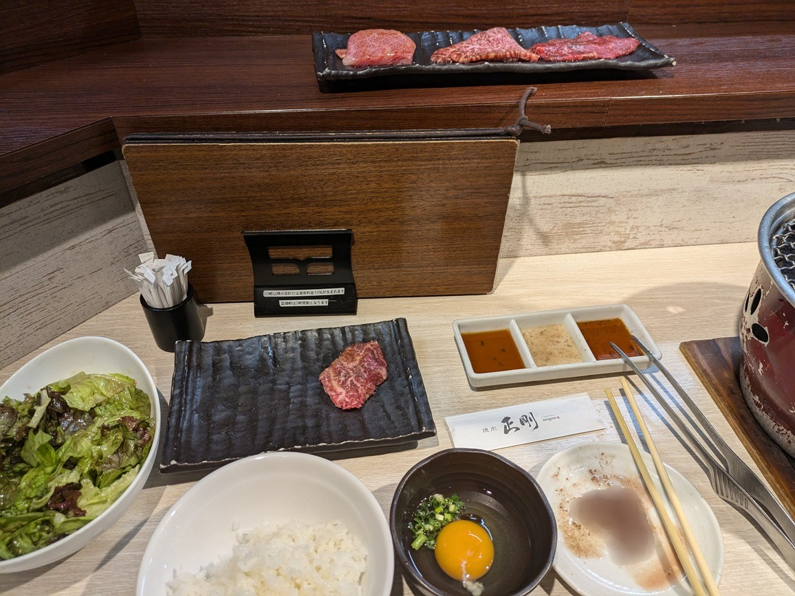
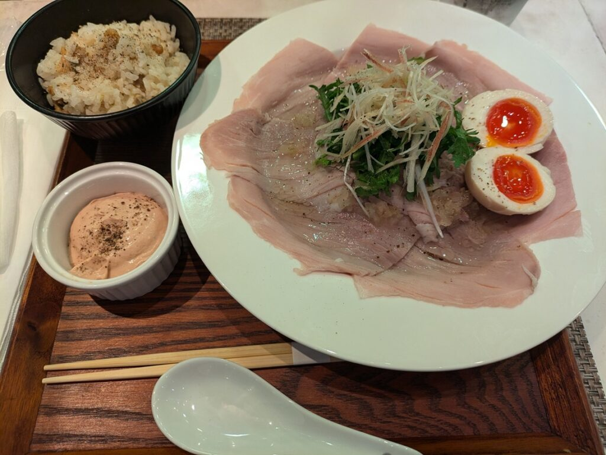

## お盆休みに外食してみた話

お盆休みの間外食でもしてみようと思って、行った場所を紹介しようと思います。

普段は自炊するか弁当なので一人で外食することは滅多にないですね。

今回行った場所は2箇所になります。博物館のやつを含めれば4か所ですが、前回話したので割愛します。

### 1箇所目：焼肉 正剛

まず1か所目は**焼肉 正剛**になります。HPは[こちら](https://seigou.gorp.jp/)で食べログは[こちら](https://tabelog.com/tokyo/A1323/A132301/13158346/)になります。

ここで頼んだものは以下になります。これで9000くらいですね。

- 上タン・・・1人前

- 上ハラミ・・・1人前

- 上カルビ・・・2切れ

- 上ロース・・・2切れ

- やきしゃぶ・・・2切れ

- seiサラダ

- 中ご飯

- アルコール

最初上タン、上ハラミ2切れだったんですが、美味しくて追加で頼みました。食べかけがあった場所はぼかしてます。

### 正剛\_各メニューの感想

上タンと上ハラミですが噛みやすく柔らかい食感でした。更に味付けもされてたのでタレをつけなくても十分美味しいものになってます。

それ以外のお肉も美味しいですが、上タンと上ハラミはおすすめです。1人前(4切れ)頼むだけでご飯食べきれますね。

seiサラダは塩味でgouサラダは醤油味ですが、今回はseiサラダを頼みました。これも美味しいですね。

### 正剛\_総評

少し奮発したいと思った時はここ食べに行くのいいなーと思いました。次行く機会があるかわからないですが、余裕があれば東京離れる前に行っておきたいですね。

### 2箇所目：キッチンステージ

最後に**キッチンステージ**です。HPは[こちら](https://www.kai-group.com/fun/kitchen_stage/)です。ここは伊勢丹の地下1階にあるお店になります。初めてデパ地下というところに行きました。人が多すぎていきたくないです…

固定で同じ料理を作ってるわけではなく、シェフを読んで定期的に料理や品を変えながら提供している場所になります。

今は普段フランス料理をしているシェフの方が作ったラーメンやつけ麺を提供しています。他のタイミングで行ったことはないですが、時間があれば行ってみたいですね。

### キッチンステージ\_各メニューの感想

まずハムですが、スーパーに売ってるハムと食感が似てる部分はありました。ただ加工感は全くないのですごくおいしいです。スーパーのハムしか知らなかったのでいい発見になりました。

ラーメンに関しては麺は細麺になります。こしがしっかりあり、スープは絡まないタイプの麺でした。スープは塩味で海鮮メインの出汁になってます。上品な味で美味しいラーメンです。

ご飯は出汁の効いたあさりごはんでこれだけでも茶碗一杯食べられます。おかずとかは不要なぐらい美味しいご飯でした。

最後にレバーペーストですね。レバーは好き嫌いが分かれるので人によるとは思います。こちらはレバーの味がする濃厚なペーストでこれ単品でも食べられます。味変としてラーメンに入れて食べても美味しいです。

### キッチンステージ\_総評

美味しいのは間違いないのですが、上品な味なので飽きが来るなと感じました。一人でもまた行きたいというほどではなかったです。私個人の感想ですが…

後は全体的に塩分量が多く感じました。レバーペーストを全部食べてしまったのが原因かもしれませんが。レバーペーストは全部食べずラーメンにある程度混ぜつつ、ちょびちょび食べるのがちょうどいいですね。

実はステージキッチンの料理レシピはインスタで公開されているみたいです。紙のほうでもレシピをもらえます。ただ、紙のほうにしか書いてないレシピもあるみたいです。キッチンステージのアカウントは[こちら](https://www.instagram.com/kitchenstage_shinjuku/)。

### 外食を通じて感じたこと

普段一人で外食をしないので久しぶりに行って楽しかったです。普段の料理でもどのような味か？食感は？必要な栄養素などをより意識しながら食べようと思います。

なかなか料理の味を言語化するのは難しいですから、普段から意識して考えておくと誰かに伝えやすくなるかなと思います。美味しいだけでは伝わりにくいかと思うので。

またどこか行ったときは記事にしてみようともいます。ではでは。
