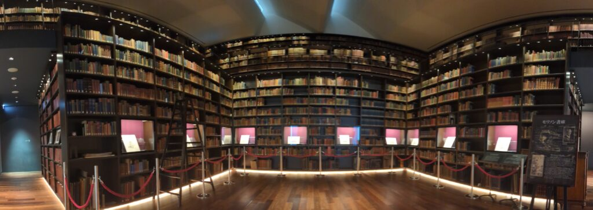
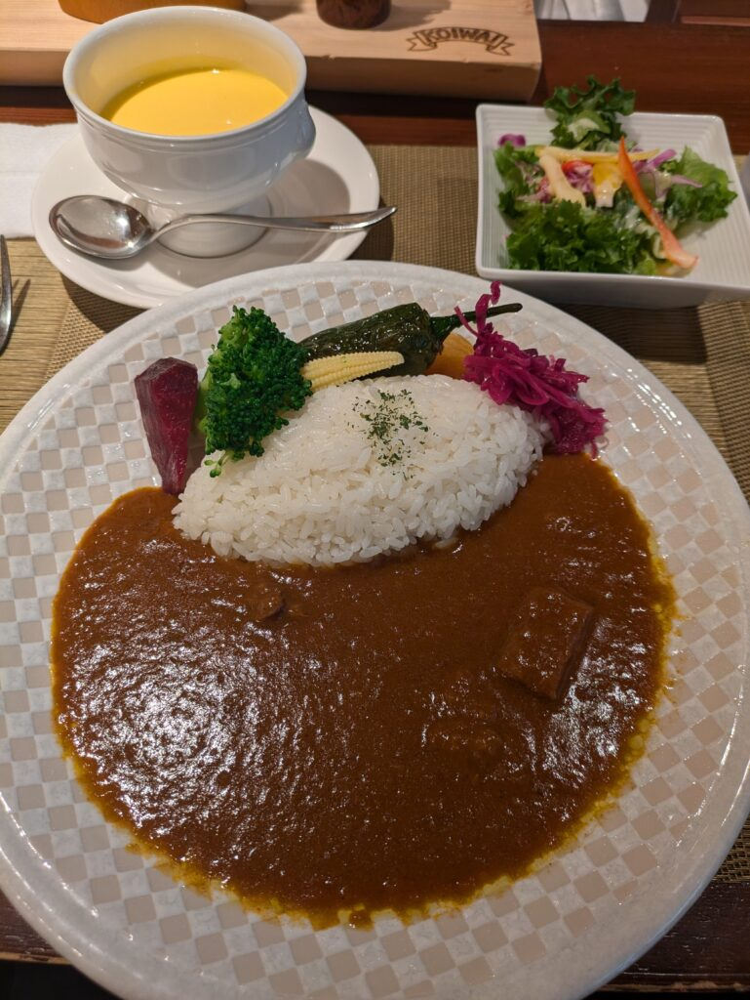
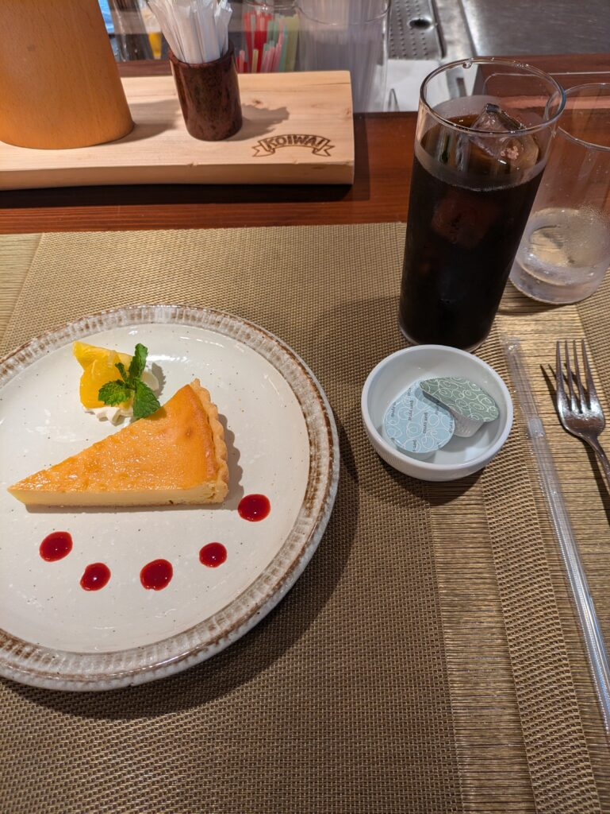
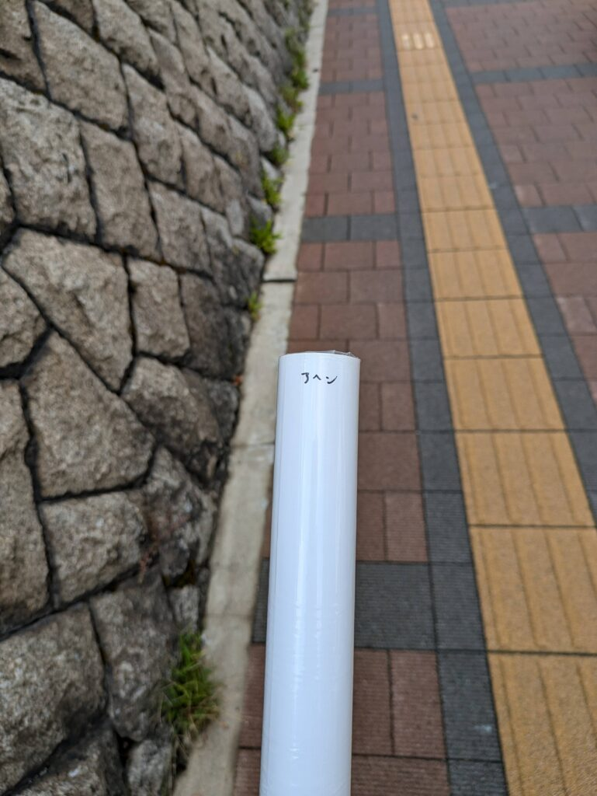
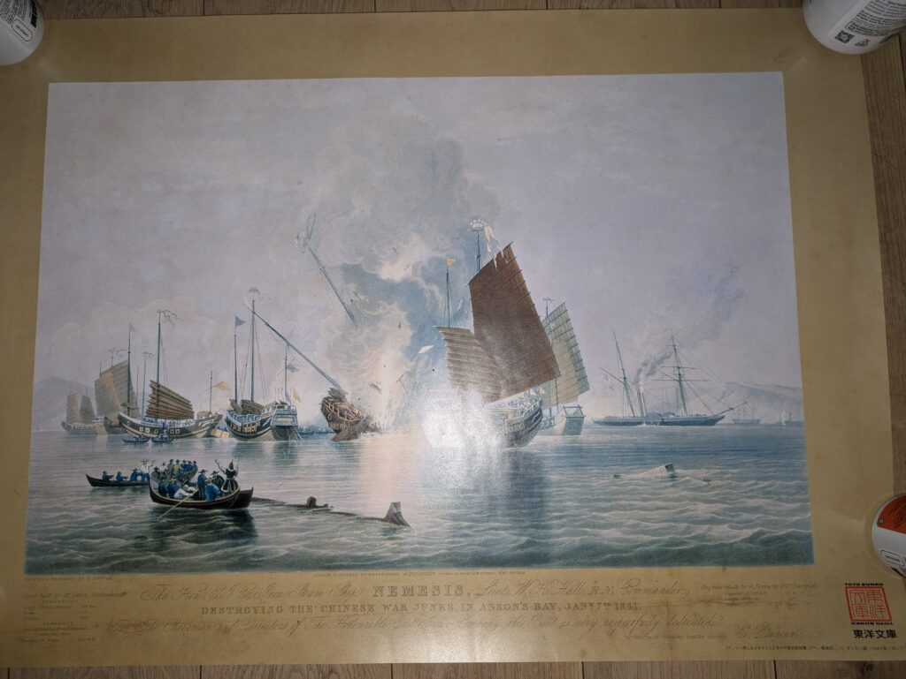

## 東洋文庫ミュージアム訪問記

というわけで、夏休みなので[東洋文庫ミュージアム](https://toyo-bunko.or.jp/museum/)に行ってきました！

駒込駅から10分くらいのところにあります。まず下の画像は日本一美しい本棚と言われている「**モリソン書庫**」になります。

### 東洋文庫ミュージアム\_モリソン書庫の印象

写真一枚で撮れなかったのでパノラマで撮りました。人がいないタイミングを狙って（笑）

とてもきれいでしたね。色んな国について書かれた書物が収められてました。上の方でスタッフさんが本の整理をしてたみたいです。

### 東洋文庫ミュージアム\_その他の展示品

さて、モリソン書庫以外にも展示品はあります。ディスプレイでの音声解説と今は「**アジア偉人伝**」がやってます。

ちなみにアジア偉人伝ではアジアを中心に活躍した人の書物が閲覧できます。日本の有名武将はもちろん、インドや中国、朝鮮にモンゴルなども関わってきます。

また、日本に来て宣教師や来日して物を広めた人の書物などを見ることもできます。

### オリエント・カフェでのランチ

お昼は同じ敷地内にある「**オリエント・カフェ**」で食べました。

ここでは、小岩井農場で作られた食材の料理を食べることができます。私はカレーとチーズケーキをいただきました。

ただ、美味しいのは間違いないですが舌鼓を打つような感覚はなかったです。個人の感想なので間違ってるかもしれませんが…

その一方で接客は凄く丁寧でした。隣のおじさんが店員さんと楽しそうな会話をしてるのを見かけました。

### マリー・アントワネットについて

次回、行くときはマリー・アントワネットを食べてみたいと思います。

一日10食しか作られないので、あらかじめ席を予約して開店と同時に食べに行かないと難しそうです。マリー・アントワネット以外は食事も含めて予約できるみたいですが…

後は電話予約のみらしいです。ディナーは[ネット予約](https://www.tablecheck.com/shops/orientcafe/reserve?utm_source=google)できるみたいです。

### お土産とキャンペーン

食事も終わって一通り展示品も見たらお土産を見て回りました。一番心を惹かれたのが遊印(ゆういん)ですね。自身の名前が掘られたものがあったのでいいなーとは思ってました。

次回行ったときは買ってみます。

さらに、問題を3問解いたらプレゼントがもらえるキャンペーンをやってました。せっかくなので解いてスタッフさんに提出したら「**アヘン**」と書かれた何かをもらえました（笑）

思ったより大きいプレゼントで持って帰るのが大変でしたね…

家に帰ってみたらアヘン戦争の複製ポスターでした。

飾ることはないですが、保管しておこうと思います。4隅で支えてるのは飲んでるサプリです（笑）

### 東洋文庫ミュージアムの感想

最後に感想を書いてみます。

今回の博物館で得られた知識の8割ぐらいはもう忘れました（笑）

ただ、印象的だったのが絵画です。

日本人が書いた絵と西洋の人が書いた絵は全く違うなと感じました。もちろん絵のタッチもありますが、それ以外にも多く違う点を感じました。

- 日本
    - 人物が多く複数人いる
    
    - 装飾も描かれている
    
    - つり目のような横一本線で描かれる
    
    - 人を中心に物事を描かれている
    
    - 背景と人物の配置が破綻している(人が中心なので変な場所に船や山が描かれている)

- 西洋
    - 風景が多い
    
    - 複数人だと人の背をよく書かれる
    
    - 丁寧に描かれる

私が見た展示品で感じたことなので全ての絵がそうとは限りません。ですがそんな傾向があるなーという感じで見てました。

### 美術館への興味

今度は美術館にも行ってみたいですが、前提知識が一ミリもないので少し学んでから行きたいですね。

前提知識は作者の生い立ち、画風、苦悩、時代背景などですね。とりあえず展示されている作者回りは少しでも知っておきたいですね。

後は国立科学博物館にも行ったのでその話もしようと思います。ではでは。
