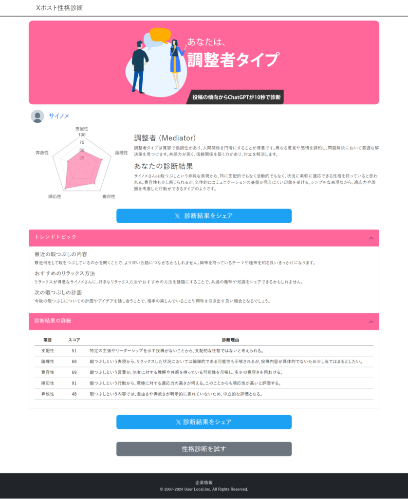
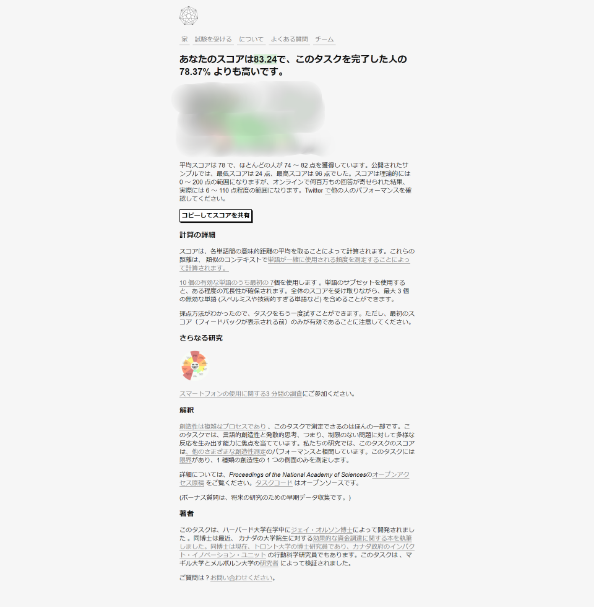
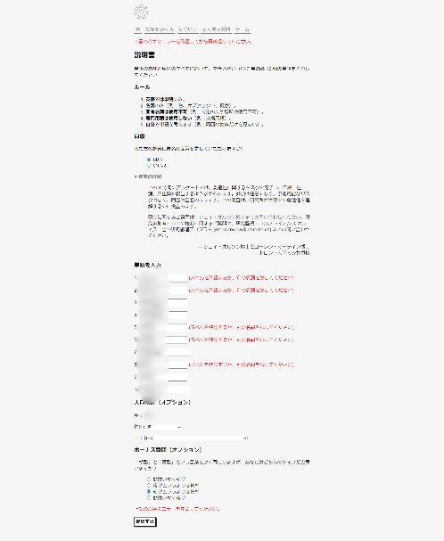

## 最近見つけた面白い情報サイト

最近情報のインプットをあまりやってなかったので情報サイトを少し見て回りました！

その中で面白そうなサイトが2つあったので是非試してほしいと思います。

### 診断サイト：X（旧Twitter）から得た情報

まずは[こちら](https://ai-tool.userlocal.jp/x_shindan)です。

こちらはX(旧Twitter)のポストから情報を得てどんな人か？という診断をしてくれるものになります。

ちなみに私のアカウントの取得結果がこちらになります。

まあほとんどブログのポストしかしてないのでこんなもんですね（笑）

もし日常のポストしてる方や気になる人がいればぜひ診断してみてください。

もちろん全面的に信じることはせず、こんな一面があるかもなーくらいがちょうどいいです。

### 創造性を測る単語生成サイト

次のサイトは[こちら](https://www.datcreativity.com/task)です。

こちらは4分以内に無関係な10個の単語を考えるというものです。こちらは英語のサイトになりますので英単語1つで答えるものになります。

単語同士が無関係であればあるほど創造性が高いみたいです。というわけでやってみた結果がこんな感じです。

意外と高いという結果をいただきました！ここに書いてますが平均が78、74~82が一般的で大体6~110点の範囲になるみたいです。

理論値では200まで取れるみたいですがそこまで目指さなくても平均以上取れればいい方なきはします。

ちなみに初めてやった時はいくつか具体的に書きすぎたので似たものに修正しました（笑）

一応私のやり方としては概念的に対極にありそうなものを考えました。その後、具体的な名詞を考えたり、概念の組み合わせで考えたりしました。

例えば動物↔植物、有機物↔無機物、運動↔学問、世界×ITという形で考えたりしました。

最近聞いた話が創造性として既存の物の組み合わせらしいので、ぜひ高いスコアを目指してみてください！ではでは。
