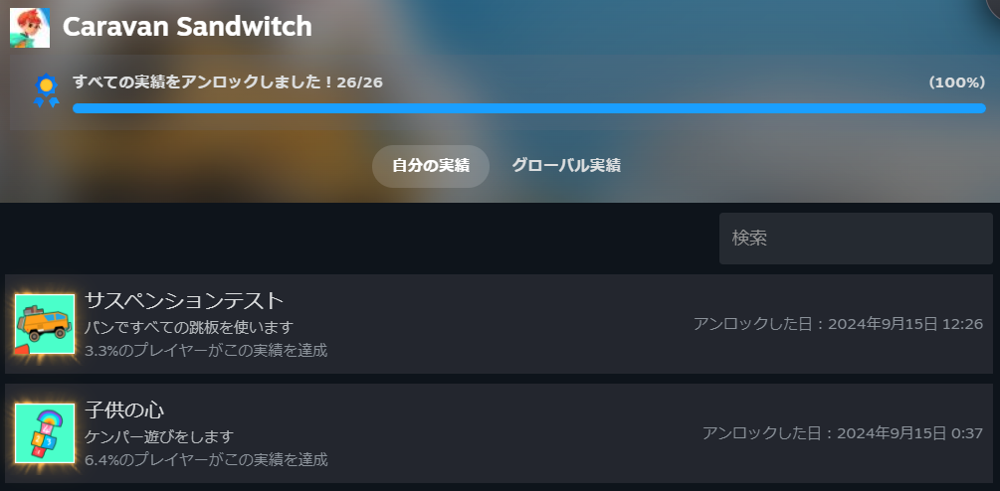
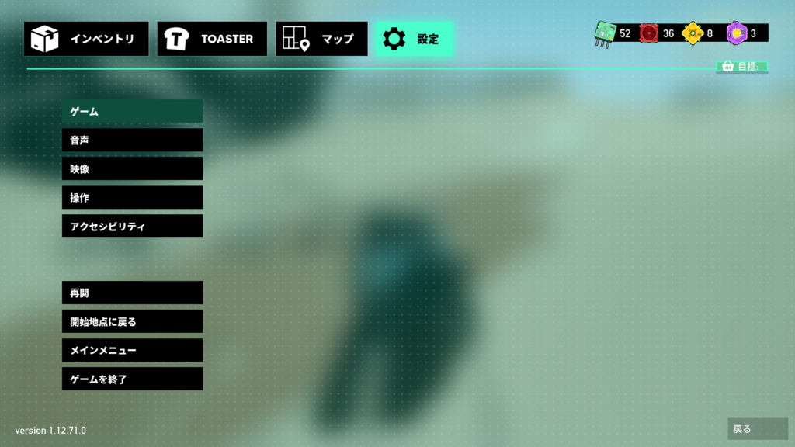
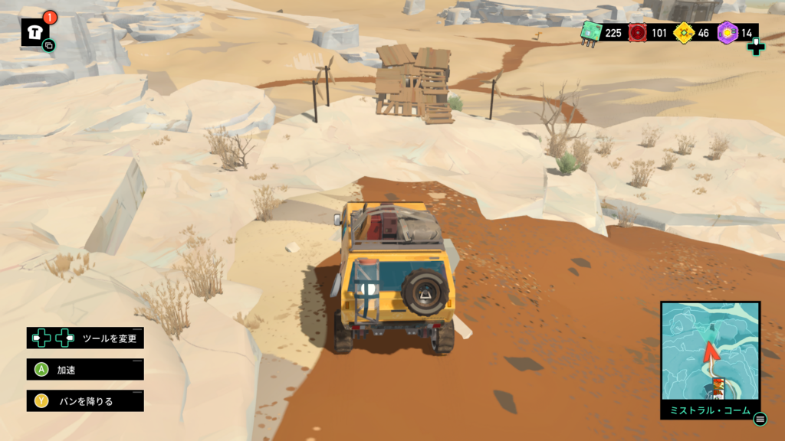
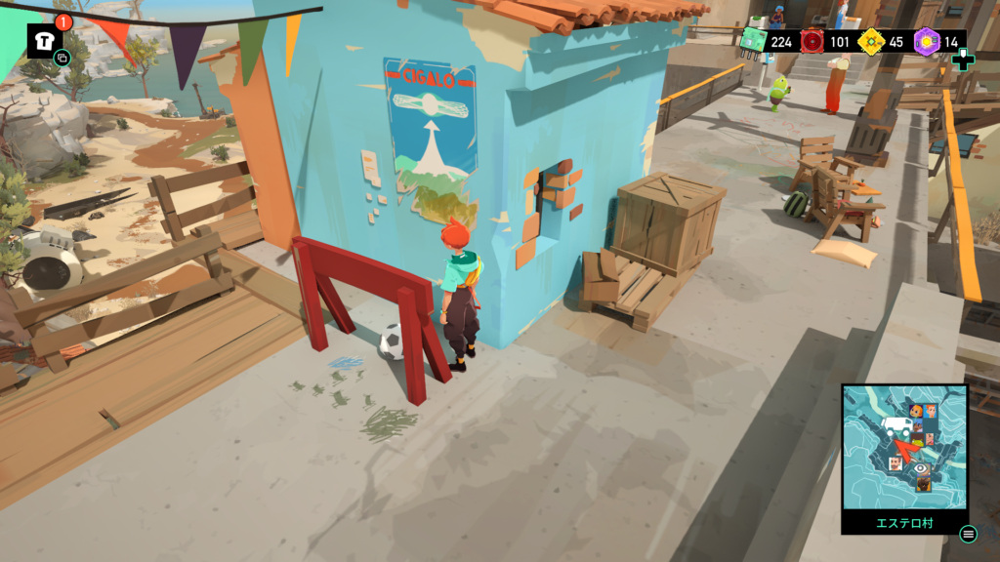
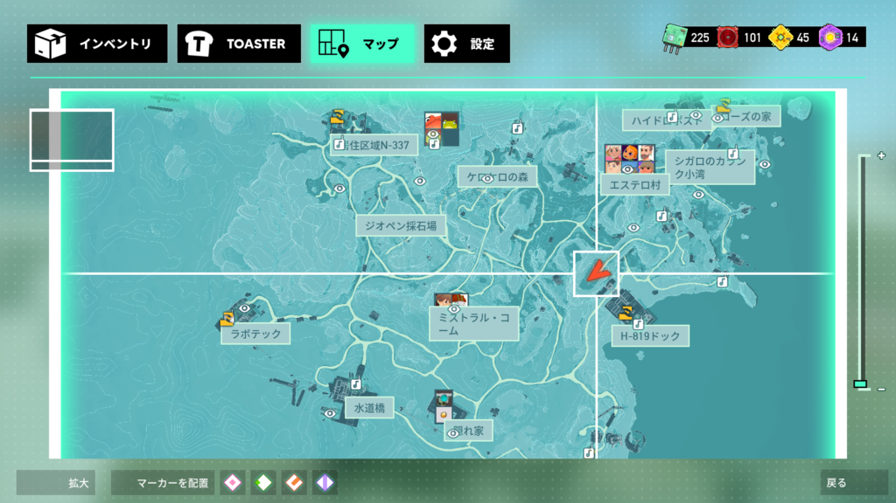
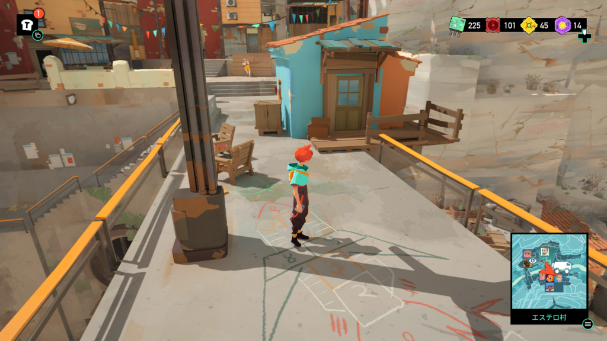
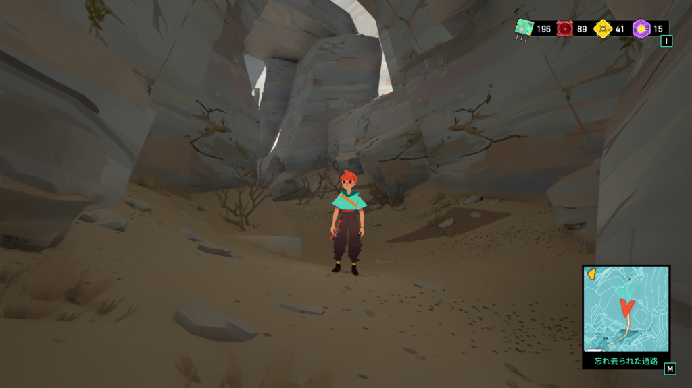
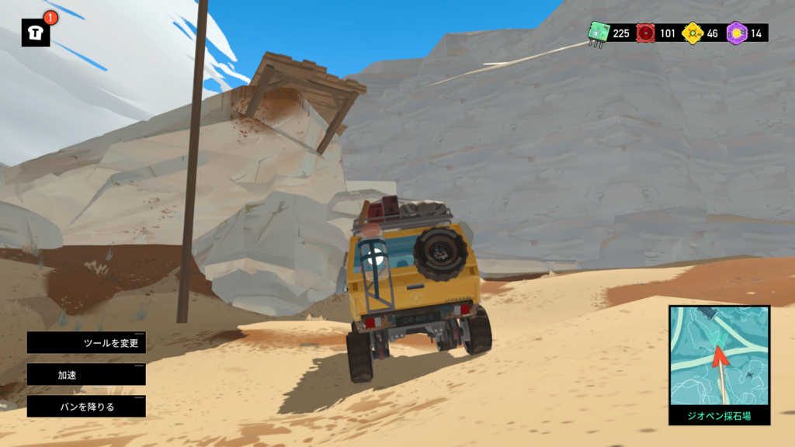
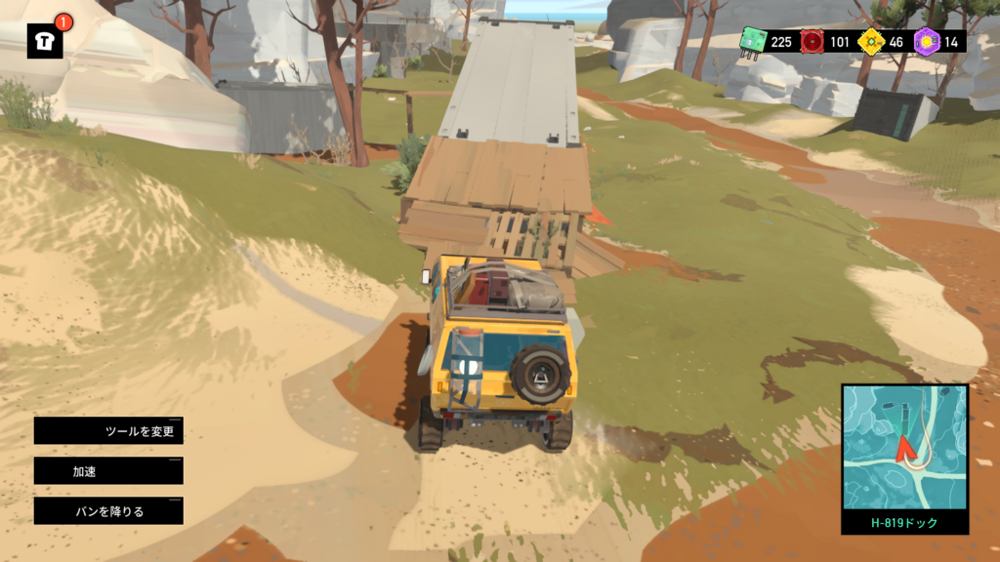

## **Caravan Sandwitch**のストーリーとゲーム概要

最近販売された**Caravan Sandwitch**の実績を全部取りました！私はsteamなので[こちら](https://store.steampowered.com/app/1582650/Caravan_SandWitch/?l=japanese)ですね。

こちらのゲームは探索アドベンチャーゲームとなります。いろんな場所を登ったりジャンプしたりして各地を探索し、パーツを集めればストーリーが進んでいきます。ちなみにやられることはありません。

ストーリーとしては連絡が取れなくなった姉からの通信が届いた妹が姉を探すゲームになります。最初に姉を探して別の惑星に行きます。そこで会った人と交流し、バン(車)でパーツを探し、新しいメカを作っていきます。

世界観は宇宙で快適に過ごすことができる状況で、生まれ故郷の惑星に行きます。そこでは荒廃した世界となっていて、住んでいる住人と協力します。この荒廃はある企業のプロジェクトにより起きてるので、それを止めるのも一つの目標になります。ただ、パパと父親がいるのは今っぽいですね…

### Caravan Sandwitchのサブタスクと実績

メカを作るたびに行ける範囲が広がっていくので、ワクワクしながら探索出来ます。メインやサブに関係ない場所でも使います。

また、メイン以外の**お願い**というサブタスクが存在します。困ってる住民を助けるとパーツをもらうことができます。もちろん無理にすることはないですが、住民の話や実績には必要なのでやっておくと良いと思います。その章でしかできないサブタスクもありますので。

### Caravan Sandwitchの感想とゲーム性

感想としては雰囲気がいいゲームになります。音楽と世界観がマッチしてるのでいい心地でプレイすることができます。ゲーム性に関してはあちこちに探索して収集するのが好きな人は楽しいと思います。バトル要素はないので戦闘好きな人はおすすめできないですね。

また、いろんなとこに行くのでスタックすることもあります。スタックしても脱出方法はあるので、多少ハマっても色んな所に行きやすいですね。車でスタックしても問題ありません。

パーツ集めに関しては割と余るので無理にあちこち行く必要はないと思います。最悪タスクをこなすだけでも十分かもしれません。

メカに関しては最初にチュートリアルがありますので、それで使い方をマスターしましょう。と言ってもそこまで難しい操作ではないです。

### Caravan Sandwitch実績解除のヒント

最後に実績ですね。実績もそこまで難しいものはないと思います。人によっては探すのが大変なものもあるかもしれませんが…

バンで1秒以上浮くのは以下の場所から飛ぶと実績解除されます。

ゴール！！！に関しては村のサッカーボールをゲートに入れると解除されます。

完成主義者は全ての?となっている地点を確認できれば実績解除できます。ラジオや座布団があるのでそれを確認すればOKです。

子供の心はケンパーをすればよいです。地面に数字が書かれているのでそれっぽくジャンプすれば達成できます。ゴールと一緒に達成しましょう！

探検家は全ての場所を訪ねることが必要です。全体マップだけでは名前が出ていない場所もあり、右下のミニマップにしか出ない場所もあります。ちなみに画像は地下施設から物流センターに行き、奥の細道を行った場所になります。私はここが最後に行った場所でした。ちなみに何もありません笑

最後にサスペンションテストですね。大体6,7か所を飛ぶと実績解除されます。見つけにくい場所で言えば下の2か所かなと思います。大体マップの黒い箇所を探していれば見つかります。

それ以外の実績はあちこち探索したり、タスクを全て完了することで達成できますので色んなとこを見て回るのがおすすめです。

### 終わりに

というわけでCaravan Sandwitchの紹介でした。雰囲気のいいゲームですが、10時間くらいで終わりますので人によっては物足りないかもしれません。2日くらい暇があってさっくりと終わらせたい人にはおススメです。ではでは。
