## 無料で使えるAIツール「Continue」でVSCodeにAIコード補完機能を導入する方法

Github Copilotが出てだいぶ時間が経ちましたが、IDEで未だにAIを使わず開発をしています。

Github Copilotは料金がかかりますし、open-interpreterを使ったとしてもopenAIのapiを使ってるので料金はかかります。

結果ほぼIDEでAIを使わずやってきたのですが、最近Continueが出たということを聞きました。こちらはllamaなどのオープンソースを使ってるので、料金はかからなそうです。参考にした記事は[こちら](https://www.theregister.com/2024/08/18/self_hosted_github_copilot/)になります。Continueのサイトは[こちら](https://www.continue.dev/)です。llamaの使い方は[こちら](https://docs.continue.dev/customize/tutorials/llama3.1)。

### Continueのインストール手順

というわけでまずはインストールしてみます。

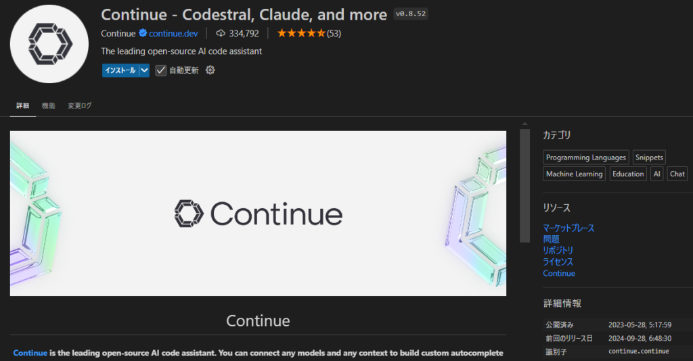

インストールが完了すると左のタブに表示されます。モデルの選択でどのモデルを使用するか選ぶことができます。

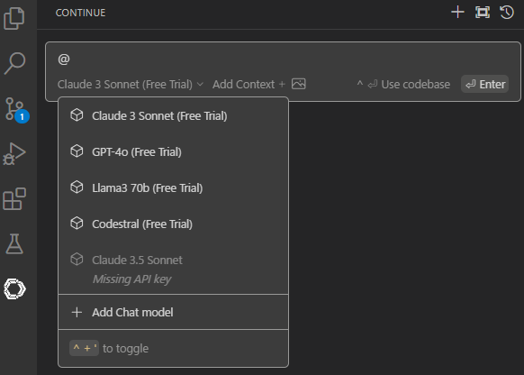

### Llamaモデルのダウンロードと設定

チュートリアルに従って次はllamaをダウンロードします。[こちら](https://ollama.com/)ですね。最近llama3.2が発表されたので3.2になってますね。3.1が良ければ[こちら](https://ollama.com/library/llama3.1)からダウンロードできます。

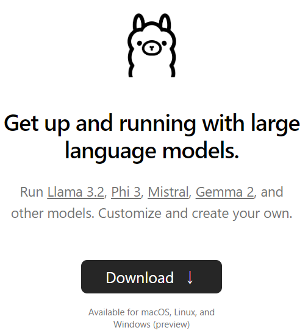

次にOSを選んでダウンロードしましょう。もしモデルのアップデート通知が欲しければアカウントを作って登録すると良いと思います。ニュースになるので今はやらなくてもいいかと

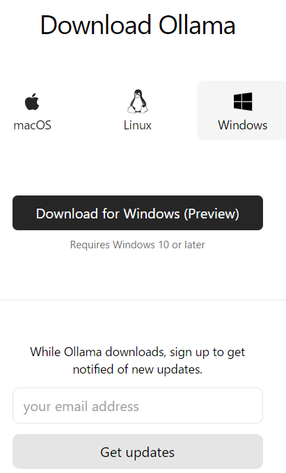

### ターミナルでモデルを実行

実行ファイルがダウンロードされるので開いて案内に従っていきます。インストールが完了すると実行ファイルなどが入っています。実行するとコマンドプロンプトから実行してくださいと言われます。

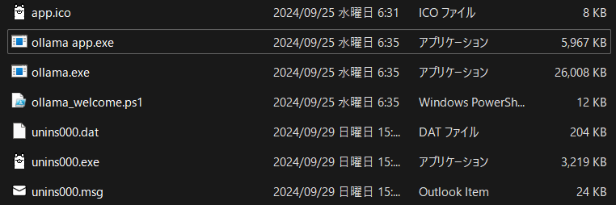

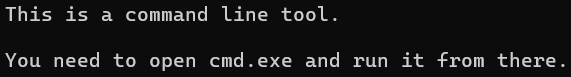

というわけでターミナルを開いて以下のコマンドを実行します。チュートリアルでは3.1:8bとなってますが、今回は3.2:3bを使用します。

```
ollama run llama3.2:3b
```

### 大きなモデルの利用（任意）

一応チュートリアルでは[Groq](https://console.groq.com/settings/profile)と[together](https://api.together.xyz/signup)などのサイトのAPIを使えば大きなモデルも使うことができるみたいです。ただ、料金などもかかりますので今回は省きます。

### Continueのモデル設定とconfig.jsonの編集

最初のモデル選択の部分でFree Trialのモデルを使えます。こちらを使う場合はGitHubにサインインする必要があります。今回はllamaをインストールしたのでlocal modelを使うことになります。

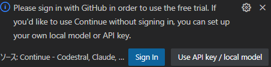

次はconfig.jsonを編集していきます。llama3.1を使う場合はこの"Add Chat model"から設定できますが、今回は3.2なのでconfig.jsonを直接編集していきます。Free Trialが不要であれば削除しましょう。編集する際は歯車を押せばconfig.jsonを開きます。

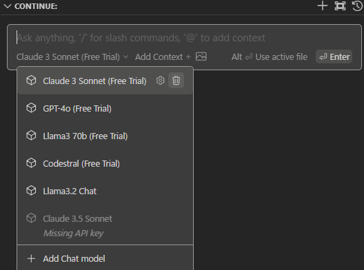

### エラー対処とモデルの接続

文字を入力してみましたが、エラーが出ました。大元のモデルは動いてますが、チャットモデルも必要みたいです。オートコンプリートモデルはコーディングをするとき予測して文字を補完するモデルです。というわけでpullしてみます。

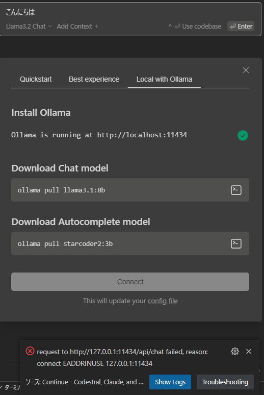

コマンドのターミナルをクリックすればターミナルにコマンドがコピーされますので、pullしましょう！もしこんなエラーが出たらおそらくVSCodeがポートを使用しているのでターミナルから実行してみてください。

```
Error: Head "http://127.0.0.1:11434/": dial tcp 127.0.0.1:11434: bind: An operation on a socket could not be performed because the system lacked sufficient buffer space or because a queue was full.
```

両方のモデルをpullすれば無事接続ができます。接続した際、llama3.1のモデルがconfigに追加されます。まあtitleやmodel名は違いますが消しても大丈夫です。接続できたことを確認できれば、初めのconfigで設定したモデルを使用できるようになります。

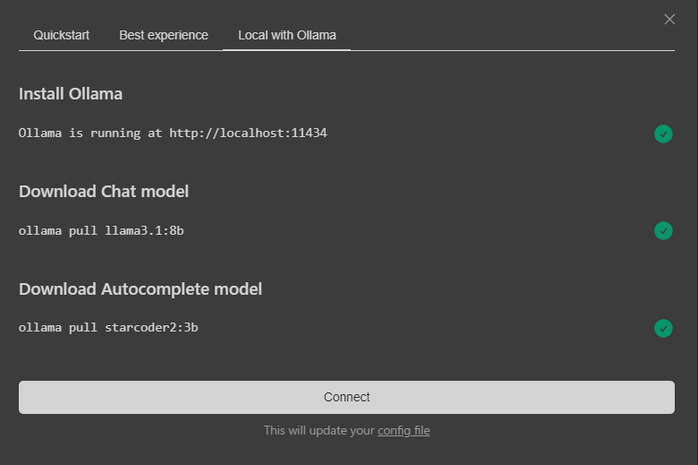

### Continueを実際に使ってみる

というわけで使えるようになりました。もちろんChat-GPTやCloudeのほうが性能がいいと思います。ノートPCで使えるローカルモデルではないですし。ただ、ネットにつながず軽量なモデルだとは思いますのでもう少し試してみようと思います。

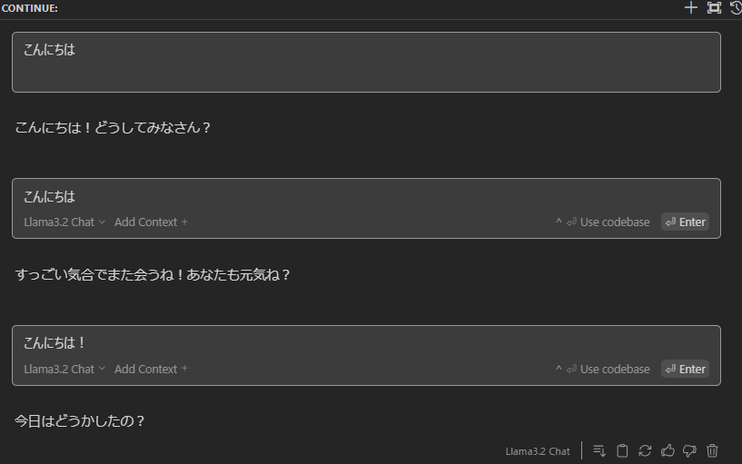

モデルの大きさの関係上3.2:3bよりは3.1:8bのほうが性能がいいかもしれませんね。今後モデルの精度や軽量化が進めばわかりませんが。

### VSCodeの設定で注意するポイント

さて設定は完了していつでも使えるようになりましたが、vscodeの設定で注意があります。匿名で使用情報を収集していますので必要に応じてoffにしてください。"ファイル" > "ユーザー設定" > "設定"からcontinueを検索し、Telemetry Enabledのチェックを外してください。気にならなければそのままで大丈夫です。

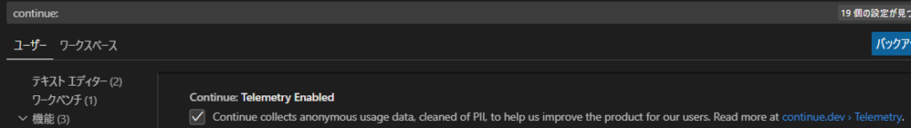

### コード生成のテスト：Dockerfileを作成

というわけで実際に使ってみます。今回はdockerfileを作成してみました。名前だけのファイルを作って、vscode上で開いた後に"CTRL + i"を押して以下のプロンプトを投げてみます。

```
Dockerfileを作成、python3.12を使用、ライブラリはnumpyとpandas、ワークスペースはapp、実行ファイルはapp.py
```

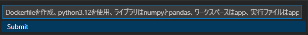

それで出来たのがこちらのファイル。概ね欲しいものができたと思います。requirements.txtやファイルのコピーは不要ですが、おそらく一般的な作りがこれなのでそこに当てはめた感じだと思います。

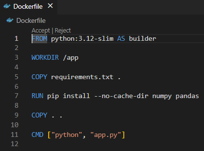

### コード生成のテスト：HTMLファイルを作成

一応もう一つ作ってみます。index.htmlファイルを用意してみました。どうやらファイル名によって作れるコードが変わるみたいなので、そこだけは気を付けましょう。Dockerfileからhtmlコードは生成されませんでした。というわけでプロンプトはこんな感じ。

```
インライン CSS を使用して HTML でシンプルなランディング ページを生成する
```

それで出来たコードがこんな感じですね。どんなページができたのか私はわかってないのですが、まあそれなりの物はできたのではないでしょうか？

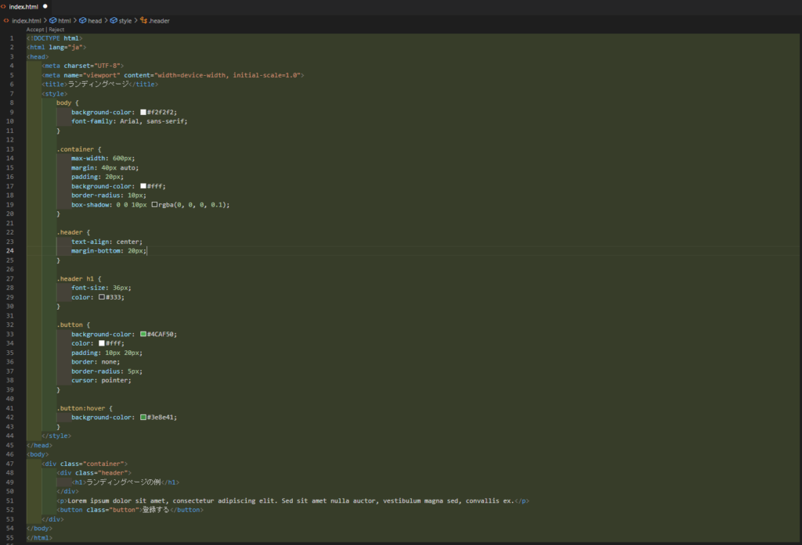

### まとめ：Continueの活用方法

こんな感じで他にも使い道はまだありますので是非調べて試行錯誤してみてください。あるいはプロンプトで訪ねてみるのもよいと思います。

コードの作成から修正、リファクタリングや文字の自動補完などがあります。またapiを使ってやればさらに良くなると思います。料金はかかってしまいますが快適にプログラミングができると思います。ではでは。
