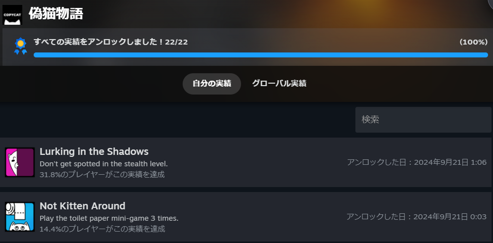
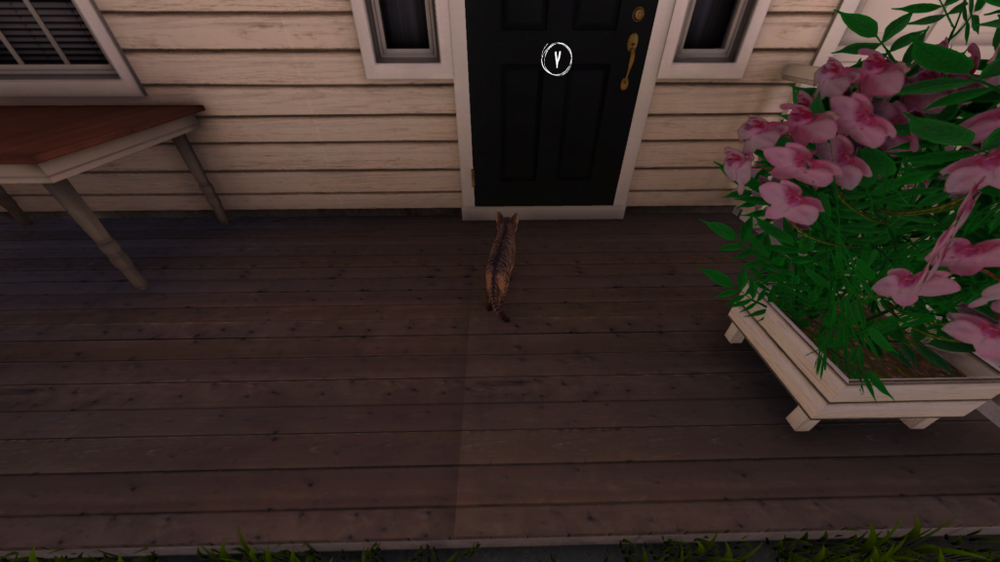
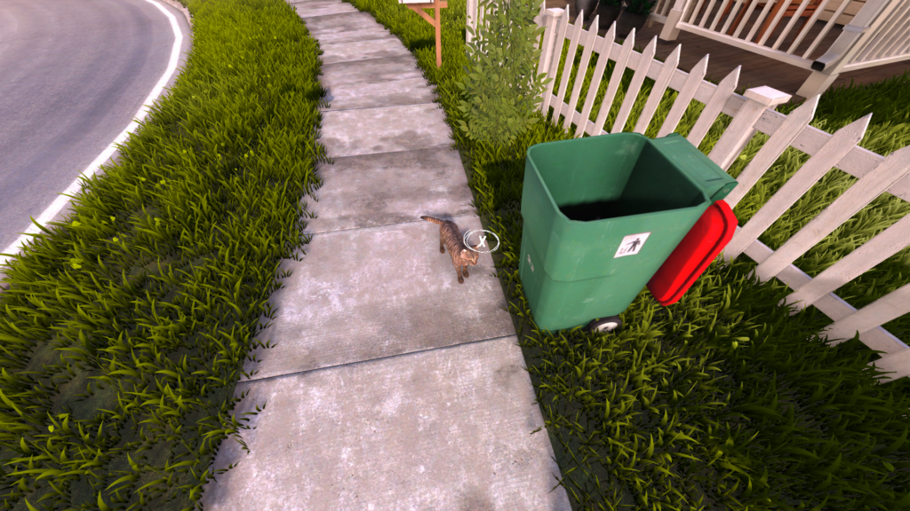
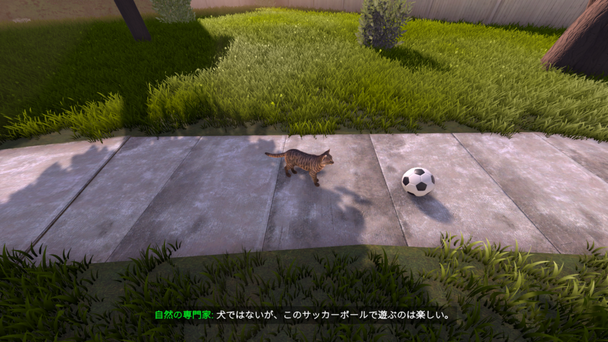

## 偽猫物語について

最近発売された[偽猫物語](https://store.steampowered.com/app/1622350/_/)をクリアしました！

こちらのゲームの物語としてはおばあちゃんが保護ネコ(Dawn: ドーン)を引き取ったところから始まります。

家の中、家の庭、近所を駆け回りながらミッションをこなし、ストーリーを進めていきます。

それからこのゲームのタイトルにある**偽猫**、それとコンセプトにある**家**について描かれています。

家というのは物理的なものではなく精神的なもので、「求められ居てもいい場所」というように言われています。

英語で言えば**house**ではなく**home**という感じですね。日本語だとどちらも家ですけどね…

見ているとどうしようもないなと思う部分があります。元凶はこいつが悪いといった部分もあります。最後はハッピーエンドですが、その道中に描かれる描写を考えさせられます。もちろんその人の背景を考えるとなんとも言えないのですが…

そういったどうしようもないことを自身なりに考えさせられるストーリーを見ながら猫を動かしていきます。

猫のゲームといえば最近の代表作だと**Stray**があります。私はプレイしたことはないですが。ただ、このゲームも猫の可愛さや鳴き声を見聞きすることができます。

あるいは猫やネコ科に関する豆知識なども教えてくれたりします。それから所々でドーンが考えていることを文字として見せている部分もあります。現実の猫がこんなことを考えてるかはわかりませんが、見てて楽しいですね。

### 操作性について

操作性に関しては若干悪い感じですね。完全に思った通りの動きをしているという感じではないです。ただ、猫を操作するだけで楽しいですね。

### 偽猫物語\_実績の攻略ポイント

次は実績についてです。これは難しいものはありません。

実績によってはゲーム内で博士が提案してくるものもあるのでそれに従えばよいものもあります。例えばペンキ缶を落とすシーンがありますが、そのペンキを足に着けてあちこち歩くとかですね。

それから家の物を棚から落とす。話をよく聞く。ミニゲームを失敗しない。細かく探索してみるということをやっていけば大体解除できると思います。他には

全ての隣人を訪ねる

ゴミ箱を調べる

3つのボールを触ってみる

というようなものがありますので、いろいろ触ったり探検すれば実績解除は難しくありません。

### 終わりに

最後にこのゲームは5時間ぐらいで完結します。あちこち探索してこの時間なのでまっすぐ進めば3時間ぐらいで終わると思います。

ただ、猫の可愛さと物語で描かれる問題を考えさせられるのはいいなと思いました。サクッとゲームをやって猫に癒されたい人にはおすすめです。ぜひプレイしてみてください！ではでは。
