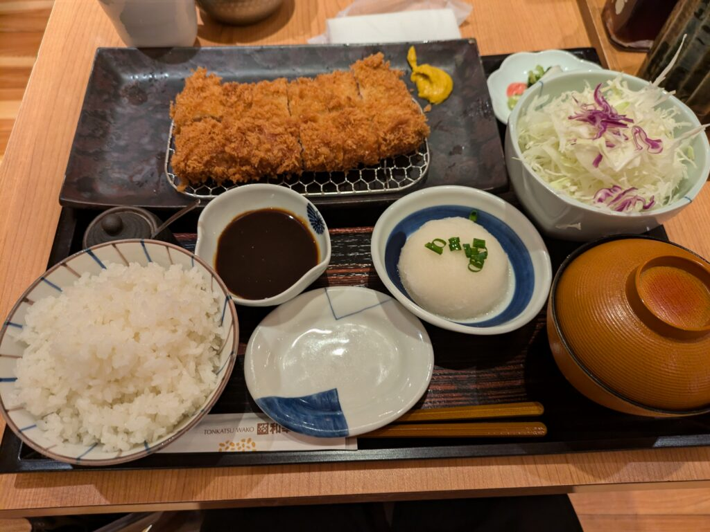

## 古代オリエント博物館へ訪問

古代オリエント博物館へ先日行ってきました。お盆に台風で行かなかった上にチケット期限ギリギリというのもありましたが…

オリエントとは東方のことを指します。日本に関するものはなかった気がしますが、アジア圏内やエジプト付近が多かった気がします。

場所は池袋のサンシャインシティ内の7Fにあります。[こちら](https://aom-tokyo.com/)ですね。実は私がパスポートを取得したのもここだったのでついたときは驚きでした。

### コスプレイベント「アコスタ」との偶然の出会い

余談なんですがこの日はコスプレしている人が多くいました。調べてみたら[アコスタ](https://acosta.jp/)というイベントだったみたいです。私が知ってるキャラのコスプレもあって少し感激しました。

### 古代オリエント博物館の展示物

さて、中は他の博物館のように広いわけではなく一部を借りて展示しているような感じでした。右回りで順路を通っていきます。

基本的には当時使われていた陶器や銅像などが置かれていました。それから当時の生活様式ですね。どんな家に住んでたのか？どんな土地に住んでたのか？がよくわかります。

それからレプリカが置いてありました。例えばツタンカーメンのマスクや棺桶。他にもハンムラビ法典もありました。もとは石碑なのでそのレプリカですね。

### 紀元前の歴史を学ぶ展示内容に感動

一応その地域で起きた歴史なども書かれています。紀元前の歴史はあまり知らないので初めて知ったことも多いですね。ここ2000年の技術進歩は凄いなと改めて感じました。紀元前の数千年はそこまで大きく進歩しなかったみたいなので。

### 古代オリエント博物館の聖書に関する展示品

また、今回期間限定で展示されていた聖書回りの展示品ですね。旧約聖書、新約聖書があること自体は知ってましたが起源などはほぼ知らなかったですね。こういうのを見ると実際に聖書の中を見たくなります。4000円ぐらいしたので今回は見送りましたが…

### 子供向けクイズと夏の特別展示

今回は夏の展示ということで子供が楽しめるようクイズがありました。恐らく全問正解すると何かもらえたりするんだと思います。ただ、クイズに興味がある感じで歴史を見てた感じはしなかったです。歴史に興味をもつきっかけになるといいんですが…

休みの日でしたが人はそこそこ入っていました。とは言え展示品があまり見えないというわけではなくまばらにいるくらいですが。

### お土産コーナーと展示後の感想

最後に見回った後お土産もありました。聖書以外に惹かれるものはなかったので適当に物色した後、その場を後にしました。

感想としては気軽に回れて紀元前あたりの人々の暮らしがわかるいい博物館でした。手軽に行けますし、サンシャインシティ内にあるので他に行く場所も多いので。ただ、休みの日は人が多いのでおすすめできないですね。

### サンシャインシティでのとんかつ和幸の食事

サンシャインシティには食べる場所もありましたのでとんかつの和幸を食べました。店舗展開しているので味などは割愛しますが美味しかったです。最近はタレよりも塩がいいなと思い始めたので老いかもしれません…

### 次回の訪問予定：東京国立博物館と美術館探索

次回は東京国立博物館に行こうと思います。こちらもチケットを買ってそのままになっているので。

後は美術を少し学んで美術館にも行ってみたいですね。東京を離れる間にいろんなところを回ってみたいです。描くのが苦手なので美術は敬遠してましたが、知らないままというのもむず痒いので。美味しい外食をする言い訳にもなるので（笑）ではでは。
