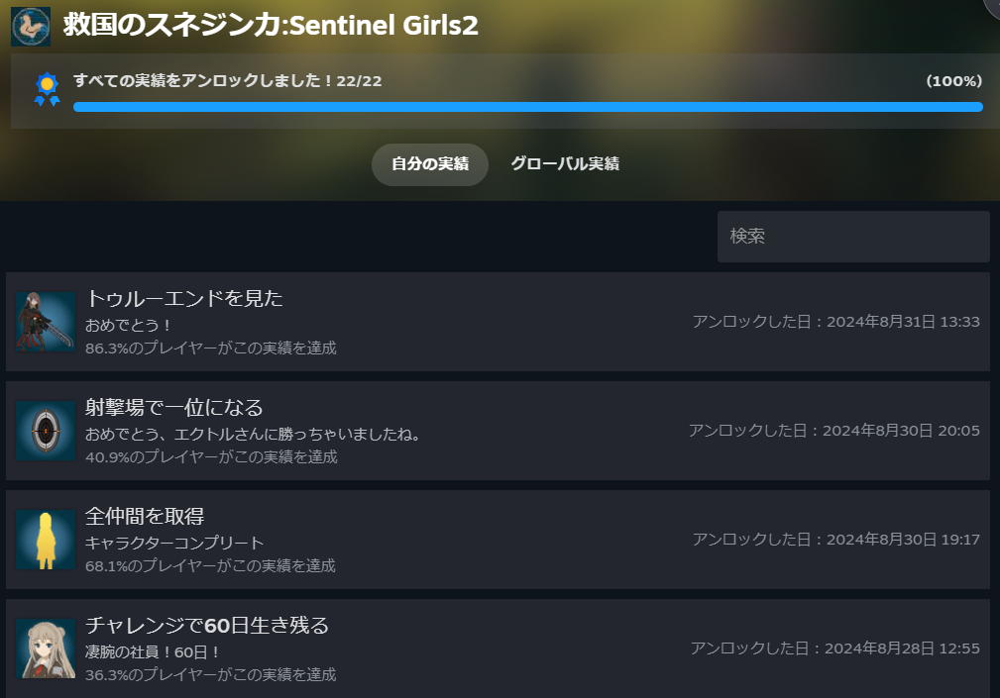
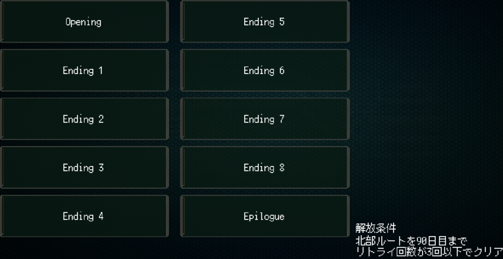
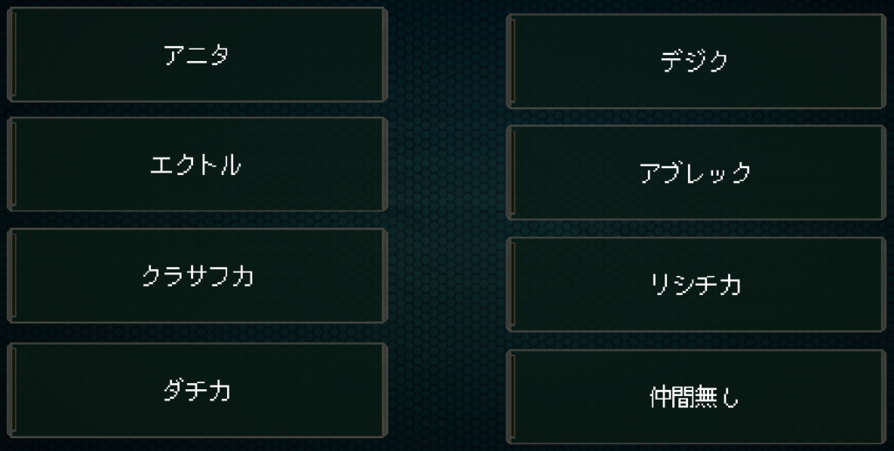
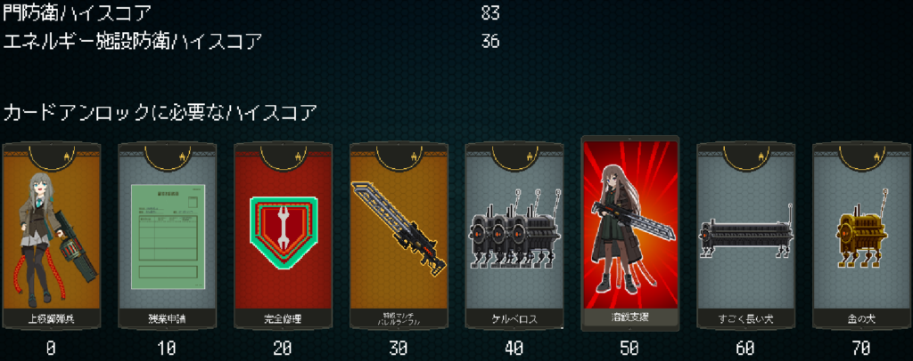
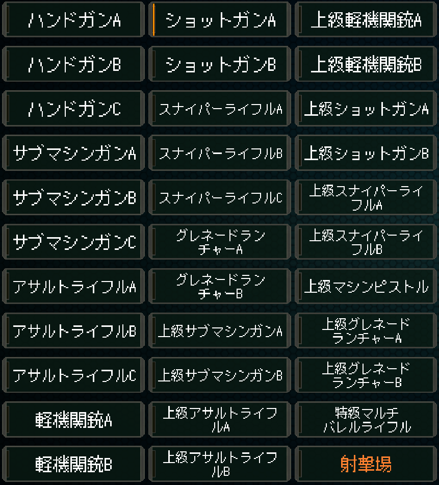
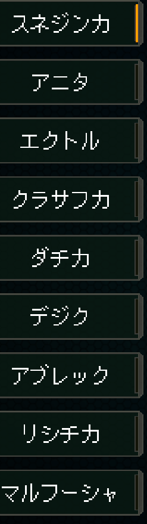

## 溶鉄のマルフーシャ続編をクリアした感想

[以前](/posts/2024/07/recent-games-roundup-july-2024/)溶鉄のマルフーシャをクリアした記事を書きましたが、続編をクリアしました。

### 救国のスネジンカ\_今回のストーリー概要：姉を探す妹の物語

前回は政府のために仲間とともに戦う姉の話でしたが、今回は姉探しのため仲間とともに戦う妹の話になります。仲間のため戦い続ける姉と姉を探して戦う妹が相まみえたときどんな物語が作られるのか？という感じですね。

### 救国のスネジンカ\_実績とエンディングの攻略

前回と同様実績自体は特に難しくないですね。一番難しいものでも30%台なので。エンディングは8+op+ed、キャラごとのセリフ分岐、武器コンプまでやると少し時間がかかる感じですね。

ちなみにキャラコンプはキャラカードをすべて使えばコンプできると思います。コンプ自体はこんな感じ。

エンディング。解放条件も載ってるのでそれに従えば十分です。

セリフ分岐。その日数にお供キャラがいれば解放されます。北部(トゥルー)、東部(ノーマル)のどちらかで見れば問題なしです。20日の上級キャラが少し大変ですね。

ハイスコアのカードアンロック全解除。メインを軽くやった後にやりました。ただ、メインではほとんど出てこないですね…

### 救国のスネジンカ\_キャラコンプと武器コンプの進め方

武器コンプ。意識的に使っていればほぼコンプできると思います。特級マルチバレルライフルだけはチャレンジでした出ない気がします。当然ですがめちゃくちゃ強いです。

キャラコンプ。カードを使用すれば大丈夫です。

今作も楽しませてもらいました。コンプも難しくないですし、音楽も耳に残るリズムで飽きにくい。後はクリアするとキャラの能力を借りてプレイできるのですが、それと武器の組み合わせも楽しい。

### おすすめのキャラと武器の組み合わせ

リシチカというキャラはスナイパーライフル系なのですが、1発目が強いという特徴があります。これと上級スナイパーB(弾は1発のみ)の組み合わせはロマンがあります。バラマキ仲間が必須ですが…

上級機関銃Bとプッシュ強化もいいですね。敵を近づけさせないのでチャレンジだとだいぶ楽に70日まで行けるようになります。おすすめです。

それから青ガジェットは強装弾がいいですね。これに段数が多いものが組み合わされば大体のボスは撃破できると思います。個人的に上級機関銃Bは一番いいなと思えますね。

それからチャレンジでは各キャラが使えます。キャラごとに相性のいいバディキャラがいますので、そのやり取りを見るのも面白いと思います。

1回だけですがやり取りとパラメータ強化がありますので、見てみるのもよいですね。

### 射撃場での攻略法と記録更新

後は射撃場ですがこれもおすすめは上級機関銃Bですね。的が出る間に置き射撃ができるので、的が出たと同時に破壊することができます。

エクトルの記録を塗り替えると悔しそうにしている姿と慌てているダチカを見ることができます。

その後また来るとエクトルの記録が7秒になってますね。ただこれも上記の戦法で上回ることができますので試してみてください。

### まだ続編が期待されるシリーズの魅力

おそらくまだ続編が作られる予感はしますのでとても楽しみですね。現在[前編](https://store.steampowered.com/app/1456820/Sentinel_Girls/)とともに[セール](https://store.steampowered.com/app/2608350/Sentinel_Girls2/)をやってますので気になったらやってみてほしいですね。ではでは。
