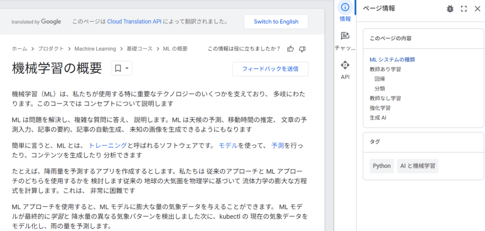
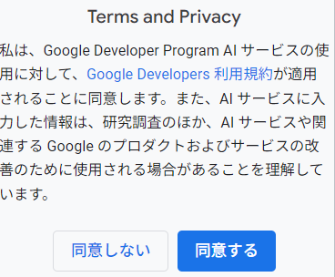
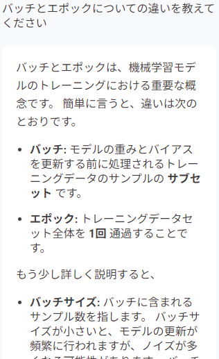
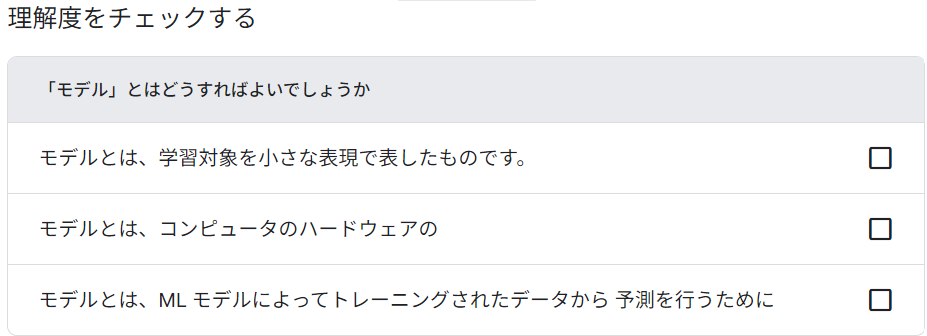
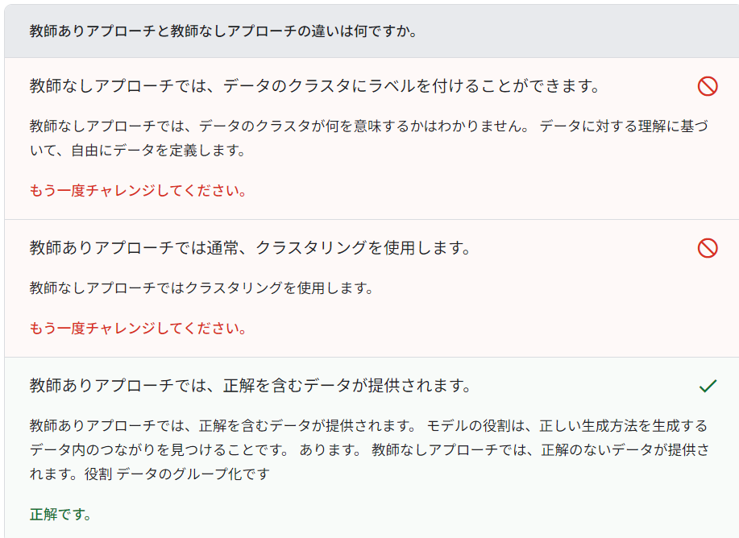
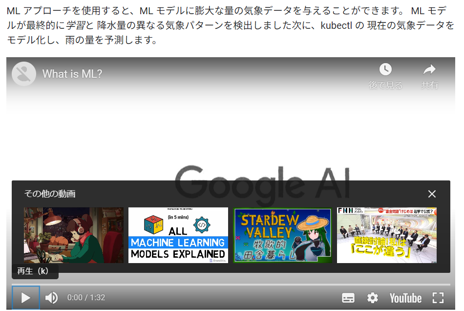
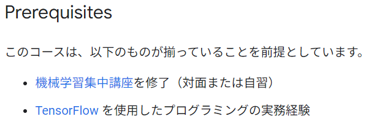
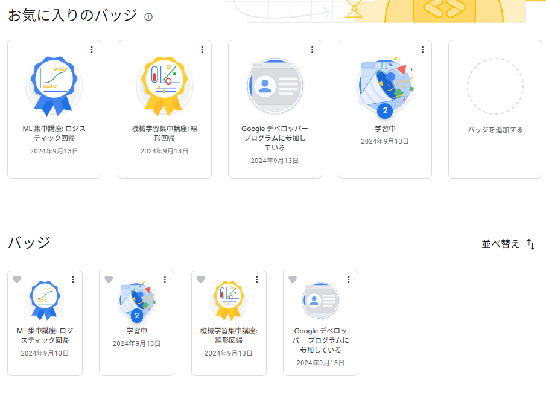

## E資格合格後に再学習を決意した理由

[E資格を合格した](/posts/2024/03/jdla-deep-learning-engineer-exam-2024-1-to/)後復習とか出来てないので、改めて学びなおしてみようと思ったのがきっかけになります。[こちら](https://developers.google.com/machine-learning/foundational-courses?hl=ja)から受けることができます。必要に応じて日本語に切り替えることもできます。

生成AIの進歩もありそれにまつわるような部分もあるので、ぜひ理解を深めたうえで使っていくと良いと思います。

### 機械学習講座の学習ツールとインターフェース

タブに基礎コースと上級コースがあるのでまずは基礎コースからやってみました。

初めの内容としてはこんな感じですね。

右タブに**情報**と**チャット**と**API**があります。

情報はこのページの目次ですね。チャットは生成AIを使って質問することができます。わからないことがあったら随時聞いてみるといいと思います。サービスの同意をしたら試してみましょう！

APIを使えばデータを見ることができます。一覧は[こちら](https://developers.google.com/apis-explorer?hl=ja)にあります。今回は一旦無視しますね。

### 理解度チェックとインタラクティブな学習

目次の項目によっては理解度チェックがあります。下の画像の場合は三択から1つ選んでクリックすることになります。日本語だと微妙な部分もありますので、英語で見てみるのも手ですね。

正解の選択肢では説明を見られるものもあります。間違った場合は別の選択肢をクリックしましょう。間違ってもペナルティがあるわけではないので、ミスは気にせずページをよく読んで解答するとよいです。

### 動画コンテンツでの学習補助

さらに動画もあります。概要の説明をしているので興味があれば見てみてください。英語説明ですが画面を見てるとなんとなくわかるので、必要であれば字幕を付けるなどして見てください。

基礎講座だけでも十分機械学習について学ぶことができます。一応上級講座も見てみました。

基本的に変わりませんが、前提知識や実装経験が必要になってきます。

なのでまずは基礎で十分理解と実装経験を積んでから上級に行くことをおすすめします。

### 機械学習のプログラミング演習活用

講座を進めていくとプログラミング演習を実施することもできます。英語なので必要に応じて日本語訳してみてください。

### 機械学習講座後のバッジとプロフィールの公開

学習が終わってチェックテストをクリアするとバッジをもらうことができます。お気に入りを5つまで設定できるので、いっぱい集めてみようと思います。

プロフィールを公開すれば他の人にも見られるようになります。転職等で使えるんですかね？

### 今後の学びと実践に向けた決意

機械学習には教師あり、教師なし、強化学習、生成があります。本来全てやることは少ないかと思うので全て学ぶにはかなり時間がかかると思います。

ただ、これが理解できればどのようなデータが仕事に使えるかわかるようになります。また売上予測や顧客分類、キャンペーンの効果も見える部分が出てくると思います。

しっかり学んで実際のデータで試してみれば学習の実感が出てくると思うので頑張っていきましょう！私も再度学びなおして理解を深めていきます。ではでは。
