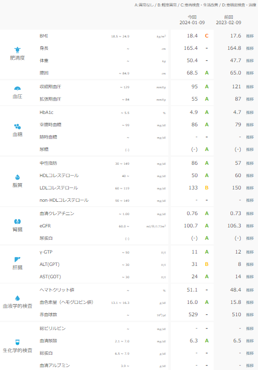

## 社会人になってから健康に気を付け始めた理由

社会人になってから親元を離れたので、健康に少しずつ気を付けるようになりました。なぜなら実家にいたときは料理を作ってもらってたので

### 自炊を始めたきっかけと健康診断の結果

社会人になってからは自炊をするようになりました。というわけで最近の健康診断の結果がこちらです。

BMIに関してはやせすぎなので筋肉をつける必要がありますね。筋トレをもう少し頑張ってみます。

それ以外は概ね問題ないと思っています。ただ、B判定もありますので油断はできないですね。この辺は食べ物と筋トレで解消できるかと思います。

### 日常的に気を付けている運動習慣

日常的について気を付けている運動については以下のような感じです。

- 階段を使う

- 電車は座らない

- 歩くときはなるべく早足で

### 週4回の筋トレメニュー

それから週4で筋トレを行っています。項目は以下のみですね。

- バーピー: 30秒 \* 8回 (ゆっくり最大ジャンプ \* 4回, 素早く \* 4回)

- 片足ニープランク: 30秒 \* 8回 (右足 \* 4回, 左足 \* 4回)

- 運動の間の休憩: 15秒 \* 15回

- 午前午後で1セットずつ

流れとしてはバーピーをやった後片足ニープランクを行っています。今はこの秒数で2セットこなしてますが、去年の11月から負荷を挙げていたりします。

### 筋トレの進捗と負荷の調整

始めた当初は1セットかつ20秒でも筋肉痛になってました。プランクも片足ではなく両足で行ってました。そこから4回の部分を5,6,7,8と増やしていきました。増やすと1セットが長くなるのが嫌だったので、2回に分けて行うようになりました。

少し前までは20秒の5回で２セットだったのですが、負荷を増やすため30秒にしました。ただ、慣れが欲しかったので回数を4回に減らしています。まだ回数も秒数も増やしていく予定です。

### 新たに挑戦しているエクササイズ

筋トレはこんな感じですが最近気になってることがあります。片腕腕立て伏せと逆立ち腕立てと懸垂ですね。片腕腕立て伏せは数回ならできましたが、それ以外は全くですね。興味があるので空いた時間で少しずつ上達したいですね。

### プロテインの摂取とおすすめアイテム

筋トレやってるのでプロテインを飲むようにしています。もちろん筋トレしなくても飲んだ方が良いとは思います。大体の人はタンパク質不足になりがちなので。私が飲んでいるのは以下ですね。

- [Milkshake Protein Powder](https://www.amazon.co.jp/gp/product/B07L91HBFG/ref=ppx_yo_dt_b_asin_title_o03_s00?ie=UTF8&psc=1)

- [ボーンブロス粉末、バニラ](https://jp.iherb.com/pr/left-coast-performance-bone-broth-powder-vanilla-1-lb-454-g/115839)

- [ホエイプロテインアイソレート](https://jp.iherb.com/pr/biochem-100-whey-isolate-protein-powder-vanilla-1-8-lbs-857-g/6907)

- [自動シェーカー](https://www.amazon.co.jp/gp/product/B0C7GWGLWV/ref=ppx_yo_dt_b_asin_title_o01_s00?ie=UTF8&th=1)

この辺は体にもよく体調を壊しにくいかなと思います。ただ、甘ったるいなど人の好みがありますので色々試してみることをおすすめします。さらにシェーカーも手でフルのが面倒なので、私は充電式の自動シェーカーを使っています。

### 食生活の改善と果物の摂取

最後に食事ですね。

自炊をしているのである程度他の人よりは気を付けている方だとは思いますが、弁当は週1くらいで買って食べてます.。

少し前までお菓子を食べたりしていましたが、最近はお菓子はほぼ食べてません。代わりに果物を食べるようにしています。そのため以下を食べています。

- バナナ

- 冷凍ベリー

- キウイ(なければ小さめのリンゴ)

- 梨

朝にバナナ、冷凍ベリーにヨーグルトとハチミツをかけてコーヒーで流し込んでます。他のキウイ、リング、梨は皮も含めて食べています。もちろん種やヘタは除いてますが。

皮を食べるのは基本的には食物繊維を取るためですね。もちろん他の栄養素もありますが。ただ、皮は好き嫌いがあると思いますが、果物は取るに越したことはないと思います。当然ですがお菓子より健康にいいと思うので。果物じゃなくてもナッツ系もいいと思います。

### 食事全般と今後の目標

食事自体は普通ですね。ご飯、肉、野菜を食べてます。魚を多めに食べたいのですが、近くにあるのが業務スーパーなのでつい肉になりがちですね。

### 健康への取り組みまとめ

主に気を付けてるのはこんなところだと思います。サプリなども一応とってますが、必須ではないと思いますので。健康に気を付けて年をとっても色んな体験や経験ができるようにしておきたいですね。ではでは。
