## 豆狸バケルをSteamでプレイ！ゴエモン風アクションゲームの魅力

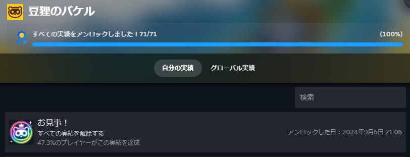

株式会社グッド・フィールから発売された[豆狸バケル](https://mameda-bakeru.com/)がSteamでも配信されたのでやってみました！

実はSwitchで販売されていたみたいです。ゴエモンのような雰囲気があり気になってやりましたが、楽しかったです。

アクションがもともと好きなのもあって割とサクサク進めました。

### 豆狸バケルのストーリー：狸が街を救うお祭りの冒険

ストーリーはお祭りで洗脳された街を狸がおとぎ話のキャラの力を借りて救う話になります。キャラの力を借りれば強くなるし、楽に道中を進められます。

やってみた感想や実績のヒントにでもなればいいかなと思います。

### 爽快感のあるアクションとキャラの力

感想としては楽しかったなという感じですね。

敵はサクサク倒せますので爽快感はあります。特にキャラの力を借りたときの爽快感は大きいですね。個人的には"うらしま"をよく使ってました。強さ的には"きんたろう" > "うらしま" > だと思います。ただ使ってて気持ちよかったので。

お金集めは意識的にしておいたほうが良いですね。招き猫を見たら積極的に使いつつ買う。そうすれば困ることは少ないと思います。さらに、かんしゃく玉を使えば一気に殲滅できるのでお金もモリモリで気持ちいです。

### 豆狸バケルの実績や収集要素の攻略ポイント

ゲーム内には収集要素があります。おみやげ(その地域のご当地アイテム)や地域にまつわるうんちくです。聞いたことあるものや知らなかったものがあるので、これは見ていて面白いですね。ただ、うんちくを見返した時パッと見れたらいいなとは思いました。

後半から収集要素に狸が追加されます。これは見つけにくかったですね。追加された最初のステージはシッポが出てわかりやすいのですが、それ以外は狸柄を見つけないといけないですね。主に目のマークがついてたりします。後で張り付けてみようと思います。

### 兵器バトルとボス戦の攻略

実績自体は難しくなく、収集要素のコンプとボスノーダメ撃破が大変なほうだと思います。バケルが戦う場合は店で攻撃力UPとバリアアイテムを使えば余裕ですね。ラスボスは速度UPも使って急いでいけば大丈夫だと思います。

ただ、兵器バトルがあるのですがこっちが大変ですね。上からのミサイル以外は防御でしのげますが、動きが遅い…

素早く防御出来ないので慎重になりながら攻撃する必要があります。特にこけしは大変で、カウンターを使ってきます。左右交互に攻撃しつつ、カウンターがきそうなら必殺で避けるという感じであれば行けると思います。兵器も最大まで強化していれば必殺も貯まりやすいですし。

### お祭り気分の音楽とBGMの魅力

音楽もお祭りがメインなので全体的に明るいですね。ただ、スパイクチュンソフトさんが関わっているのもあって絶望少女に似たBGMがありました。少し怖めの雰囲気の時に流れて似てるなーと思いながら聞いてました。

### 収集要素と各地域のお土産

感想というか攻略としてはこんな感じですね。最後に狸のスクショでも上げてみます。愛媛のミカン箱と奈良の紅葉は取れなかったのですがそれ以外は取れましたので。

**沖縄**

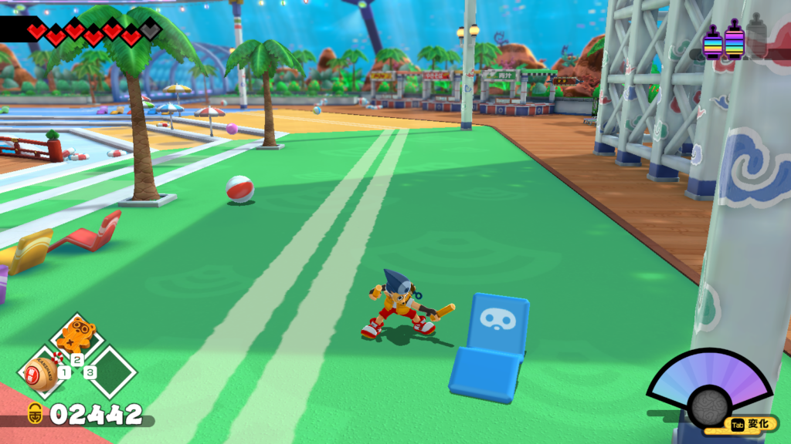

**静岡**

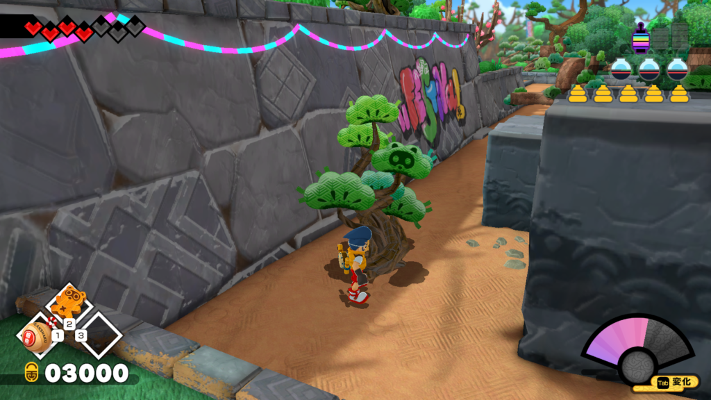

**和歌山**

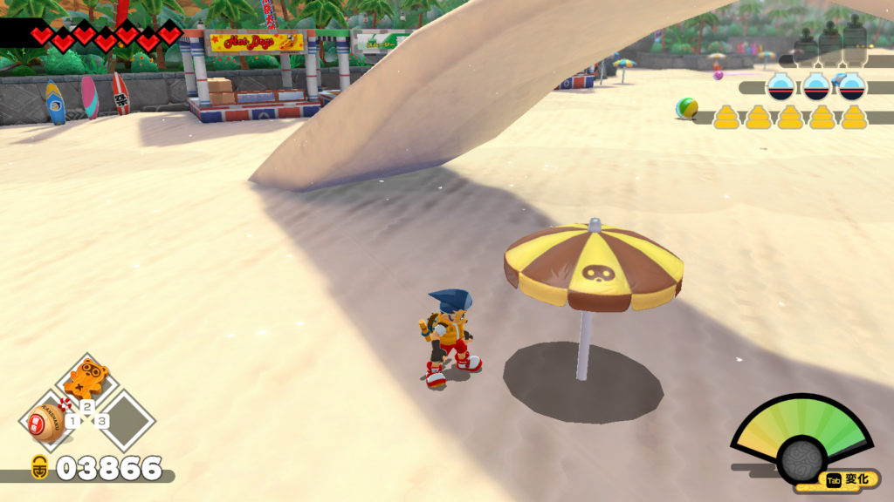

**兵庫**

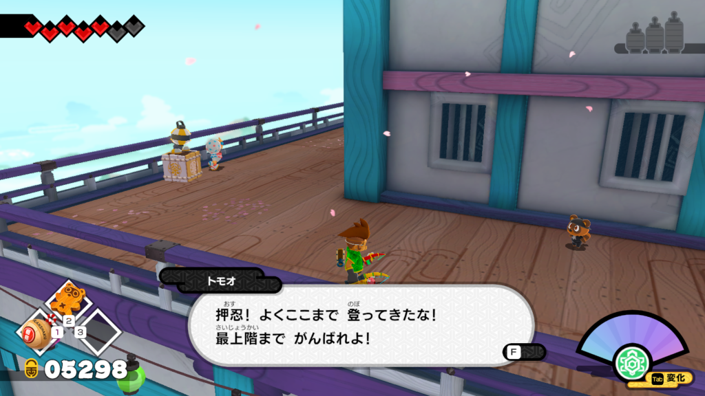

**岡山**

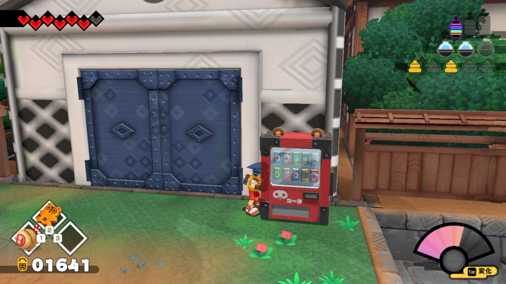

**島根**

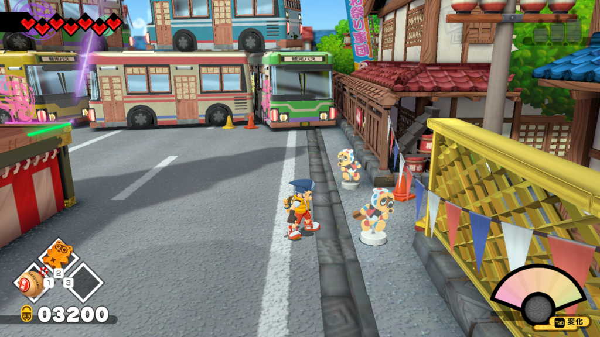

**宮崎**

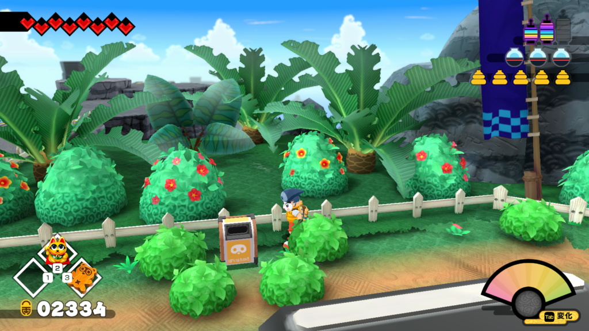

**長崎**

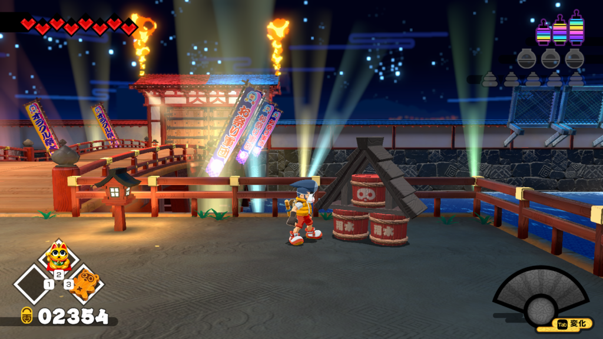

**熊本**

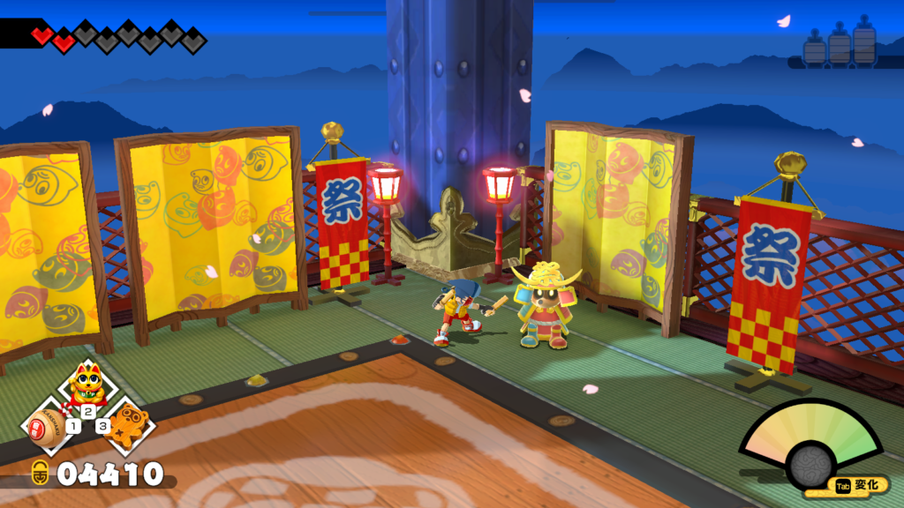

**福井**

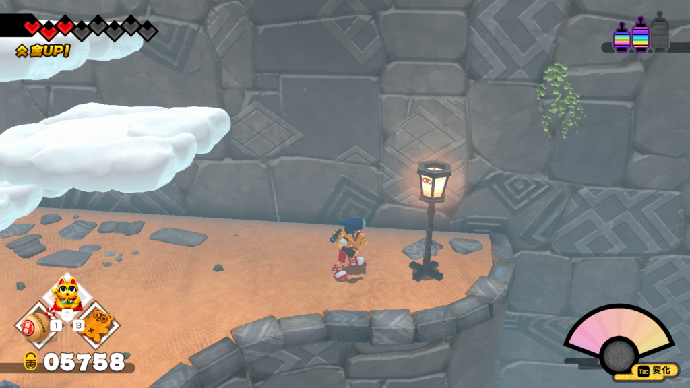

**石川**

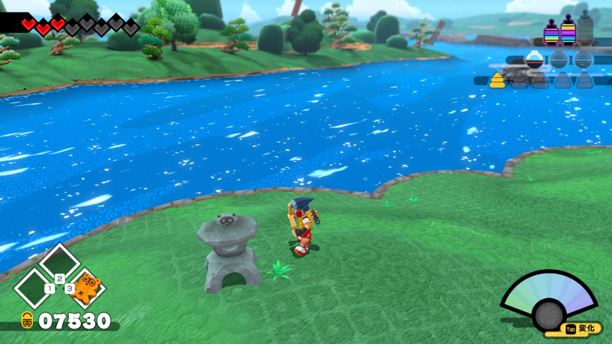

**富山**

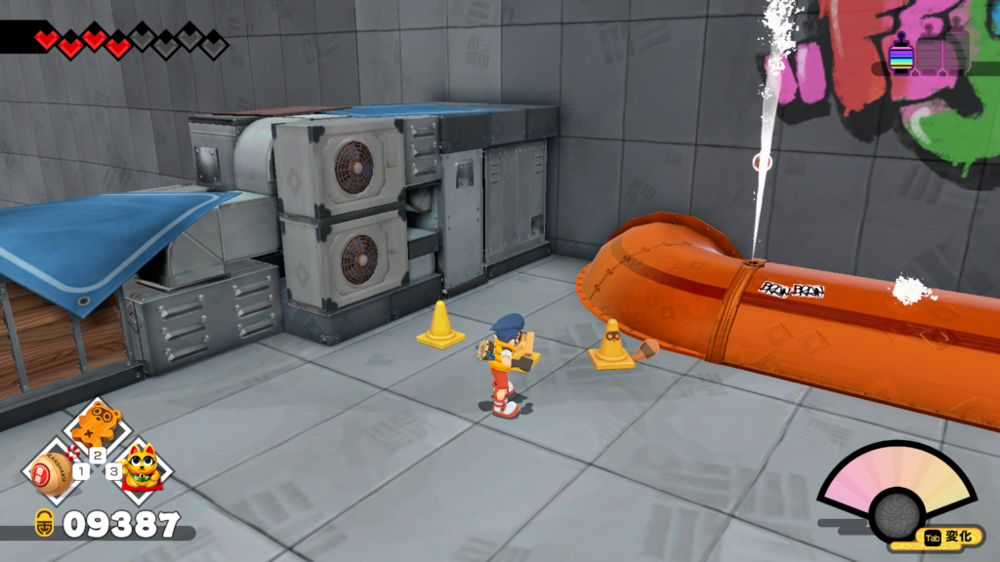

**福島**

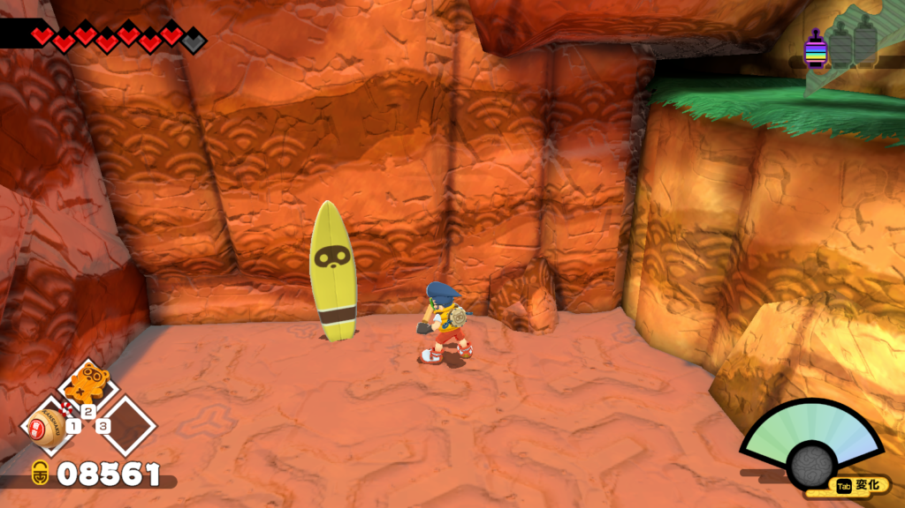

**山形**

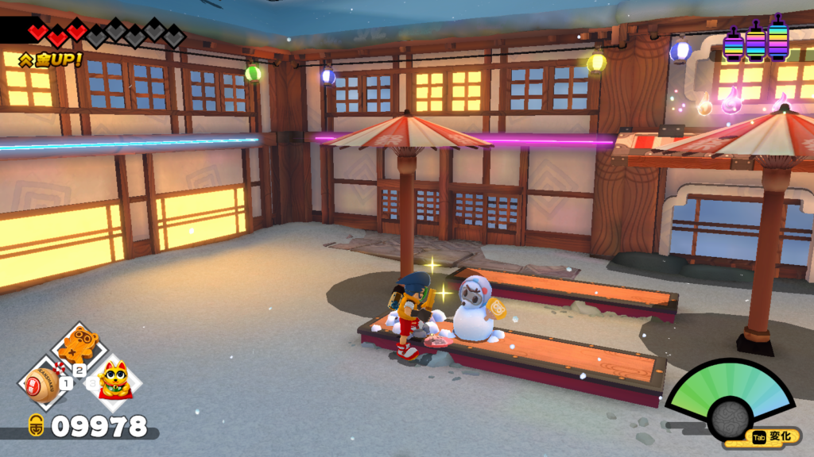

**茨城**

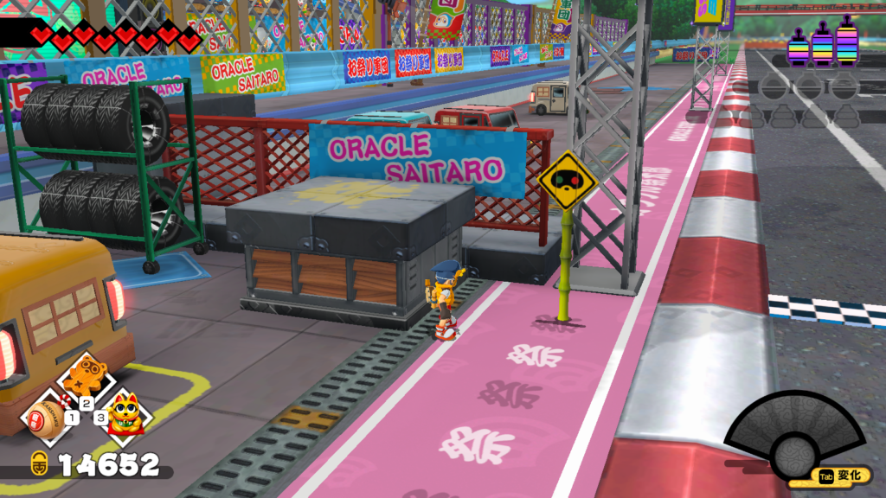

**東京**

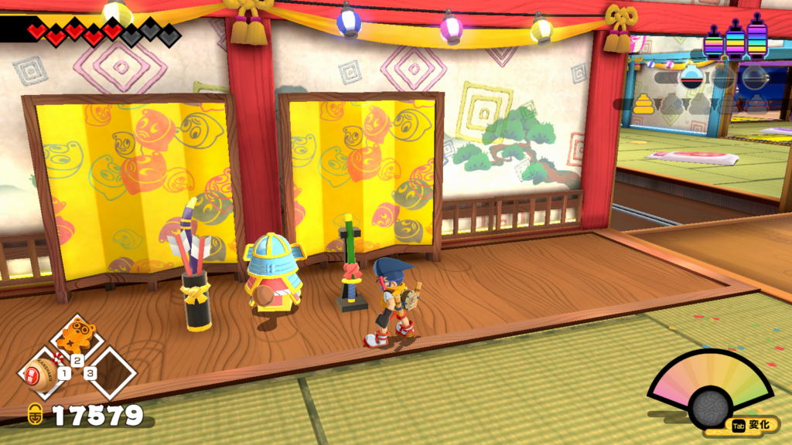

### プレイの感想と今後の期待

最後に富山のお土産で苦戦したとこもお見せします。この場所だけはかなりわかりづらく、苦戦した場所になります。ここ以外は1,2回見逃すくらいなんですが、ここは何度もスルーしちゃいましたね。

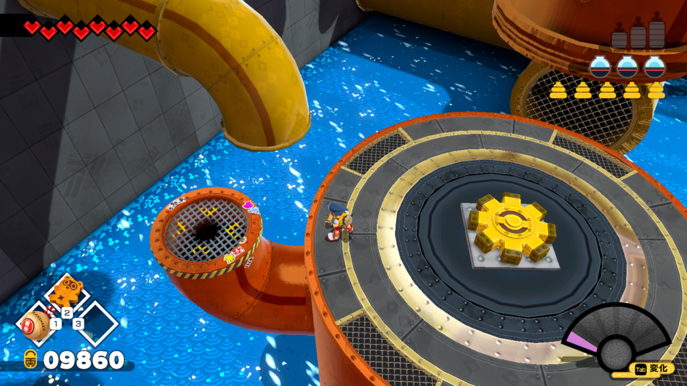

という感じで以上になります。久々に遅くまで起きてゲームをした時がありました。またこんなゲームを見つけて楽しんでみたいですね。ではでは。
