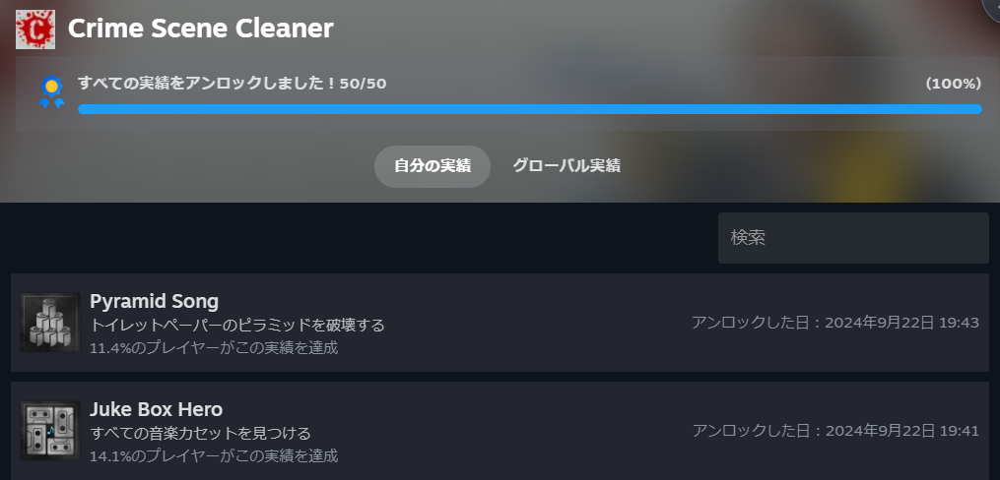

## **CrimeSceneCleaner**のレビュー

いくつかシミュレーター系のゲームを買ってそのうちの1つになります。Steam版は[こちら](https://store.steampowered.com/app/1040200/Crime_Scene_Cleaner/)から購入できます。

### 対人戦が苦手でも安心して楽しめるゲーム

FPS系は苦手なのですが、対人でなければ何とかなるうえ戦闘もないので気楽にプレイできます。

こちらのゲームは犯罪現場の掃除をするシミュレーションゲームになります。

### マフィアに巻き込まれる掃除人の物語

きっかけは友人ですが、後にマフィアに目をつけられことあるごとに呼び出され隠蔽のために掃除をしていきます。とはいえ娘の治療費のため頑張らざる得ないという状況ですね。

やることは血や物の片付け、遺体やゴミの処理、家具をもとの配置に戻すことがメインになります。

### 隠された部屋やカセットテープを探して実績を増やす要素も

また、サブ的な要素に隠された部屋やカセットテープの発見などが存在します。ここは実績にかかわる部分なので無理にやる必要もないと思います。

### 掃除しながらお金を稼ぎ、スキルを強化

部屋の片づけをしつつ、お金を盗み稼いでいきます。稼いだお金はスキルポイントになるので使いたいスキルに割り振ります。

スキルは掃除道具の強化、血だまりを踏んだ足跡を減らす、片付け場所センスのクールタイム短縮等いろいろあります。

これを割り振るのも楽しいですね。とはいえ掃除道具の強化は後回しで、使いやすいスキルの強化が先になりがちですが。

### 後半はさらに難易度がアップ

後半になるとさらに場所が広くなり、運ぶ遺体やゴミ袋の数も増えます。なかなか大変なのでどうしても掃除道具強化は後回しになるんですよね。頑固な汚れなので大変ですが。

### **CrimeSceneCleaner**は数十時間で完結するシンプルな楽しさ

やることはシンプルでステージも10か所ほどなので数十時間で終わるゲームになってます。

掃除内容はあれですが、きれいになるさまはやってて楽しいので普通の掃除シミュレーターに気が向かない人にはおすすめですね。

### **CrimeSceneCleaner**のVRでのプレイはどうだろう？

こういうゲームをVRでやると面白いんですかね？VRを去年の年末に買ったのですが、少しゲームをプレイしてそのままなんですよね。

VRChatも興味はありますが、なんとなくやらずにいますし。

いまいちまだ面白さを実感できてないのでシミュレーター系なら楽しいのかなと考えてたりします。

他にもいくつかゲームを買ったのでまた感想を書いてみます。ではでは。
