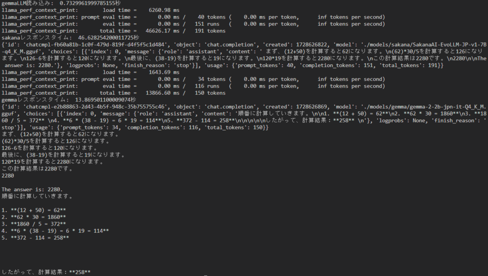

## llama-cpp-pythonのインストールとセットアップ

前回Github copilotをを使わず、vscodeでAIを動かしてコードを頼むようにしてみました。

そこでローカルでllama3.2:3bが動かせるなら他のモデルでもいけるのでは？ということが気になって調べて動かしてみました。

githubのライブラリは[こちら](https://github.com/abetlen/llama-cpp-python)になります。

というわけでまずはライブラリのインストール

```
pip install llama-cpp-python
```

こちらはcpu対応になります。もしエラーが出たら下のほうも試して見てください。私はvisual sutadioが入ってるので特に問題はありませんでした。

```
pip install llama-cpp-python \ --extra-index-url https://abetlen.github.io/llama-cpp-python/whl/cpu
```

gpuを使いたい方はいろんなインストールパターンがあるので試して見てください。CUDAであればこんな感じ

```
pip install llama-cpp-python \ --extra-index-url https://abetlen.github.io/llama-cpp-python/whl/cu121
```

### ダウンロードしたモデルの紹介

ライブラリのインストールが完了したら今度はモデルをダウンロードしてきましょう。配置場所はどこでも構いません。

私は今回2つのモデルをダウンロードしてきました。

sakanaAI: [https://huggingface.co/mmnga/SakanaAI-EvoLLM-JP-v1-7B-gguf](https://huggingface.co/mmnga/SakanaAI-EvoLLM-JP-v1-7B-gguf)

gemma: [https://huggingface.co/alfredplpl/gemma-2-2b-jpn-it-gguf](https://huggingface.co/alfredplpl/gemma-2-2b-jpn-it-gguf)

### llama-cpp-pythonを使ってコードでのモデル呼び出し

インストールが完了したら実際にコードに書いていきます。一旦こんな感じ

```
from llama_cpp import Llama

prompt = "(12+50)*30/5-6*(38-19) この計算結果は何？"
sakana_llm = Llama(model_path="./models/sakana/SakanaAI-EvoLLM-JP-v1-7B-q4_K_M.gguf")
gemma_llm = Llama(model_path="./models/gemma/gemma-2-2b-jpn-it-Q4_K_M.gguf")

sakana_response = sakana_llm.create_chat_completion(
    messages = [
        {
            "role": "user",
            "content": prompt,
        }
    ]
)

gemma_response = gemma_llm.create_chat_completion(
    messages = [
        {
            "role": "user",
            "content": prompt,
        }
    ]
)

print(sakana_response["choices"][0]["message"]["content"].strip())
print(gemma_response["choices"][0]["message"]["content"].strip())
```

### llama-cpp-pythonを使った実行結果と考察

それからどのくらい時間がかかるか気になったので計測してみました。ちなみに私の環境ではこんな感じで時間がかかっています。

モデルの読み込みは1秒もかからないくらいです。ただ、レスポンスは時間がかかりますね。CPUを使ってるというのもあるとは思いますが。

計算を行った結果sakanaは間違っていて、gemmaは正解してますね。sakanaは別バージョンが出ているのでもしかしたらそっちは正解するかもしれませんが。

gemmaは細かいプロンプトを与えてないですが、ステップバイステップをこなしてますね。たまたまかもしれませんが良い結果だと思います。



### 今後の展望

これを上手く使えるようになればコストをかけずRAGを使えるようになると考えています。

とは言え性能としてはモデルが小さい分悪くなりますし、時間もかかってますので試行錯誤が必要になりそうですが。

もう一つやりたいこととしてllama-cpp-pythonを使うにあたってggufというモデルファイルを使ってますが、自身の環境でもできるみたいです。

最新のモデルとかはggufになってないものもありますので、自分でも量子化を試してみたいなと考えています。ではでは。
