## モネ 睡蓮のときを鑑賞した感想

先日[国立西洋美術館](https://www.nmwa.go.jp/jp/)に行ってきました。

### モネ 睡蓮のとき\_チケット購入と入場の様子

「[モネ 睡蓮のとき](https://www.e-tix.jp/monet2024-25/)」が開催されていたので、そちらを見に行ってきました。私はネットで買って入りましたが、会場で買えば現物のチケットがもらえる感じですね。ただ、それなりに並びます。朝9:30開場ですが、10:00前に行っても並んでたので、チケットのこだわりがなければネットで買うのがおすすめです。

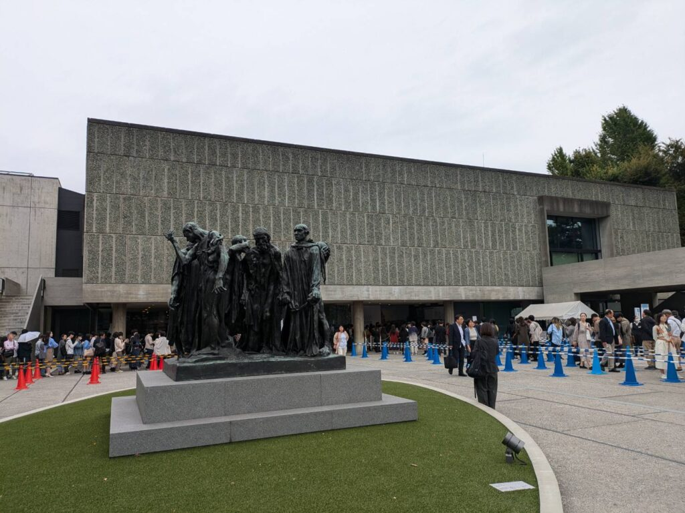

中に入って色々と展示されてました。ただ、ほとんどは写真NGで1フロアのみOKになってました。

### モネ 睡蓮のとき\_展示内容と感想

展覧リストをもらってきました。題名の通り睡蓮関係が多めですね。他にもパリのマルモッタン・モネ美術館に多くある物みたいですね。パリに行けばもっと見られるかもしれないですね。

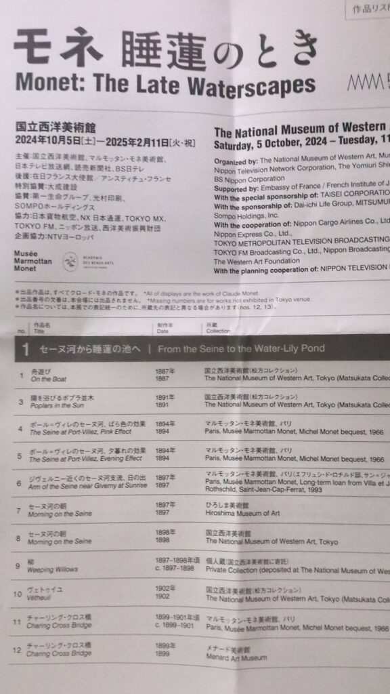

色々見ていった感想としては割と同じ構図で多くの絵を作ったというイメージですね。風景画だと思うので環境の条件や日付が異なるとは思いますが、同じ場所から書いていた感じです。写真OKのやつはバラバラですね。

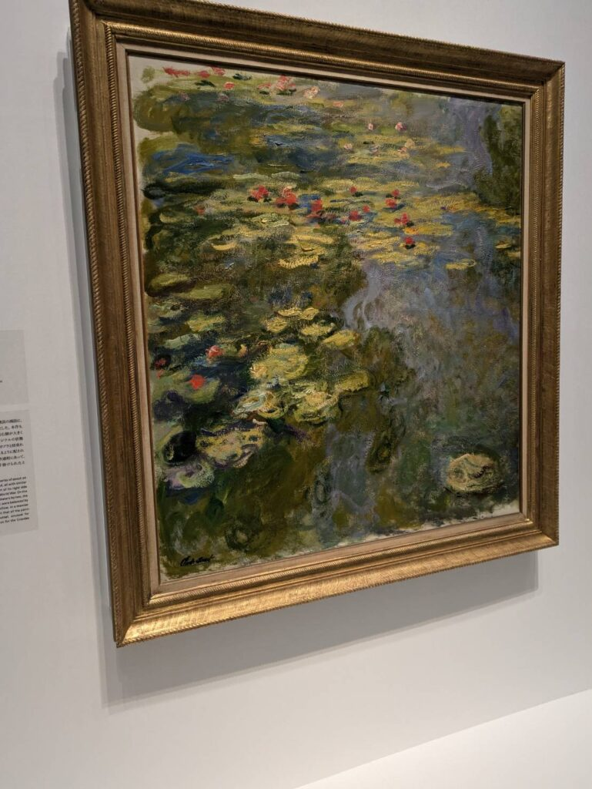

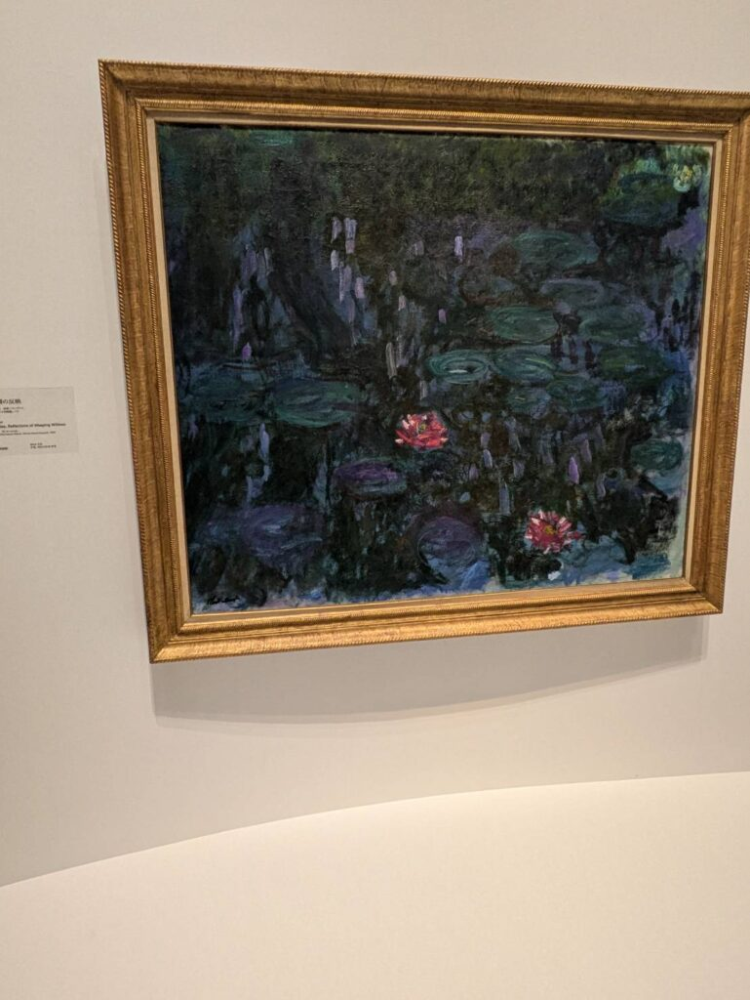

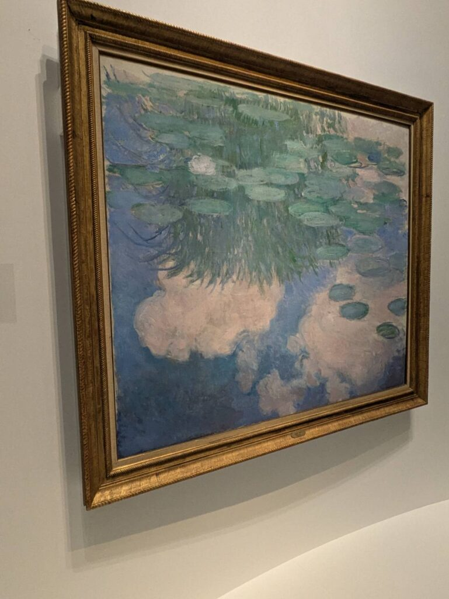

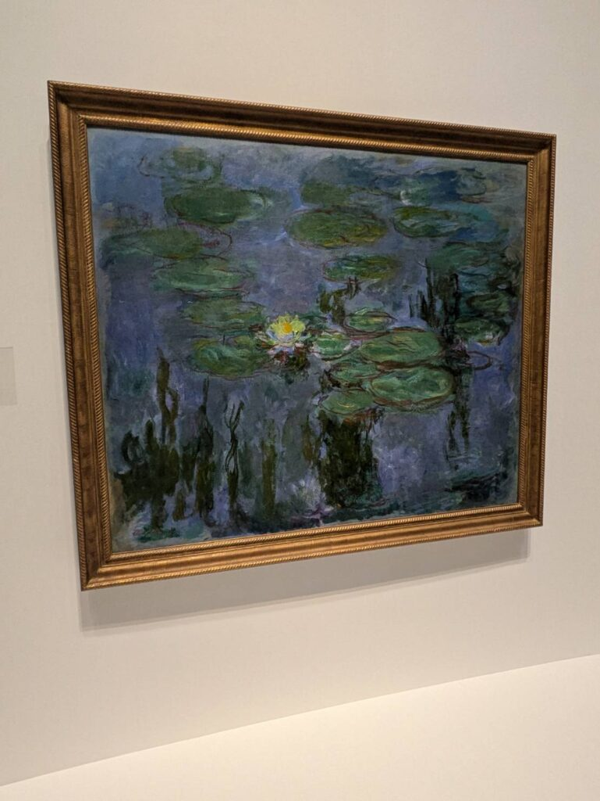

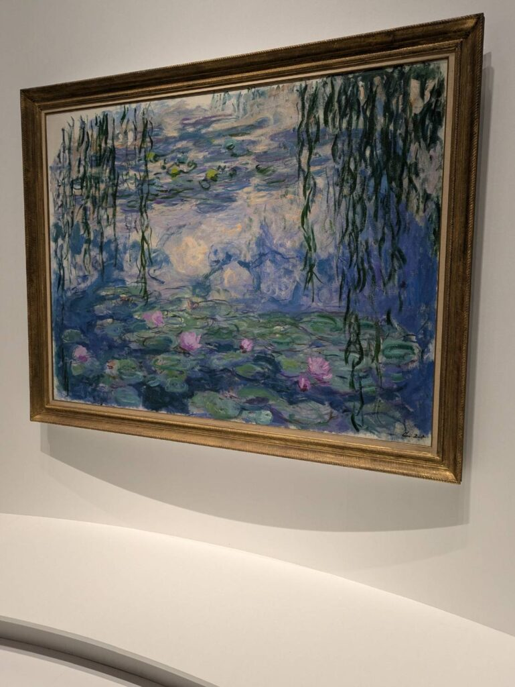

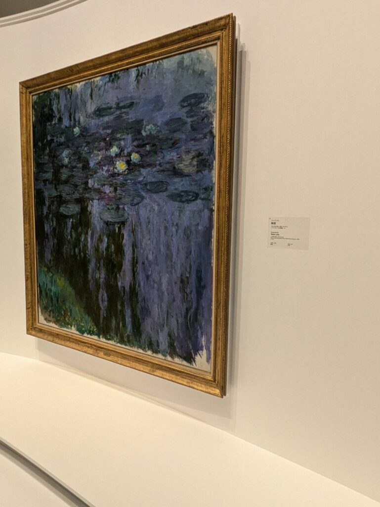

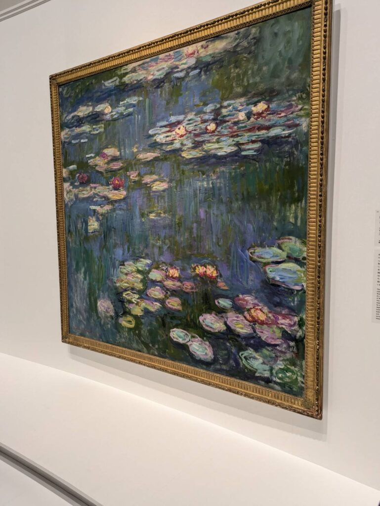

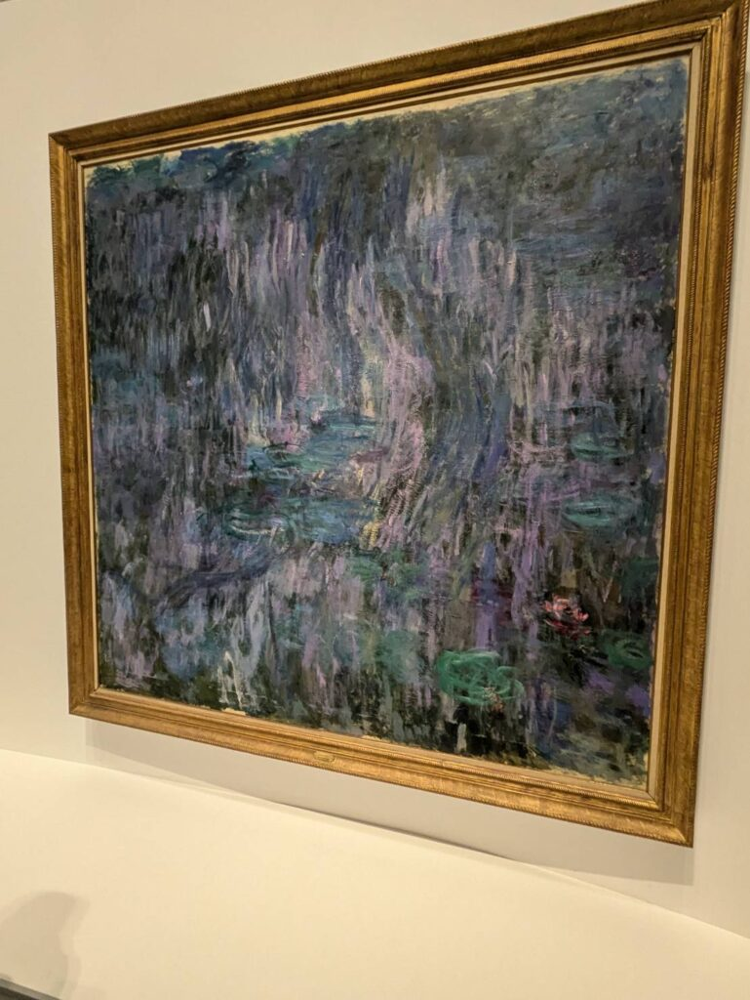

油絵で描かれたもので風景画なので主に緑、青系が使われていました。ただ、朝または夕方あたりであれば赤系統が使われていました。恐らくですが…

### 気に入った作品と余白の意図

絵として気になったのは余白ですね。キャンバスすべてに色を塗るのではなくあえて塗ってない場所もありました。白の代わりなのか意図的なのかわかりませんがそういうものなんですかね？

それからモネの作品に**日本の橋**というものが複数ありました。日本の影響もあったということですかね？どこの橋かは全くわからなかったですが、嬉しい限りです。

個人的に好きな作品は柳と睡蓮ですかね。ウォータールー橋やセーヌ河もよい感じですけど、柳のたくましさと睡蓮の物寂しさが個人的には好きですね。

### お土産とレストラン

お土産も売ってますがこちらもかなり人が並んでました。私は物が欲しいとかは特にないのでスルーしました。絵のレプリカを予約販売してましたが、値段が数万から十数万くらいで売ってましたね。本物は億超える感じですかね？そもそも売ってもらえるのかどうか…

特別展は大体1時間くらいで見回れます。[常設展のチケット](https://www.e-tix.jp/nmwa/)は買ってなかったので、終わり次第帰宅しました。中には[レストラン](https://www.nmwa.go.jp/jp/shop-eat/cafe.html)などもありますが、こちらも今回はスルーしました。次回行くときは行ってみようと思います。

### お昼のミスタードーナツ

余談ですがお昼はミスタードーナツに行きました。飲茶を食べてみたいというのがあっていきました。今は台湾フェアやってるので鶏サンラータン麺を食べました。

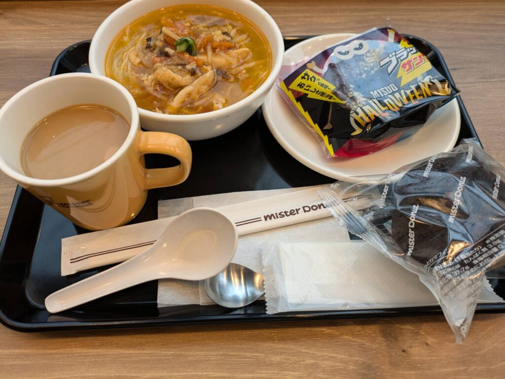

スープは酸味があって、ラー油の辛さが良い感じですね。細麺に程よく絡みつつ具材も美味しかったです。

ミスドはたまに食べるくらいがちょうどいいですね。月一でも飽きるかもしれません。

というわけで今回は以上になります。またいずれ行くと思いますし、来月当たり行こうと思ってるやつもあります。それを見たらまた書いてみようと思います。ではでは。
