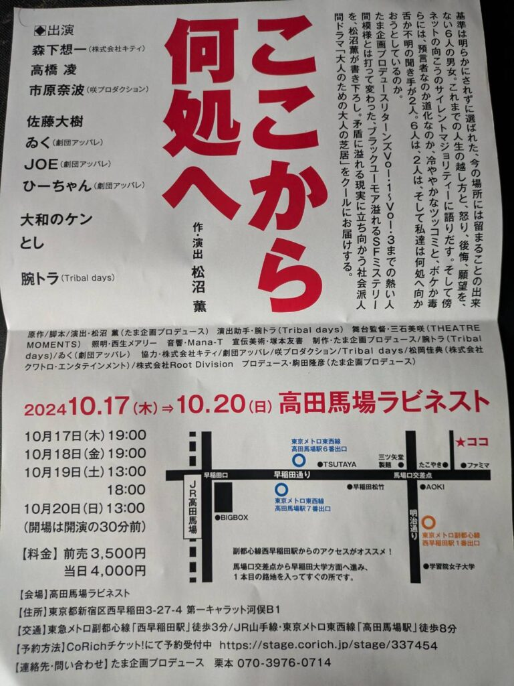

## 舞台「ここから何処へ」を観た感想

先日舞台を見に行く機会がありましたのでその感想になります。

### 初めての舞台体験

私は舞台を見に行ったことがありません。幼いころライオンキングを見た記憶はありますが、それ以降は一度もないですね。中学生の部活紹介とかぐらいでしょうか？

今回見た舞台は"**ここから何処へ**"になります。HPは[ここ](https://tamakikaku.stage.corich.jp/)ですね。予約は[ここ](https://stage.corich.jp/stage/337454)からしましたが、今は公園が終わってると思います。

### 「ここから何処へ」の物語の概要

ここから先は物語の感想になります。舞台素人なので細かい部分や的外れな意見もあるかもしれませんが、(　´\_ゝ｀)ﾌｰﾝぐらいで聞いていただければと思います。ちなみに舞台と観客の距離が割と近かったです。この中で演技ができるのは凄く、尊敬するなと思っています。私には無理ですね…

物語の内容はSFストーリーになります。6人の男女と2人の司会、AD1人とフィクサー1人の計10名で構成されています。途中で役が変わるなどはありません。

シナリオとしてはある番組に出演した6人の男女、視聴者から高評価を得られれば願いを叶うと言われて出演します。その番組では本音を話すシーンがあるが、事件が起きてという流れになります。シナリオ自体の感想は最後に話そうかと思います。

### ここから何処へ\_各キャラクターの紹介と感想

6人の男女は一般市民でヤンキー主婦、鉄砲玉、町工場経営者、金持ち主婦、女優、ハッカーになります。2人の司会は1人が男で進行役、1人が女で審判役になります。ただADの人は喋らず、フィクサーは起きてる出来事の裏をぺらぺらと語ります。

#### ヤンキー主婦

ヤンキー主婦役はDV気質の人です。ただ、浮気をされたということで出演しています。役の人は感情の訴えをしたりしなかったりという感じでした。こんな主婦いるんだろうなとは思いつつも、心を揺さぶられる感覚はたまにあるという感じでした。

#### 鉄砲玉

鉄砲玉はヤクザで敵組に突っ込む人です。愛する人のため猪突猛進という役です。感情自体はあまり伝わってこなかった印象です。活舌の問題なのかなんと言ったかわからない部分もありました。役としてはひょうきんな感じだったので、シリアス展開中に謎の発言をするという役回りでした。

#### 町工場経営者

町工場経営者は酒を飲み仲間と楽しそうにしゃべるが、家族に見放された職人気質の人です。この方は凄いですね。こんな人いるなと思いつつ、悲しいや家族を思う気持ちがよく伝わって泣きそうでした。いいおっちゃんで幸せになって欲しいとさえ思えました。

#### 金持ち主婦

金持ち主婦は陰謀論にはまってそうな感じです。特に放射能系ですね。本音は1人でも生きる！という強い意志がありました。そこの感情はよく伝わってきました。彼女の性格上家族だろうが友達だろうが関係ないとみれば、それ以外の感情は伝わらなくてもよいのかもしれません。

#### 女優

女優は昔人気だった人です。今は記者に追い回されながら、いろいろスキャンダルを暴露されたりしているという感じですね。後半で活躍する場面があります。自分勝手に生きつつも、身近な人への感情を隠し切れないというのが伝わりました。

#### ハッカー

ハッカーはなんでも知りたがりの人です。とは言えそれで金稼ぎをしているので金を稼ぐ意図が全く見えなかったのですが。この人を中心に事件が巻き起こりますが、そうなるかな？というのがあった印象です。何か動かしそう感があってよかったですが、悪者感が出てました。場をかき乱す役という意味では間違ってなさそうですが。

#### 男司会と女審判

男司会の人は各演者に振り回されつつも番組を何とか進行しようと努めます。大変だなと思いながらも事件の真相を知っている人なので、複雑な思いが垣間見えます。

女審判者の人はひょうきんで皮肉屋だけど核心を突いたり、本音を引き出すことや記憶消去もできます。最後辺りにこの人が何者かわかるのですが、こんな性格になるかな？と思う部分はあります。役者さんの演技は役に見合っててよかったです。

#### ADとフィクサー

ADさんは喋ってないですが、裏方に徹してました。それからフィクサーは小物感が強かったです。大物の役だと思うので、貫禄が出ていないのは少し残念でした。また、こちらの方も鉄砲玉の人と同じで少し聞き取りずらい部分もありました。ビームややられたところは面白かったですが。

演者さんの印象はこんな感じですね。次はシナリオの感想ですね。

### ここから何処へストーリー進行と演出の印象\_前半

初めは司会の人が番組を始めるところから始まります。その後は出演者6名の紹介ですね。ここで演者の印象が決まります。ただ、のちにこの印象は変わります。当たり前ですが、本音だけで生きているわけではなく建前を使ってるので。

紹介した後は実際にスタジオに入ります。そこで建前と本音を話すパートに入ります。3名話した後CMで司会の人の掛け合いとスタジオに入った場面が出ます。

スタジオに入る場面は普通なくてもいいのですが、ここがあるおかげでハッカーの暗躍が活きてきます。ただ、IT系の人でなければこの場面の必要性は伝わりずらいかもしれませんね。

その後2名の出演者の建前と本音を話した後、ハッカーが事件を起こします。番組をジャックして真相を深掘るパートに入っていきます。核実験によりブラックホールが地球の中心に生成されたため、上級国民が遺伝子のため選民するという話でした。

### ここから何処へストーリー進行と演出の印象\_前半

さらに司会の人は核実験に関りがあり、審判者はマザーAIでAIと量子コンピューターが掛け合わさったAIになります。この技術があるならロボットもいけそうですが、なぜかホログラムでしたね。

最終試験の審判で選民が終わり、処理するタイミングでハッカーが邪魔します。女優さんだけ最後の言葉がなかったのが気になりました。後はADが他国のスパイやらスパイをフィクサーがビームで始末するやらあります。なんじゃそりゃという感じでしたが（笑）

女優の言葉に感化されハッカーは何とかしようと画策します。そこでマザーが裏切り、上級国民たちの選別すらも変えてしまいます。

結果出演者たちは地球に残って半分願いを叶えてもらい、ハッカーが司会の人の後を引き継いで物語は続いていきます。地球は10年後くらいに滅びますが、選民番組は続いていくということで話は終わります。

### ここから何処へは舞台の明るい雰囲気とSFの設定

SFストーリーでしたが全体的にポップで明るい雰囲気でした。私は前の舞台を見ていないのですが、以前は昔の時代でシリアス展開が多めだったと聞きました。そちらの方が良かったという意見もあるかと思いますが、初めて見る人には取っつきやすいのかなと感じました。

### 初めての舞台で学んだこと

DV問題や陰謀論、微下ネタはありましたが、大部分は楽しく見れたと思います。役者さんの幅はあるんだなと思いました。うまい人は噛まないし、聞き取りやすく、感情の出し方がうまいんだなと感じました。

### 次に見たい舞台観劇

初めてなのであまり注目できなかったんですが、大道具や小道具、音声や照明などはあまり注目できなかったので次は注目したいですね。演出も舞台に必要な要素だと思いますし。

長くなりましたがミリしら舞台の感想は以上になります。次はプロの舞台も見てみたいなと思いました。また見る機会があったら感想を書いてみたいと思います。ではでは。
