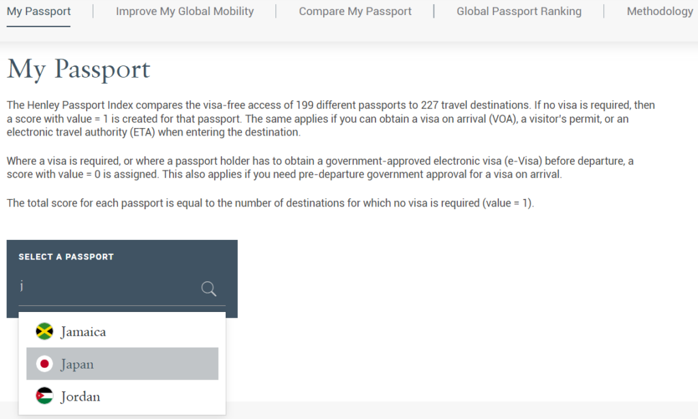
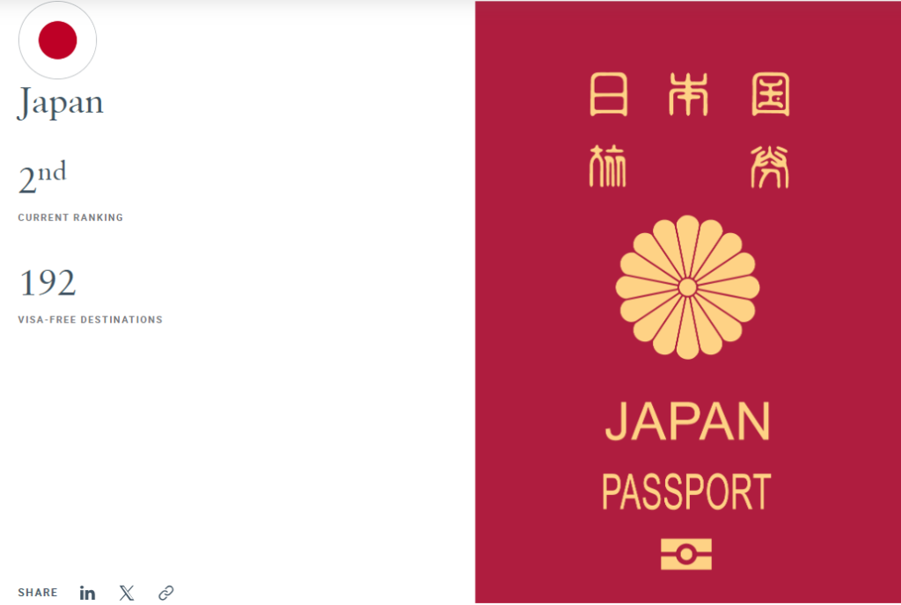
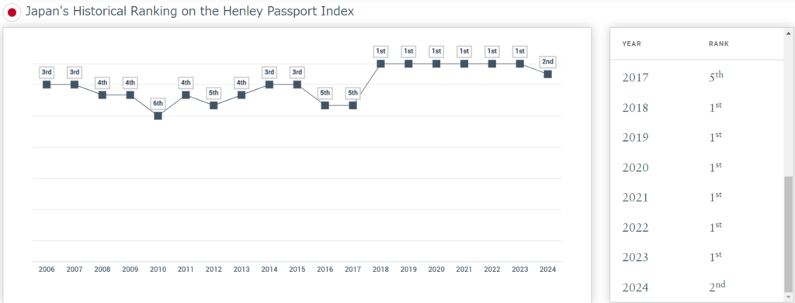
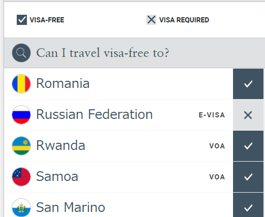
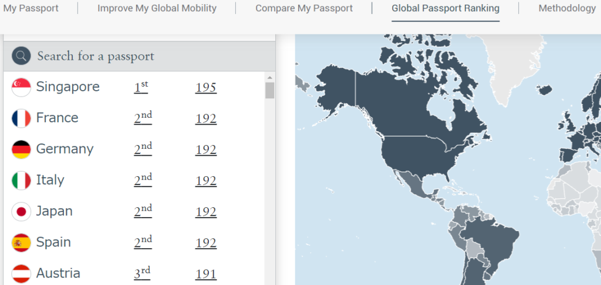
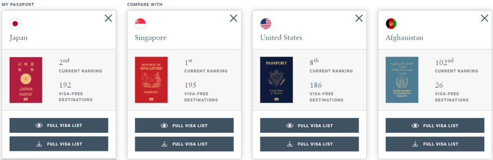
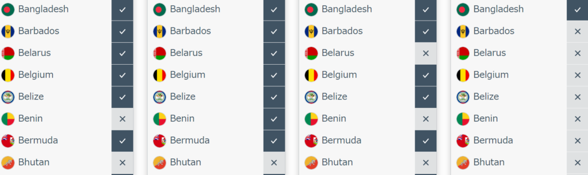
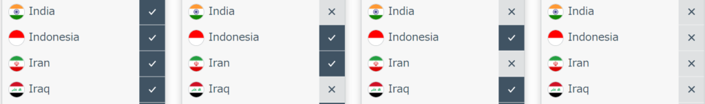
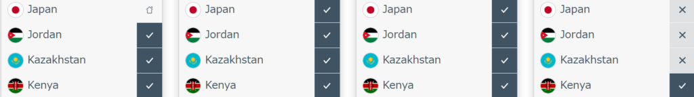

## パスポートの順位を見たきっかけ

最近ニュージーランドのことを知ろうと思っていくつかニュースサイトを見てました。見てたのはこちらの4つですね。

- [nzherald](https://www.nzherald.co.nz/)

- [rnz](https://www.rnz.co.nz/)

- [nzdaisuki](https://nzdaisuki.com/)(こちらは日本語サイト)

- [1news](https://www.1news.co.nz/new-zealand/)

基本英語ですが、Chromeでは翻訳ができますのでそれを使ってなんとなく見ています。その中である記事の細部で掲題が書かれてました。ただ元記事は忘れてしまいました、すみません。

### パスポートの順位を確認

ということでパスポートを確認できるサイトは[こちら](https://www.henleyglobal.com/passport-index)になります。My Passportにある"SELECT A PASSPORT"にjを入力するとJapanが出ますので選択してみましょう！

### 日本のパスポートのランキング結果

というわけで見た結果がこちらですね。ランキング的には2番目で192か国ビザなしでの渡航、到着ビザ取得で入国できます。

ちなみに過去のランキングを下の方で見ることができます。

### パスポートランキングの変動

なんとなくですがロシアがダメになったのかなという気もしています。過去の分を見てないのでわからないのですが、1か国減ったみたいですし。

### 1位のシンガポールと他の国々

ちなみに1位はシンガポールです。195か国到着ビザで入国できます。3か国も多いんですね。日本と同じだとフランスやドイツ、イタリア、スペインですね。

### 各国のビザ有無を比較

ただ、国によってビザの有無が変わります。今度はそちらを比較してみます。候補は日本、シンガポール(1位)、アメリカ、アフガニスタン(最下位)です。気になったとこをピックアップしてみます。

バングラディッシュは全て大丈夫ですね。ベナンは日本はNGでシンガポールはOK、ブータンはどこもNGですね。

少し下の方を見るとインドやイラク、イランは問題ないみたいですね。とは言えイラク、イランは危険だと思いますが…

一応日本も見てみました。アフガニスタンはNGですね。これはしょうがないと思いますが。

### まとめ

こうやって見ると面白いですね。ちなみに中国は日本アメリカともにNGになってます。シンガポールはOKになってますが。

もしこれを見比べながら最強のパスポート軍団を所持すれば、どこでも行けそうですね。ただ、すべての国でNG出してる国はあるかもしれませんが。

もし興味があれば見てみてください。見比べると結構楽しいですし、もしかしたら国と国のつながりや政治が見えてくるかもしれませんね。ではでは。
