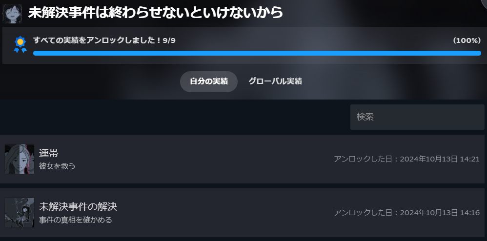
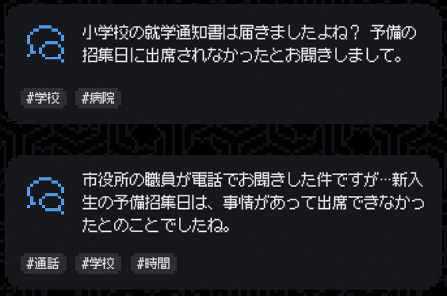
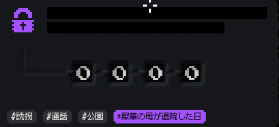
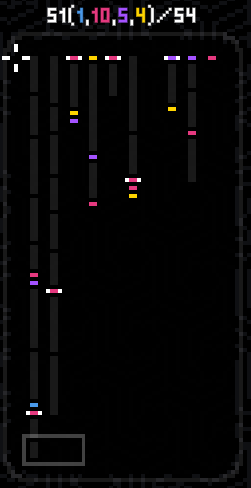
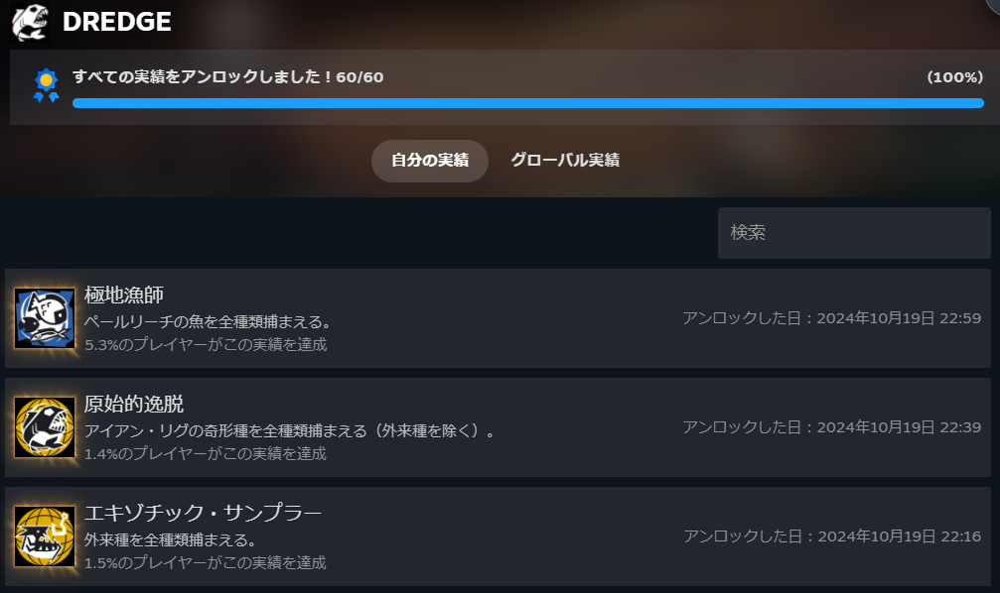

最近ゲームに飽きつつあるのですが、直近でやったゲームを書いてみようと思います。

### 未解決事件は終わらせないといけないから

まずは[こちら](https://store.steampowered.com/app/2676840/_/?l=japanese&curator_clanid=33635445)のゲームで、「LEGAL DUNGEON」を作成したSomiさんの作品になります。一応共通のキャラが出てきますが、知らなくても楽しめると思います。

### 未解決事件は終わらせないといけないから\_ゲームシステム

なお実績自体は難しくなく、ゲームを進めていけば問題ありません。

中身を軽く触れるとゲームシステムだと青吹き出しで会話を見ていきます。進めていくと黄色、紫、赤の項目が出てきます。黄色は鍵が必要になります。鍵は青の会話を並べていくと手に入ります。紫は日付の入力ですが、会話から見つけていきます。赤はキーとなる会話を指摘すれば解放されます。

### 未解決事件は終わらせないといけないから\_シナリオ

なおストーリーの中身としては詳しく触れないですが、会話の中で嘘が混ざったりしています。それを見つけながら真実が何なのかを探していきます。

会話をよく読むと"この人ではなくあの人が話してるな"というのがわかりますので、よく読むことが正解を導くカギになります。会話中ではこの人の言い分もわかるけど良くないよねという感じですね。結末は2種類で見方で変わるという感じですね。実際にやって確認してみてください。

### DREDGE: DLCを含む

[こちら](https://store.steampowered.com/sub/1093759/)のゲームは釣り微ホラーゲームになります。

以前実績のコンプをしたのですが、DLCをやってこなかったのでそこも含めてやりました。ちなみにニュージーランドセールをやってたのでそのタイミングで買いました。他のゲームもそうですが。

### DREDGE\_追加DLCのシステム内容

DLCの内容は3つですね。

- アイテムのみ

- ペールリーチ

- アイアン・リグ

アイテムのみは正直いらない気はします。初めてやる人ならいいかもしれません。ペールリーチは新しい海域、魚、ツール、クエストですね。専用の海域があるので新しく釣り竿が必要になります。ただ、クエストシナリオ自体は淡白でその場所にいた人の話を聞き、何があったかを解明するという感じです。

アイアン・リグは既存の場所を再度訪れクエストを行っていきます。始めたばかりでは途中で詰まるかもしれませんね。釣竿を作り替え、古代の魚を釣り、研究者に渡して進めていきます。徐々に不気味さが滲み出てくるような感じですね。

### DREDGE\_追加DLCのクエスト内容

ただ、クエストとしてはお使いっぽさが否めないですね。少しづつ飽きは来るかもしれません。報酬はいいものがあるので、始めたばかりの人は同時並行でやると楽しいと思います。

こちらも興味があればぜひやってみてください。やられることはありませんが、船が故障したり、釣った魚を失うことはありますが…

### 今後プレイする予定のゲーム

今やってる、やろうとしているゲームはこんな感じですね。

- 戦国無双5

- Flutter Away

- ATONE: Heart of the Elder Tree

実は戦国無双3を昔やってたので久しぶりにやりたくなってやってます。加えて他2つはNZセールで買ったものになります。せっかくNZに行くのでなんとなくやってみたくなった感じですね。

ゲームをやりすぎて飽きつつあるので、本を読むなり、勉強するなりしようかと思います。後は外に出て色々見聞きする感じですかね。外に出て経験しないとわからないことも多そうですし。ではでは。
