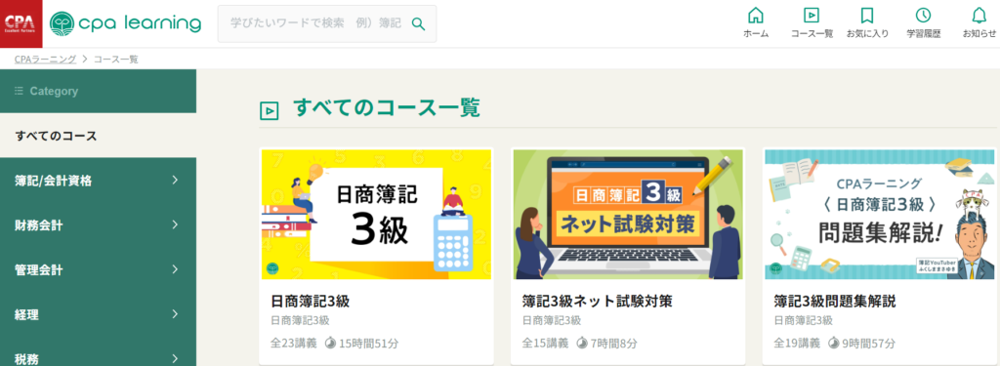
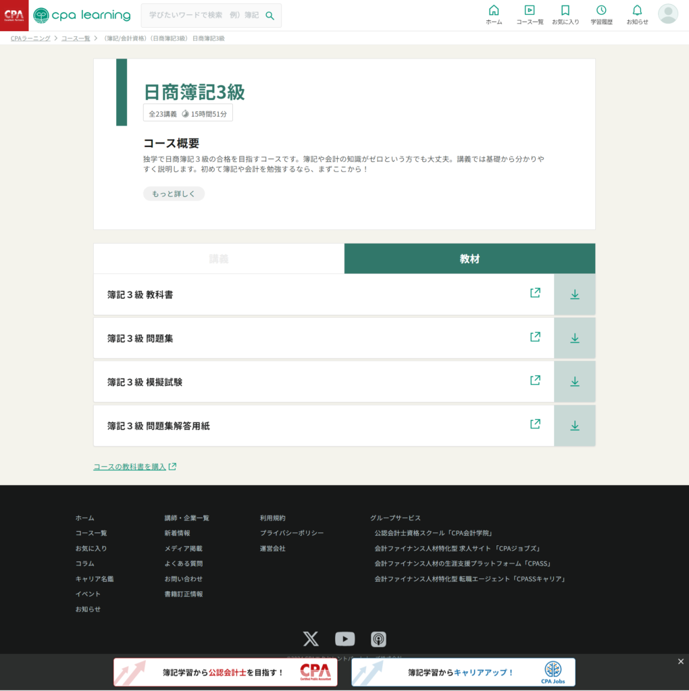
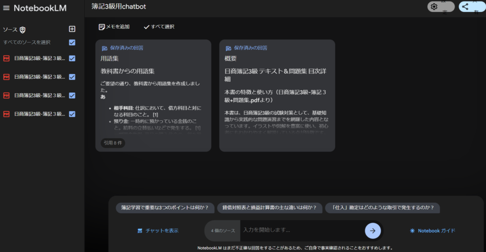
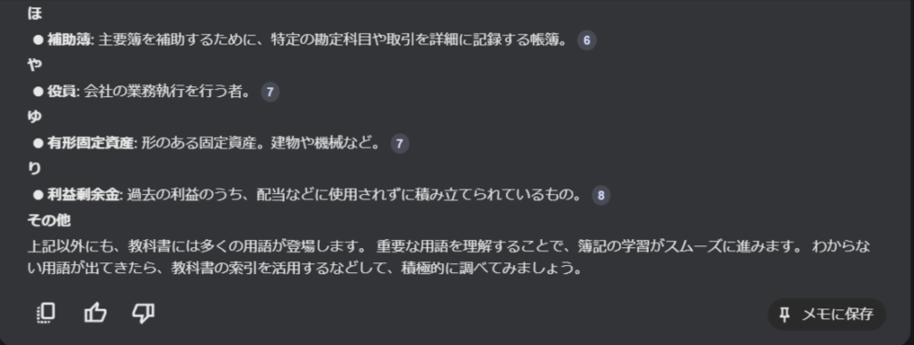
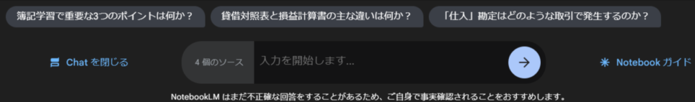
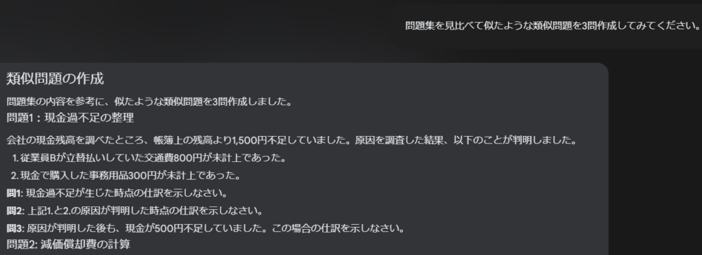
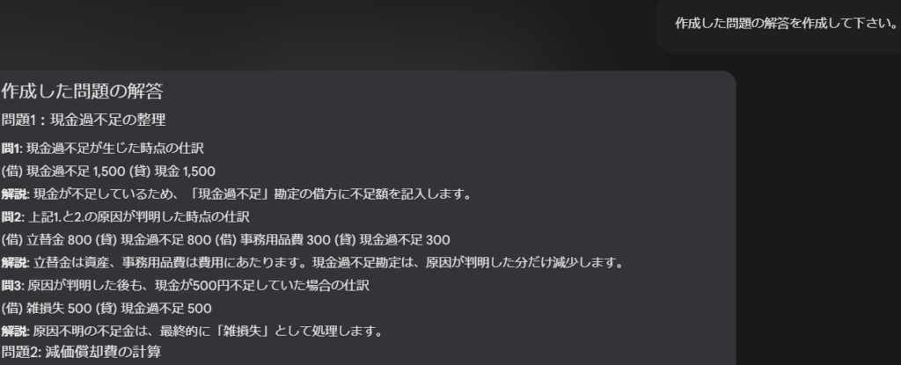

## 簿記を始めたのはなぜか？

[前回のブログ](/posts/2024/10/recent-games-roundup-october-2024/)でゲームに飽きてきたという話をしました。というわけで勉強をしようかと思います。

### 簿記に挑戦：コースについて

プログラムの勉強もいいんですが、普段＋副業でもやってるので変わった勉強をしたいなと思いましした。そこで[このサイト](https://www.cpa-learning.com/home)ですね。アカウントを登録すると使えるようになります。

色んなコースがありますが、メインは簿記だと思います。問題集の解説もありますので、試験勉強だけでも使えると思います。他のコースは今のところ興味がわかないので無視します。

まずは簿記3級ですね。簿記2級を1つ見てみたんですが、簿記3級の知識を前提に話を進めていたので。

### 簿記に挑戦：教材の活用

それから動画だけでなく教材もあります。紙媒体ではなくpdfですが。コースを見ると左のタブに**講義**、右のタブに**教材**があります。ここからダウンロードできますので、欲しければダウンロードしてみてください。

さて、動画見て教材見て手を動かしながらやるのが勉強としては一番の近道だと思います。

進めていきながら時々忘れていることがあれば、立ち止まってなるべく思い出すまで考えて、どうしても出なければ復習するという感じでやるのがいいかなと思います。

ただ、私はITに従事する者です。これだけではわからないことがあった際に聞けないこともあるなと感じました。

### NotebookLMを使ってサポート

というわけで**NotebookLM**の出番です。実は最初Difyを使おうとしたのですが、15MBという制限がありましたので変更しました。勉強したいpdfを全てぶち込んでみましょう。

一旦概要と用語集を作ってみました。

作り方はシンプルでチャットに「教科書から概要を作成してください」や「教科書から用語集を作成してください」と入力します。

そうするとpdfを読み取って作成してくれます。それをメモに保存するという流れになります。作成されたチャットの下部に「メモに保存」があるのでそれをクリックすれば作成されます。

### NotebookLMの活用法

大体概要や用語集を作れば困ることは少ないかと思いますが、動画内の説明でわからないことがあれば質問すると答えてくれると思います。あるいはこんな感じで質問の方法を出してくれることもありますので。

もう一つ有効活用としては類似問題の作成ですね。「問題集を見て似たような問題を3問作成してください。」と言えば3問類似問題を作成してくれます。一応「解答を作成して下さい」と言えばそちらも作成してくれます。

とは言え全て正確か？という言われるとわかりません。特に類似問題を作成した後の解答などは怪しいかもしれません。LLMを使うときは当たり前ですが、鵜呑みにはしないようにしましょう。時には教材を見直すことも必要なので。

### Courseraでさらに深い学びを

今は空いた時間でやってるところなのでこの勉強をしていますが、仕事を辞めた直後ぐらいであれば**Coursera**で勉強しようかと思います。[こちら](https://www.coursera.org/)ですね。

ここはほぼIT系の勉強になりますが、認定証ももらえますし、コースによっては海外大学の証明書ももらえます。もちろん有償ですが…

ただ、コースの認定証だけなら7日間の無料トライアルがあります。この期間に1つぐらい取りたいなと思ったので空いた時間にやってみようと思います。ではでは。
