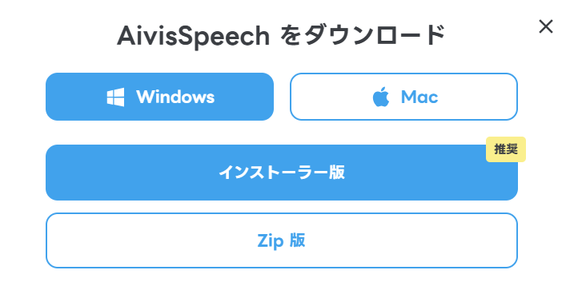
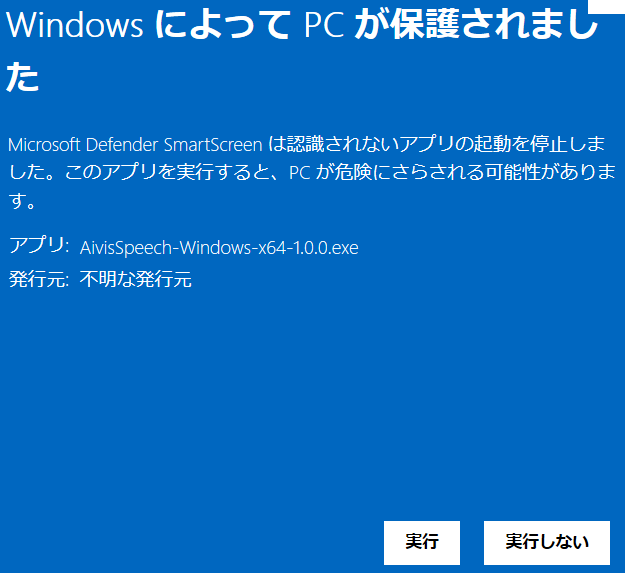
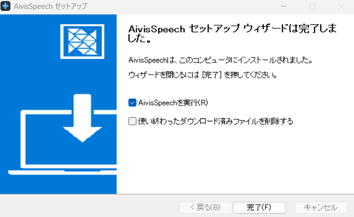
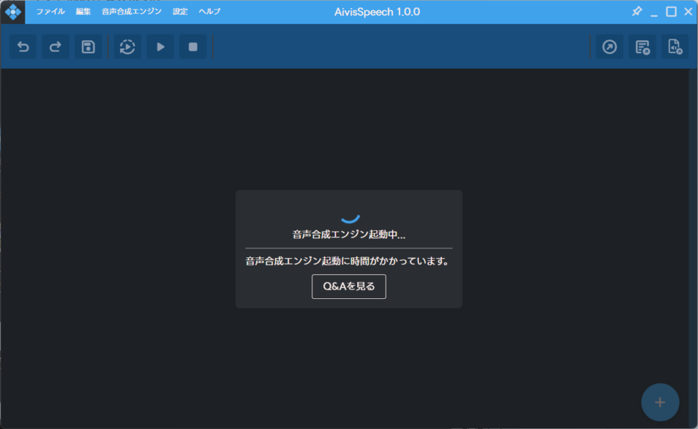
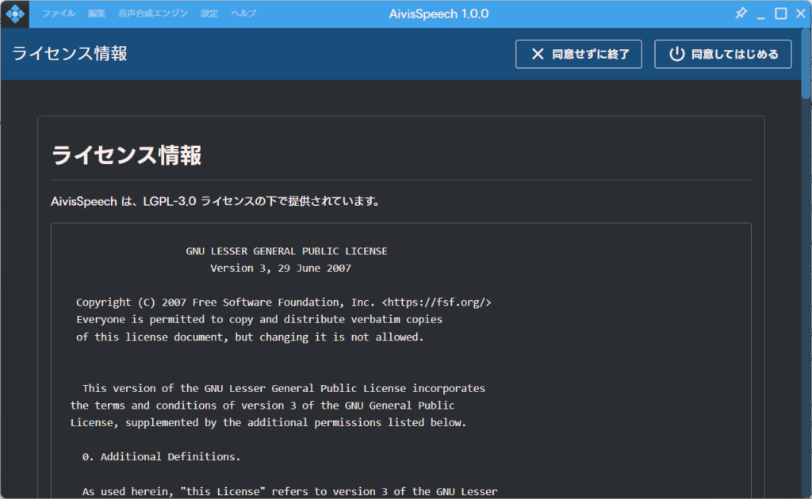
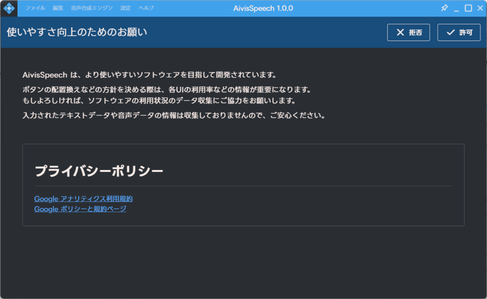
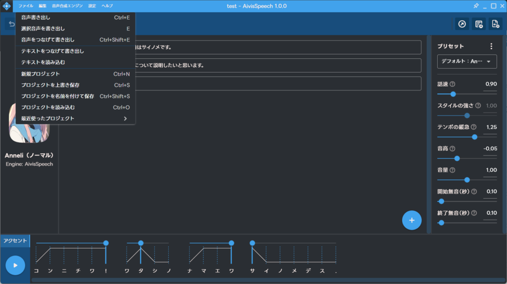
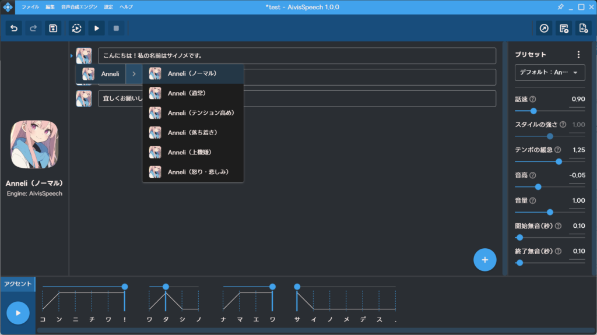
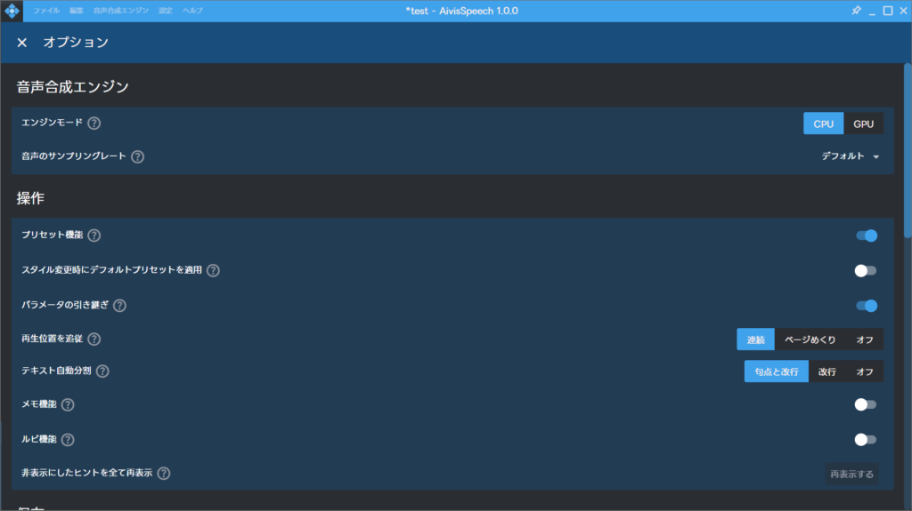
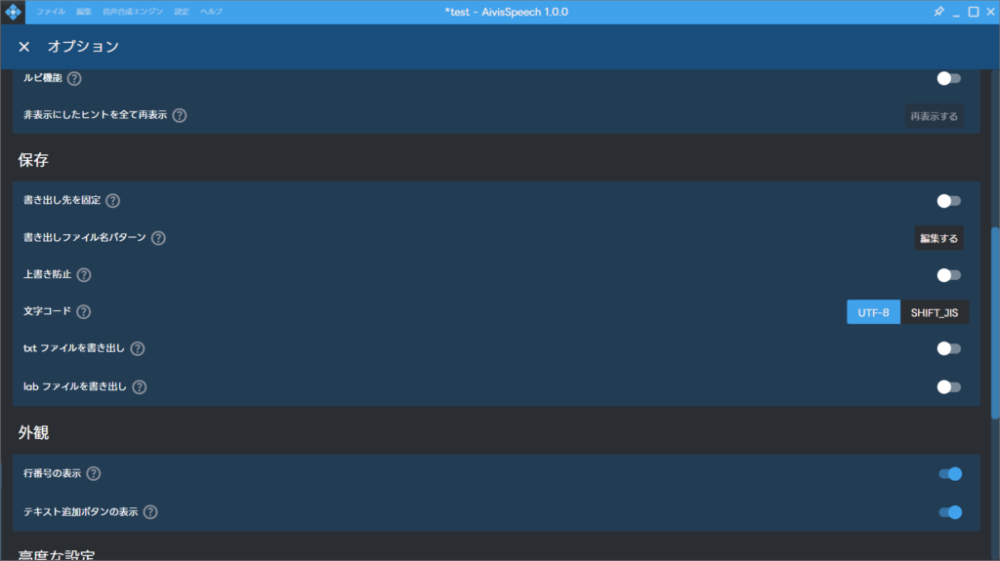

まずはAudibleという形でこの記事を読み込ませてみました。今後も活用してみようと思います。

## AivisSpeech とは？

DMMの[にじボイス](https://nijivoice.com/)(旧:DMMボイス)でいろいろ騒がれていたところに商用利用もできる無料のAI音声合成が出ていました。

[Aivis Project](https://aivis-project.com/)のAivisSpeechですね。他のプロジェクトもありますが、一旦試しで使ってみる場合はAivisSpeechになると思います。

### AivisSpeechのインストール方法

というわけでまずはダウンロードしてみましょう！ダウンロードする場合はWindowsとMacがあります。私はWindowsなのでこちらのインストーラー版をダウンロードしてきます。

インストーラーを実行しようとするとワーニングの表記が出ます。元のHPにも書かれていますが、コード署名はまだ行われていないようです。一旦開発をガシガシ進めて、余裕が出来たらコード署名もやるとは思います。今回はこのまま実行していきます。

インストールが完了したら実行しましょう。途中でダウンロードするファイルがありますが、不要であれば削除しても問題ありません。私はチェックを入れて特に問題なかったので。

起動するときと喋らせるときは時間がかかることがあります。この辺はPCの性能にもよりますので、人によっては数秒以上かかることもあるかと思います。

ライセンス情報に同意して始めましょう。内容を確認したほうが良いですが、著作権や商用、個人情報について書いてはないのでそのまま続けましょう！

ポリシーは自由にしてもらって大丈夫です。私は基本的により良くなっていってほしいので許可することは多いです。ただ、拒否しても問題ありません。

### 音声合成

ダウンロードが完了したら試しに文字を打って実行してみましょう。PCによっては多少時間がかかるかもしれませんが、数秒で応えてくれます。デフォルトだとこんな感じですね。

右側の和側やテンポなどを変え、アクセントも少し変化させてみます。右側の喋る部分についてはプリセットで登録できますので、好みの話し方を模索すると良いと思います。こんな感じ。

### 音声の書き出しと読み込み

話し方を決めて話す内容を決めたら音声を書き出してみましょう！"音声書き出し"だと段落ごとに出力されますので、それが嫌な場合は"音声をつなげ書き出し"を行います。出力時の拡張子はwavファイルになります。

また、書いた内容をテキストファイルとして出力することもできます。逆に書いた内容がテキストファイルとして存在していれば読み込むことも可能です。

そしてプロジェクトを保存すればいつでも同じ話し方と話す内容で作業することができます。

それからモデルによってはスタイルがあります。このスタイルはアイコンをクリックすることで変更することができます。デフォルトだと6種類ですね。

### 設定などの変更について

後は設定もいろいろ変更できます。基本的にCPUでも動かせますがGPUでも動かすことができます。それから保存先です。ここを設定しておくと保存が楽になるのでやっておくとおすすめです。

もし、他の操作でわからない点や気になることがあればヘルプを見ることをおすすめします。ルビを振ったり、メモを残す方法などもありますので興味があれば一読すると良いと思います。

### 終わりに

他の音声モデルについては[こちら](https://hub.aivis-project.com/)から確認することができます。ただ、今はあまり多くないのでここから選択するか、待つか、自分で作ってみるのも手だと思います。作るのは大変そうですが…

次はモデルを作ってAivis Speechに取り込むまでをやってみたいですね。ではでは。
