## pCloud 3in1バンドルのレビュー

pCloudがブラックフライデーセールをやっていたので購入してみました。以前から気になっていたのですが、このタイミングの[セール](https://landing.pcloud.com/ja/BF2024)がよさそうだったので待ってました。

### 購入したもの

今回買ったのは3in1バンドルですね。内容は以下

- ストレージ5TB

- セキュリティ性が高いEncryption

- パスワード管理サービスのPass Premium

### pCloudのセール価格について

値段は599$、現在は154円/$なので大体9万2千円ですね。最初のコストが高いですが、99年使えるのでサブスク換算だとかなり安くなります。

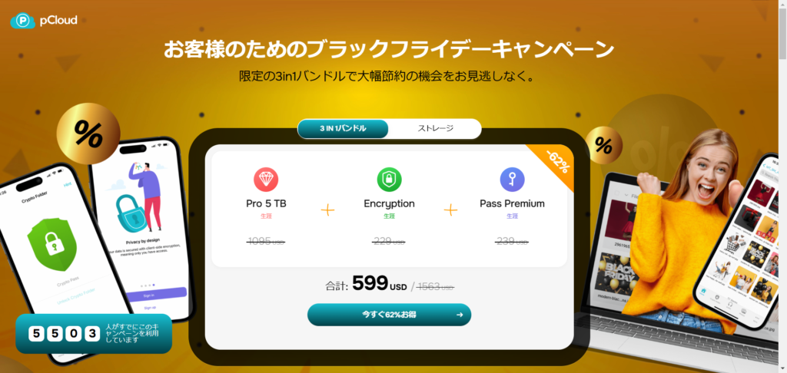

その他の値段を見ると以下の金額。

- 1TBだと199$

- 2TBだと279$

- 10TBだと799$

例えば1TBを買った場合、月26円ぐらいで1TBのストレージが使えます。もちろん写真以外にも動画、音楽、ドキュメントファイルなどなんでもよいですね。

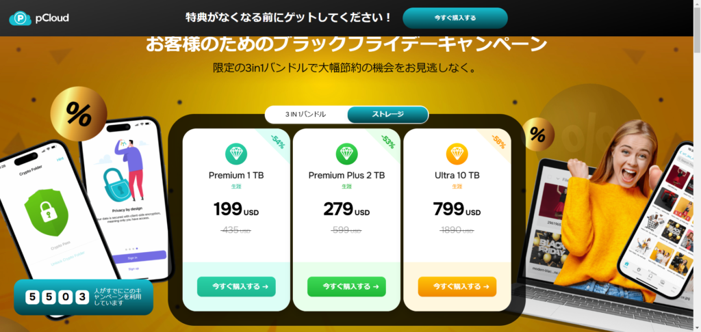

注意してほしいのがこの会社が潰れないということが前提ですね。潰れない限りは日がたつことにどんどん安くなっていくイメージですね。

AWSやGoogle Cloud、iCloudは月間のサブスクなので、これらを使っているのであれば一考の余地ありという感じです。

### 実際に触ってみた感想

実際に使ってみた画面がこちらですね。「Automatic Upload」には自動でアップロードされたファイルがあります。こちらはwebで見た画面です。

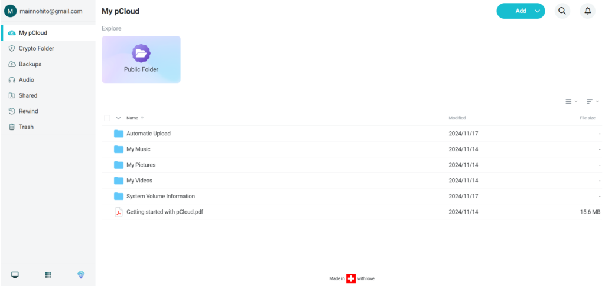

[アプリ](https://www.pcloud.com/ja/download-free-online-cloud-file-storage.html)もありますので必要であればダウンロードしましょう。PC版モバイル版ありますのでファイルの同期をしてみます。

ちなみにPC版のアプリは画像のように各フォルダー別にバックアップをすることができます。

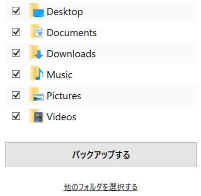

他のフォルダも同期から選択することができます。

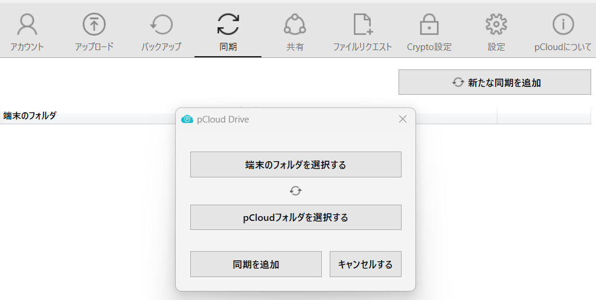

CryptoフォルダはEncryptionサービスになります。見られたくないものや大事な書類を入れておくものに使ったりします。ただ、個人で使う場合は個人情報ぐらいしか思いつかないですね。プログラムならprivateでgit管理しそうですし…

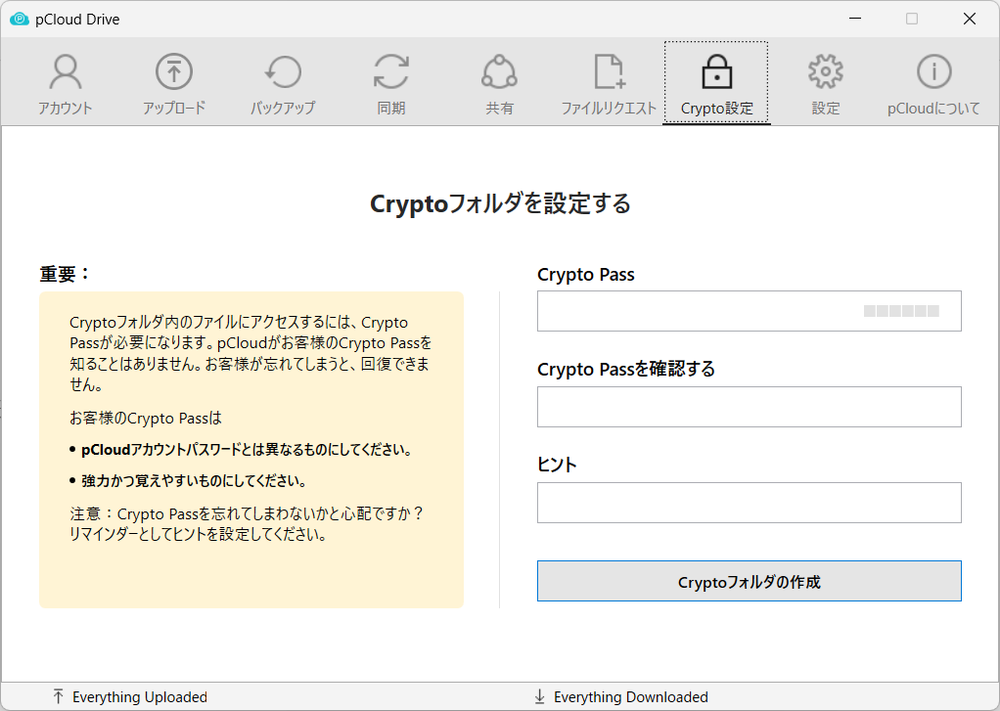

### pCloud Pass Premiumについて

もう一つPass Premiumというサービスを買いました。これはパスワードの管理ですね。こちらもWeb版アプリ版モバイル版で使うことができます。

ログインするとこんな感じです。色んなブラウザやパスワード管理ツールが出てきます。私はChromeを使ってるので実際にインポートしてみます。

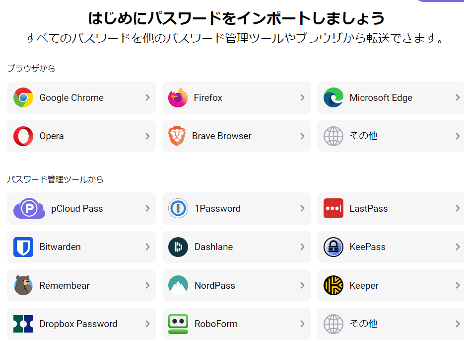

#### Chromeのエクスポート方法

Chromeの場合は右上の縦三点リーダーから"設定" > "パスワードと自動入力" > "Googleパスワードマネージャー"を選択します。

パスワードマネージャー画面から"設定"を選び"パスワードのエクスポート"にある"ファイルをダウンロード"をクリックします。そうするとcsvファイルがダウンロードされます。

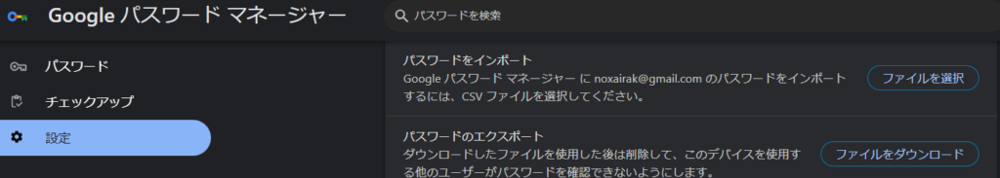

#### ファイルのインポート他

ダウンロード後はpCloud passからChromeを選び以下の画面にファイルをアップロードします。内容を確認して問題なければ"選択内容をインポート"をクリックします。

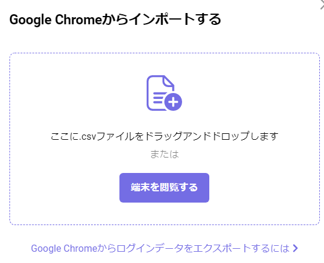

もし他のブラウザやパスワード管理ツールを追加したければ"追加"をクリックして同様の手順で設定すれば問題ありません。

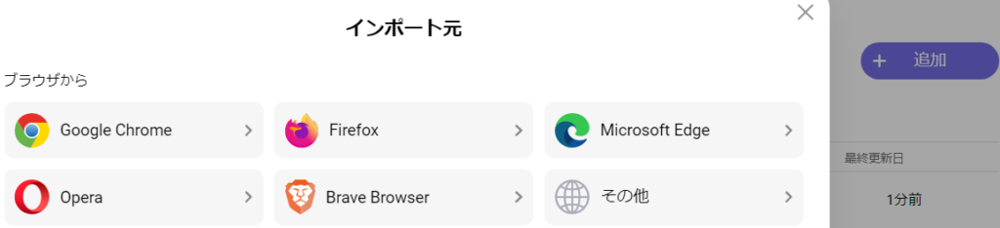

ちなみにGoogle Driveやフォトのバックアップができますが、1アカウントだけみたいなので複数のアカウントに分けてる場合は別の方法が必要そうですね。

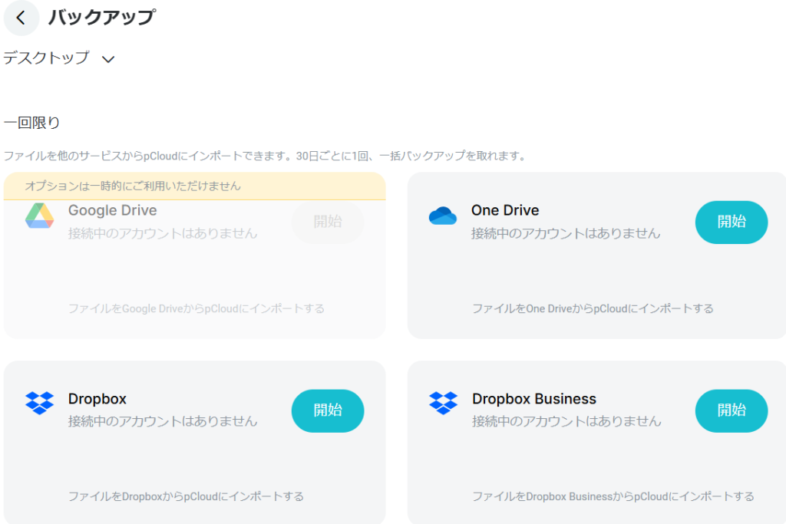

ざっくりpCloudはこんな感じですね。5TBもあるのである程度動画を入れても問題なさそうです。[以前動画を作った](https://xainome.blog/wp-admin/post.php?post=147&action=edit)ことがあるという話をしたのですが、それを全部突っ込んでチャンネル爆破でも楽しそうですね。

### お得なキャンペーンをやってるらしい

最後に[対象のサイト](https://d-gogo.com/pages/pcloud-blackfriday2024?srsltid=AfmBOop0I9FajtXVHoDodDLrY00w_jOY3-3H68EpwLupCy0ALZVx4ltH)からpCloudの商品を買えばアマギフがもらえます。もちろん買う商品によって値段は変わりますが、1割弱戻ってくるのでお得です。

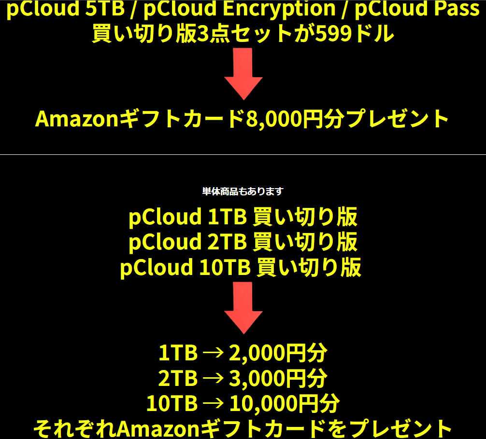

もしpCloudを購入したらエントリーしましょう。

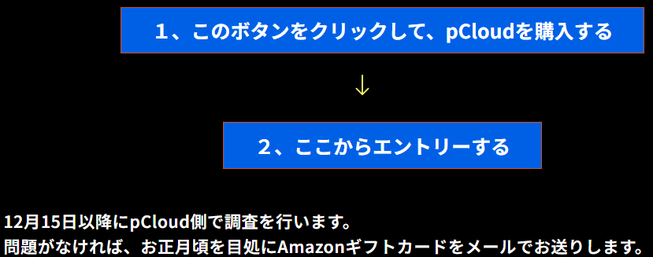

姓名とメアドを記載したらエントリー完了です。ただ、調査がセール終了後になりますのでアマギフ送付が正月くらいになるみたいです。

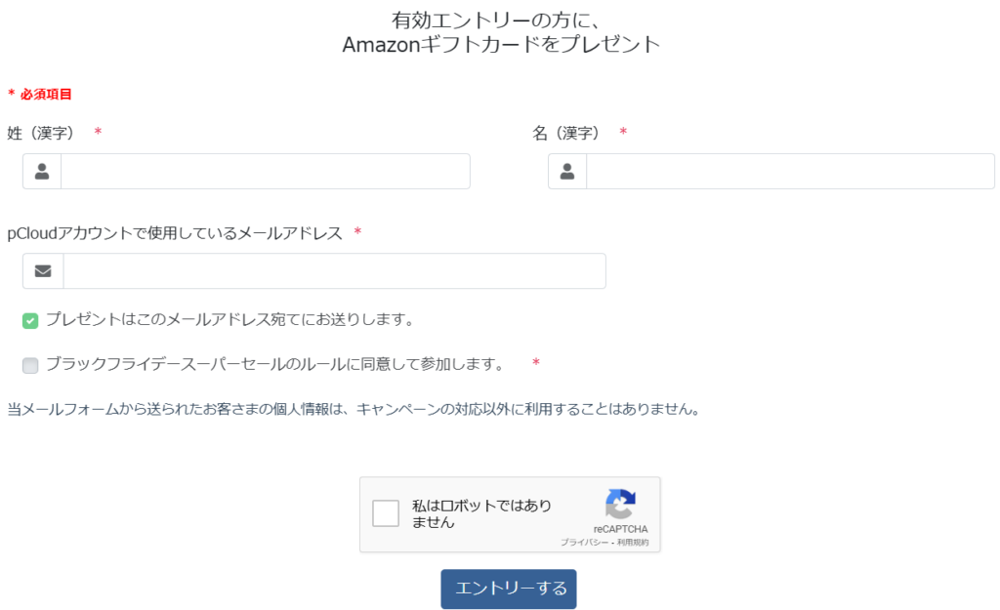

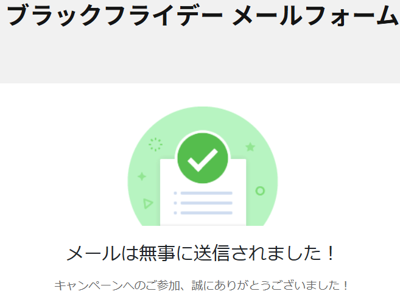

### 最後に

とは言えストレージはそんなに要らなければ買う必要はないと思います。強固なフォルダーもあまり使わなそうですし、パスワード管理は代用がいくらでもあるので。私は将来的にあると使えるかな？程度で買ったので興味とお金に余裕があれば試してみてください！ではでは。
