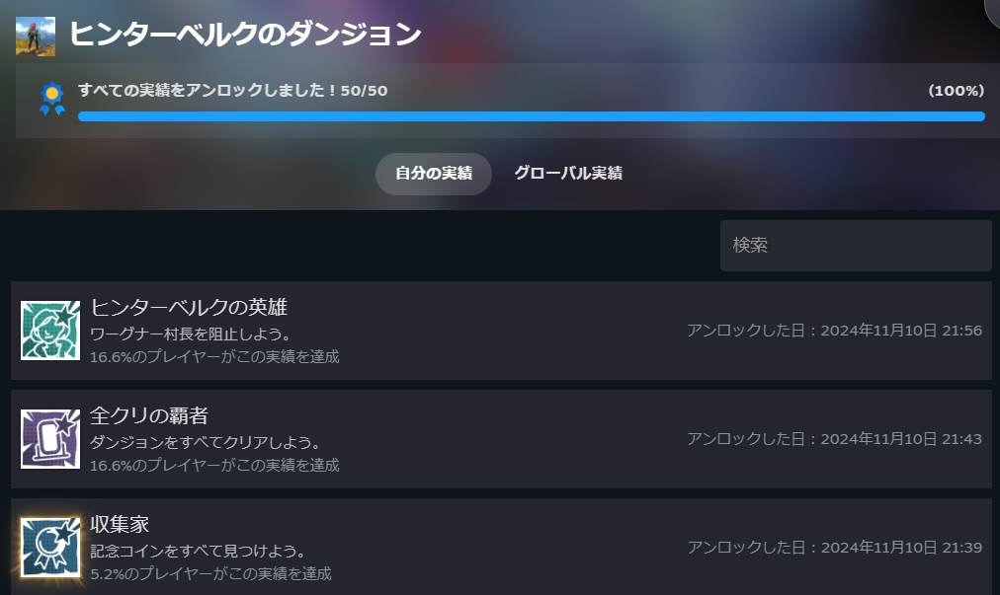
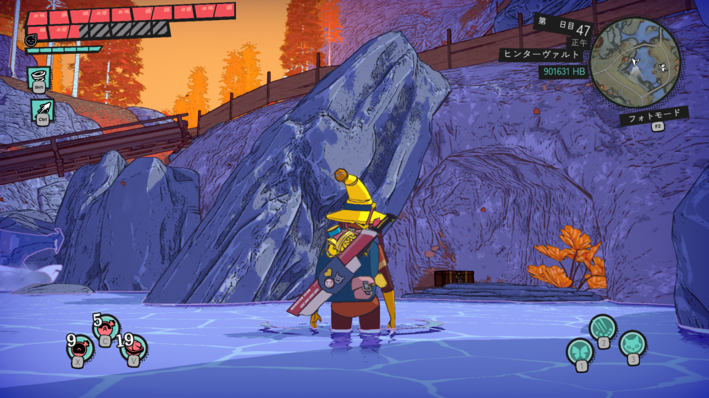
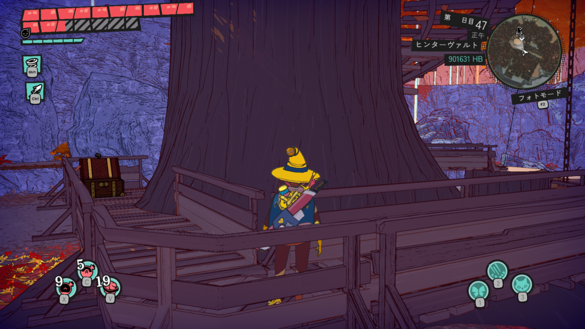
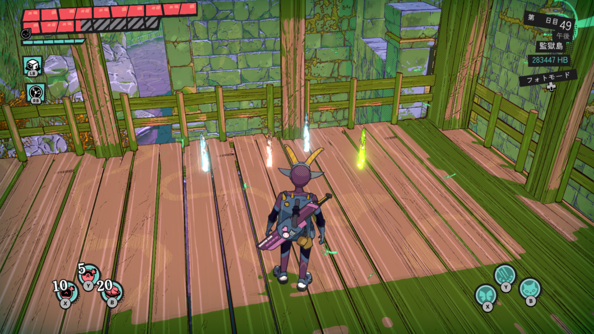
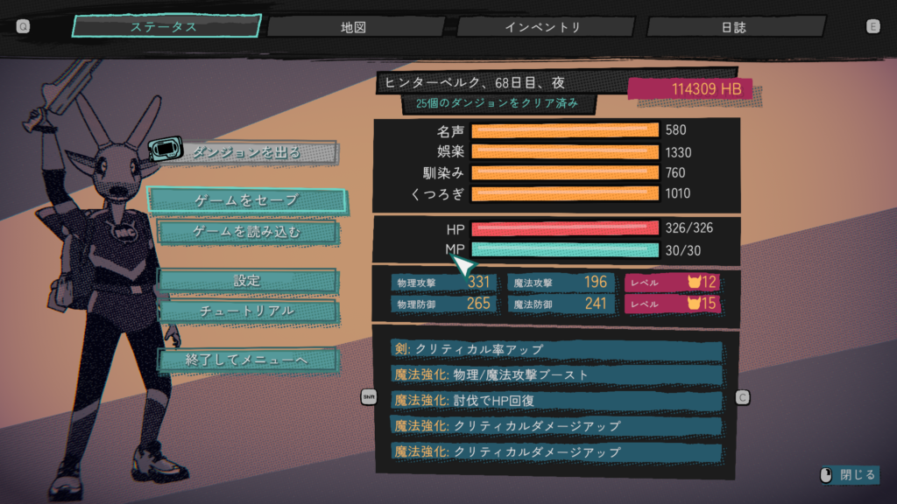
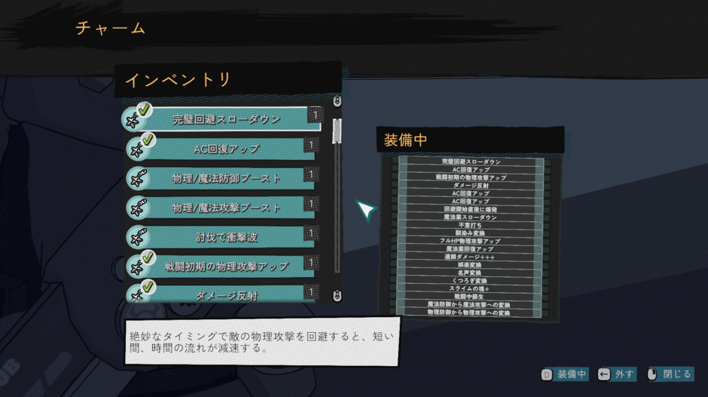
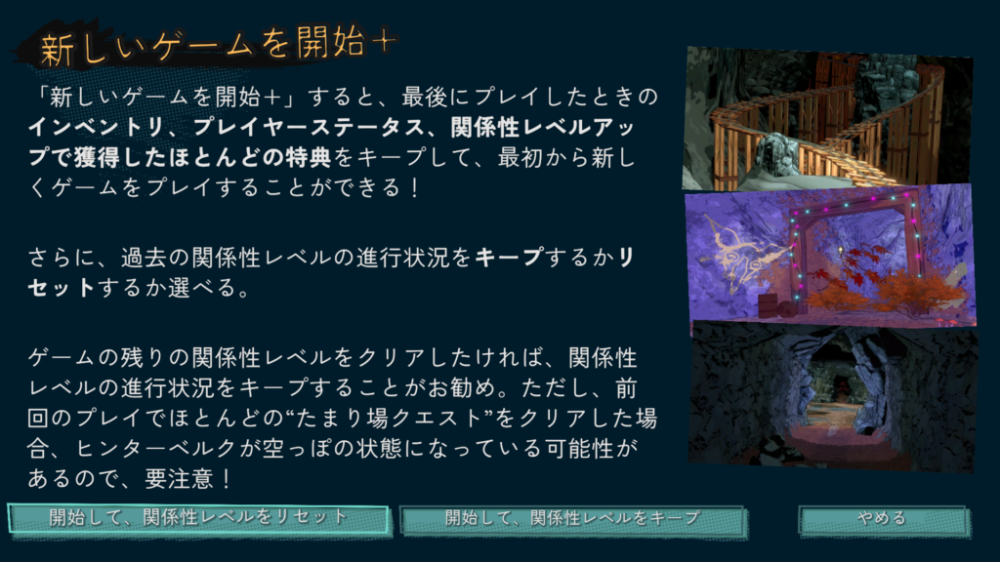

## ヒンターベルクのダンジョン実績について

[前回](/posts/2024/11/dungeons-of-hinterberg-review/)[ヒンターベルクのダンジョン](https://store.steampowered.com/app/1983260/_/?l=japanese)についてある程度の説明をしたので、内容については省略します。実績に関しても特に難しいものはなかったので簡単に紹介してみます。

ドーベルコーゲルの滝の後ろにあります。滝の中に入れば宝箱が見つかりますので、空ければ解除できます。鍵はついてないのですぐ見つかると思います。

**攻撃コンジェットを7または12個使用する**はコンジェットを1回使うだけで大丈夫です。ハンナの店から買ったり、友人からもらうことで増えます。もしかしたらダンジョンの宝箱にもあるかもしれませんが…

**ヒンターヴァルトの鍵付き宝箱**は2個あります。ダンジョンは含めないのでマップ内から取得することができます。1つは川の近く、もう1つは大木の裏ですね。少し細かく見ればすぐ見つかると思います。

### 大変だと感じた実績

一番大変になるのは100万ヒンターバックとモンスタークラブのクエストかもしれません。方法としてはマップに向かうたび、ファストトラベルを使わず基本徒歩でアイテム回収と敵を倒すことですね。積極的に売却アイテムを集めればお金とクエストがいけると思います。

ちなみに青はお金または魔法素材、赤はモンスター系、緑は回復アイテムですね。

またモンスタークラブに関してはチャームがありますので、それを付ければ割と集まります。ついでに換金もしてお金を貯めていきましょう！

アイテム回収をすればゴミやチャームの圧縮素材も集まると思います。これでゴミ、モンスタークラブのクエスト、お金、チャームの装備個数実績が達成できます。チャームに関しては交友関係を広げて枠を広げる必要もあります。

昼はマップやダンジョンでお金を貯めたり、コインを集めたり、スポットでゆったりします。コインについては少しだけ見つけにくいですが、周りを見るようにすれば大丈夫だと思います。

### ヒンターベルクのダンジョン\_おすすめの交流相手

夜は全員と交流していきます。おすすめはハンナですね。剣や防具のアップグレードができますので。また個人的におすすめのコンジェットであるバタフライ爆弾も買うと良いです。

早めに交流したいのはテオですね。鍵付き宝箱を早く解放したいところです。次の商品25%オフも魅力的ですけど。意外なキャラだとトラヴィスですね。最後の報酬が1回復活できるものになります。これで探索はかなり容易になりますね。

個人的にはカイのコンジェットも好きですね。自爆ローリングの敵がいるんですが、これを使えば楽に倒せますからね。

中盤だと社交ステータス変換チャームがいいですね。攻撃力、防御力が大幅に底上げされると思います。物理攻撃300の実績にも必要ですね。

とは言え基本的には好きなキャラから攻略してもいいです。ダンジョンに行かずひたすらスポットでゆったりして交流するというのもありだと思います。ただ、一通り集まった後ダンジョン行くとかなり余裕になるのでひりひりした戦いがしたければ先にダンジョンに行きましょう！

最終的に全員の交流をすればほとんどの実績を到達できると思います。もし物理攻撃力が武器やチャームでも足りなければボートに乗ってください。これは攻撃力が上がりますのでいずれ300に到達できると思います。

### 最終日の状況

大体69日過ごして最終的なステータスがこちらですね。最後は深夜にテレビと午後にスポットを行き来する日々でしたね（笑）

チャームはこんな感じ。回避スローダウンは最後まで活躍しましたね。回避爆発はノックバックに使えます。不意打ちは火力上げ、社交ステータス変換はステータスが大幅アップ。といった感じですね。雑魚相手なら討伐衝撃波もかなり有効です。

全てが終わったら新しいゲーム+を始めることができます。ただ、交流などを全て完了した場合はやる必要はないですね。もし、まっすぐ進んだけど実績もやりたい方はこちらを進めることになるくらいだと思います。

ヒンターベルクのダンジョンはこんなところですね。個人的に夢中になってやったゲームなのでおすすめです。ゲームは一旦ここまででまた勉強に戻ろうと思います。ではでは。
