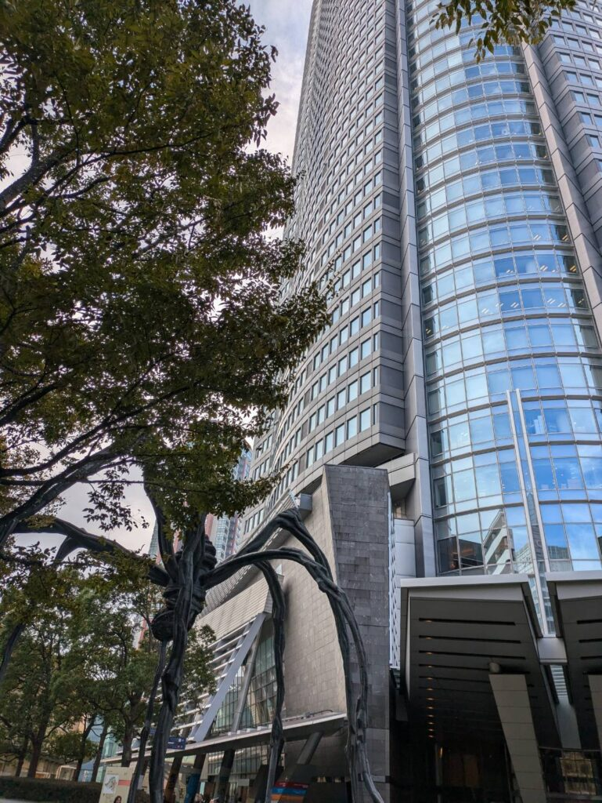
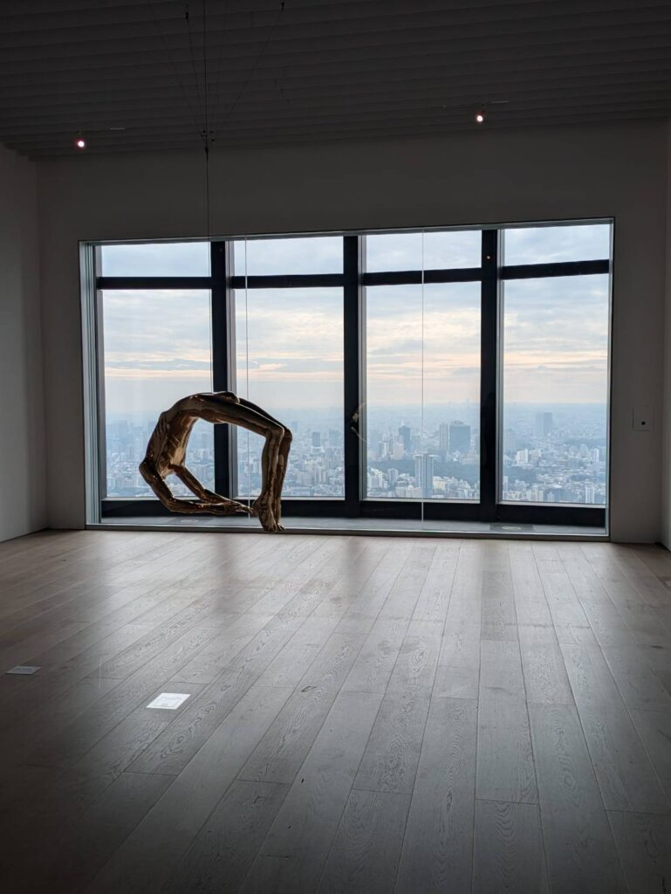
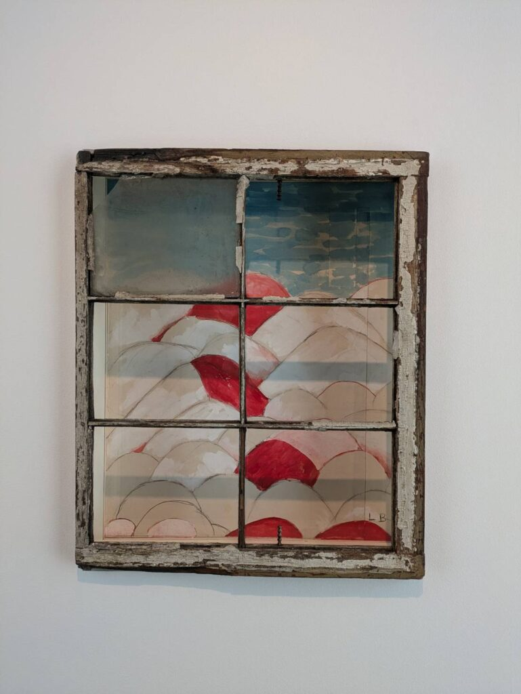
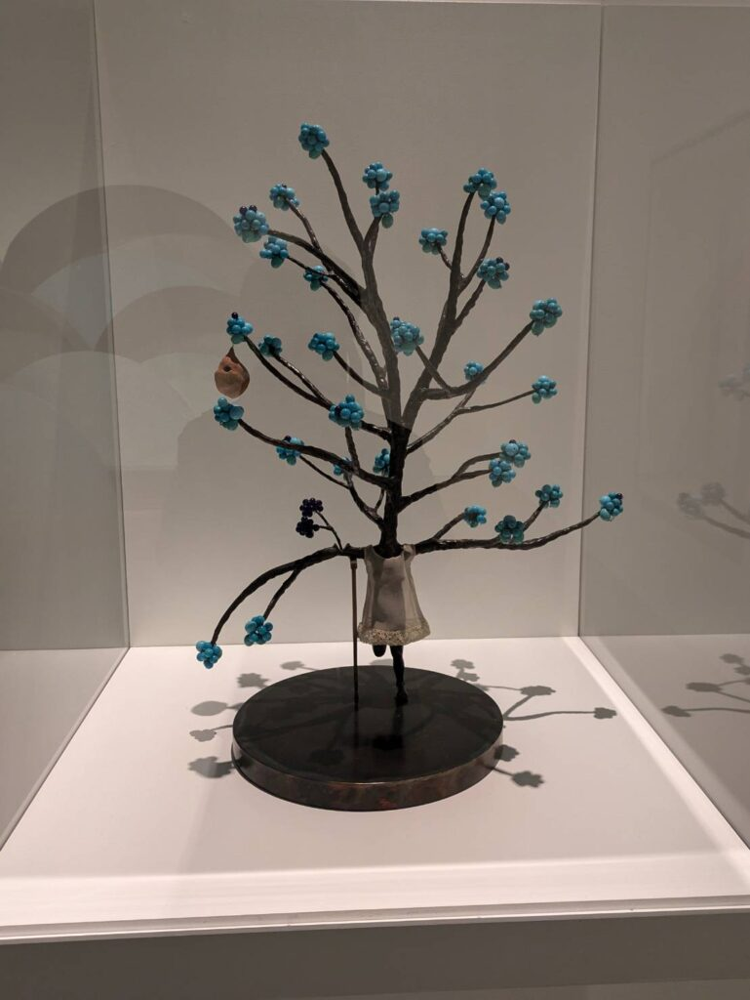
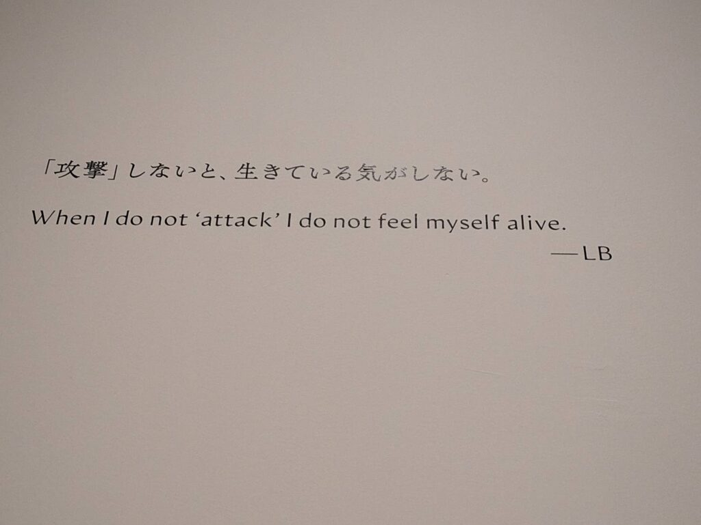
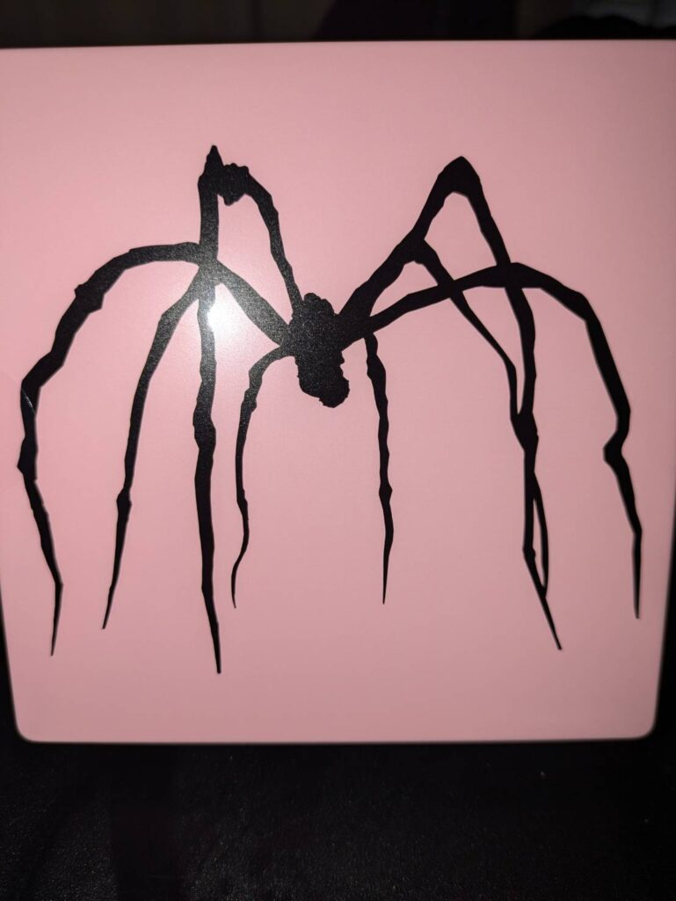
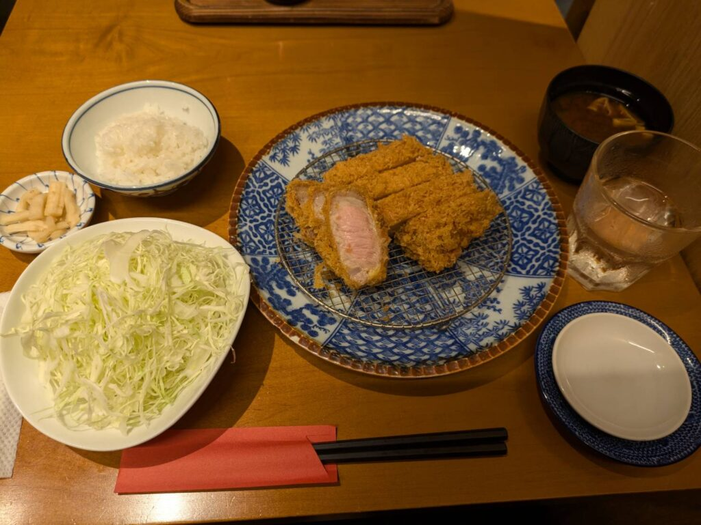

## ルイーズ・ブルジョワ展の概要

先日[ルイーズ・ブルジョワ展](https://www.mori.art.museum/jp/exhibitions/bourgeois/)に行ってきました！[モネ 睡蓮のとき](/posts/2024/10/monet-water-lilies-exhibition/)を見に行った時にパンフレットをもらったので行ってきました。下の写真は代表的な作品の一つ蜘蛛の彫刻「ママン」になります。どうでもいいですが、高校の同級生が少し前に行ってたみたいです（笑）

六本木ヒルズの外にもありますが、展示会場にも2点ほどあります。いずれも違う様相をしています。

### 展示品について

ルイーズ・ブルジョワ展の展示品はほとんど撮影がOKだったと思います。私は気に入った作品だけ撮ってきました。53階の外が見られる宙づりにされた男、窓枠にある空の絵、黒い実がある松葉づえで支えられている気の女ですかね。正しい名前は忘れましたが…

### ルイーズ・ブルジョワについて

[ルイーズ・ブルジョワ](https://ja.wikipedia.org/wiki/%E3%83%AB%E3%82%A4%E3%83%BC%E3%82%BA%E3%83%BB%E3%83%96%E3%83%AB%E3%82%B8%E3%83%A7%E3%83%AF)という人はフランス出身のアメリカ人アーティスになります。女性で幼少期の体験から母性やカップルをよく題材にしてました。

そのため性を彷彿とさせる作品が多いため、写真を撮っても見せづらいものが多いですね。なのでほとんど撮らなかったのですが…

ただ、作品自体は考えさせられるものもあり、なぜこんな表現になったのかな？というものもありましたね。謎の重厚な扉に囲まれた椅子、多くの似た絵画、椅子がメインとなっているホログラム等ありました。

もちろん解説ありの作品もあります。とは言え自身の中で想像を膨らませながら"これは何を表してるのか?"と考えるのも楽しいです。

また、彼女の母親がタペストリーの修理をしていたみたいです。その影響もあって服飾系の作品もありました。色使いもきれいなものも多く刺繍などもあって凄いなーと思いました。

### ルイーズ・ブルジョワの言葉

それから彼女の言葉で好きな言葉がこれですね。SNSが出てきたことでよりこの言葉が刺さるように感じます。私はほとんど投稿してないのですが、批判はまだしも誹謗中傷が飛び交うような状況ですからね。この言葉は忘れず心に秘めていこうと思います。反面教師の言葉として。

### お土産について

一通り見て回った後はお土産ですね。特別欲しいものはなかったのですが、個人的にはパズル系ですね。組み合わせパズルだけでなくボードゲームもありました。友人関係や部屋に余裕があれば買ってやりたいところです。私が買ったものはミルクアーモンドですね。

容量は50gなので大きくはありません。味は外のミルクが割と厚みがありますね。厚みのあるミルクとアーモンドでお土産としてはいいかもしれませんね。アーモンドと言っても砂糖やら加工物もあるので体にいいわけではないですが…

### 豚組食堂で昼食

見回った後はお昼をいただきました。ヒルズB2にある[豚組食堂](https://www.butagumi.com/shokudo/)ですね。スタンダードの豚に厚切りサイズを注文しました！ご飯とキャベツはお替り無料ですね。値段は2000円くらいですが、サイズを抑えれば1200円ぐらいになるかと思います。

厚切りにしたのでお肉は肉厚で、衣はサクサクですね。味付けは塩とタレがありますが、塩だけでも十分美味しいですね。もちろんカラシとタレでも美味しいですが。

個人的にはキャベツがもう少し新鮮だと良い気がしました。しなしなではないですが、もう少し鮮度が高いキャベツだとより箸が進むかなという気がします。鮮度か洗いすぎかはわからないですし、あくまで個人の感想ですが…

ちなみに会計は前払いなので注文→会計→食事になります。ファーストフードやカフェは前払いが多いですが、ランチでは滅多に見ない気がしますね。店員さんの気づかいは細かい方だと思います。各テーブルをちょくちょく見回ってきて、カラシや水、ご飯等を確認してましたので。

### 終わりに

以上ですね。美術館に行った際いくつか気になるパンフレットをもらったので、また来週どこかに行こうかと思います。ではでは。
