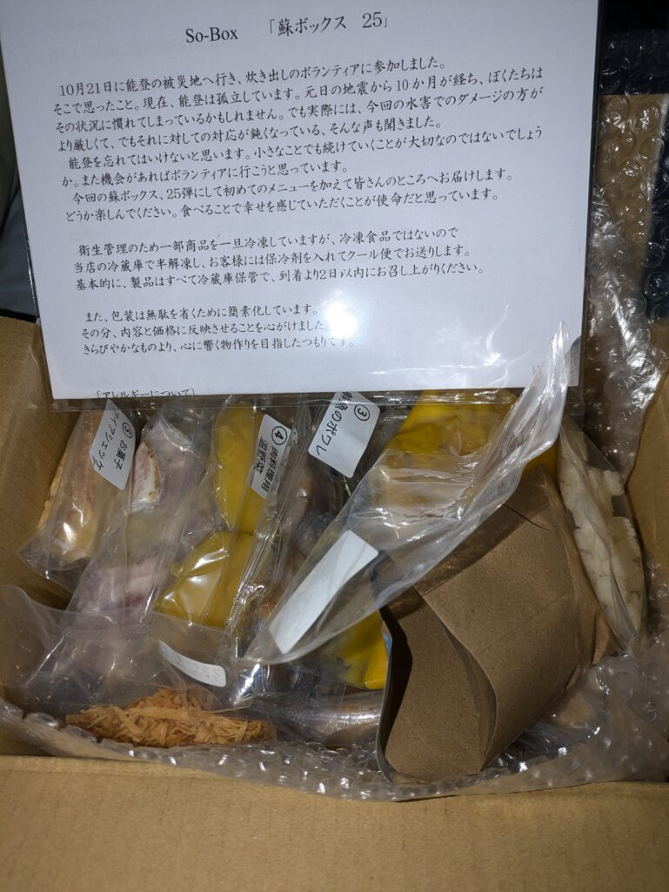
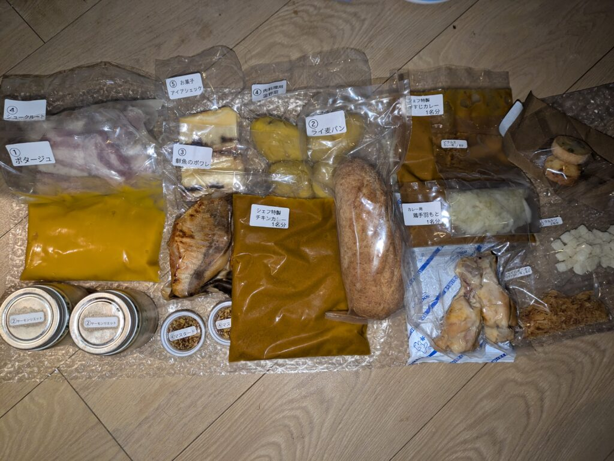
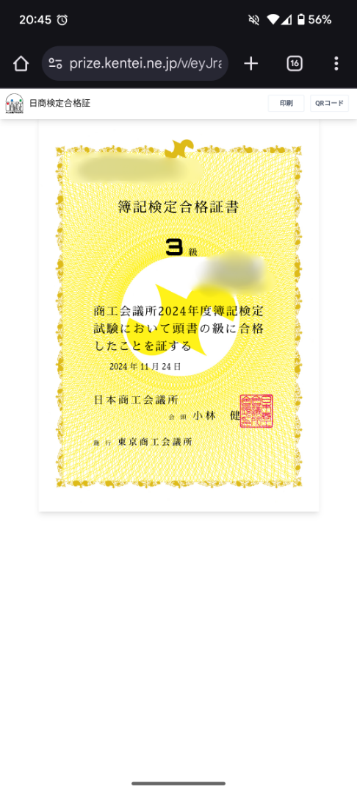
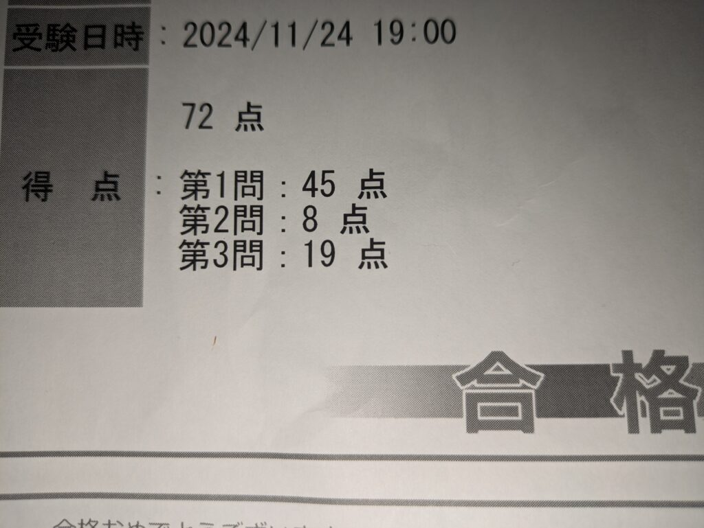

個人的にあった良かった出来事を書いていこうかなと思います。ただ、大した内容ではないのでサクッと書いていきます。

## **ミチノ・ル・トゥールビヨン「蘇」ボックス体験記**

1つ目は美味しいご飯を食べたことですね。[ミチノ・ル・トゥールビヨン](https://www.michino.com/gift.html)というお店の「蘇」ボックスです。

少し前が誕生日だったので義援金付きで買ってきました。現地でもランチやディナーがあるみたいですが、大阪なので冷蔵ボックスで届く感じですね。盛り付けまでできればよかったのですが、絶望的にセンスがないので雑に更に盛って食べました（笑）

内容はサイトに飛んでいただければ見れますので味の感想を書いていこうと思います。

### **それぞれの料理の感想**

- ポタージュ
    - 甘くてなめらか、クルトンのサクサクもちょうどいい

- 魚とキノコ
    - 魚はホロホロ食感、キノコのコリコリと味が少し濃ゆいしょうゆベースでご飯が欲しくなる

- チキンカレー
    - 辛くないスパイスで甘みもあり複雑な味がおいしい、オニオンフライの食感もよい、手羽も柔らかくしっかり味がついてる

- ケーキ
    - 下のタルトクッキー、レーズン＆レアチーズケーキとチーズケーキの2層、上はクッキー？

- 豚肉
    - 肉のホロホロ、玉ねぎのしみた味のシャキシャキ、じゃがいもが優しい味、マスタードの辛みがちょうどいい

- バゲット
    - サーモンに塩が聞いていて玉ねぎのシャキシャキがよい、ライムギに少しバターを溶かして一緒に食べると良い、余ったリエット飲み食べてもよい

- ビーフカレー
    - コクのある深みのスパイス、ピクルスの酸っぱさとのアクセントが良い

一旦冷凍されているとは美味しいです。使った材料が書かれてある紙が同封されていました。そのため再現できるのかもしれませんが、流石にプロと同じ味にはならないと思いますね。

プロってやっぱ凄いんだなと思いました。素人目から見たら高級レストランでも食堂でもプロに見えてしまいますが。次は現地に行って食べてみたいと思います。

## **簿記3級合格！勉強方法から試験当日の様子までをレポート**

もう1つは簿記3級に合格したことですね。[前々](/posts/2024/11/bookkeeping-level-3-post-2/)から勉強はしていたのでようやく本番を受けてきました。[こちら](https://cbt-s.com/examinee/examination/jcci.html)から受験することができます。

試験終了すると結果をプリントします。QRコードを読み込むと合格証明書をWeb上でもらうことができます。こんな感じですね。一応証明書番号と本名はモザイクを掛けておきます。便利な世の中になりました。

### **ギリギリ合格！危なかった…！**

試験結果をプリントしてもらったのですがぎりぎりでした。試験中に合格できるか怪しいなとは思ってましたが、ほんとにぎりぎりですね。1問目の仕訳を1つでも間違えてたら終わってましたね。今回は仕訳が複雑なものがなかったので何とかなってよかったです。

ただ、2問目や3問目はやったことのない問題が出ていたので、ちんぷんかんな部分がありました。そのせいでかなり点数を落としちゃいましたね。まあ合格すればよいのでいいんですけど…

確か2問目は利息の仕訳でしたね。仕入や売上は模擬で慣れてたんですが、こっちはなれずに微妙でした。

3問目は前受金の一部が未決済の商品売上で計上していないという問題だったと思います。この辺も慣れてない部分だったので点数を落とした要因かなと思いますね。

### **私が実践した簿記3級勉強法**

最後に私が簿記3級合格するまでにやったことを軽く書いていきます。

まずは[CPAラーニング](https://www.cpa-learning.com/courses/90002)で簿記の勉強ですね。もちろん、動画も無料ですし、教材や問題集、模擬試験などがPDFでもらえますので積極的に活用しましょう！さらに、問題も一緒に解いて理解を深めていくのがおすすめです。

次に動画を見終わったら問題を解いていきましょう！問題集を解いていってもいいですが、ある程度分かっているならネット試験を受けましょう。無料で[CPAラーニング](https://www.cpa-learning.com/courses/360011)でも出してますし、[ネットスクール](https://nsboki-cbt.net-school.co.jp/exam/level3/select-set)というサイトでも解くことができます。

ちなみに公認で出してる模擬試験もあります。[こちら](https://boki.pckentei.com/product/album/)は500円/31日で使用することができます。安めではあるので余裕があればやっておくと高得点は狙えると思います。ただ、内容をしっかり理解できていれば不要ですね。

### **簿記3級はコスパ最強**でメリットもあるよ

受験料は3850円(3,300+550の手数料)です。上記のライセンスと合わせれば4000円強で簿記をとれますね。加えて、やる気を見せればどの業界でも働けますので、かなりコスパはいいと思います。少なくともE資格よりはよいですね。あれは10万以上必要なのに使える場面は限られてますので…

さらに簿記は個別投資などでも役に立つと思います。会社の経営状態を知ることは長期的に成長したり、安定して利益を生み出せるかわかるようになるので。

というわけで興味があれば簿記やってみてください。以上最近あった出来事でした。ではでは。
