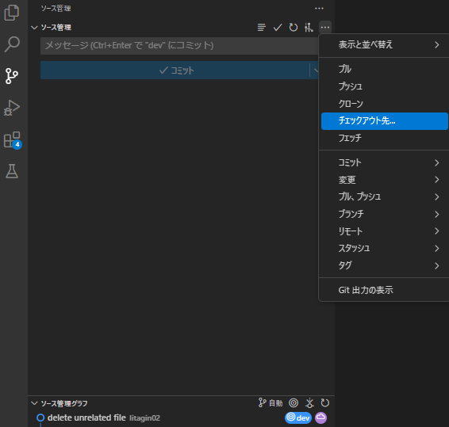
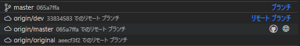
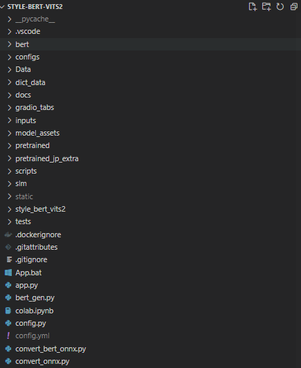
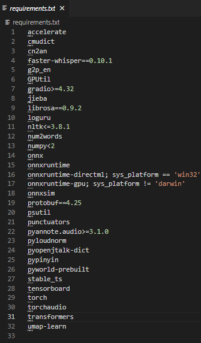
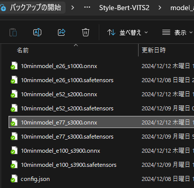
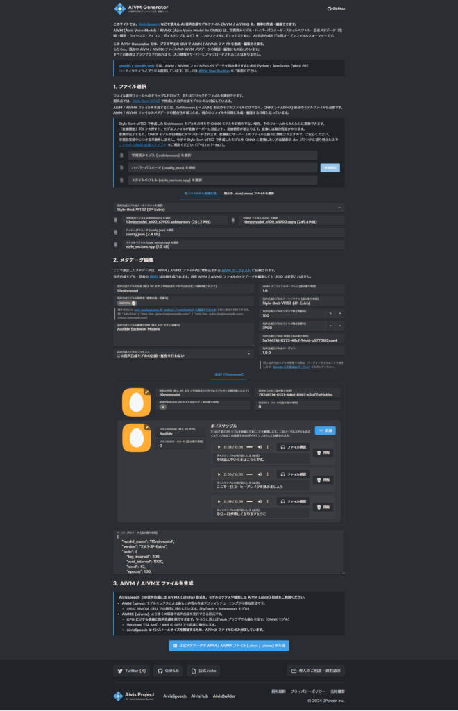
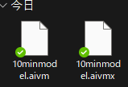
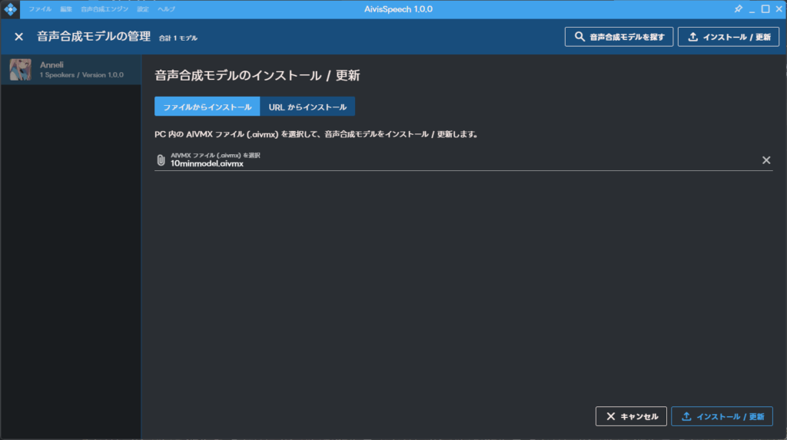
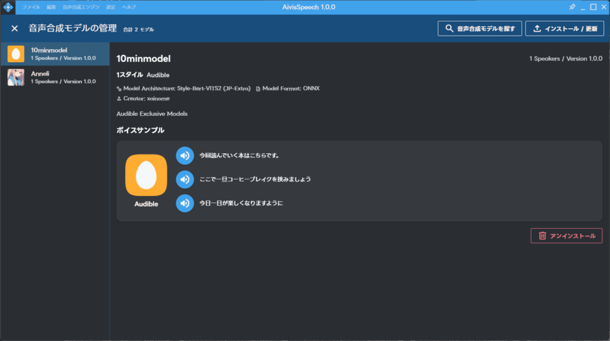

## AIVMGeneraterを使えるようになるまで

前回Style-Bert-VITS2を使って音声合成モデルを作りました。今回は作ったモデルをAivis Speechでも使えるようにしようと思います。

AIVMGeneraterでは自作した音声合成モデルをAivis Speechで使えるようにします。以前までは音声合成モデルさえあればAIVMGeneraterで変換できるようになってました。しかし、今は使えなくなってます。そのため、.onnxファイルを作って変換する必要があります。

ただ、Style-Bert-VITS2を使えるのであればできますので諦めずやっていきましょう！

### Style-Bert-VITS2をdevブランチへ切り替え

まずはStyle-Bert-VITS2をdevブランチへ切り替えます。デフォルトだとmainブランチになってますので、これをdevブランチへ切り替えます。ターミナルからコマンド実施でもよいですが、VSCodeを使っているのであれば以下の方法で切り替えて実施できます。

まずはGitのタブを選択しましょう。それからソース管理の設定から"チェックアウト先"を選択します。



そうすると真ん中あたりにこんな感じでブランチやリモートブランチが出てきます。ここからorigin/devを選択しましょう。



### onnxファイルの作成

そうすると中のファイルなどが変わっていると思います。以下を確認してみましょう！

- "convert\_onnx.py"が存在しているかどうか

- requirements.txtにonnx系のライブラリが記述されているかどうか





上記が確認出来たらrequirements.txtで一括再インストールをしてconvert\_onnx.pyを実行しましょう。私の環境でのコマンドだと以下のような感じですね。この辺は適宜自身の環境に合わせて変えてください。

```
py -3.10 -m pip install -r requirements.txt
py -3.10 convert_onnx.py --model model_assets/{モデル名}
例：py -3.10 convert_onnx.py --model model_assets/10minmodel
```

そうするとモデルファイル内に.onnxファイルができてると思います。モデルごとにできるので少し容量を使っちゃいますが…



### AIVMGeneraterの設定

.onnxファイルが出来たら[こちら](https://aivm-generator.aivis-project.com/)のページからAIVMGeneraterを使います。使い方はシンプルでモデルに関するファイルをアップして、サンプルボイスもアップして変換するだけです。

メタデータ編集では製作者や説明を記載出来ます。この辺はなくても大丈夫です。私は一応記載しましたが。それからモデルの公開ですね。今回は公開しませんが、公開したい場合はライセンスを選びましょう。

ACML 1.0 と ACML-NC-1.0 の違い**営利目的の利用を許可**するかどうかです。ACML 1.0は許可しますが、ACML-NC-1.0は非営利目的のみとなっています。パブリックドメインは著作権フリーで、カスタムライセンスはライセンスを自作することになります。

ACML 1.0かACML-NC-1.0のどちらかを選べば特に問題ないかと思います。



それからアイコン、スタイル説明、サンプルボイスを追加しましょう。サンプルボイスは実際にモデルを使った時の音声を貼っておきます。

アイコンはデフォルトだと卵型の形になります。公開する場合は設定しておきましょう。スタイルは何もなければノーマルになります。公開するスタイルに合わせて書き換えましょう。

設定が完了したら、変換をします。そうすると変換が完了したファイルがダウンロードされます。許可を求められた場合は許可しましょう。



### Aivis Speechへの取り込み

ダウンロードが完了したら、Aivis Speechに取り込みます。まずはAivis Speechを起動します。"設定" > "音声合成モデルの管理"を選択します。そしたら右上の"インストール/更新"を選択して.aivmxファイルを選択します。



ファイルを選択したら右下の"インストール/更新"を選択しましょう。このような画面になったらインストール完了です。後は自由に使えるようになります。



### 終わりに

今後ですがもう少しモデルの作成を試してみたいなと思います。10minmodelを作りましたが、お試しで作った物なので。使ってみた感じつまずいたり、うまく喋れてない部分がありました。なので、データの再集録からですね。

それからスタイルもいくつか使ってみたいですね。本来Audibuleスタイルで作りましたが、せっかくなら感情表現もできるキャラクター用も作ってみたいですし。

ここまでできれば色んな音声合成モデルを作れるようになります。皆さんもぜひ試してみてください。唯一の難点はローカルでモデル作成しているときPCが使えないということですね。Colabを使えばいいと思いますが、あれだと数日かかりそうですし。ではでは。
