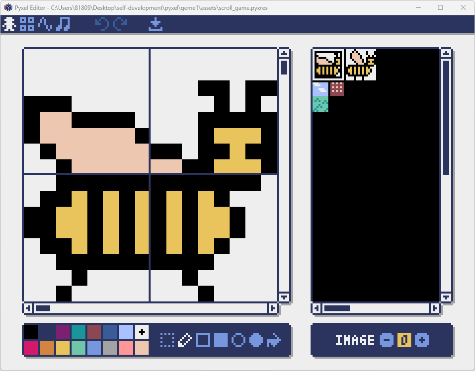
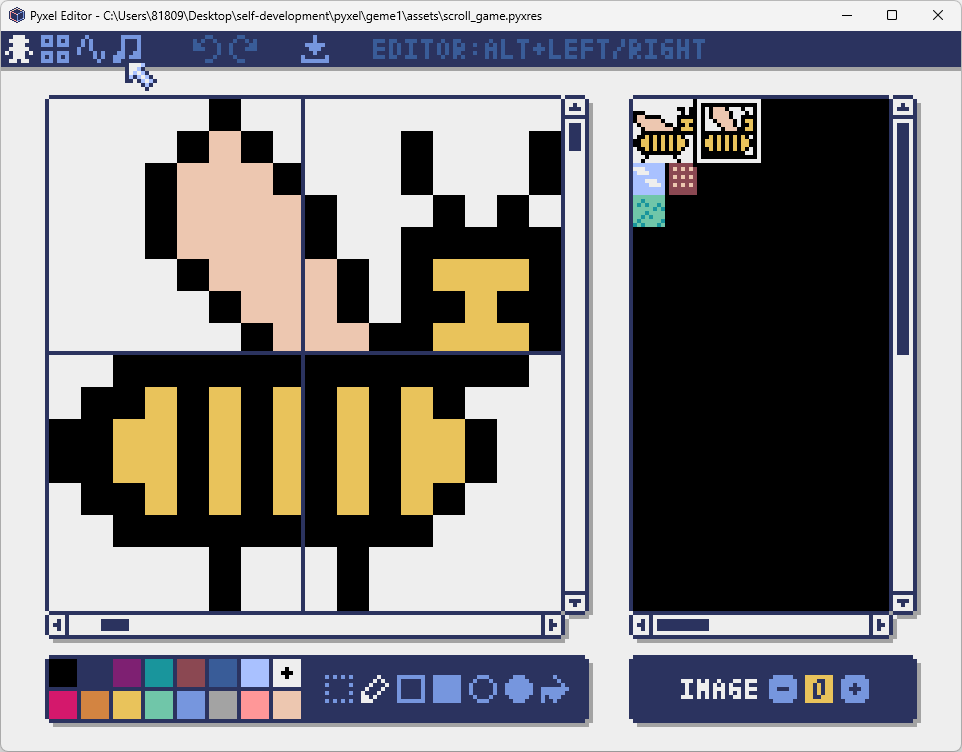
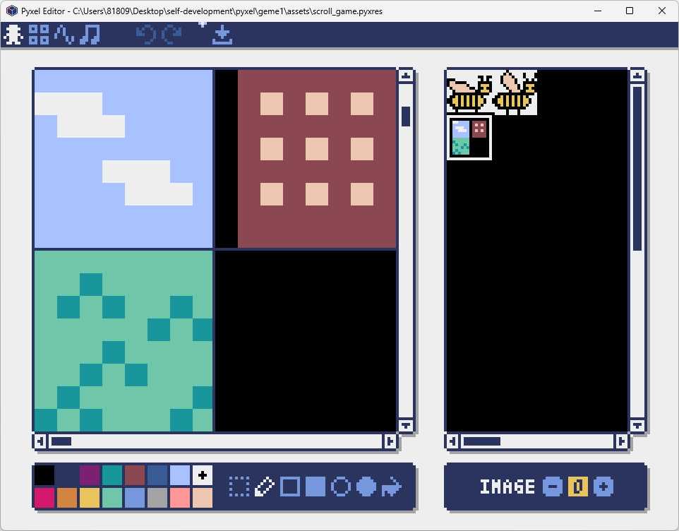
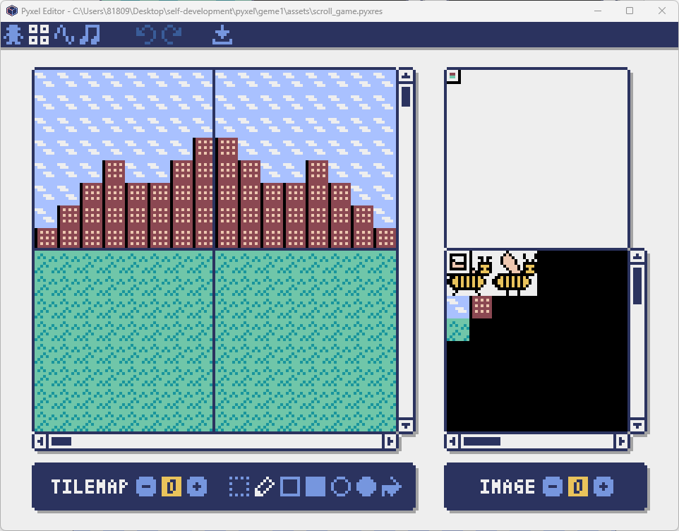
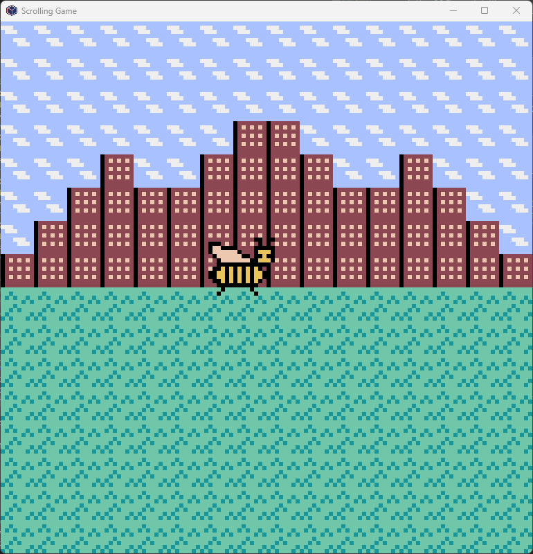

## Pyxelでゲーム開発入門

ゲームを作成するのであれば[Unity](https://unity.com/ja)や[Unreal Engine](https://www.unrealengine.com/ja)が有名です。それとは別にpythonでコーディングができる[pyxel](https://github.com/kitao/pyxel/blob/main/docs/README.ja.md)があります。

pyxelはレトロゲームエンジンになります。ファミコンのようなドット絵スタイルのゲームしか作れませんが、pythonを知ってる人にはちょうどいいかもしれません。

### 開発環境の準備

pythonを導入している前提ですが、少し進めていきたいと思います。基本的には[README](https://github.com/kitao/pyxel/blob/main/docs/README.ja.md)通りに進めていけばよいと思います。まずはライブラリのインストールを進めていきます。

```
pip install -U pyxel
私の例: py -3.10 -m pip install -U pyxel
```

\-Uがないとエディター画面が出ないので忘れずにつけましょう！その後は参考のためサンプルを導入するのもよいと思います。なくても特に問題はありません。

```
pyxel copy_examples
```

### 基本的なコード構造

そうすると簡単なゲームやガイドなどが入ってます。これを理解できれば基本的なコードは書けるようになると思います。基本的なコードはこんな感じになってます。

```
import pyxel

class App:
    def __init__(self):
        pyxel.init(160, 120)
        self.x = 0
        pyxel.run(self.update, self.draw)

    def update(self):
        self.x = (self.x + 1) % pyxel.width

    def draw(self):
        pyxel.cls(0)
        pyxel.rect(self.x, 0, 8, 8, 9)

App()
```

クラスの中に\_\_init\_\_関数とupdate関数とdraw関数があります。\_\_init\_\_関数では画面サイズの指定や各関数の実行ができます。

update関数ではキー入力や画面の切り替えを行う関数になります。update関数がメインになりそうです。もちろんupdate関数だけじゃなくて新しく関数を作っても問題ないです。キャラクター用や画面用などいろいろ作ると使い分けが楽になると思います。

draw関数では画面やキャラクターの描画を行います。エディター画面で作成した背景やキャラクターを呼び出したりします。

### ドット絵とタイルマップの作成

というわけでまずはドット絵とタイルマップの作成からですね。ちなみに私は絵心は全くないので、大したものは書けません。所謂味がある絵みたいなイメージですね…コマンドは以下になります。

```
pyxel edit "絶対パス"
例: pyxel edit "C:\pyxel\assets\game.pyxres"
```







コマンドは相対パスだと開かないので気を付けてください。一応実行しているフォルダーに移動してファイル名のみ指定しても問題ありません。

こんな感じで蜂A、蜂B、空、草原、岩のタイルを用意してみました。適当ですが苦手なりにそれっぽくできた気がします。まずはタイルマップの作成をします。左上のエディターからタイルマップを選び、書いたタイルを指定して書いていきます。



### タイルマップへのキャラクター表示

今度はコードを使ってタイルマップにキャラクターを表示してみます。



ここからどう動かすか？という感じですね。描画するときのコードはこんな感じですね。

```
import pyxel

class Scrolling_Game:
    def __init__(self):
        pyxel.init(128, 128, title='Scrolling Game')
        pyxel.load('assets/scroll_game.pyxres')
        self.char_x = 50  # キャラクターのX座標
        self.char_y = 50  # キャラクターのY座標
        pyxel.run(self.update, self.draw)

    def update(self):
        self.scroll_x += self.scroll_speed

    def draw(self):
        pyxel.cls(0)

        pyxel.bltm(0, 0, 0, 0, 0, 128, 128)
            
        # キャラクターの描画 (アニメーション)
        pyxel.blt(self.char_x, self.char_y, 0, 0, 0, 16, 16, 7)

Scrolling_Game()
```

### キャラクター表示\_コーディング

\_\_init\_\_内でエディターで描いたドット絵の読み込みと座標設定をしています。

drawではclsは一旦画面をリセットします。その後bltmでタイルマップの読み込みですね。bltでキャラクターの読み込みをしています。

bltmでは画面(0,0)の位置にタイルマップ0番を呼び出します。タイルマップ0番の(0,0)の位置から(128,128)まで描画します。

bltも同様に指定していますが、最後の7は透過する色になります。蜂が黄色と黒の模様なので黒透過が使えませんでした。なので白透過をするために7を指定しています。ちなみに黒透過なら0を指定すれば大丈夫です。

### 終わりに

今回は一旦ここまでにしようと思います。次回はキー入力で動かしたり、音楽を触ってみるぐらいはしてみたいなと思います。ではでは。
