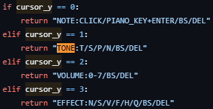

## pyxeleditorでキャラの動きやサウンド

[前回](/posts/2024/12/build-game-with-pyxel-part-1/)[pyxel](https://github.com/kitao/pyxel)のインストールからドット絵を描いて表示させるところまでやってみました。今回は実際にキャラクターを動かしたり、サウンドを作ったりしたいと思います。

### pyxeleditorで作った部分

実際に動いた画面がこちら。

### コードの中身\_init

一旦各コードを簡単に見ていこうと思います。まずは\_\_init\_\_内ですね。前回も話したのでざっくりと見ます。

```
pyxel.init(128, 128, title='Scrolling Game')
pyxel.load('assets/scroll_game.pyxres')
self.char_x = 50  # キャラクターのX座標
self.char_y = 50  # キャラクターのY座標
```

initで画面サイズの設定、char\_xとchar\_yはキャラ座標を設定しています。loadでpixel editで作成したものをロードしています。ドット絵、タイルマップ、サウンドなど全て一旦ロードしています。

```
self.char_frame = 0  # 表示する画像のインデックス (0 または 1)
self.frame_count = 0 # フレームカウンター
self.is_moving = False  # 移動中フラグを追加
self.last_input = False #直前のフレームでキー入力があったか
pyxel.run(self.update, self.draw)
```

他のコードはコメントも記載していますが、キャラ画像の入れ替えやフラグの設定をしています。後はpyxelの起動ですね。

### コードの中身\_update

次はupdate関数ですね。

```
# ゲーム中断
if pyxel.btnp(pyxel.KEY_Q):
    pyxel.quit()
# キー入力と移動処理
self.is_moving = False
key_pressed = False # 今のフレームでキーが押されているか
```

Qを押したらゲームを中断します。それからフラグとキー入力の初期設定をしています。

```
# キー入力処理とキャラクターの移動
if pyxel.btn(pyxel.KEY_LEFT):
    self.char_x -= 1
    self.is_moving = True  # 移動中フラグを立てる
    key_pressed = True
if pyxel.btn(pyxel.KEY_RIGHT):
    self.char_x += 1
    self.is_moving = True
    key_pressed = True
if pyxel.btn(pyxel.KEY_UP):
    self.char_y -= 1
    self.is_moving = True
    key_pressed = True
if pyxel.btn(pyxel.KEY_DOWN):
    self.char_y += 1
    self.is_moving = True
    key_pressed = True
```

ここでは各方向キーを入力した時の設定をしています。上下左右分書いてるので記述は多いですが、内容はシンプルです。キャラクターの座標をずらして、フラグを書き換えています。というか関数化したほうがもっとシンプルになりますね…

```
if self.is_moving and self.last_input:
    self.frame_count += 1
    if self.frame_count % 10 == 0:
        self.char_frame = 1 - self.char_frame
elif self.is_moving and not self.last_input:
    self.frame_count = 0
        
self.last_input = key_pressed # 次のフレームのためにキー入力があったかを保存
```

ここではframe\_countの書き換えとchar\_frameの書き換えを行っています。キー入力があって前のフレームでも入力があった場合はframe\_countに+1をしています。

その後frame\_countが10で割り切れた場合はchar\_frameを書き換えています。frame\_countの条件文がないとキー入力があるたびに画像が切り替わります。より虫らしさを表現できますが、動きが気持ち悪くなるので条件文を付けてみました。

さらにchar\_frameの値を書き換えることで画像の切り替えをするように設定しています。次にキー入力がなかったらframe\_countを初期化しています。

最後に直前のキー入力があったかどうかのフラグを書き換えています。

### コードの中身\_draw

最後にdraw関数ですね。

```
pyxel.cls(0)

pyxel.bltm(0, 0, 0, 0, 0, 128, 128)
            
# キャラクターの描画 (アニメーション)
if self.char_frame == 0:
   pyxel.blt(self.char_x, self.char_y, 0, 0, 0, 16, 16, 7)
else:
   pyxel.blt(self.char_x, self.char_y, 0, 16, 0, 16, 16, 7)
```

clsは画面の初期化、bltmでタイルマップを呼び出します。char\_frameが0なら蜂Aを呼び出し、0以外なら蜂Bを呼び出します。

コードの中身としてはこんな感じですね。コードのせいで長くなってますが、そのままサウンドを触っていきます。

### pyxeleditor\_サウンド

pyxeleditorのサウンド画面を触っていきます。一旦ドレミファソラシドを流してみます。そのうえでTONEを変えたりEFFECTを掛けたりしますので違いを聞いてみるとわかりやすくなります。ちなみにVOLはvolume(音量)で0~7まで設定できます。

まずはTONEを変えてみたときのサウンド

次にEFFECTを変えてみたときのサウンド

ここで一旦コードを少し見てみようと思います。とは言え見るコード自体は簡単です。



少し触ってコードを見たので内容の説明をわかる範囲で書いてみようと思います。vloumeは音量なので省きます。共通で出ているBS(back space)とDEL(delete)は消すだけなのでこれも省きます。内容はchat-gptに聞いても同じなので、詳しく知りたいのであれば聞いてみてください。

#### TONEやEFFECTの説明

- TONE
    - T：Triangle(三角波)でデフォルトの波形。電子ピアノ風？
    
    - S：Square(矩形波)、少し電子っぽく音が延びている？感じ
    
    - P：Pulse(パルス波)、Sより電子っぽくファミコンのイメージはこれ
    
    - N：Noise(ノイズ波)で爆発によく使われてそう

- EFFECT
    - N：None(ノン)で特にエフェクトなし、指定しなければこれ
    
    - S：Slide(スライド)で音程が滑らかに変わる
    
    - V：Vibrato(ビブラート)で音が揺れる感じ
    
    - F：Fade Out(フェードアウト)で段階的に音が下がる、個人的なイメージは音の長さが1/4になる
    
    - H：Half(ハーフ)？個人的なイメージは音の長さが2/4になる
    
    - Q：Quarter(クォーター)？個人的なイメージは音の長さが3/4になる

#### pyxeleditorで実際にサウンドを作ってみた

というわけで一旦簡単ではありますが、作ってみました。

ちなみに私は絵心が0ですが、音楽スキルも皆無です。とは言えどちらもそれっぽくできたと我ながら満足している部分があります。

私なりの作り方としてはとりあえず生成AIに頼んでました。蜂は画像生成AIに頼んでアニメ風からリアル寄りまで複数枚ですね。そこで色合いと姿を見ながら頭の中でイメージしてた形をpyxeleditorで再現した感じですね。

サウンドのほうは生成AIに音楽を作ってみて、作りたいゲームの雰囲気に合う部分を抽出。それをpyxeleditorで再現してみるという感じですね。音の高さが聞いた音と合わない部分もありますが、概ねいい感じです。

#### pyxeleditor\_サウンドの取り込み

今度は作ったサウンドを取り込んでみます。コードはinit内に以下を記述するだけですね。playmの0はmusicの0番を指定しています。loop引数は繰り返すかどうかですね。基本ゲームの音楽は繰り返しなので、デフォルトはloopありでいい気がします。また、トラックの途中から再生することもできますが、今のところ使い道が思い浮かびませんね。経験不足ですかね？

```
    def __init__(self):
　　　　…
        pyxel.playm(0, loop=True)
        pyxel.run(self.update, self.draw)
```

### Web上で動かせるようにする

絵もかいて音楽も付けて動かせるようになったので、今度はweb上で動かしてみます。アプリファイルが必要になるのでコマンドでパッケージ化します。コマンドは以下ですね。

```
pyxel package {パッケージ名} {実行ファイル}
例：pyxel package game1 game1/Scrolling_Game.py
```

.pyxappをGithubにアップできたらURLさえわかれば実行できますね。作った分は[こちら](https://kitao.github.io/pyxel/wasm/launcher/?play=sai-nome.pyxel.game1)で遊べます(ゲーム性は皆無ですが…)。URLのつくりとしてはこんな感じですね。

```
https://kitao.github.io/pyxel/wasm/launcher/?play=<githubのユーザー名>.<リポジトリ名>.<アプリのディレクトリ>.<拡張子を取ったアプリ名>
```

### 終わりに

今回はこの辺にします。ドット絵、サウンド、動きが一通りできました。今度はゲーム性を持たせる必要がありますね。ゲームオーバーとスコアがあれば簡単なゲームはできそうです。ではでは
