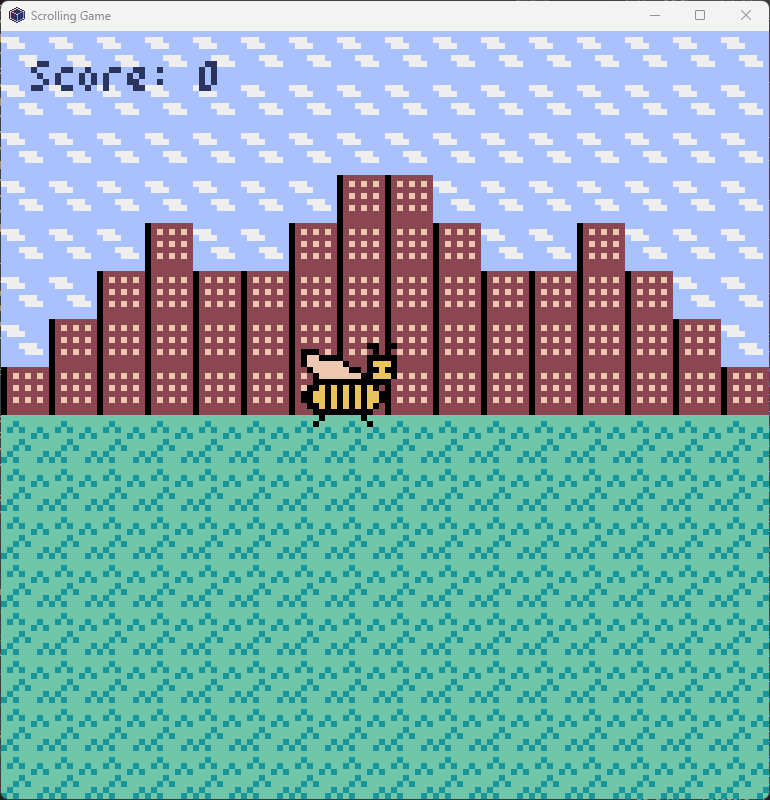
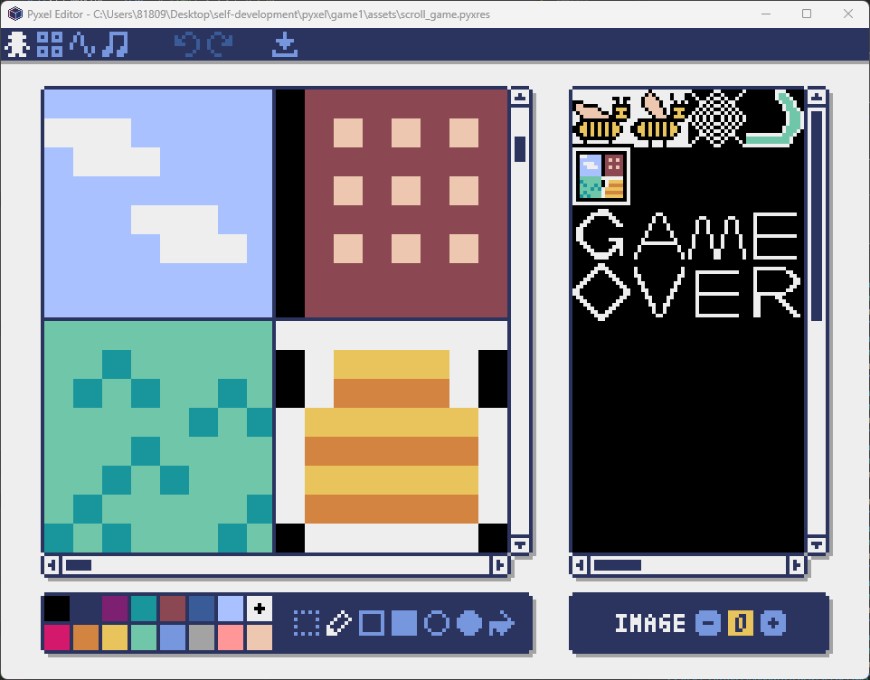

[前回](/posts/2024/12/build-game-with-pyxel-part-2/)[pyxeleditor](https://github.com/kitao/pyxel)を使ってサウンドを作って動かすところまでやってみました。

## スコアとゲームオーバーの実装

### スコア表示の実装

今回はゲーム性を持たせるところですね。やることはスコアの作成とゲームオーバーの作成ですね。まずはスコアの作成をしていきます。コードとしてはシンプルです。

```
class Scrolling_Game:
    def __init__(self):
        …
        self.score = 0
        …
    def draw(self):
        …
        pyxel.text(5, 5, f"Score: {self.score}", 1)
```

textの後の引数はx座標とy座標。後はテキストとカラーパレットですね。カラーパレットはドット絵と同じで0が黒、7が白になります。

さらにスコアについては特定のアイテムを取った時にプラスしていきたいので、変数にしています。ただ、固定ならテキストを入力で問題ないですね。表示させるとこんな感じ。左上にスコアが出ています。



### スコア増加の実装

次はどうやってスコアを増加させるかですね。シンプルな方法でアテイムを取ったら増加するという方法でやろうと思います。

というわけでアイテムを書きました。ハチミツの壺ですね。「ハチミツ食べたいな～」でおなじみの奴です。



他にもいろいろ描いてますが、将来的に使いたいなーと思って描いたやつです。気にしないでください（笑）

それから出現をランダムで出したいと思います。ここもそこまで難しくないですね。初期変数をランダムに設定し、draw関数でランダム変数を設定する感じですね。以下のコード

```
import random

class Scrolling_Game:
    def __init__(self):
        …
        self.item_x = random.randint(0, 120)
        self.item_y = random.randint(0, 120)
        …
    def draw(self):
        pyxel.blt(self.item_x, self.item_y, 0, 8, 24, 8, 8, 0)
```

### 当たり判定の実装

これでランダムに出現するようになりました。ただ、初期配置でランダムになるだけで取得もできないし、スコアも変わらないです。なので、次は取得して配置を変え、スコアを上げるコードを書いていきます。

```
class Scrolling_Game:
    …
    def update(self):
        …
        # 当たり判定
        if (self.char_x < self.item_x + 8 and 
            self.char_x + 16 > self.item_x and
            self.char_y < self.item_y + 8 and
            self.char_y + 16 > self.item_y):
            self.score += 100
            self.item_x = random.randint(0, 120)
            self.item_y = random.randint(0, 120)
    …
```

これで当たり判定とスコアの上昇、アイテムの再配置を行いました。動かすとこのような感じですね。

### ゲームオーバーの実装

最後はゲームオーバー要素を付け足すだけですね。今回は枠外に出たらゲームオーバーという風にしてみます。ただ、意識的に画面外に出ることはないのでスクロールも追加してみます。というわけでそのコードがこちら

```
class Scrolling_Game:
    def __init__(self):
        …
        self.scroll_x = 0 # スクロール位置
        self.scroll_speed = 1 # スクロール速度
        …
    def update(self):
        …
        self.scroll_x += self.scroll_speed  # スクロール位置を更新
        self.char_x -= self.scroll_speed  # キャラ位置を更新
        # スクロール位置が背景画像の幅を超えたら、0に戻す
        if self.scroll_x > 128:  # 128は背景画像の幅
            self.scroll_x = 0 
        …
    def draw(self):
        pyxel.bltm(0, 0, 0, self.scroll_x, 0, 128, 128)
        …
        # キャラクターが画面外に出た場合
        if self.char_x < 0 or self.char_x > 128 or self.char_y < 0 or self.char_y > 128:
            pyxel.bltm(0, 0, 0, 0, 128, 128, 128)  # 指定のタイルを表示
```

スクロール関係の変数を設定しました。常にスクロールを更新していき、スクロールするとキャラが左に行くようにしました。

それから画面外にでたらゲームオーバー画面を出すようにしました。サウンド設定やキー入力受付停止の設定は次回やろうと思います。というわけでこんな感じ。

### 終わりに

まだ甘いところはありますがこれで最低限のゲーム性を持たせることはできたと思います。次はもう少しゲームとしての完成度を上げていく作業ですね。

敵を追加する。ゲームオーバー時の設定をしっかり作る。レベルアップシステムを作る。などなどもう少しゲーム性を拡張できるので試してみようと思います。ではでは。
