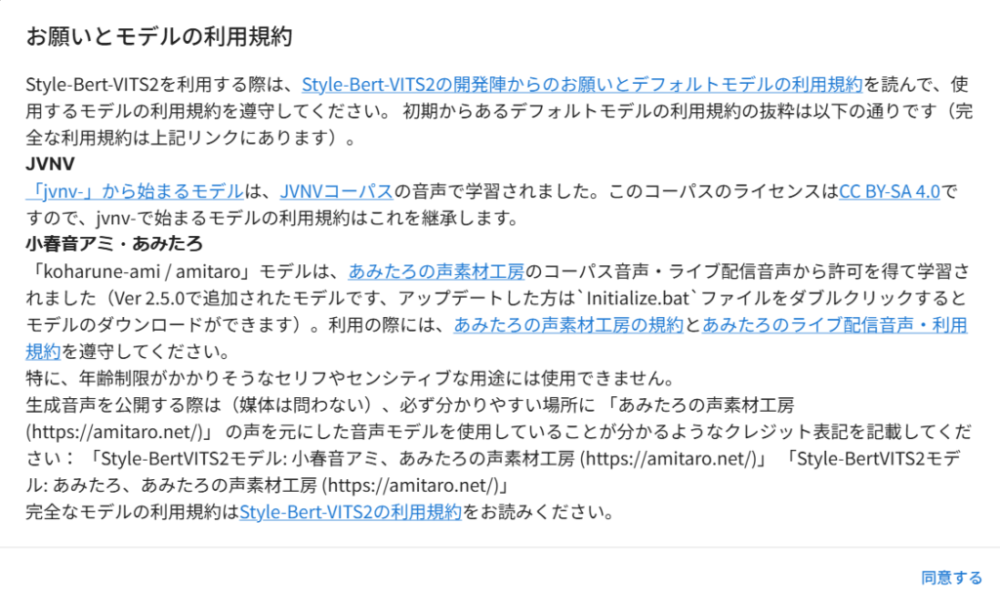
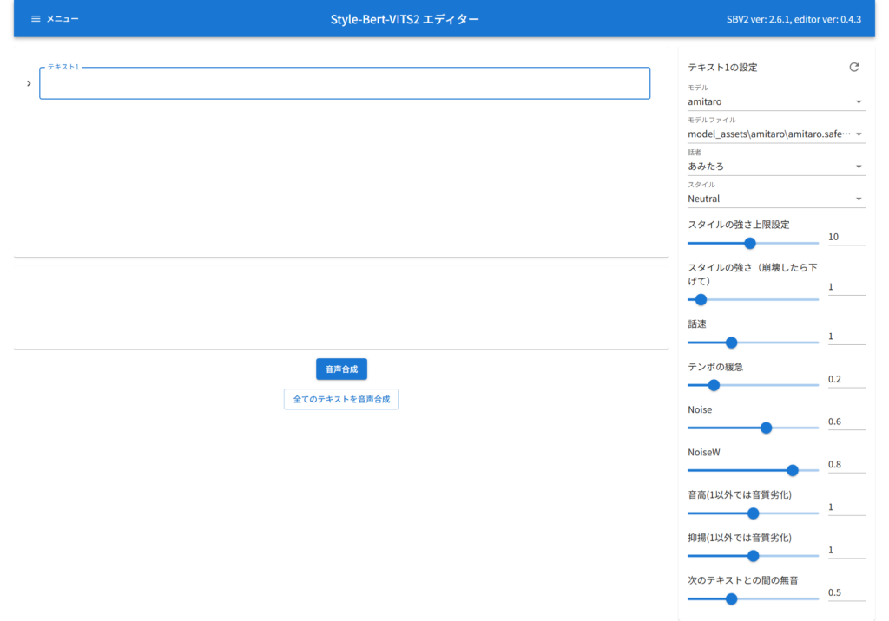
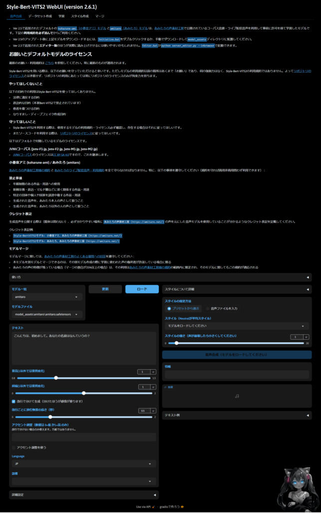
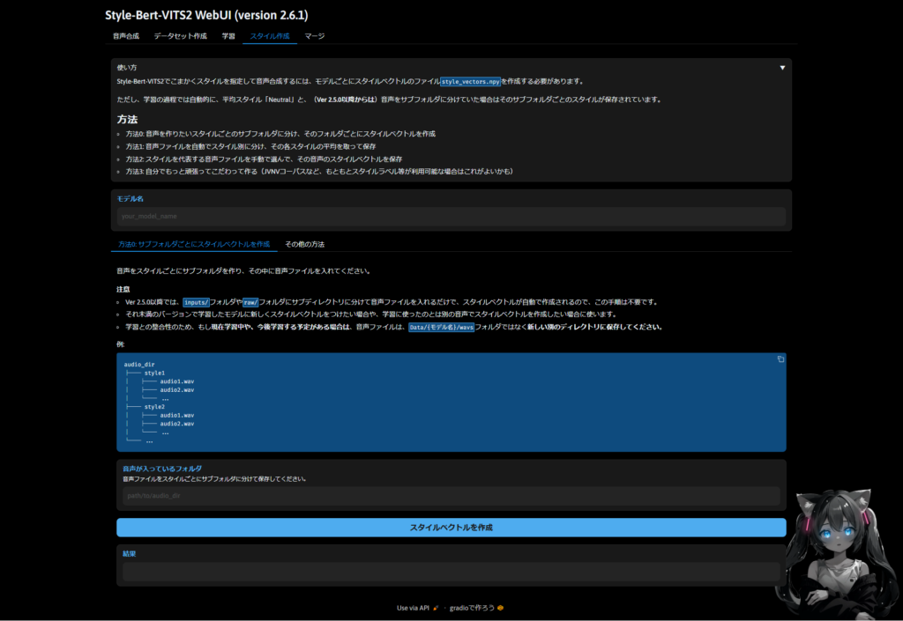
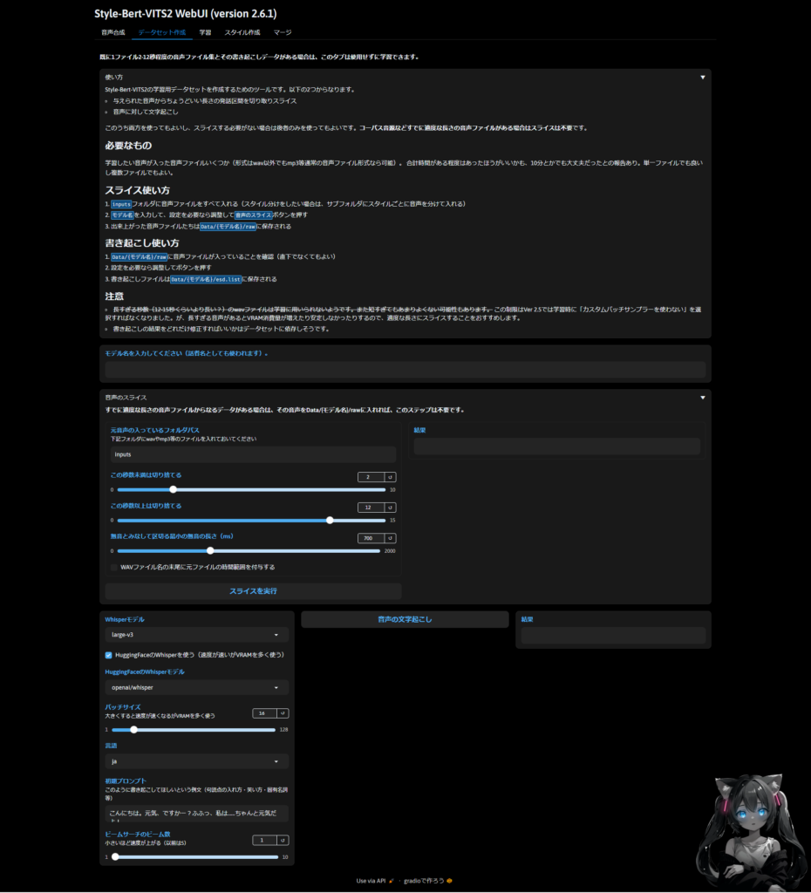
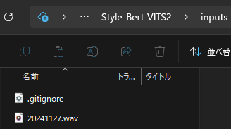
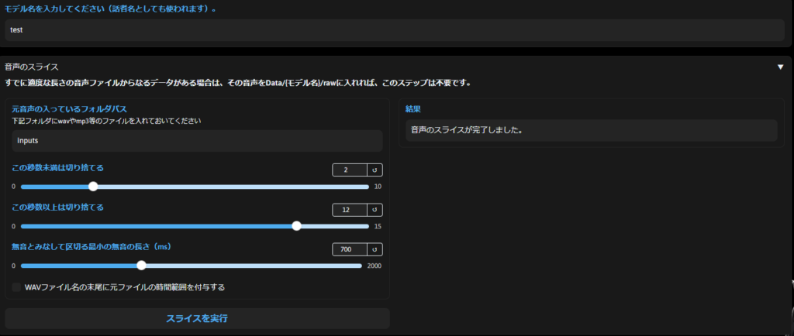
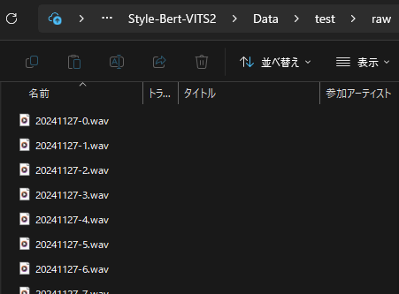

[前回](/posts/2024/11/ai-voice-synthesis-aivisspeech-review/)Aivis Speechを触ってみたので自身の音声合成モデルを作ってみたいなと思い調べてみました！StyleBertVITS2は音声合成がメインになると思います。他にも学習やデータセットの作成もできます。というわけでStyleBertVITS2を使っていきます！

## StyleBertVITS2のインストール

というわけでまずはStyleBertVITS2のインストールからですね。基本的には[Github](https://github.com/litagin02/Style-Bert-VITS2)に載ってますのでその通りで問題ないと思います。

ただ、私は仮想環境作るのが面倒なタイプでpythonのversion別(3.10と3.12)でしか管理してないのでそれに合わせたコマンド使用しています。プロジェクトが複数存在しないのであれば、使わなくていいかなと思う派です。思想は人それぞれなので。

```
# 各種ライブラリのインストール
git clone https://github.com/litagin02/Style-Bert-VITS2.git
cd Style-Bert-VITS2
py -3.10 -m pip install "torch<2.4" "torchaudio<2.4" --index-url https://download.pytorch.org/whl/cu118
py -3.10 -m pip install -r requirements.txt
# モデルのダウンロード
py -3.10 initialize.py
# エディター画面の表示
py -3.10 server_editor.py --inbrowser
または
py -3.10 app.py
```

### StyleBertVITS2\_server\_editor.pyの実行

server\_editor.pyを実行した場合は以下のような画面になります。その前に利用規約に同意しましょう。特に性的や政治的、フェイク系はやめましょうという感じですね。





この辺は音声合成モデルを使用するという感じですね。やってることはAivis Speechと同じような感じだと思います。

### StyleBertVITS2\_app.pyの実行

こちらではモデルの作成などは出来なさそうなので、もう一方のプログラムを実行してみます。app.pyのほうですね。



こちらであればデータセット作成、モデルの学習、マージもできそうなのでこっちを使ってみます。

### スタイルの作成方法

まずはスタイルの作成をする必要がありますがデータが必要になります。必要なデータは1時間ほどあれば十分だと思いますが、数十分でもできそうな気はしています。試してないので何とも言えませんが…

もし10秒程度のwavファイルが360個ほどあれば十分なのでその時はスタイルの作成を行ってください。説明にもありますが、Dataフォルダとは別で配置しておくとスタイルの管理も楽なので別フォルダを作っておくと良いかもしれません。1スタイルなら適当な配置でもよさそうです。



### wavファイルの準備

次はデータセットがない場合ですね。もし自身の声を使用しない場合はどこからかwavファイルをダウンロードする必要があります。状況によっては環境音や音楽を削除するなどの対応も必要かと思います。ただ、今回は自身の声で作成する想定なのでこの工程は省きます。

もし、細かい音声データを大量には持ってないけど、数十分~1時間のwavファイルがある場合はデータセットの作成を行いましょう。



### データセットの作成

まずはinputフォルダにデータを入れます。録音などの環境がまだ整ってないので一旦前回使用したwavファイルを使ってみます。



次はモデル名を決めましょう。私はまだ本格的にやらないので適当に"test"にしました。秒数の設定などは一旦デフォルトにしています。この辺は好きなように設定すると良いです。"成功すればスライスが完了しました。"というメッセージが出て所定のフォルダに出力されます。



大体10秒近くの音声ファイルが出力されます。これでスタイル作成の準備が整ったのでスタイル作成をして学習という流れになります。



### 終わりに

ここまで書いてきましたが、私の方でまだデータの準備ができていません。

一人で話して録音する分には問題ないです。ただ、マイクがゴミだったのでまともなマイクを使って収録したいと思います。

それから原稿ですね。大体1分間で300文字想定として1時間なので1万8千字くらいを用意したほうがよさそうですね。スタイル自体は読み方や抑揚の問題なので、現行は1つで何とかなりそうです。

原稿はまだ何とかなりそうですが、問題は収録ですね。細かく分ければよいですが、1時間ほど同じテンションでしゃべり続けるのは大変そうです。またスタイルを複数作ると考えるとさらに時間がかかりそうですし…

というわけで今回はここまでにします。次回はモデルの作成までをやっていきたいと思います。ではでは。
