## マグナとふしぎな少女の概要

少し前にネットで話題になった[記事](https://newscast.jp/news/7802776)で流行りすぎて授業中もプレイする事態になり、一時的に公開停止になったゲームです。

マグナとふしぎな少女は[こちら](https://magna.mintflag.com/)から確認できます。[Android版](https://play.google.com/store/apps/details?id=com.mintflag.magna&hl=ja)と[Apple版](https://apps.apple.com/jp/app/ai%E3%81%88%E3%81%84%E3%81%94-%E3%83%9E%E3%82%B0%E3%83%8A%E3%81%A8%E3%81%B5%E3%81%97%E3%81%8E%E3%81%AE%E5%B0%91%E5%A5%B3/id1112371684)もあります。

### マグナとふしぎな少女\_ゲームの流れ

割と遊んだのでその感想を書いていこうと思います。スタート画面はこんな感じ。

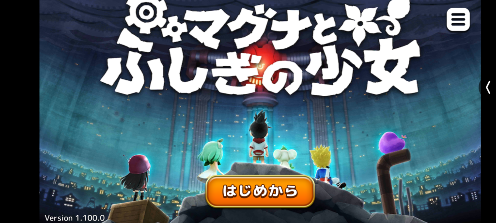

最初はロードがありますので少し待つ必要があります。その間英語で遊べます。ただ、この間は簡単な英語のみですね。

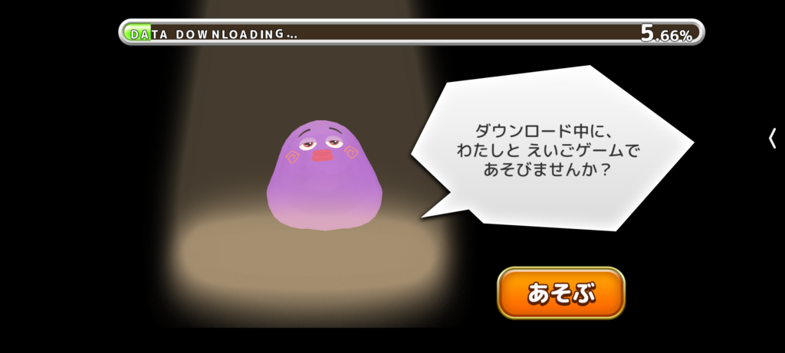

まずはストーリーですね。スキップしても大丈夫だと思います。私はしっかりと見る派ですが。

一応内容としては劇場の中で展開されます。見てる側は劇風ですが、実際に起こっているのは劇ではないという感じでしょうか？内容はそこまで難しくありません。基本小学生がプレイするものですから。とは言え大人でも楽しめる部分はあると思います。

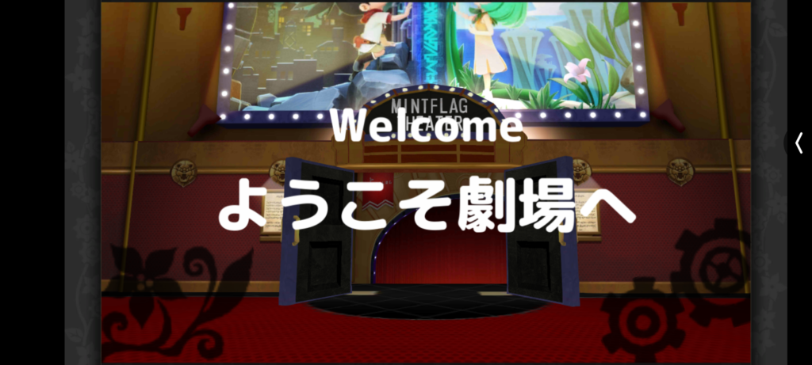

少し驚いたのは利用規約やプライバシーポリシーですね。子供でも分かるような説明になっていて読みやすいなと思いました。もちろん下の方に硬い文章もついています。読んでる人がどれくらいいるかはわかりませんが凄い配慮だと思いました。

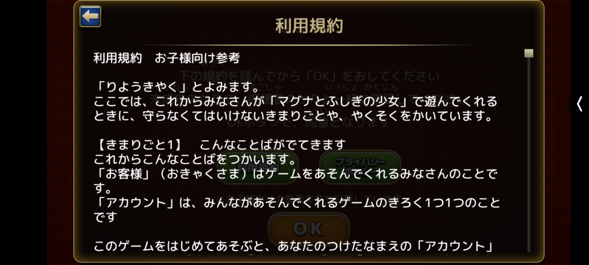

### マグナとふしぎな少女\_ストーリーとバトル

アバターとプロフィール画面が出来たら始まりですね！ストーリー画面はこんな感じ。ここからやれることがどんどん増えてきますが、まずはストーリーを進めましょう。初めのうちはハートを消費しないのでサクサク進めることができます。

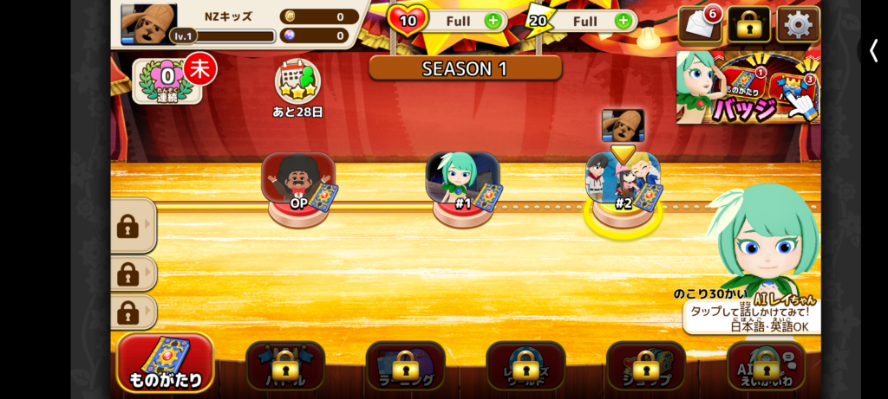

ストーリーのローディング中はARで劇場を見回すモードになります。これも飽きさせない手法の一つですね。毎回席が変わって楽しいですよ

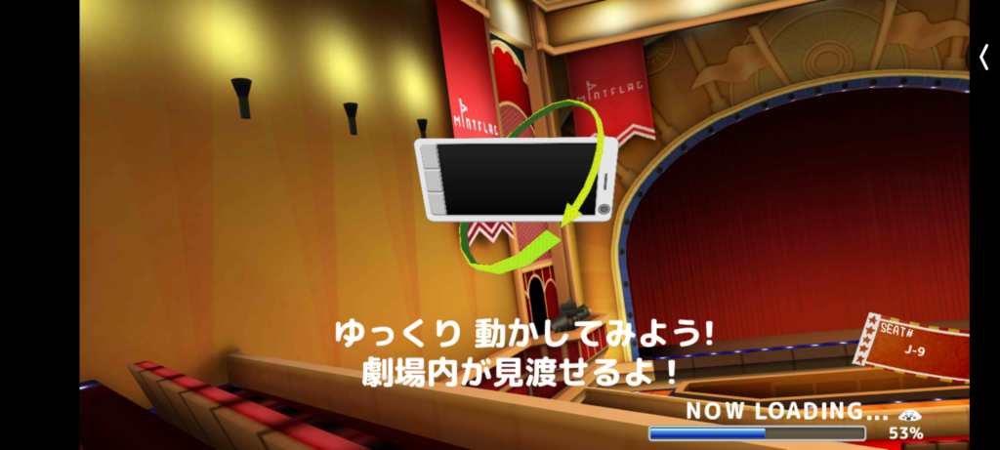

一通りやったらバトルの説明に入ります。方法はシンプルでエネルギーを支払ってレジェンド(キャラクター)の召喚やスキル(スペル)を実行します。パネルをフィールドに移動させるだけでできます。スキルの実行には発音が必要になります。スコアで威力が変わったりしないので、成功を目指しましょう。

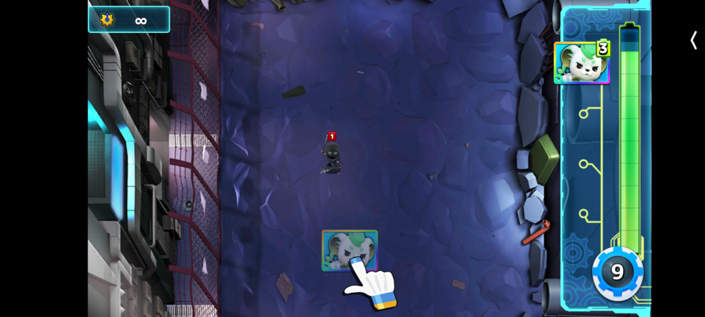

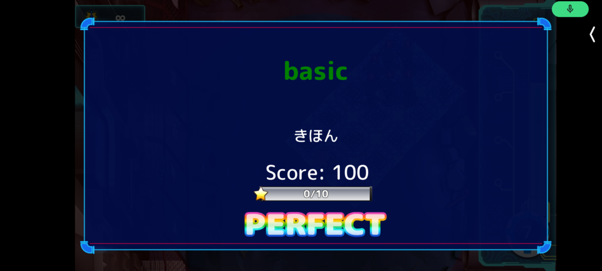

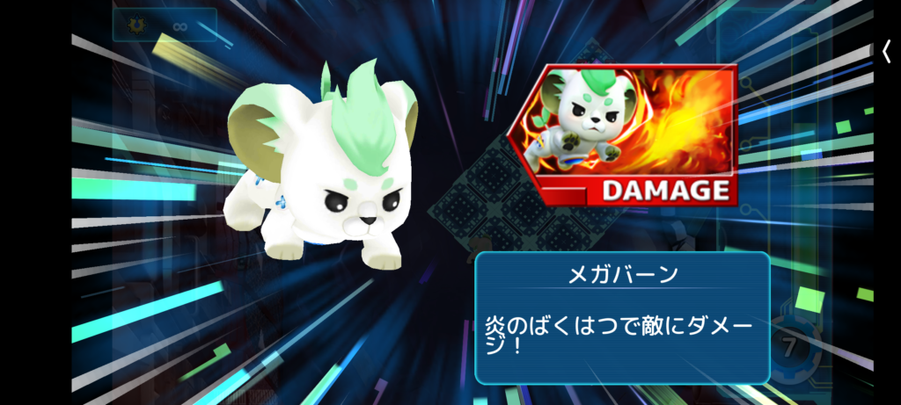

スペルのスコアが影響してくるのはマナの獲得数ですね。ただ、そこまで影響は大きくないので気にしなくても大丈夫です。

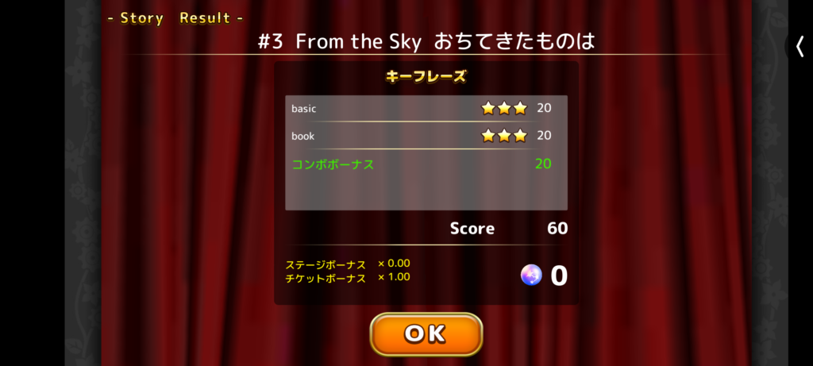

物語はストーリー部分、クイズ、バトル、ラーニングミッションで構成されています。クイズはシナリオで出てきた発音や英訳を喋ります。シナリオが進んでいくと日本語訳の選択問題も出てきますので、ストーリーの把握をしておくと楽になります。

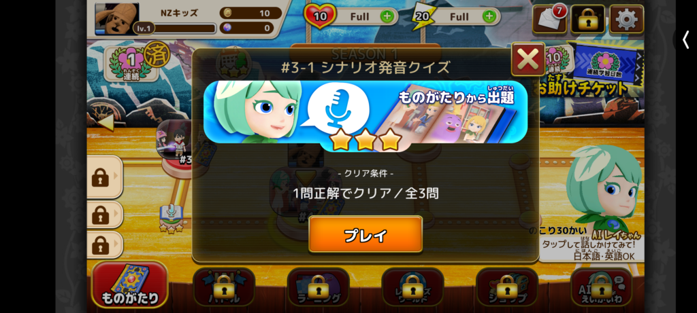

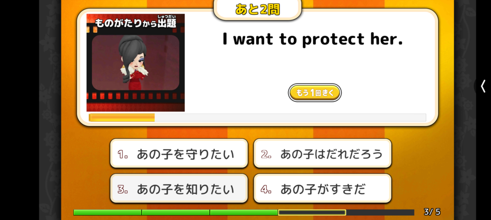

### 英語の学習

ある程度進むとラーニングが解放されます。ここでは英語の学習を進めていきます。項目は聞く、話す、読む、書くですね。

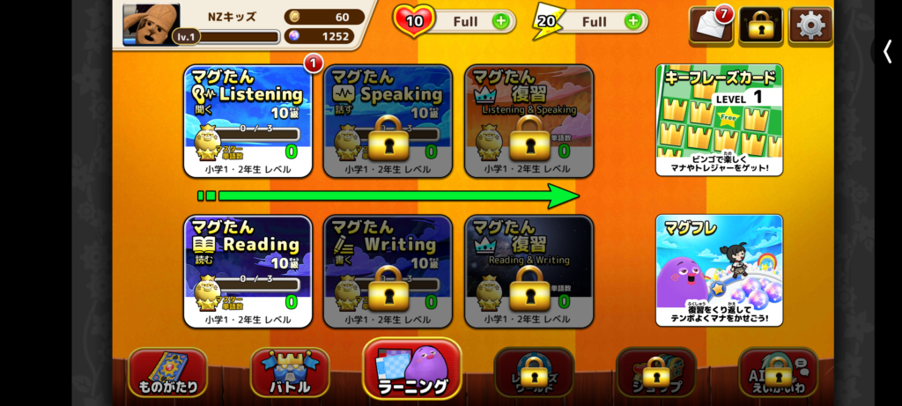

基本的には普通に進めていけばいいんですが、フィーバータイムや2倍チャレンジがあります。クリアするとマナがボーナスでもらえるので、是非ともクリアしたいですね。

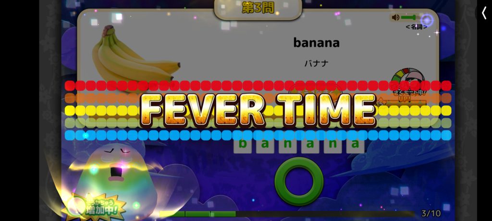

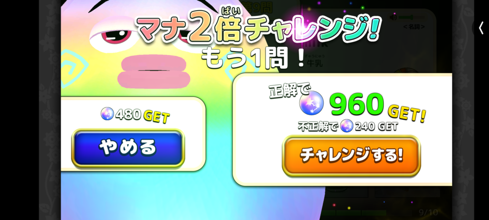

### AIと会話

AIレイちゃんと会話をすることができます。制限はあるものの自由に会話ができます。会話をすることでマナを獲得もできます、少しですが…

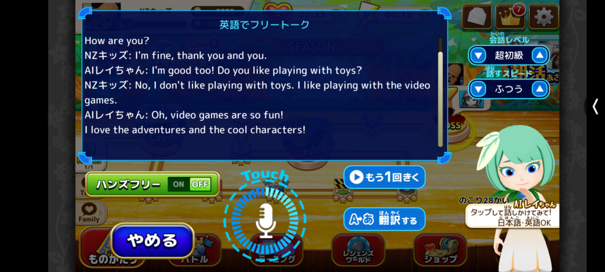

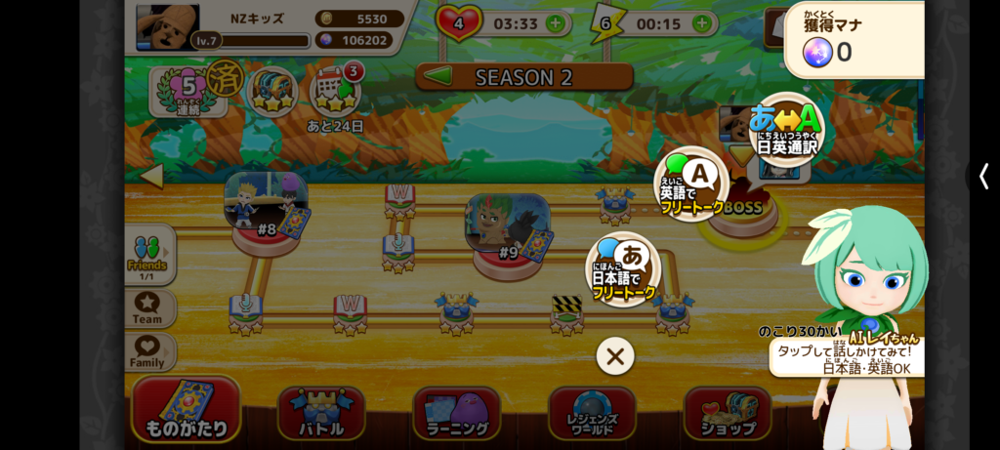

### その他の要素

それから毎日やることもあります。デイリーミッションと動画でガチャが無料で回せます。レジェンド強化のために欠かさずやると良いですね。

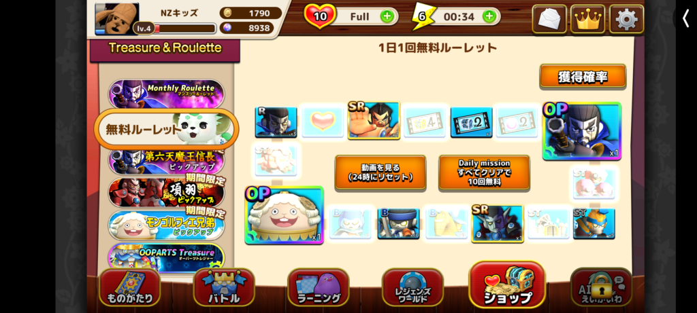

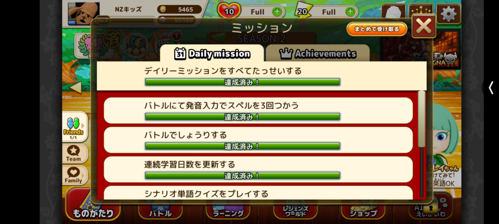

最後にやれることは編成と強化と探索系、ガチャですね。探索系はレジェンドなどのカードがもらえます。運要素も多少絡んできますが。ただ、トレジャーハントは10章から、チャレンジは13章から解放されますので早めに進めちゃいましょう。

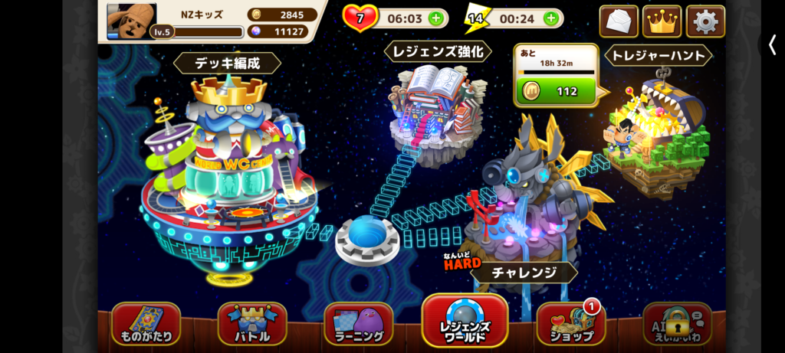

ガチャはありますが、ゲーム内コインのみで出来ます。課金要素はないので札束で殴るというのは出来なさそうですね。基本シナリオボーナスのガチャと確定のみでいい気がします。マナが余ればその10連もいいかもしれませんが。

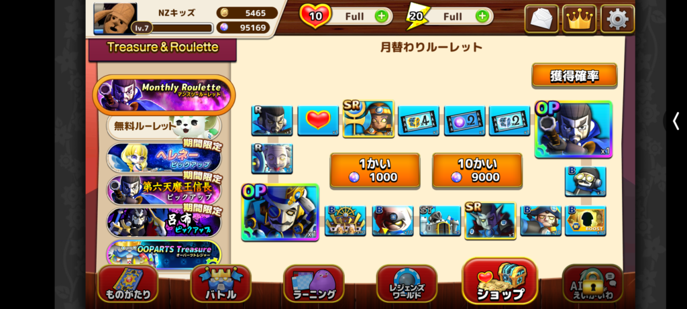

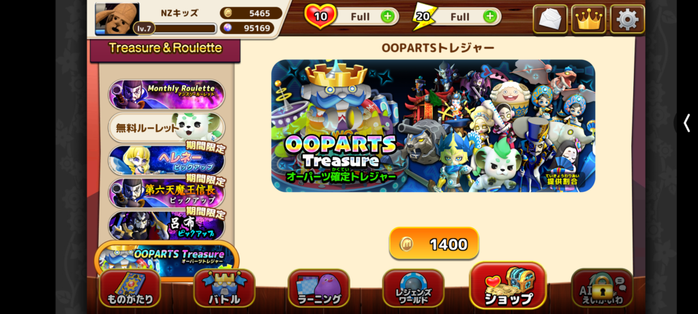

ざっくりとシステム的な部分はこれで以上になりますね。ここから先は個人の感想を書いていきます。

### 個人的な感想

まずはストーリーですが内容はわかりやすいものになってます。小学生向けなので当然と言えばそうですが、大人には物足りない人もいるかもしれません。ただ、感動する部分もあるので大人でも楽しめるかなと思います。

それからラーニングの部分ですね。これは大人にとっては不満が出やすい部分かなと思いました。聞く、話す、読む、書くがありますが、1単語で4回登場します。同じ単語を4回もやるのは人によって苦痛に感じるかもしれません。

ただ、何度も行ってますが、メインは小学生なのでこのくらいしっかりやっていいと思います。これくらいやればある程度覚えますので。一応サクサクモードがありますが、4回やるのは変わらないので諦めて頑張りましょう！

色んなフレーズを学んでますが、これが日常的な英会話で咄嗟に出るかは不安ですね。後は実戦あるのみですかね？

### ハマりそうな要因

さて最初の話題で出した流行りすぎて授業中もやることになり、一時停止があったことについて考えてみたいと思います。

このゲームはもちろんフレンド申請があります。ただ、基本的には身近にいる人がメインになると思います。コードとQRコードがありますからね。

小学生は自慢したがるのでこの英語知ってる？というのもありますし、ガチャでレジェンドの自慢もあると思います。ガチャをするためには英語を勉強しなければならない。レジェンドと英語の両方自慢ができるいいシステムだなと思います。

また、協力して敵を倒すイベントがあります。これもハマる理由になりそうです。頑張れば友達から尊敬されたりしますからね。ただ、気になるのは辞めたいと感じたときに辞めにくいとこですかね。同調圧力が発揮されそうですし…

もう一つスタミナやエネルギーの回復速度ですね。スタミナは10分に1つでmax10個、エネルギーは1分に1つでmax20個となります。スタミナは物語やイベント、エネルギーはラーニングに使います。ここでもったいない病が発動するとついついやりがちです。

### 終わりに

というわけで私も引き続き遊んでいきたいと思います。今はシーズン2までやってるので割と楽しめてます。最高のデッキを組むのも楽しいですし。

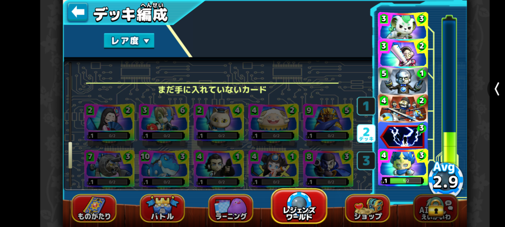

個人的には今このパーティがいい感じですね。エジソンのエナジー溜めが最初にできれば割と楽になりますね。ただ、空中の敵が多い分には苦戦するのでもう少し改良の余地ありますね。ではでは。
