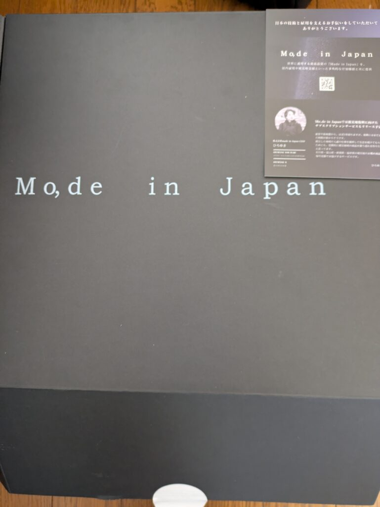
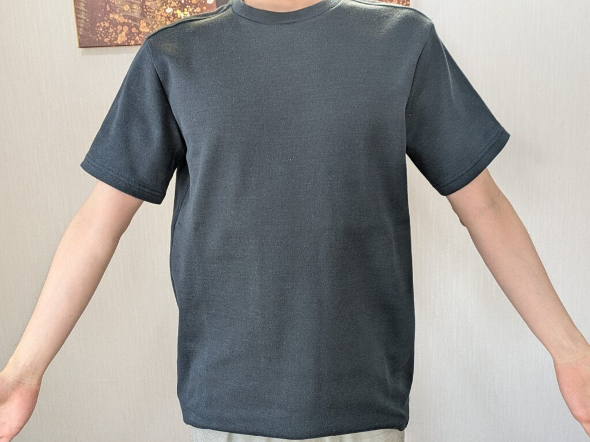
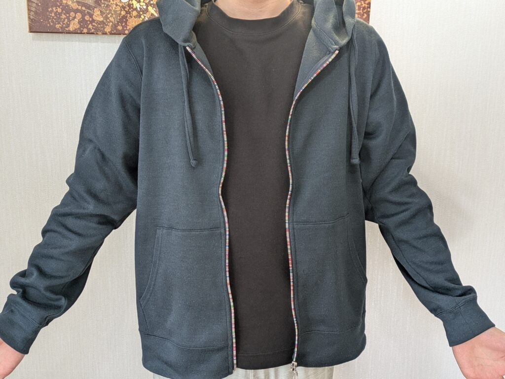
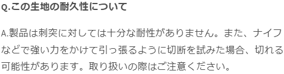
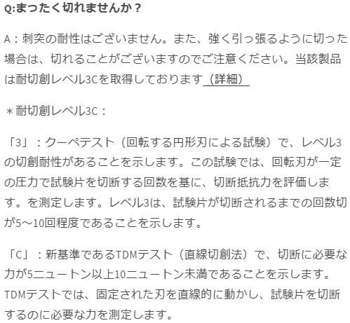

2024/12/16日に[株式会社made in japan](https://shop.modein.jp/)から切れない燃えない服が発売されました。[リアルタイム](https://www.youtube.com/watch?v=2bzLdUt7Xdo)では見てないですが、終了後に見て気になったので買ってみした！

### ModeinJapanブランド購入のきっかけ

買った理由は気になったのもありますが、海外へ行く予定なのと日本も少し物騒になったのが理由ですね。本当はこのような商品がなくても安全な国であればいいんですが…

ちなみに今はパーカー、長そでTシャツは全て売り切れて半袖Tシャツのみ残っています。気になった方はぜひ買ってみてください。余談ですがフルジップパーカーは1日で全て売り切れてました。さらにXLサイズは1時間ほどで売り切れてました。

届いたときはこんな感じ。スタイリッシュな箱で届きました。ブランド名の「Mo,de in Japan」の由来はわからないです。madeをもじってるのはわかるんですけど…

### 着心地

というわけで着てみました。私が注文したのは半袖TシャツのMとフルジップパーカーのMになります。私の身体情報は以下です。

- 身長：165cm

- 体重：51kg

- 男

パーカーの左上フード部分が光の当たり具合で変色してますが、気にしないでください。

着心地は良い方だと思います。全くごわごわしてません。素肌の上から来ても気にならないですね。私的にはですが。

難点である洗濯ですが、パーカーはまだしもTシャツは大変そうですね。夏場の汗で頻繁に洗濯する必要がありそうですし。その手間が面倒という意味ではパーカーのほうが楽かもしれません。ジップ部分の色合いは初めて見たので案外気に入ってます。

### 安全性

個人的に気になったのは身の安全面ですね。最近日本でも刺されるというニュースが良く出ている気がします。というわけで実際に試してみました。カッターを使って服を刺すという感じですね。

うん…穴が開いちゃいました…

これは確認しなかった私が悪いのですが、サイトにある[よくある質問](https://shop.modein.jp/pages/faq)を見てみると

刺突耐性はなかったみたいです。まあ切れない燃えないとは言ってましたが、刺さらないとはどこにも書いてないですからね…

とは言え他の服よりはちょっと破けにくいかもしれません。また引っ張りながらでないなら切れることはなさそうです。

### 終わりに

昨今の事件では**刺される**人が多いので、お守りぐらいの気持ちでよい気がします。切られることが全くないわけではないと思うので。

Tシャツに速攻で穴が開きましたが、見えにくい位置だったので海外でも使おうと思います。ちなみに普通に悲しんでます😿

他にもいろんな商品を扱うみたいですので、注目しつつ気になったものがあれば買ってみようと思います。海外に行っちゃいますが、日本に貢献できるのであればいいことですし。ではでは。
