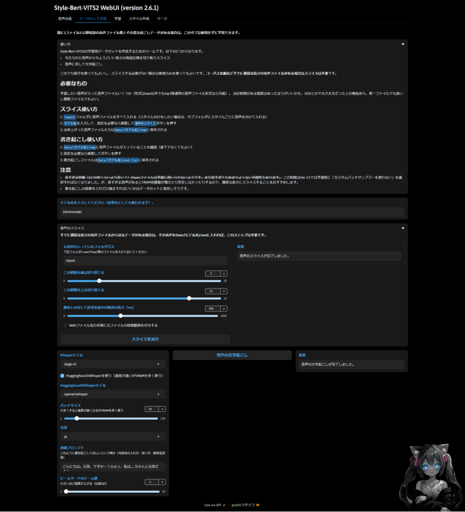
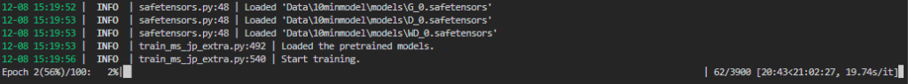
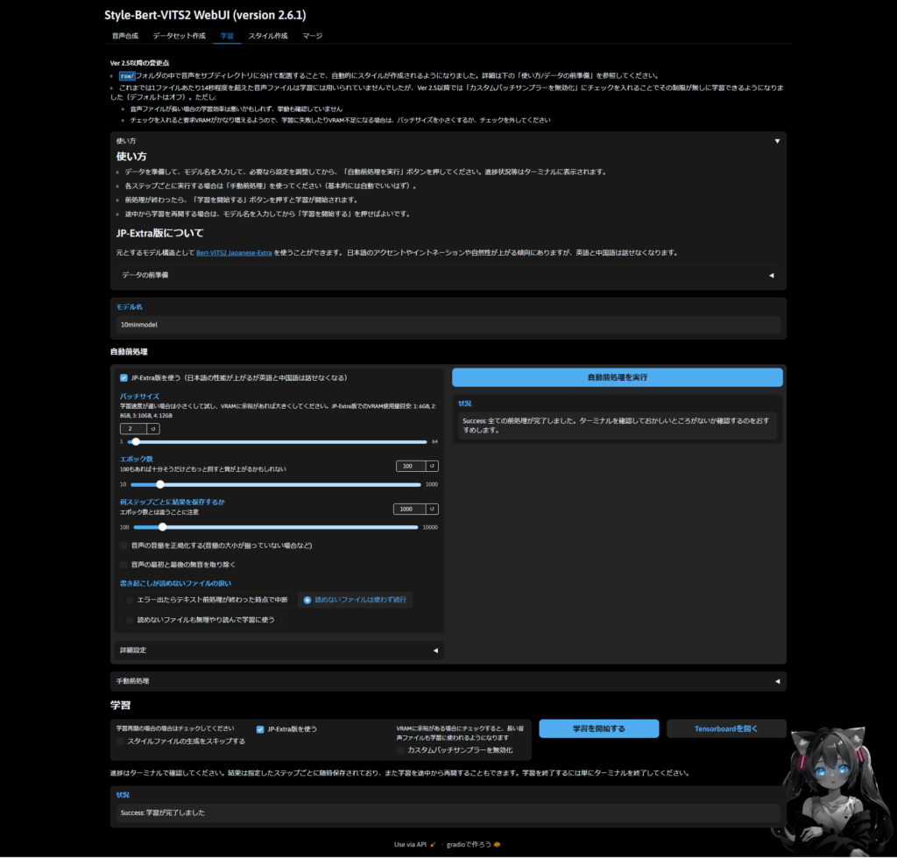
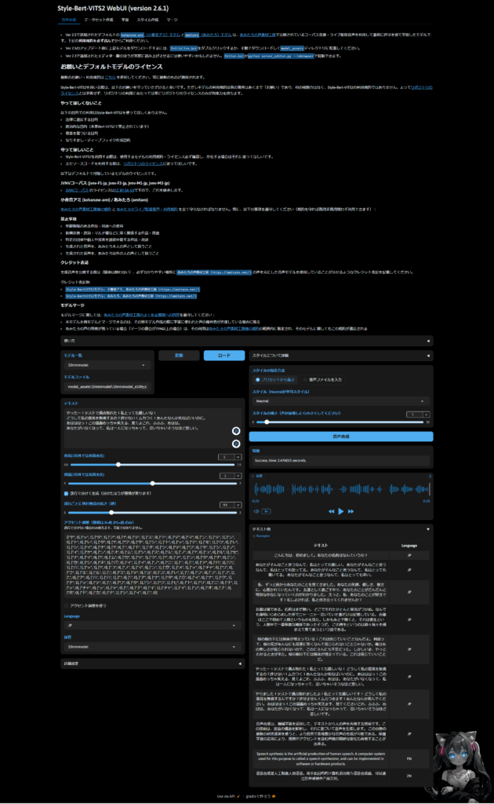

## 音声合成モデルの作成

[前回](/posts/2024/12/stylebertvits2-tutorial/)Style-Bert-VITS2を試しに使ってみることをやってみました。今回は実際にモデルを作ることをやろうと思います。

まずは音声の収録ですね。こちらに関しては自身でいろいろ試してみるしかないですね。とりあえずノイズキャンセリング付きや単一指向性マイクなどがいいかもしれません。後は収録時に詰まったり、変な発声になったりせず滑らかに読むことですね。無音は多少なっても大丈夫なので。

次に音声データセットの作成です。こちらは前回やったので飛ばします。収録した音声を勝手に10秒程度に切り分けてくれますので。

### 文字おこし時のエラー対処

私は文字おこしで以下のエラーが出たので"pip install tf-keras"で対処しました。

```
RuntimeError: Failed to import transformers.models.whisper.modeling_tf_whisper because of the following error (look up to see its traceback):
Your currently installed version of Keras is Keras 3, but this is not yet supported in Transformers. Please install the backwards-compatible tf-keras package with `pip install tf-keras`.
. エラーメッセージが空の場合、何も問題がない可能性があるので、書き起こしファイルをチェックして問題なければ無視してください。
```

その次はこのようなエラーが出ました。

```
site-packages\transformers\pipelines\audio_utils.py", line 37, in ffmpeg_read
    raise ValueError("ffmpeg was not found but is required to load audio files from filename") from error
ValueError: ffmpeg was not found but is required to load audio files from filename
```

その場合は以下の手順で対応しました。私はwindowsかつVS Codeなのでmacとかは別になります。Gitでクローンする方法でも大丈夫です。

1. [こ](https://ffmpeg.org/download.html)[こ](https://github.com/BtbN/FFmpeg-Builds/releases)からffmpeg-master-latest-win64-gpl.zipファイルをダウンロードして、解凍します。

3. ffmpeg-master-latest-win64-gpl/binを環境変数のPATHに追加する。

5. ターミナルまたはコマンドプロンプトからffmpeg -versionを実行し、バージョンの表示がされていることを確認する。

7. ffmpeg-pythonがなければpip install ffmpeg-pythonでライブラリのインストールを行う。

9. VS Codeを再起動する。

完了したら文字おこし成功のログが出ます。esd.listというファイルができているので、これが学習に必要なものになります。私は10分以上かかりました。PCの性能によってはもっとかかる場合があります。



### 学習前の前処理

学習をする際はまずは前処理を行います。基本的には自動前処理で問題ないですが、こだわりたい方は手動前処理で行ってください。一旦パラメータなどはデフォルトで行ってみます。こちらはすぐに完了すると思います。

ターミナルを見て異常がなければ大丈夫だと思います。私はwarningが出ていましたが、特に問題なさそうだったので次に進みます。ちなみに出ていたwarningは以下

```
ReproducibilityWarning: TensorFloat-32 (TF32) has been disabled as it might lead to reproducibility issues and lower accuracy.
It can be re-enabled by calling
   >>> import torch
   >>> torch.backends.cuda.matmul.allow_tf32 = True
   >>> torch.backends.cudnn.allow_tf32 = True
See https://github.com/pyannote/pyannote-audio/issues/1370 for more details.

  warnings.warn(

12-08 15:16:57 |WARNING | train.py:252 | Step 5: style_gen finished with stderr.
```

### 音声合成モデルの学習

前処理が完了したら学習を行いましょう。ターミナルで確認できるの気になるのであれば見てみると良いと思います。こんな感じ。エポック100で全ステップが3900まであるのでかなり長くかかると思います。想定時間は21時間で1ステップ約20秒くらいですね…



作成が完成したら次はスタイルの作成になります。ただ、ver2.5以降だと自動で作られるのでここはスキップします。"Style-Bert-VITS2\\model\_assets\\{モデル名}"の中にモデル、config.json、style\_vectors.npyが作られているか確認しましょう。



### 音声合成モデルを試す

完成したら音声合成を試してみましょう！テキストを書いても良いですし、面倒であれば右下からサンプルを選ぶことができます。ただし、JP-extra版であれば英語や中国語を話すことはできません。



### 終わりに

一応私の想定としてはAudibleとしての使い方を想定していたので、まあ悪くないかなぐらいですね。これをキャラクターとして使うのは向いてない感じです。感情表現のセリフをデータとして全く入れてないので。

ただ、読んで詰まったり微妙な場所があったので、もう少し修正できそうかなという気がしました。今後は修正版を作ってみたり、キャラクターとして使えるモデルを作ってみるのも面白そうですね。ではでは。
