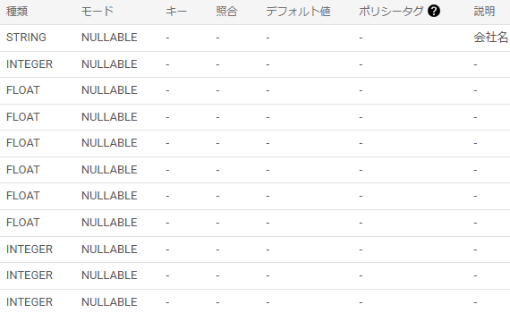
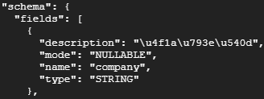
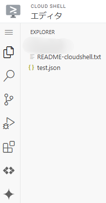
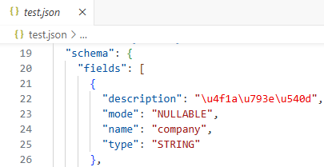
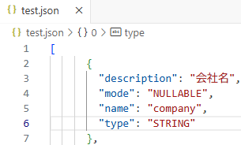

## bqコマンドを使ってカラム説明を一括入力

業務委託で[副業](/posts/2023/11/learning-gcp-for-freelance-project/)としてやっていた仕事の内、カラムに説明を追加するというタスクがありました。

今後非エンジニアの人も使えるようにするため、カラムの意味を把握する必要がありました。そこで説明欄を埋める必要があるという流れです。

ただ、一つ一つ手作業で埋めるのは手間なのでいい方法がないか探して試したやり方ですね。ということで[bqコマンド](https://cloud.google.com/bigquery/docs/managing-table-schemas?hl=ja&utm_source=chatgpt.com)を使用して進めてみます。

まずは埋めたいテーブルはこんな感じ。カラム名はさておき、説明が埋まってないという状況ですね。



### ターミナルでbqコマンド実行

まずはターミナルを開いて一旦テーブルの中を確認してみます。ターミナル自体は簡単に開けます。ここからですね。画像の左から2番目のアイコンから開けます。


コマンドは以下ですね。dataset\_idとtable\_idは任意で変えることになります。

```
bq show --format=prettyjson <dataset_id>.<table_id>
```

コマンドが実行されると人によっては承認が必要みたいです。承認しましょう。


### テーブル確認

ターミナルに以下のように表示されます。もし説明欄に入力していると文字化けのように見えます。ただ、文字化けではなくエスケープ表示にされてます。書き換えるときも日本語で入力しても問題ないので、今は無視して進めましょう。



特に問題なさそうであればこのスキーマをjsonファイルに書きましょう。コマンドはこんな感じ。

```
bq show --format=prettyjson <dataset_id>.<teble_id> > <file_name>.json
```

こうするとローカルのフォルダにjsonファイルが格納されます。コマンドを実行したらファイルを確認しましょう。ターミナルのエディタを開くから確認することができます。


中を開くと初期ファイルと作成したjsonファイルがあります。作成したjsonファイルを開いてみます。



ファイルを開くとターミナルで確認したような文字列があります。後は同じように説明を追加します。エスケープ表示ですが日本語に変更してみました。それからfieldsの中身のみが必要になります。\[\]の中身だけ取り出しましょう。





### bqコマンド\_カラムの説明欄更新

ではこのjsonファイルを使用してカラムの説明欄を更新してみます。コマンドは以下

```
bq update --source <file_name>.json <dateset_id>.<table_id>
```

更新が完了したら"successfully updated."と出るので確認してみましょう。特に問題なければこれで完了になります。


### 終わりに

当初はgcloud alphaというコマンドがあり、そちらを使おうと思ってました。

ただ、いいやり方が見つからず従来のbqコマンドとファイルの編集を利用したやり方を採用しました。

最近AIのニュースを見てはいたのですが、全く触ってないので何かやってみたいですね。ではでは。
