## Deepseekを試した背景

英語にカマかけてAIについてほぼ触れてこなかったのですが、Deepseekは割と盛り上がってるみたいなので触ってみました。

一応、o3が出ることやCursor、Browser Use(openAIが[operator](https://openai.com/index/introducing-operator/)を出してましたが…)があることは知っています。

ただ、開発をほぼやってなかったのでノータッチでしたが、今回は軽量で低コストでo1に匹敵するということで気になったので触ってみました。

とは言えDeepseekが中国産というのは知っています。どうしても不安がぬぐえない部分があったので、軽く調べて判断することにしました。

### AI検索エンジンの利用状況

さて、AI検索エンジンと言われて何を使ってますか？

[perplexity](https://www.perplexity.ai/)でしょうか？それともOpenAIのSearchGPT？あるいはGoogleのDeepResearchでしょうか？私が使っていたのは[felo](https://felo.ai/ja/search)になります。

feloは日本初のAI検索エンジンになります。無料でも使えますし、20個以上のソースから回答してくれます。有料になればさらに思考を深めて解答したり、マインドマップの生成も無限にできます。無料でも回数制限がありますが、使うことはできます。

### Deepseekのセキュリティについて

ということでDeepseekのセキュリティ系について聞いてみました。回答としてはこんな感じ。

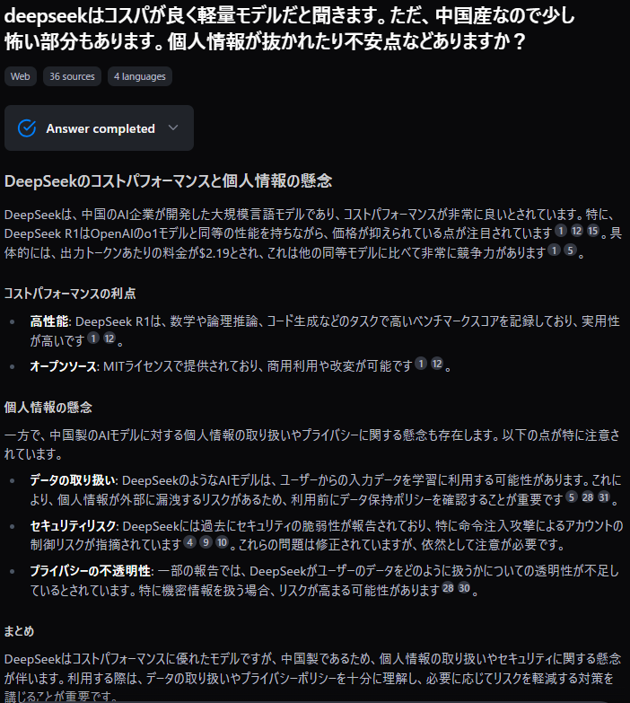

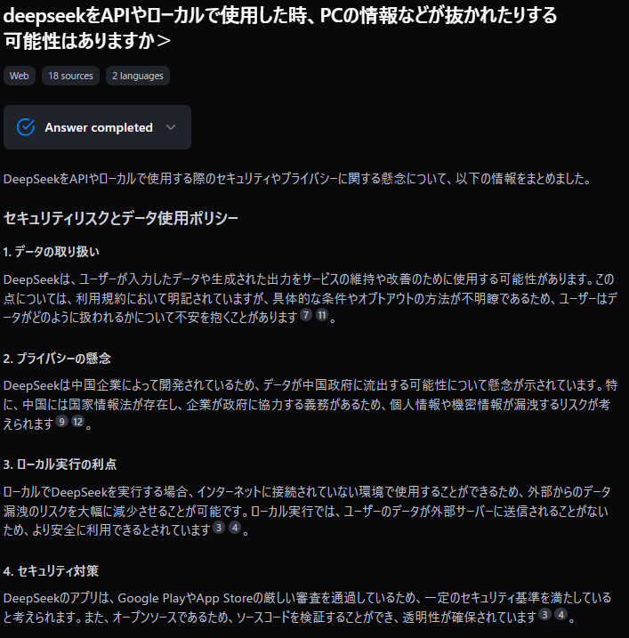

他のAIと同じく個人情報の取り扱いには気を付けたほうが良いが、そこ以外でデータが抜かれる可能性は低いよと解釈しました。一応ソース元を軽く見たりもしましたが、個人的に不安になるほどの内容はなかったので使ってみることにしました。

ただ、中国には国家情報法というものがあるんですね。これは知っておいてよかった気がします。今後中国産系のアプリやらサービスを使う場合はこの辺も気を付けたほうが良いとわかったので。後は中国の思想に寄ってることですね。特定の話はできないとか。とは言え日本独自だろうが米国独自だろうが多少なりともありそうな気はしてますが…

### AI検索エンジンとしての性能

というわけでまずは普通に使ってみます。web版ですね。まずは登録します。私はGoogleアカウントで登録しました。今回はコード支援ツールであるContinueとClineとcursorの違いについて聞いてみました。まずはfeloでdeepthinkあり。

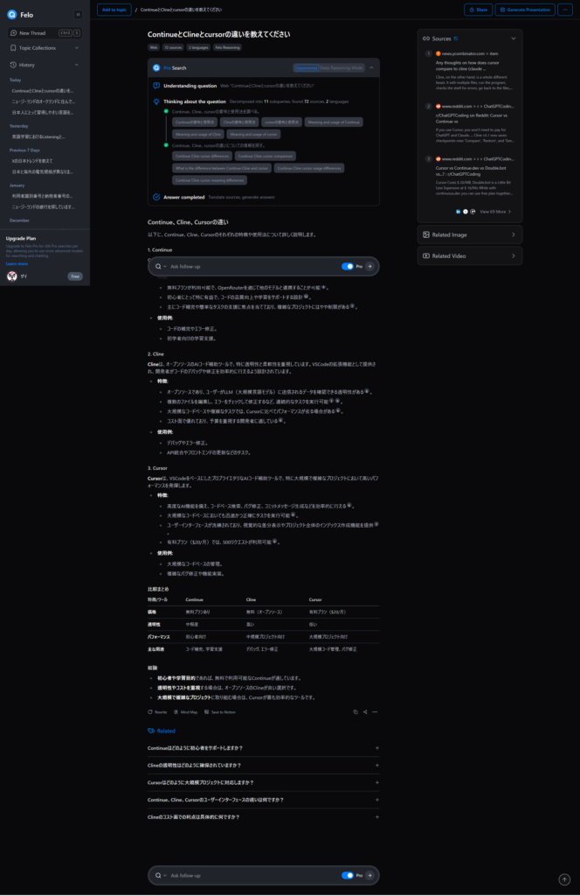

次はdeepseekですね。こちらも同様にdeepthinkありのsearch付きで。

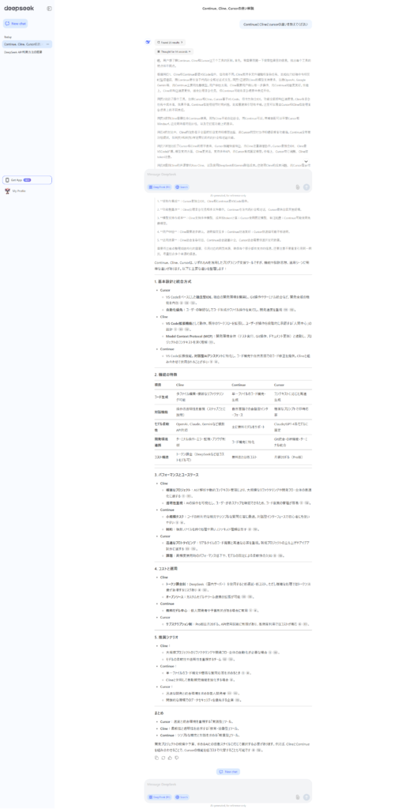

こちらもかなり細かく書かれています。feloはdeepthinkを使ったうえでの結果なので、普段の検索であればこちらでもよい気がします。feloのdeepthinkは無料だと回数制限があるので。ただ、マインドマップという利点があるので、使い分けできればよさそうです。

### Deepseekをコード支援ツールに導入

次はコード支援ツールへの導入ですね。一旦[continue](/posts/2024/09/github-copilot-vscode-continue/)に導入してみます。まずはapiキーの発行からですね。[ここ](https://platform.deepseek.com/usage)からプラットフォームへログインできます。apiキーの発行手順は簡単です。キーの値だけ忘れないようにしてください。

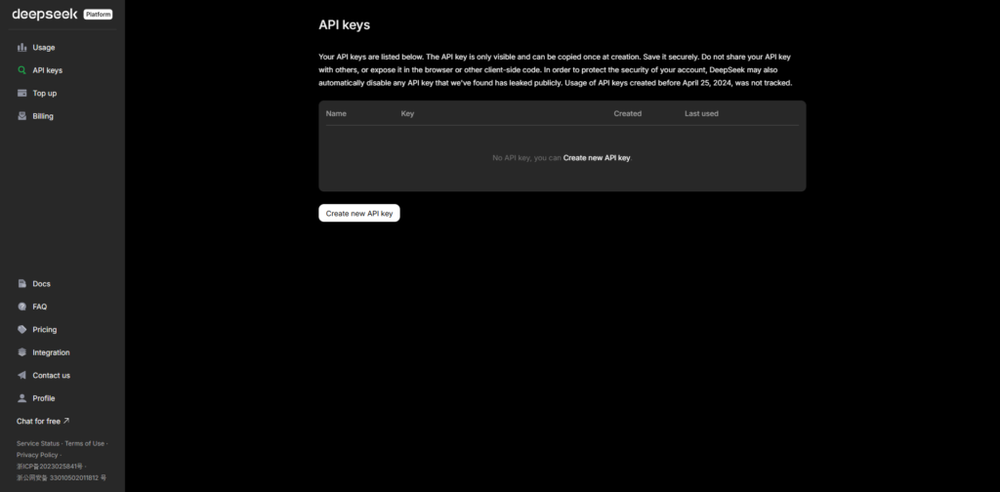

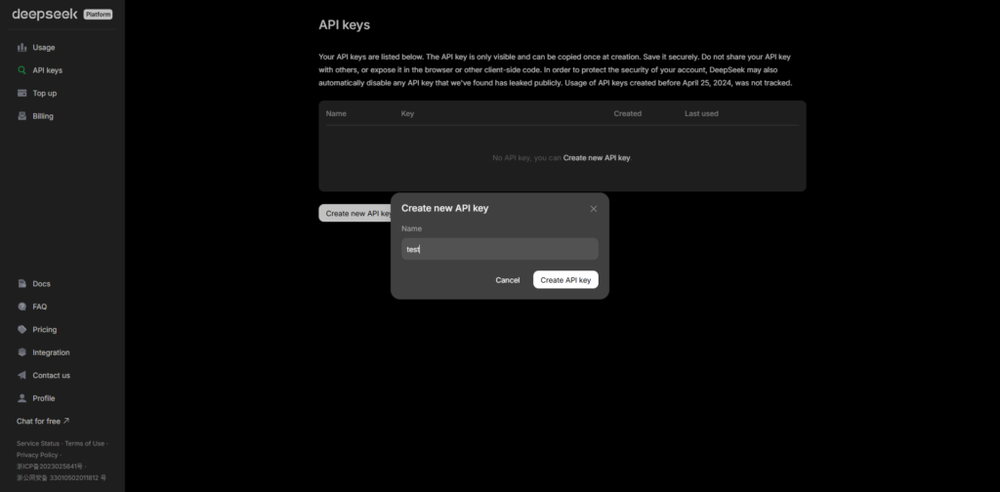

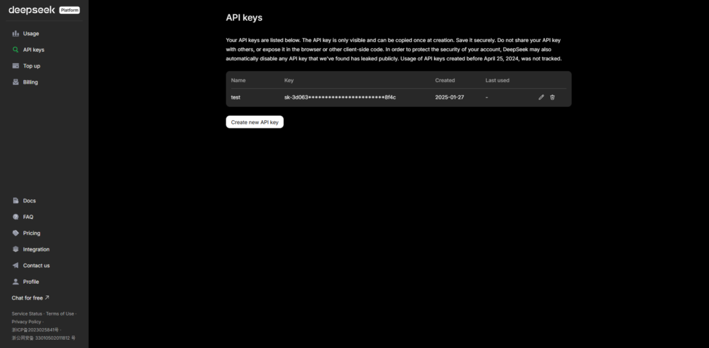

ちなみに中国国内であれば多少のトークンが付与されます。それ以外の人はクレジットカード、デビットカードまたはpaypalの設定が必要です。というわけでtop up(トークンのチャージ)をしたら使用してみましょう！こんな感じで確認できます。


ちなみに余談ですが**top up**という単語はよく目にします。カードに現金をチャージしたりするときもtop upが使われます。なので、覚えておくと海外旅行行った時も便利ですよ！

まずはcontinueに導入してみます。だいぶ昔にコード補完として入れてましたが、あまり使ってなかったですね。ということで入れてみます。

昔tabAutocompleteModelにstarcoder2:3bを使ってましたが、同じ書き方はできないので一旦コメントアウトしました。

Continueタブを開いて設定(歯車)からjsonファイルを開きます。そこにモデルとcompleteモデルの追加をすれば完了です。この設定は[ここ](https://note.weizwz.com/editor/vscode/vscode-deepseek)から引用してきました。

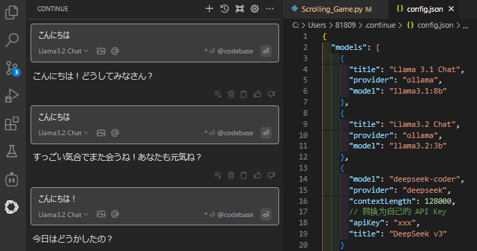

```
    {
      "model": "deepseek-coder",
      "provider": "deepseek",
      "contextLength": 128000,
      // 替换为自己的 API Key
      "apiKey": "xxx", 
      "title": "DeepSeek v3"
    }
  ],
  "tabAutocompleteModel": {
    "title": "DeepSeek Coder",
    "provider": "deepseek",
    "model": "deepseek-coder",
    // 之前遗漏了，这块加上apiKey后tab补全才会生效
    "apiKey": "xxx", 
  },
```

### **トークンのチャージ**

もし、アカウントにチャージがされていないとこんな感じのエラーが出ますので支払いを忘れずにしておきましょう。

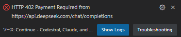

これでContinueでの設定は完了です。問題なければこんな感じで使えますし、オートコンプリートの補間もしてくれるようになります。

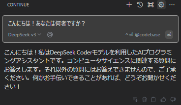

次はClineですね。私は使ったことがないんですが、本来はclaudeを使ったほうが全ての機能を開放できるんですよね。computer useって騒がれてましたがどこかで使ってみたいですね。早くopenAIのoperatorが使えるようになりたいです。

Clineはモデルとapiキーの設定だけで出来るので、シンプルでいいですね。それからplanとactで分かれてるんですね。これはモデルを切り替えればコスパよく開発を進めることができるということですかね？

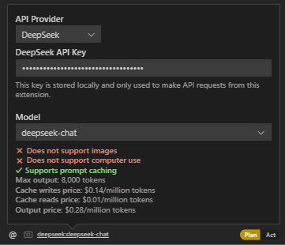

### 終わりに

今のところ開発をする予定がないので、これを有効に使う機会がないですがどこかで触ってみたいですね。何かやってみたいことがあれば作ってみようとは思います。ではでは。
