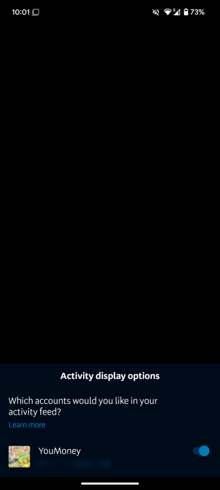
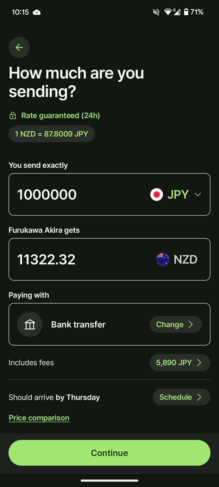
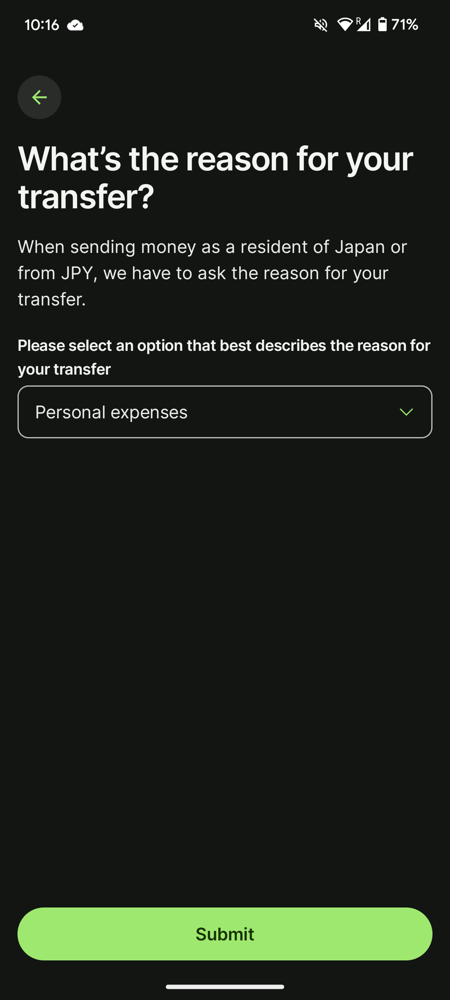
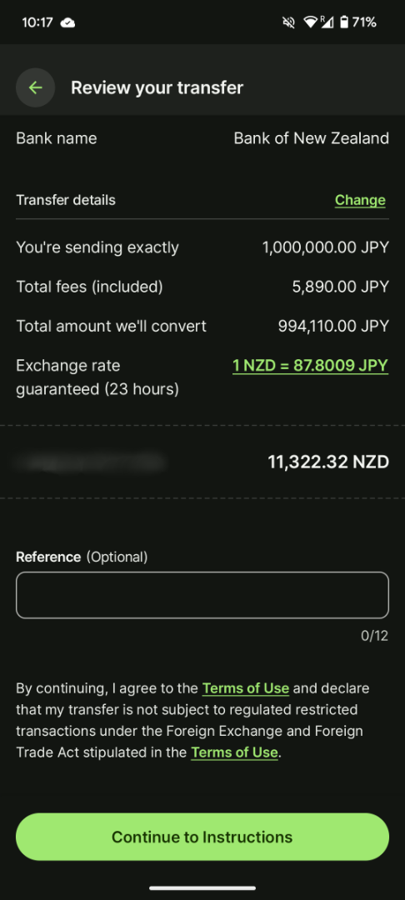
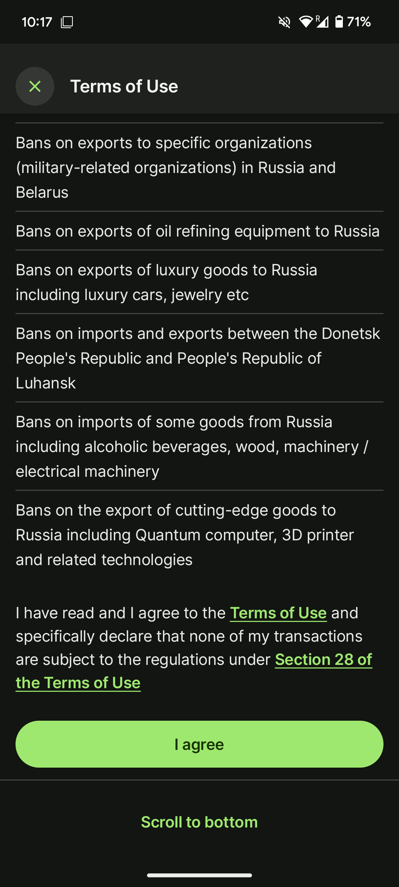
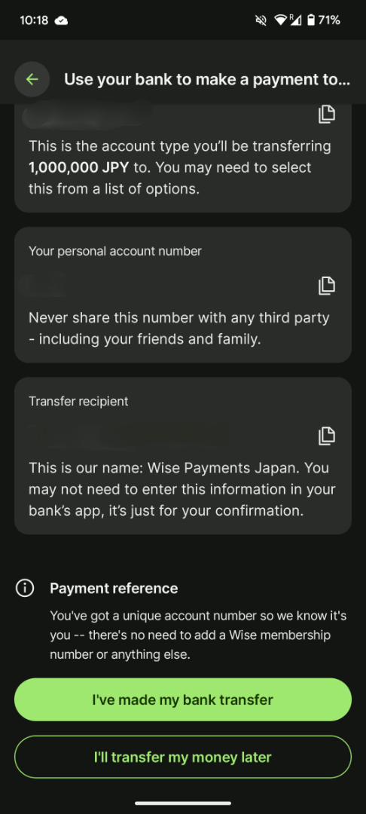

[国際線](/posts/2025/01/flight-to-new-zealand-and-first-day-at-lsi/)の乗り継ぎで苦労したのですが、こっちに来てからもいくつか苦労したので振り返ってみようと思います。

## 最近行った手続き

現状やったことは以下ですね。他にもまだまだやることは多いんですけど。

- AT HOP

- BNZの口座開設

- 国際送金手続き

### AT HOPカードの入手

もし、公共交通機関を使う場合は[AT HOP](https://at.govt.nz/bus-train-ferry/at-hop-card)があるとかなり便利ですね。

もちろんデビットなどのカードでも決済することはできます。ただ、このカードがあれば割引されたりします。特に学生やシニアであれば尚更ですね。1回1ドルくらいお得になるので是非ステータスは変えたいですね。

このAT HOPカードですが、買う場所は駅やコンビニでも買うことができます。私の場合は$55(4840円)で$50分のチャージを買いました。ただ、このままだとカードステータスが**Adult**なので**Student**に変える必要がありました。

変える場合はAT HOPのサイトに行ってアカウントを作成します。その後はカードを登録します。登録が完了したらカスタマーセンターに行く必要があります。

そこでカード、学生証を提示すれば変えてもらえます。学生証は語学学校に行けばもらえるはずなので受け取っておきましょう。

### BNZ口座開設

次はBNZの口座開設ですね。口座自体はどこでもいいと思いますが、私はBNZにしてみました。特に意味はないです…

私は[事前に開設の申し込み](https://www.bnz.co.nz/personal-banking/international/moving-to-new-zealand)をしておきました。Rapid Save口座は貯蓄用口座で年利3.75%ぐらいだったと思います。オプションなので必要であれば開設すると良いですね。私は証券口座だけでいいかなと思ってますが。

開設が完了できれば送金ができるようになります。ただ、支店で有効化しないと引き出せないので注意してください。

有効化する場合は口座番号の把握と、パスポート、住所証明が必要になります。口座番号は開設した後アプリを入れ、ログインすると把握しやすくなります。Activityタブから右上のボタンを押せば下部に表示されますね。

私の中で大変だったのは住所証明ですね。以前エージェントからホストの情報をPDFでもらったので、それを提出したのですがダメでした。

なので学校(私はLSI)に住所証明をもらうよう頼んでもらいました。それでようやく口座の有効化ができたという経緯になります。ただ、もし住所証明がなくても残高証明があればできるみたいです。NZDでないとダメですが…

### Wiseを使った国際送金

最後に国際送金ですね。私はWiseを使っています。こっちに来てアカウントを作ったのですが案外簡単に送金することができました。日本居住だとマイナンバーが必要になるので、住所を変えたら変更するようにしましょう。

まずは送金先の口座と送金元の口座の登録をする必要があります。ただ、それ以外にパスポートや住所証明などの登録も必要なので、口座の有効化とともに忘れずやると楽ですね。証明自体は写真でOKなので紙の場合は撮影すれば問題ありません。

一通り登録が終わったら実際に送金してみましょう。全ての画面はお見せ出来ませんが、ある程度似たように進めてみます。まずはどのくらい送金するかですね。どの通貨で送金できるか設定できるので決めましょう。

#### wiseでの送金手順

次は目的ですね。なぜ送金するかですが、基本的にはpersonal expensesでいい気がします。

次は確認ですね。送金元の口座、送金先の口座、送金金額と手数料などの確認ですね。特に問題なければ進めていきましょう。

次は制約の確認ですね。特に問題なければ進みましょう。指定された地域に送らないでくださいなどが書かれています。

最後に送信する口座が表示されます。一旦この口座に送金したい金額を入れます。そうするとwise側で送金してくれます。最初は不安かもしれないので少額で試してみると良いです。問題なければ額を大きくしてやりましょう。多く送れば手数料も減るので。

### 終わりに

これで以上ですね。あちこち行ったり、wiseでは地域の設定を変えたりしたので苦戦しました。これを日中に行わないといけないと考えると仕事中は難しそうですね…ではでは。
