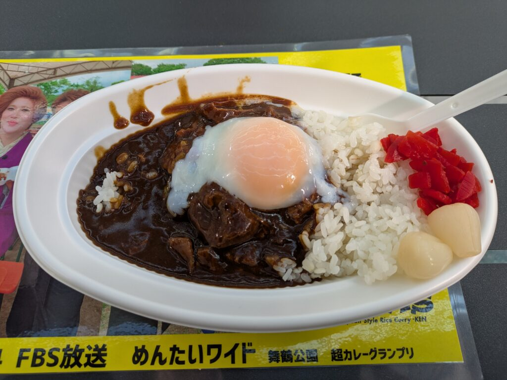
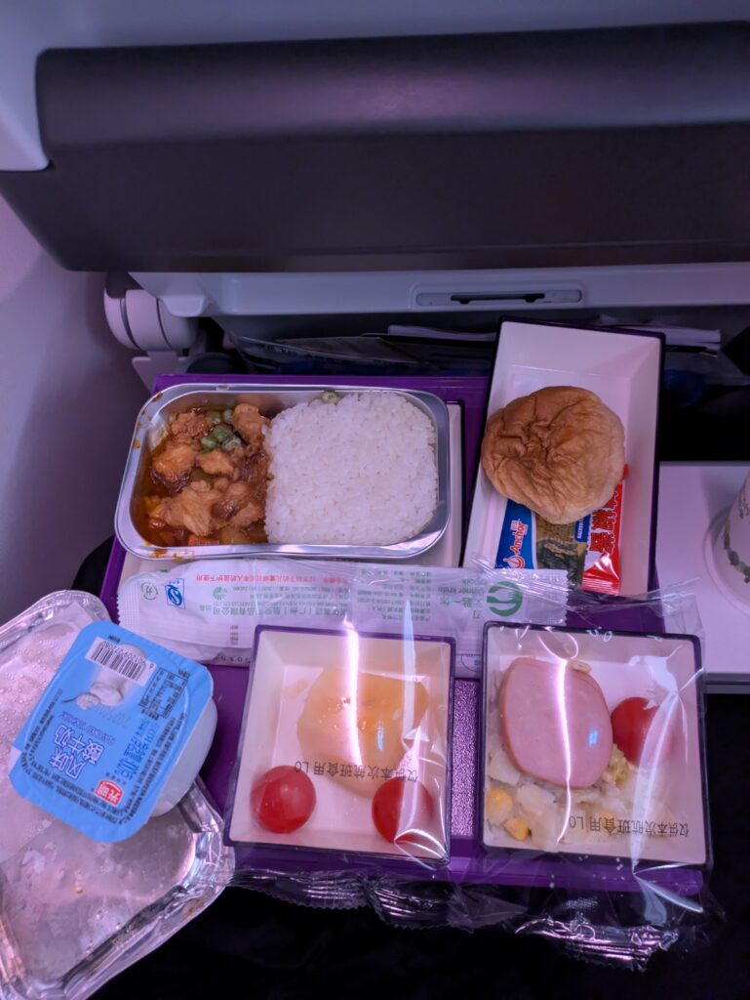
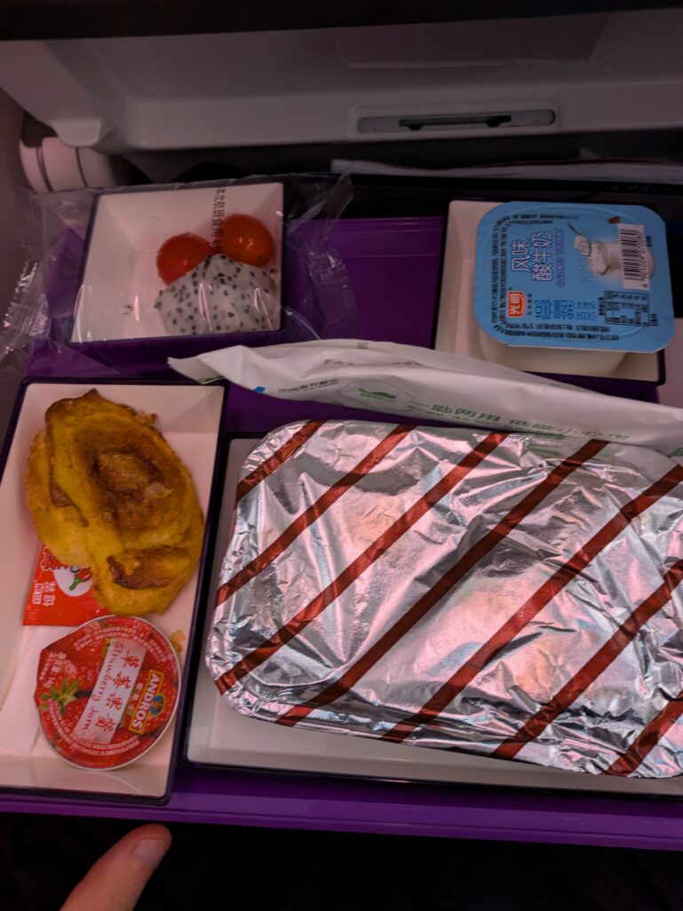
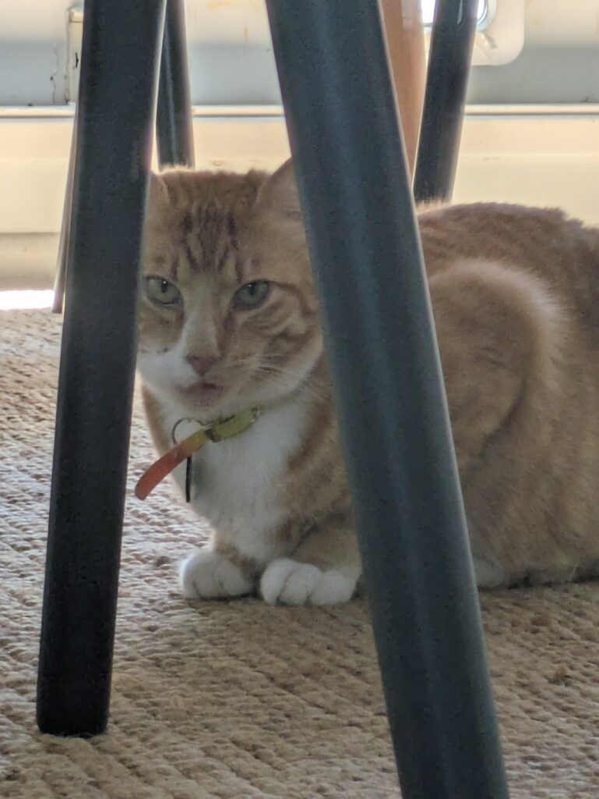

## 国際線の出来事とLSI初日

[前回](/posts/2025/01/fukuoka-trip-before-moving-abroad/)記事の投稿に時間が空きましたが、ニュージーランドに向かっていたので投稿が遅くなりました…

国際線やLSI初日で経験してわかったこともあるのでいくつか書いてみようと思います。これは飛行機に乗る前の食事で美味しかったです。程よく牛肉がとろけて味もしっかりついていて今度は現地で食べたいですね。

### 国際線を使って中国でのトランジット

私が飛行機に乗ったのが2025/01/10になります。まずは国際線で広州(中国)へ向かいました。ただ、乗る前の重量制限で引っかかりました。20kgまでだったのですが、多少オーバーして3000円払うことになりました。手荷物のほうに一部動かしていれば問題なかったんですけど。フライト自体は大体4時間くらいかかりました。乗った時は特に何事もなく到着しました。

ただ、中国に到着した時が大変でした。最初に感じたのはカメラの数がかなり多いなということです。もちろん他の国でもカメラは存在しますが、1m間隔くらいであった気がします。中国にもファミマがあったのは知らなかったですね。特に利用はしてないですが。

後は親切かわからないぼったくりですね。到着したのが第一ターミナルで出発するのが第二ターミナルでした。第二ターミナルは第一ターミナルから離れていて、シャトルバスか電車、タクシーで向かう必要があります。

何もわかってなかったのでどうしようか悩んでいたところに話しかけた方がいました。そのままのこのこ着いていってタクシーに乗っちゃいました。

さらに現金はニュージーランドドルしか持っていませんでした。払うときに相手もどのくらい必要かわかってなかったので、60NZD払う羽目になりました。日本円だと5400円くらいですね…勉強代として今後同じ目に合わないように気を付けます。

### 国際線でオーストラリアまでの乗り継ぎ

次は中国からシドニー(オーストラリア)に向かいます。そういえばチェックインの時にシドニーと言って通じなかった気がします。オーストラリアは通じるみたいですが、知識さは人によるかもしれません。

それから検査場が独特でした。広い空間でありますが、検査する場所自体は壁で区切られていて狭さを感じました。他の国だとあまり見なさそうな雰囲気ではありましたね。

#### 飛行機内の出来事

最後に飛行機に乗り込んだ時ですね。R64Aという書かれ方をしていましたが、Rの除いた文字がシート番号になってました。なんでRがついてるのか不思議です…

自分の席を見つけたとき、中国人が私の席に座ってました。2席占領しているようなイメージですね。念のため後ろの人に席が合ってるか聞いてみて、合ってたので声をかけてどいてもらいました。不機嫌そうでしたが、他人の席なのでやめてほしいですね…

ここで9時間のフライトが待っています。私はずっと座りっぱなしだったので、エコノミー症候群にならないよう頻繁に足を動かしてました。そのうえ寝れなかったので、かなりしんどい状況になりました。機内食はまあまあの味です。

国際線でオーストラリアに着いて目的を訪ねられました。ただ、私のチケットはスルーバゲージ対応のチケットみたいでした。つまり機内荷物は次の飛行機に運んでもらえるということです。というわけでトランジットの検査場に行き、検査が終わって出発ゲートに向かいました。

ただ、トランジットチケットの場合は出発ゲートで国際線の航空券と変えてもらう必要があります。受付の人に名前を呼ばれてたので、何かと思ったら航空券取得の処理が必要だったみたいです。

### 国際線を使用してオークランド到着

それ以降は特に何事もなく進み、オークランドに到着。送迎オプションがあったので迎えがいたのでそのままホストファミリーの家に向かいました。知らない人かつ言語もあまり通じない状況なので不安でしたが、かなり親切にしてもらいました。

ちなみに今の私は相手の言ってることの30%ぐらいしか理解できてません（笑）知ってる単語をピックアップして、そこから状況を連想して理解するようにしています。よくわかってなくても大体"Yeah!"や"Oh"と言って笑顔で乗り切ってます。質問されてわからなかったら再度聞き直す流れですね。

もう一つ話すときは大体言葉が出てこないですね。日本語としてこう言いたいけど、該当する英語がすぐに出てこないという状況ですね。日本語でも稀にありますが、英語だとこんなにも出てこないんだなと実感しました。調べると割と知ってる単語だったりするんですが…

### LSIでの学習

そして[LSI](https://www.lsi.edu/jp/%E8%AA%9E%E5%AD%A6%E5%AD%A6%E6%A0%A1/%E3%83%8B%E3%83%A5%E3%83%BC%E3%82%B8%E3%83%BC%E3%83%A9%E3%83%B3%E3%83%89%E7%95%99%E5%AD%A6/%E3%82%AA%E3%83%BC%E3%82%AF%E3%83%A9%E3%83%B3%E3%83%89%E7%95%99%E5%AD%A6%E3%81%A7%E8%8B%B1%E8%AA%9E%E8%AA%9E%E5%AD%A6%E7%A0%94%E4%BF%AE)初日になります。最初はリスニング、スピーキング、文法のテストですね。Level2(初級)からのスタートになりました。段階としてはLevel1~6まであります。Level3スタートだろう！とか思って自惚れてましたが、頑張っていきたいと思います。

オリエンテーション後はLessonに参加して解散になりました。人によっては午後もありますが、私は水曜と木曜に参加することになってます。一般英語の20なら午前中のみ、24なら一部午後、30ならフルコマという感じです。

アクティビティややってみたいこともあったので24にしました。留学の目的は英語力の向上ですが、友達を作ったり経験することも大事だと考えているので。もし英語に自信があれば資格やビジネスに特化したコースでもいいと思います。

### 終わりに

そんなこんなで特に友達を作ることもなく帰宅して今に至ります。まだまだやることは山積みですが、少しずつ消化してNZ生活を満喫していきたいと思います。ではでは。

おまけでホストファミリーの猫です。めっちゃ可愛い！顔を掻いてほしくて寄ってきます。私は猫専用孫の手として1か月間頑張らせていただきます！

