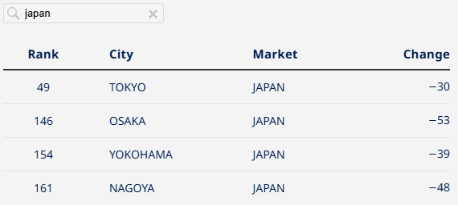
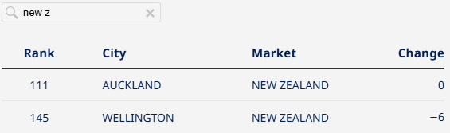
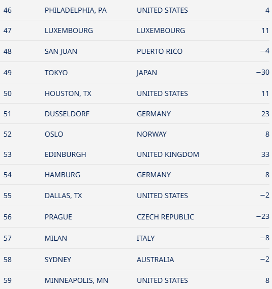
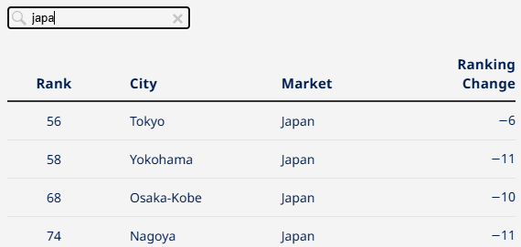
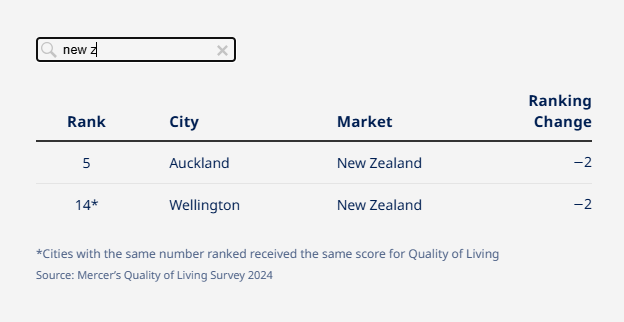
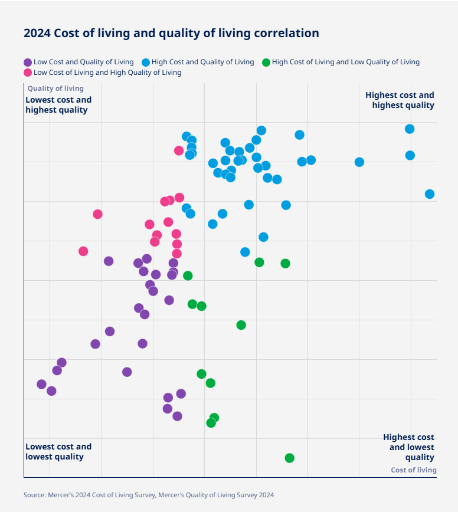
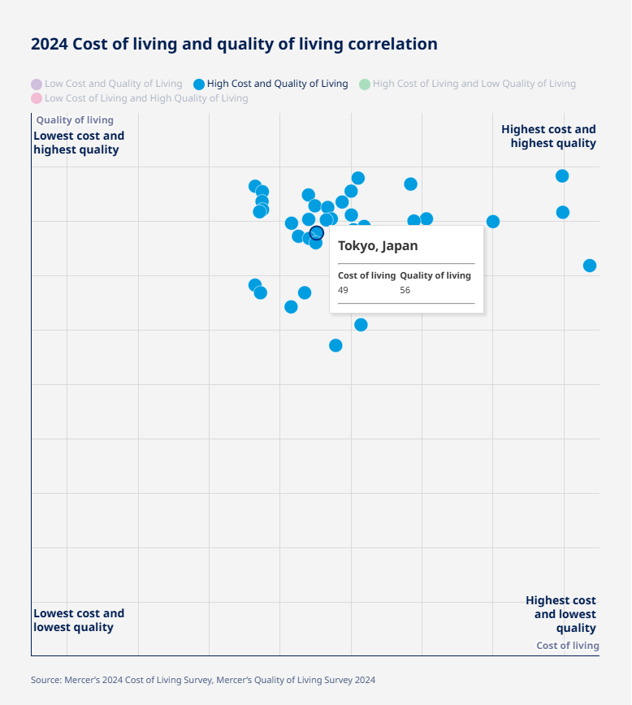
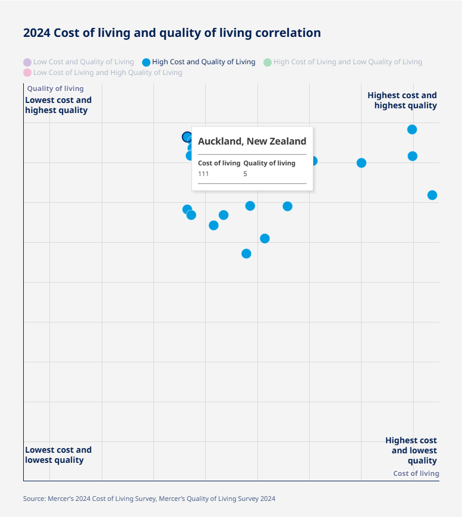

## 生活費について\_日本やニュージーランド

ニュージーランド(以下NZ)の[サイト](https://www.naumainz.studywithnewzealand.govt.nz/)を見ているときに気になったページがありました。それは生活費に関するページですね、[こちら](https://www.naumainz.studywithnewzealand.govt.nz/studying-in-nz/before-your-arrival/cost-of-living)です。

ここではNZの生活費について書かれています。生活に関わる食料や電気、衣服から娯楽までざっくりと書かれています。

そしてこのサイトの中で気になったのがMercerの[生活費調査](https://www.mercer.com/ja-jp/insights/total-rewards/talent-mobility-insights/cost-of-living/)ですね。Mercerは色んなことを調査し、それを基に企業へコンサルティングを行っています。

### 生活費調査\_Mercer

その中でレポートを出しているものがあります。その一つが生活費調査ですね。ちなみに言語は日本語に設定できますので変えて読むことをおすすめします。

生活費の指標としては物価、光熱費、教育費、住民税、地価などが関わってきます。

ざっくりと見るとアジアの一部、北米、ヨーロッパ当たりが高いですね。アフリカは低めになってます。まあこの辺は感覚でもわかる部分ですね。

#### 生活費\_日本のランキング

それでは日本はどうなのか？ということでランキングの中を見てみます。日本だけに絞ってみるとこんな感じになりました。

東京は高めでそれ以外の都市はあまり変わらないですね。地方だともう少し下がるイメージですかね？ただ、全体的にランキングは下がっています。インフレしてますが他の都市より緩やかみたいです。

#### 生活費\_NZのランキング

次に私が行くニュージーランドはこんな感じ。東京よりは低いけど他の都市よりは高いみたいです。ちなみにウェリントンが首都ですが、一番発展してるのはオークランドになります。

ちなみに東京と似たような生活費はこんな感じ。主にアメリカやヨーロッパの都市が入ってます。

生活費ランキングの下には価格が変わった項目の一部とインフレ率が出ています。ちなみに東京は卵やオリーブは割と上がっています。これを見るとつらい部分はあるなと感じます。

ただ、ブエノスアイレス(アルゼンチン)のハイパーインフレは異常な気もしますが…

### Mercerの生活環境調査

さて次は生活環境についてですね。[こちら](https://www.mercer.com/ja-jp/insights/total-rewards/talent-mobility-insights/quality-of-living-city-ranking/#city-ranking)で見ることができます。こちらの指標は生活水準の高さ、インフラ、教育、文化や医療が関わってきます。

#### 日本の生活環境調査

では日本の順位はどれくらいかというとこんな感じ。ランキング自体は下がってますが、高い方に位置してますね。医療に関しては負担も少ないですし、インフラや教育も高い水準だと思ってます。個人的にですが。

これを見ると東京以外なら割とよさそうですね。物価はそこそこで生活水準は高め。後は収入さえよければ言うことなしですね。

#### NZの生活環境調査

次はニュージーランドを見てみます。こんな感じ。こう見るとなかなかよさそうです。留学する身としては多少安心材料になります。物価は普通で生活水準は高め。悪くなさそうです。

最後に全体的に見たらどうなのかですね。いくら生活水準が高くても物価も高いなら微妙です。物価はそこそこから低めで生活水準が高い場所がよさそうですね。その表が下の方にあります。

日本とニュージーランドはここに位置しています。

ちなみに左上がベストだと思いますが、カナダのモントリオール、アジアや南米、ヨーロッパの一部がここにあります。興味があれば見てください。

### 調査結果や収入について

最後に注意しておきたい点も書いておきます。

そもそもこの調査は正確なのか？というとこですね。私は細かく見たわけではないのでわからないです。ただ、調査したデータが正しいのか？分析手法は正しいのか？というのは見たほうが良いですね。私は真に受けず参考程度にしようと思います。

それから収入や税金についてですね。最低賃金での比較や収入や購入に対する税金はどうか？を今回は比べてないですね。ニュージーランドやオーストラリア、カナダは2000円を超えてるので、そういった意味ではよいのかなと思います。

後は給料に対する税金、事業に対する税金、投資に対する税金を見比べて考えたほうが良いですね。いくら稼いでも税金取られてばかりだと悲しくなりますから…

というわけで生活費や生活水準の都市ランキングをみてました。興味があれば色んな都市を見てください。もし、英語ができるのであれば実際に住んで生活するとより日本の良さも見えてくると思います。他のデータも見比べてみたいと思いました。ではでは
