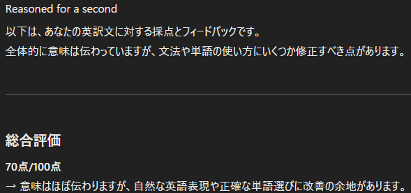

## 20250216\_Engilish\_fair

First, after waking up, I watched game commentary videos for about 30 minutes. During that time, I also played my daily LinkedIn game. The games were Tango and Queens.

Then, I did my workout. As usual, I completed 10 sets of burpees and 10 sets of planks, with each set consisting of 40 seconds of exercise followed by 20 seconds of rest. After finishing my workout, I took a shower.

### Saturday Breakfast

After my shower, I went shopping. I bought bananas, apples, yogurt, frozen berries, and a stainless steel bottle (which I purchased specifically for drinking protein shakes).

Later, for breakfast, I ate the bananas, frozen berries, and yogurt with a drizzle of honey. Normally, I have vanilla-flavored yogurt, but this time I chose a plain, low-calorie version.

### Work and Afterwards

After breakfast, I worked. I fixed some SQL code, then created a new branch from the repository and pushed it to GitHub. I also created a pull request and am now waiting for a review.

Later, since it was already evening, I had dinner – a meal I had pre-prepared on Thursday. It consisted of a Belarusian-style potato dish and a stew made with mushrooms, onions, carrots, and chicken.

Afterward, I studied English lightly while watching game commentary videos and then went to bed.

### 20250216\_What I Did on Sunday

The next day, I again woke up and watched videos for about 30 minutes. Then, just like the day before, I did my workout and took a shower. After the shower, I had breakfast—the same as yesterday.

Since I had no work on Sunday, I spent the day studying English. For example, I practiced phrases on a site called [plyaphrase.com](https://www.playphrase.me/), reviewing the top-ranked phrases that are commonly used in daily conversation. In the evening, while watching videos, I ate the same dinner as yesterday. After that, I drank a protein shake and took two creatine capsules.

## 20250216\_Engilish\_practice

First, I had watched playing video games for 30minutes after I woke up. While I was watching these, I played games of LinkedIn. Games are Tango and Queens.

After that, I worked out. I usually did 10 sets of burpees and planks. One Set is exercising 40 seconds and resting 20 seconds. I took a shower after I worked out.

### Saturday Breakfast

I went shopping after taking a shower. I bought bananas, appres, yogurt, frozen berrys, stainless bottle. I bought it to drink protein shaker.

After that, I ate breakfast a banana, frozen berrys, yogurt over honey. I had eaten yogurl tasty vanilla, but I bought it tasty natural light.

### Work and Afterwards

I worked after eating breakfast. I fixed SQL then, I made new branch from repository and pushed to git hub. I made pullrequest and I'm waiting for reviewing.

I ate dinner evening after working. I ate prepared meal on last Thursday. These meals are stewed dishes made of chicken, carrots, onions, masurooms and potato meals like Belarus.

After that, I slept after studying English while I was watching playing video games.

### 20250216\_What I Did on Sunday

Next day, I woke up and watched videos for 30minutes. After that, I worked out and took a shower as yesterday.

I ate breakfast after taking a shower. Breakfast is same yesterday's.

I studied English because I didn't have working. For Example I studied phrases about [playphrase.com](https://www.playphrase.me/) . I made sure phrases to use usual from ranking up.

I ate dinner as yesterday in evening while I was watching videos. So that, I drank protein shaker with two creatine capsules.

## 20250216\_[日本語版](/posts/2025/02/sailing-new-zealand-visit/)

まずは起きて30分ほどゲーム実況の動画を見てました。その間に日課であるLinkedInのゲームをやってました。ゲームはTangoとQueenです。

その後、筋トレをしました。いつも通りバーピーを10セット、プランクを10セット行いました。1セットは40秒間動いて、20秒間休憩を行っています。筋トレが終わったらシャワーを浴びました。

### 土曜の朝食

シャワーを浴びた後、買い物に行きました。買い物ではバナナ、リンゴ、ヨーグルト、冷凍ベリー、ステンレスボトルを買いました。ステンレスボトルはプロテインを飲むように買いました。

その後朝ご飯は買ってきたバナナ、冷凍ベリー、ヨーグルトにハチミツを掛けて食べました。ヨーグルトはバニラ味を食べてましたが、今回はプレーンのカロリーがカットされたものを買いました。

### 仕事とその後

朝食後は仕事をしていました。SQLの修正をした後、リポジトリから新しくブランチの作成をしてgit hubにプッシュしました。プルリクエストを作成してレビュー待ちです。

作業後は夕方だったので夕食を食べました。木曜に作っていた作り置きを食べました。ベラルーシ風のポテト料理ときのこ、玉ねぎ、にんじん、鶏肉の煮込み料理です。

その後はゲーム実況動画を見ながら軽く英語の勉強をして寝ました。

### 20250216\_日曜にやったこと

次の日も起きて30分くらい動画を見てました。その後は前日と同じように筋トレをしてシャワーを浴びました。

シャワーを浴びた後は朝ご飯を食べました。朝ご飯も昨日と同じです。

日曜は作業がなかったので英語の勉強をしてました。例えば[plyaphrase.com](https://www.playphrase.me/)というサイトでフレーズの勉強をしてました。日常的に使いそうなフレーズをランキングの上位から確認してました。

夕方に動画を見ながら昨日と同じ夕食を食べました。後はプロテインを飲みながらクレアチンのカプセルを2粒飲みました。

## Chat-GPTの採点(モデル: o3-mini)

```
総合評価70点/100点→ 意味はほぼ伝わりますが、自然な英語表現や正確な単語選びに改善の余地があります。修正点とコメント"First, I had watched playing video games for 30minutes after I woke up."問題点: "had watched playing video games" は不自然です。修正案: "First, after I woke up, I watched gameplay videos for about 30 minutes."コメント: 「ゲーム実況の動画」という意味は "gameplay videos" や "game commentary videos" がより適切です。"While I was watching these, I played games of LinkedIn."問題点: "played games of LinkedIn" は意味が伝わりにくいです。修正案: "During that time, I also played the LinkedIn game as part of my daily routine."コメント: 「日課であるLinkedInのゲーム」を明確にするために "as part of my daily routine" を追加するとよいでしょう。"Games are Tango and Queens."問題点: 複数形の "Queens" になっていますが、原文では "Queen" です。修正案: "The games were Tango and Queen."コメント: 一般的に、冠詞 "the" を入れて明確にします。"After that, I worked out."良い表現です。"I usually did 10 sets of burpees and planks."問題点: 「いつも通り」とは「as usual」または「like usual」が適切。修正案: "I did 10 sets of burpees and 10 sets of planks, as usual."コメント: セット数を明示的に示すとより正確です。"One Set is exercising 40 seconds and resting 20 seconds."問題点: "One Set is" は不自然。動詞の時制と単位の表現を調整。修正案: "Each set consisted of 40 seconds of exercise followed by 20 seconds of rest."コメント: この表現の方が一般的で明確です。"I took a shower after I worked out."良い表現です。"Saturday Breakfast"問題点: セクションタイトルなので "Saturday Breakfast" でOKですが、次の文を続けるときは、前後に区切りをつけるとよいでしょう。"I went shopping after taking a shower. I bought bananas, appres, yogurt, frozen berrys, stainless bottle."問題点: "appres" は "apples" の綴りミス、"frozen berrys" は "frozen berries"、"stainless bottle" は "stainless steel bottle" か "stainless bottle" では不十分です。修正案: "After my shower, I went shopping. I bought bananas, apples, yogurt, frozen berries, and a stainless steel bottle."コメント: 複数形や冠詞にも注意してください。"I bought it to drink protein shaker."問題点: 意味が不明瞭です。おそらく「プロテインを飲むために買った」という意味。修正案: "I bought the bottle specifically for drinking protein shakes."コメント: 「プロテインを飲むために」を明確にします。"After that, I ate breakfast a banana, frozen berrys, yogurt over honey."問題点: 語順が不自然。修正案: "For breakfast, I ate a mix of the bananas, frozen berries, and yogurt, drizzled with honey."コメント: 食材のリストと調味料の使い方を明確にしましょう。"I had eaten yogurl tasty vanilla, but I bought it tasty natural light."問題点: "yogurl" は "yogurt" の誤り、"tasty vanilla" や "tasty natural light" も不自然です。原文は「ヨーグルトはバニラ味を食べてましたが、今回はプレーンのカロリーがカットされたものを買いました。」修正案: "Normally, I have vanilla-flavored yogurt, but this time I bought a plain, low-calorie version."コメント: 意味を正確に表現しましょう。"Work and Afterwards"問題点: タイトルとしてはOKですが、セクションのタイトルとして一貫性を保つとよいです。"I worked after eating breakfast. I fixed SQL then, I made new branch from repository and pushed to git hub. I made pullrequest and I'm waiting for reviewing."問題点: 文の接続が不自然。 "git hub" は "GitHub"、"pullrequest" は "pull request"。修正案: "After breakfast, I worked. I fixed some SQL code, then created a new branch from the repository and pushed it to GitHub. I also created a pull request and am waiting for a review."コメント: 文章をつなぐ接続詞や句読点を適切に使い、正式名称のスペルに注意してください。"I ate dinner evening after working. I ate prepared meal on last Thursday. These meals are stewed dishes made of chicken, carrots, onions, masurooms and potato meals like Belarus."問題点: "I ate dinner evening" は不自然。 "masurooms" は "mushrooms"、"potato meals like Belarus" は意味がやや不明。修正案: "In the evening after work, I had dinner. I ate a pre-prepared meal that I made last Thursday – a Belarusian-style dish consisting of stewed potatoes, mushrooms, onions, carrots, and chicken."コメント: 説明を明確にし、食品のリストを正確に表現しましょう。"After that, I slept after studying English while I was watching playing video games."問題点: "watching playing video games" は不自然。修正案: "After that, while watching gameplay videos and studying English, I eventually went to sleep."コメント: 複数の活動を適切に接続します。"What I Did on Sunday"問題点: セクションタイトルとしてはOKです。"Next day, I woke up and watched videos for 30minutes. After that, I worked out and took a shower as yesterday."問題点: "30minutes" は "30 minutes" とスペース、"as yesterday" より "just like yesterday" などのほうが自然です。修正案: "The next day, I woke up and watched videos for about 30 minutes. Then, just like yesterday, I worked out and took a shower.""I ate breakfast after taking a shower. Breakfast is same yesterday's."問題点: "Breakfast is same yesterday's" は不自然。修正案: "After my shower, I had breakfast, which was the same as yesterday’s.""I studied English because I didn't have working. For Example I studied phrases about playphrase.com . I made sure phrases to use usual from ranking up."問題点: "didn't have working" は "didn't have any work" または "I wasn't working"、"playphrase.com" はおそらく "plyaphrase.com"、"I made sure phrases to use usual from ranking up" は意味が不明。修正案: "Since I had no work on Sunday, I spent time studying English. For example, I studied phrases on plyaphrase.com, reviewing the top-ranked phrases that are commonly used in daily conversation."コメント: サイト名、語句、文脈を正確に表現しましょう。"I ate dinner as yesterday in evening while I was watching videos. So that, I drank protein shaker with two creatine capsules."問題点: "ate dinner as yesterday in evening" は不自然。 "I drank protein shaker" も意味がやや不明。修正案: "In the evening, I had the same dinner as yesterday while watching videos. Afterwards, I drank a protein shake and took two creatine capsules."コメント: 順序を明確に、自然な英語に整えます。まとめ全体として、意味は伝わるものの、以下の点に注意してください。語順や前置詞、冠詞の使い方正確な単語のスペル（apples, berries, GitHub, pull request, mushrooms など）自然な表現にするための接続詞や句読点の使い方上記の修正点を参考に、さらに自然な英語表現にブラッシュアップしてください。
```


