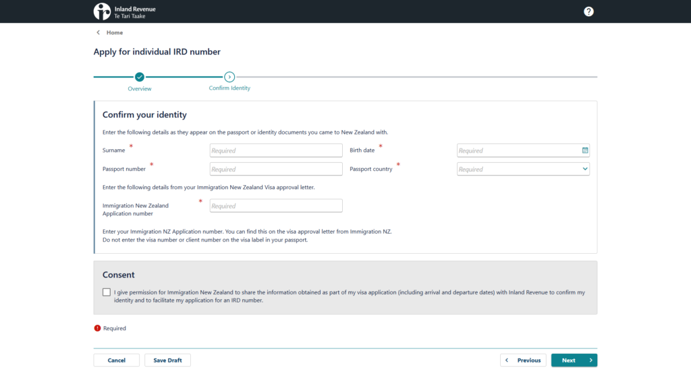

## English\_practice

I'd like to work in NEW ZEALAND(NZ), I applied IRD number. But I don't know that I can be waiter.

### Something difficult in prepared IRD number

IRD number is taxpayer identification number. IRD number is same "my number" in Japan.

You need to have something to apply IRD number. It is difficult for me to get banking certificate.

First, you need a proof of address to open bank account. You need to buy something to prove.

And, someone is new entrans or not. Of course, it is good if it is early. I could apply it when it was spent over a month.

It is no problem if you open a bank account and buy shopping to use a card.

### Apply IRD

I don't remember details because I applied. You need mail address, "my number" and banking certificate.

It is no problem that banking certificate is screen shot of application. You need your account number and recentry deals. You need maybe balance.

You received e-mail after completed applyment. In my case, I received e-mail with this mailaddress and this subject.

You will prepare early if you apply with paper.

### end

That's at all. I will register myIR and find jobs by seek. However, I don't know that I can serve customers and find a part-time jobs by IT. See you.

## 日本語版

ニュージーランドに来て仕事をしてみようと思ったので、IRD番号を申請してみました。とは言え接客ができるか怪しいのですが…

### IRDの準備で大変なもの

IRD番号は所謂、納税者番号と呼ばれています。日本だとマイナンバーと同じと考えてもらっても大丈夫だと思ます。

IRD番号にはいくつか必要なものがありますが、大変なのは銀行取引証明書ですかね。

まず銀行口座の開設に住所証明が必要ですし、証明書のために少し買い物が必要だったりします。

それから新規入国者かどうかの判定もあるかと思います。もちろん早めのほうが良いですが、私は1ヵ月過ぎたくらいでも申請ができました。

早めに口座を開設して入金とカードで買い物を素早くできれば問題ないかと思います。

### IRD申請

すでに申請してしまったのでこの先はおぼろげになりますが、メアド、日本のマイナンバーと銀行取引証明書が必要になります。

銀行取引証明書はアプリのスクショでも問題ないみたいです。口座番号と最近の取引があれば問題ないのだと思います。残高もあるかもしれませんが…

申請が完了すればメールで届きます。私の場合はこのメアドとタイトルで届きました。

紙申請の場合は大変になるかもしれないのでより早めに準備したほうが良いかもしれません。

### 終わりに

というわけで以上になります。今後はmyIRに登録して、seekなどで仕事を見つけてみたいと思います。とは言え接客はできるかわからないですし、ITもフルで仕事ができないので見つかるかわかりませんが…ではでは。

## AIの採点

この英訳は100点満点中 **40点** くらいやね。以下、主な文法や語彙の間違いと改善点を簡単にまとめるばい。

**1\. 「I'd like to work in NEW ZEALAND(NZ), I applied IRD number.」について**

- **問題点**
    - 「NEW ZEALAND(NZ)」の表記は、通常は「New Zealand」とするほうが自然やね。
    
    - 「I applied IRD number」は「applied for an IRD number」と前置詞と冠詞が抜けとる。
    
    - 2つの独立した文をカンマで繋ぐと読みにくかけん、文を分けるのが望ましい。

- **改善例**
    - 「I came to New Zealand to work, so I applied for an IRD number.」

- **ポイント**
    - 前置詞「for」や冠詞「an」の使い方に気ぃつけんね。

* * *

**2\. 「But I don't know that I can be waiter.」について**

- **問題点**
    - 「be waiter」という表現は不自然。
    
    - 役割を表現する場合は「work as a waiter」や「serve as a waiter」とするのが適切。

- **改善例**
    - 「But I'm not sure if I can work as a waiter.」または「But I'm not sure if I can serve customers.」

- **ポイント**
    - 役職や役割を表す場合、動詞「work as」や「serve as」を用いること。

* * *

**3\. 「Something difficult in prepared IRD number」について**

- **問題点**
    - 「Something difficult」とは曖昧で、何が難しかったのかが伝わらん。
    
    - 「prepared IRD number」は文法的に間違っとる。

- **改善例**
    - 「The process of applying for an IRD number was challenging.」

- **ポイント**
    - 具体的な状況（「the process of applying for...」）を明示することで、意味がはっきりする。

* * *

**4\. 「IRD number is taxpayer identification number. IRD number is same 'my number' in Japan.」について**

- **問題点**
    - 最初の文は冠詞が抜けとる：「The IRD number is a taxpayer identification number.」が正しい。
    
    - 次の文も「IRD number is same 'my number'」では、比較が不十分。

- **改善例**
    - 「The IRD number is a taxpayer identification number, similar to the 'My Number' system in Japan.」

- **ポイント**
    - 冠詞と比較表現（similar to）を正しく使うこと。

* * *

**5\. 「You need to have something to apply IRD number. It is difficult for me to get banking certificate.」について**

- **問題点**
    - 「something」が漠然としてる。実際には必要な書類があることを示すべき。
    
    - 「apply IRD number」も「apply for an IRD number」に修正する必要がある。
    
    - 「banking certificate」も一般的な表現ではなく、「bank statement」または「bank transaction certificate」とするほうが適切。

- **改善例**
    - 「There are several documents required to apply for an IRD number, and obtaining a bank statement is particularly challenging.」

- **ポイント**
    - 必要な書類の具体性を出すことと、正しい前置詞・冠詞の使用に注意。

* * *

**6\. 「First, you need a proof of address to open bank account. You need to buy something to prove.」について**

- **問題点**
    - 「a proof of address」よりは「proof of address」と数えない形で使うのが自然。
    
    - 「open bank account」には冠詞「a」が必要：「open a bank account」。
    
    - 「buy something to prove」も何を買うのか具体性がなく、意味が分かりにくか。

- **改善例**
    - 「First, you need proof of address to open a bank account, and sometimes you have to make a small purchase to obtain the required documentation.」

- **ポイント**
    - 冠詞の使い方と、具体的な状況説明を加えることで、文章が明確になる。

* * *

**7\. 「And, someone is new entrans or not. Of course, it is good if it is early. I could apply it when it was spent over a month.」について**

- **問題点**
    - 「new entrans」は誤り。正しくは「new arrival」や「if you are a new immigrant」など。
    
    - 「it is good if it is early」は「apply early」の意味なら「it's better to apply early」とするほうが自然。
    
    - 「I could apply it when it was spent over a month.」は文法的に不自然で、「even after about a month, I was still able to apply.」などとするべき。

- **改善例**
    - 「Additionally, there is a check to determine whether you are a new arrival. Of course, it's better to apply early, but I was able to apply even after about a month.」

- **ポイント**
    - 状況の説明は具体的に、そして時制や表現を正確にすることが大事。

* * *

**8\. 「It is no problem if you open a bank account and buy shopping to use a card.」について**

- **問題点**
    - 「buy shopping」という表現は不自然。
    
    - 「to use a card」の位置が不明瞭。

- **改善例**
    - 「Once you open a bank account and can quickly make purchases using your card, there should be no problem.」

- **ポイント**
    - 動詞の選択（make purchases）と文の論理的な順序に気ぃつけること。

* * *

**9\. 「Apply IRD」について**

- **問題点**
    - 単独の「Apply IRD」は見出しとしては不十分。

- **改善例**
    - 「IRD Application Process」または「Applying for an IRD Number」とするのが望ましい。

- **ポイント**
    - 見出しは内容を端的に示すように、わかりやすく記述する。

* * *

**10\. 「I don't remember details because I applied. You need mail address, 'my number' and banking certificate.」について**

- **問題点**
    - 「mail address」は「email address」にすべき。
    
    - 「You need mail address, 'my number' and banking certificate.」では、必要なものが列挙されているが、冠詞が抜けてる。

- **改善例**
    - 「I don't remember all the details since I already applied, but you'll need an email address, your 'My Number' (if applicable), and a banking certificate.」

- **ポイント**
    - 冠詞の正しい使用と、リストアップする際の一貫性に注意。

* * *

**11\. 「It is no problem that banking certificate is screen shot of application. You need your account number and recentry deals. You need maybe balance.」について**

- **問題点**
    - 「banking certificate is screen shot of application」では、名詞の数や前置詞が間違っとる。
    
    - 「recentry deals」は明らかに「recent transactions」の間違い。
    
    - 「You need maybe balance.」は意味が不明瞭。

- **改善例**
    - 「It appears that a screenshot of the bank statement is acceptable, as long as it shows your account number, recent transactions, and possibly your account balance.」

- **ポイント**
    - 正しい単語（recent transactions）と、曖昧な部分の補足説明が必要。

* * *

**12\. 「You received e-mail after completed applyment. In my case, I received e-mail with this mailaddress and this subject.」について**

- **問題点**
    - 「applyment」という単語は存在せん。正しくは「application」や「once your application is completed」とする。
    
    - 文全体の時制と構造が不自然。

- **改善例**
    - 「Once your application is completed, you will receive an email. In my case, it arrived with the email address and subject line indicated.」

- **ポイント**
    - 正しい単語の使用と、完了形の使い方に注意すること。

* * *

**13\. 「You will prepare early if you apply with paper.」について**

- **問題点**
    - 「apply with paper」は不自然。紙の申請の場合という意味なら「apply using a paper form」とするべき。

- **改善例**
    - 「If you apply using a paper form, it's advisable to prepare your documents early.」

- **ポイント**
    - 方法を明確に記述するため、具体的な表現を使うこと。

* * *

**14\. 「end」について**

- **問題点**
    - 「end」はあまりにも唐突。

- **改善例**
    - 「In conclusion,」や「To sum up,」などで締めるのが望ましい。

- **ポイント**
    - 結論部分はしっかりとした締めの言葉でまとめること。

* * *

**15\. 「That's at all. I will register myIR and find jobs by seek. However, I don't know that I can serve customers and find a part-time jobs by IT. See you.」について**

- **問題点**
    - 「That's at all.」は「That's all.」が正しい。
    
    - 「register myIR」は「register on myIR」と前置詞が必要。
    
    - 「find jobs by seek」は「search for jobs on Seek」のほうが自然。
    
    - 「I don't know that I can serve customers and find a part-time jobs by IT.」は文法的に乱れとる。正しくは「I'm not sure if I can work in customer service, and I might not be able to find a part-time job in IT.」などとする。

- **改善例**
    - 「That's all. I will register on myIR and search for jobs on Seek. However, I'm not sure if I can handle customer service roles or secure a part-time job in IT. Take care.」

- **ポイント**
    - 各文の前置詞、冠詞、時制、一致性を注意すること。

* * *

**総合的なフィードバック**

- **文法と前置詞・冠詞の使用:**  
    ほとんどの箇所で前置詞（for, on, etc.）や冠詞（a, an, the）が抜けとるけん、基本的な文法ルールをしっかり復習することが大事ばい。

- **語彙選びと表現の明確さ:**  
    曖昧な「something」や「buy something」といった表現は、具体的な情報に置き換えると読み手に伝わりやすか。

- **文章の構造:**  
    文を短く区切り、論理的な順序で情報を提供することで、意味が明確になるけん、長い文を一度見直す習慣を持つと良かよ。

- **自然な表現:**  
    ネイティブの例文を参考にし、自然な英語表現を身につけることが、IELTSなどの試験でも高得点に繋がるばい。

もし、さらに具体的な部分や別の疑問点があれば、どんどん聞いてくれんしゃい！
