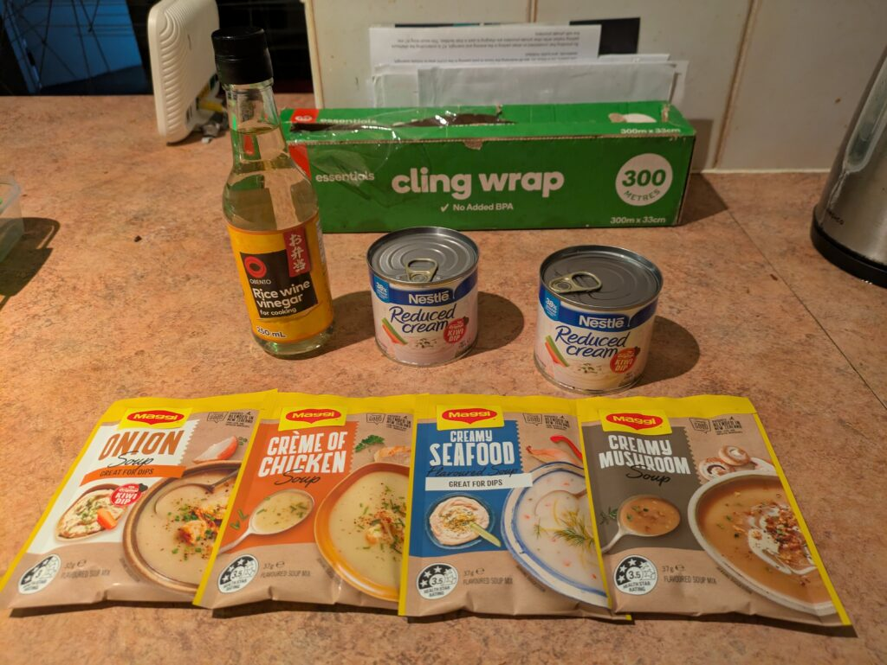
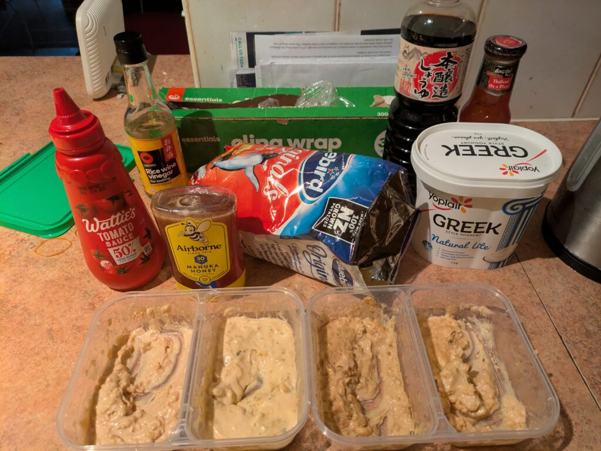

## English\_Practice

I came in NZ and I didn't eat unique foods. Therefore, I made something.

### how to make kiwidip

[Kiwidip](https://www.maggi.co.nz/recipes/Kiwi-Onion-Dip) is sinple. It is used potetochips. It is made of cream, soup powders and vinegar.

How to make easy. You mixed a can of cream, all soup powder and a small spoon of vinegar.

I tried various so I mixed a half can of cream and all soup powder. I don't care that It was a bit strong. Some people feel they want a bit vinegar.

Potetochips is tasted solty so cream's rich is mellow.

### kiwidip seasoning

Of course, it is enough. However, I mixed other seasoning because they are similer to seasoning.

These are my feeling.

- sweet chili sauce
    - delicious, I prefer spaicy more

- vinegar
    - delicious, I prefer to add vineger more

- ketchup
    - It isn't bad but if you have chili sauce, I feel it is good

- honey
    - It isn't necessary because we feel sweet chili sauce is a bit sweet.

- soy sauce
    - It is too bad because potetchips is salty

- yogurt
    - It is no change if it is plane because it is rich.

I felt I mixed chili sauce or vinegar is better.

### The end

Finally, I don't sure I will make them because I don't like potetochips.

It's bad for health. I'd like to eat NZ unique foods. See you.

## 日本語版

NZに来てこっちにある特有の食べ物をほぼ食べてなかったので作ってみました。

### kisidipの作り方

kiwidipはシンプルでポテトチップスに付けるものになります。材料も3つだけでクリームにスープの粉末と酢だけです。

作り方も簡単で缶1つにスープの粉末を全てと酢小さじ1を混ぜるだけです。

私は色々試してみたかったので缶半分と袋全て入れるようにしました。味は少し濃くなりますが気になるほどではないですね。人によっては酢が物足りないですかね？

ポテトチップスはデフォルトが塩味なのでクリームの濃さがいい具合にまろやかになります。

### kiwidipに味付け

もちろんこれだけでも十分ですが、似たような味付けになるので色々と調味料を入れてみました。

というわけでいろいろ試してみた感想がこんな感じ。

- スイートチリソース
    - 美味しい、個人的にはもう少し辛い方が好き

- 酢
    - 美味しい、追い酢は割と良い

- ケチャップ
    - 悪くないけどチリソースがあればそっちがよい

- ハチミツ
    - スイートチリソースは甘みも感じるので、特に必要ない

- 醤油
    - ポテトチップスが塩味なので塩分過多で美味しくない、クリームの濃厚さと醤油のあっさりも相反してる

- ヨーグルト
    - もともと濃厚なのでプレーン味だとあまり変化なし

個人的にはスイートチリソースと酢を入れたほうがよりいいかなと感じました。

### 終わりに

最後に私はポテトチップスはそこまで好きじゃないので今後作るかわからないですね…

健康に悪いというのもありますので。今度は別のNZ特有の食べ物を食べてみたいですね。ではでは。

## AI採点

ほんなこつ、この英訳は100点満点中 **40点** くらいやね。以下、各部分ごとに文法・語彙のミスや表現の不自然な点を細かく指摘するけん、参考にしてみんしゃい。

* * *

### 【全体的な感想】

- 意味は何となく伝わるばってん、文法の間違いや単語のスペルミスが目立つとよ。

- 自然な英語表現になっとらん部分が多いけん、もうちょっとネイティブの言い回しを意識するとよかね。

- 見出しの大文字・小文字や文のつなぎ方、冠詞・前置詞の使い忘れに注意せんといかんね。

* * *

### 【細かい指摘】

#### 1\. 導入文

**原文:**

> I came in NZ and I didn't eat unique foods. Therefore, I made something.

- **"I came in NZ"**
    - 「in NZ」より「to NZ」が適切。
    
    - 例: **"I came to NZ"** または **"Since I came to NZ"**

- **"I didn't eat unique foods."**
    - 「eat unique foods」だと「食べなかった」意味にならん。
    
    - 「try local unique foods」や「sample the unique local cuisine」とするのがよかね。

- **"Therefore, I made something."**
    - もう少し具体的に「作ってみた」と表現するとよか。
    
    - 例: **"So, I decided to try making one myself."**

* * *

#### 2\. 見出し「how to make kiwidip」

- 見出しは大文字で統一したほうがよか。
    - 例: **"How to Make Kiwidip"**

- "kiwidip" のスペルは文中で一貫して使うこと。

* * *

#### 3\. 説明文（材料紹介）

**原文:**

> Kiwidip is sinple. It is used potetochips. It is made of cream, soup powders and vinegar.

- **"sinple"** → 正しくは **"simple"**

- **"It is used potetochips."**
    - 意味が通じん。
    
    - 例: **"It is a simple dip for potato chips."**

- **"soup powders"**
    - 単数形か、または一般的に **"soup powder"** とするのが自然。

- 全体としては、**"Kiwidip is a simple dip for potato chips, made from cream, soup powder, and vinegar."** とするとよかね。

* * *

#### 4\. 説明文（作り方）

**原文:**

> How to make easy. You mixed a can of cream, all soup powder and a small spoon of vinegar.

- **"How to make easy."**
    - 不完全な文。
    
    - 例: **"It's very easy to make."** または **"The recipe is very simple."**

- **"You mixed a can of cream, all soup powder and a small spoon of vinegar."**
    - 命令形にするなら、**"Simply mix one can of cream, all of the soup powder, and one small spoonful (or teaspoon) of vinegar."**
    
    - 「a small spoon of vinegar」は具体的な量（例えば "one teaspoon"）を使うとよかね。

* * *

#### 5\. 説明文（実験的な分量変更）

**原文:**

> I tried various so I mixed a half can of cream and all soup powder. I don't care that It was a bit strong. Some people feel they want a bit vinegar.

- **"I tried various"**
    - 「いろいろ試してみた」という意味なら、**"I experimented with different ratios"** とするとよかね。

- **"so I mixed a half can of cream and all soup powder."**
    - どのように変えたか具体的に、例: **"so I tried using only half a can of cream while keeping the full amount of soup powder."**

- **"I don't care that It was a bit strong."**
    - 文法・語順が不自然。
    
    - 例: **"It turned out a bit strong, but I didn't mind."**

- **"Some people feel they want a bit vinegar."**
    - より自然な表現は **"Some people might find that it needs a bit more vinegar."**

* * *

#### 6\. 説明文（ポテトチップスとの相性）

**原文:**

> Potetochips is tasted solty so cream's rich is mellow.

- **"Potetochips"**
    - 正しくは **"potato chips"** または **"potato chips"** と複数形にする。

- **"is tasted solty"**
    - 自然な表現は **"are naturally salty"** または **"come pre-salted."**

- **"cream's rich is mellow"**
    - 意味としては「クリームの濃厚さがまろやかになる」という意味なら、
    
    - 例: **"which nicely mellows the richness of the cream."**

* * *

#### 7\. 見出し「kiwidip seasoning」

- 同様に大文字を使って **"Kiwidip Seasoning"** とする。

* * *

#### 8\. 調味料の意見部分

**原文:**

> Of course, it is enough. However, I mixed other seasoning because they are similer to seasoning.
> 
> These are my feeling.
> 
> sweet chili sauce  
> delicious, I prefer spaicy more
> 
> vinegar  
> delicious, I prefer to add vineger more
> 
> ketchup  
> It isn't bad but if you have chili sauce, I feel it is good
> 
> honey  
> It isn't necessary because we feel sweet chili sauce is a bit sweet.
> 
> soy sauce  
> It is too bad because potetchips is salty
> 
> yogurt  
> It is no change if it is plane because it is rich.
> 
> I felt I mixed chili sauce or vinegar is better.

- **"Of course, it is enough."**
    - 意味としては「基本の味付けで十分」という意味なら、
    
    - 例: **"The basic mixture is sufficient on its own."**

- **"I mixed other seasoning because they are similer to seasoning."**
    - 「similer」は **"similar"** のスペルミス。
    
    - もう少し明確に、例: **"However, I also experimented by adding various other seasonings for extra flavor."**

- **"These are my feeling."**
    - 複数形も不自然。
    
    - 例: **"Here are my impressions:"**

- 各調味料の部分も見直し：
    - **sweet chili sauce:**
        - **"delicious, I prefer spaicy more"** → **"Delicious – personally, I prefer it spicier."**
        
        - 「spaicy」は **"spicy"** のスペルミス。
    
    - **vinegar:**
        - **"delicious, I prefer to add vineger more"** → **"Tasty – I would actually add even more vinegar."**
        
        - 「vineger」は **"vinegar"** のスペルミス。
    
    - **ketchup:**
        - **"It isn't bad but if you have chili sauce, I feel it is good"** → **"It's not bad, but if you already have chili sauce, that might be a better choice."**
    
    - **honey:**
        - **"It isn't necessary because we feel sweet chili sauce is a bit sweet."** → **"Honey isn't necessary since the sweet chili sauce already provides enough sweetness."**
    
    - **soy sauce:**
        - **"It is too bad because potetchips is salty"** → **"Soy sauce doesn't work well because the potato chips are already quite salty."**
        
        - 「potetchips」は **"potato chips"** のスペルミス。
    
    - **yogurt:**
        - **"It is no change if it is plane because it is rich."** → **"Plain yogurt doesn't change the flavor much, given its richness."**

- **"I felt I mixed chili sauce or vinegar is better."**
    - 意味を明確にするなら、
    
    - 例: **"I felt that adding more chili sauce or vinegar improved the flavor."**

* * *

#### 9\. 結びの部分

**原文:**

> The end
> 
> Finally, I don't sure I will make them because I don't like potetochips.
> 
> It's bad for health. I'd like to eat NZ unique foods. See you.

- **"I don't sure I will make them"**
    - 正しくは **"I'm not sure if I'll make it again"** など。

- **"potetochips"**
    - **"potato chips"** にする。

- **"It's bad for health."**
    - もっと自然に、例: **"They aren't very healthy, either."**

- **"I'd like to eat NZ unique foods."**
    - もう少し具体的に、例: **"I’d like to try other unique NZ dishes next time."**

* * *

### 【総合的なアドバイス】

- **スペルミスの修正:**
    - "sinple" → "simple"
    
    - "potetochips" → "potato chips"
    
    - "spaicy" → "spicy"
    
    - "vineger" → "vinegar"
    
    - "similer" → "similar"

- **文法・語順:**
    - 前置詞（to, on, with）や冠詞（a, the）の使い忘れに注意。
    
    - 命令文や説明文はシンプルに、かつ自然な英語の語順で書くこと。

- **自然な表現:**
    - 直訳調にならんよう、ネイティブが使う表現に慣れるとよか。
    
    - 例として、"I experimented with different ratios" や "I decided to try making one myself" など。

- **見出しの整え:**
    - 大文字の使い方や見出しの統一感を意識すること。

* * *

この調子で、細かい部分にも気ぃつけながら、もっと自然で正確な英語表現を目指すと、IELTSなどの試験でも点数アップが狙えるけん、がんばってみんしゃい！
