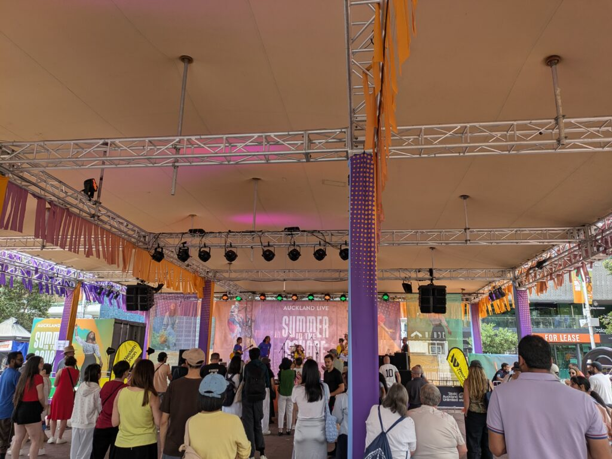
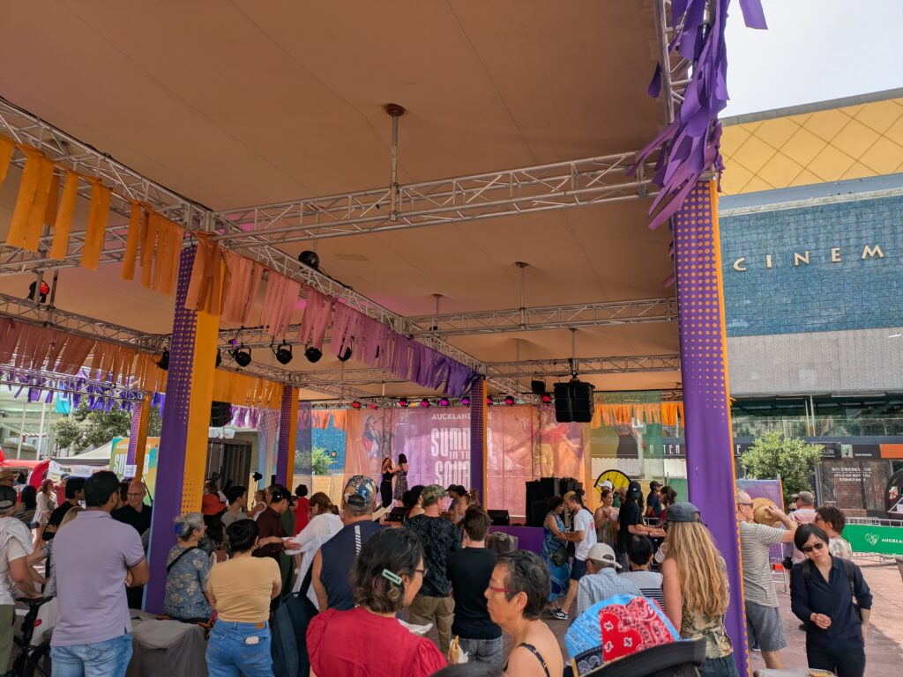
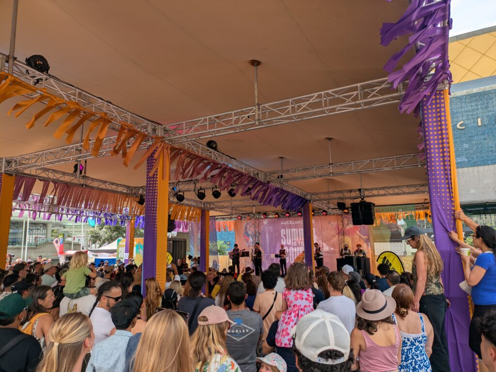
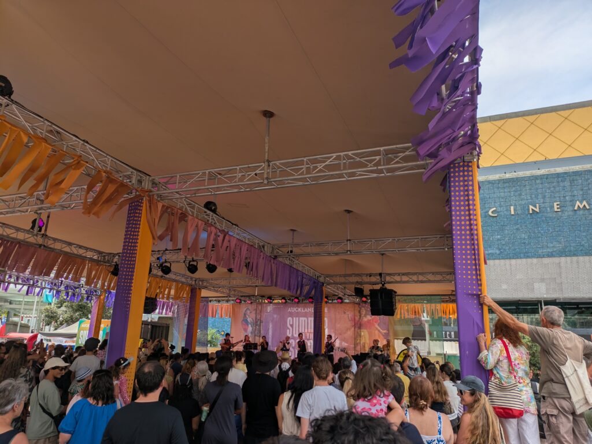
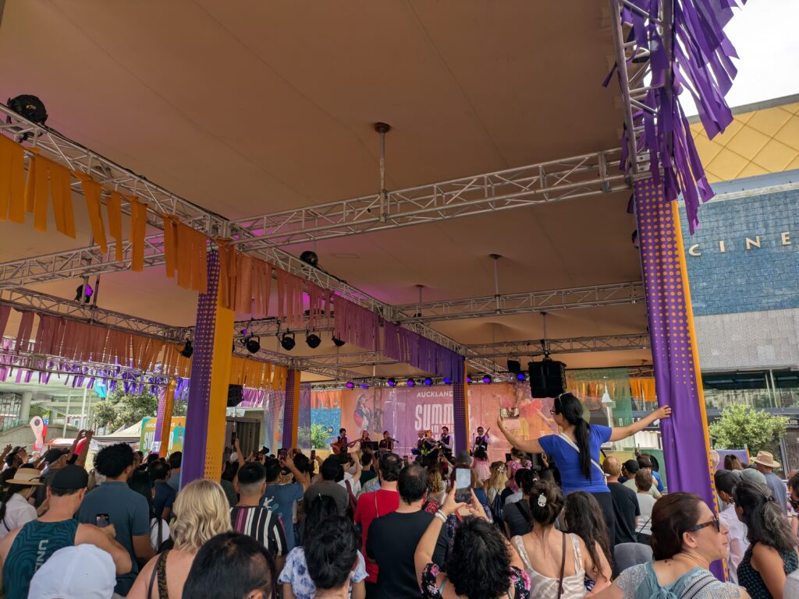
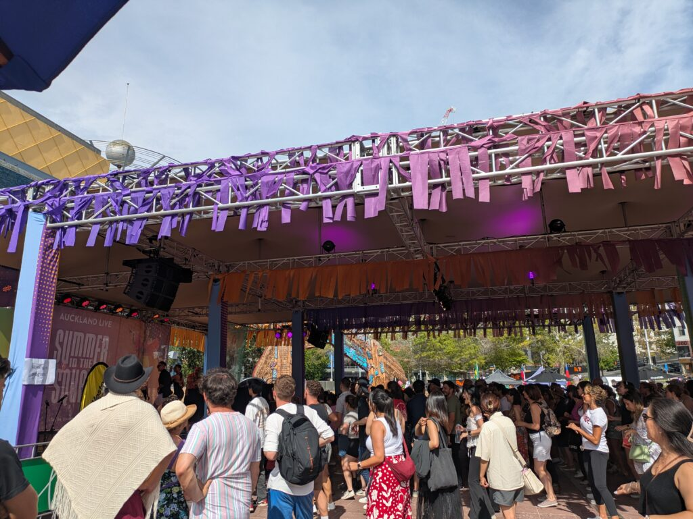

## latinfiestaに行った感想

フェスに行ったことがないうえ、あまり外に出たがらないのですがせっかくなので行ってきました。[ラテンフェス](https://www.latinfiesta.co.nz/home-auckland/)で南アメリカ系の音楽ダンスフェスになります。例えばブラジル、チリ、コロンビア、アルゼンチンあたりですね。

### **ブラジルの子供達の歌**

14時ぐらいに行ったのでブラジル系の子供達が歌っているタイミングでした。元気に歌ってて楽器も楽しく弾いててよかったです。この時はあまり人が密集してないですね。

### latinfiesta\_**Tangoレッスン**

その後はTangoのレッスンをしてました。先生が前で踊りを見せながら、見ている人も一緒に踊るという状況ですね。Tangoは基本2人組で踊るみたいで、ペアをころころ変えながら踊ってた様子です。ちなみに私は苦手なので後方腕組マンとなってました（笑）

Tangoを見ていて感じたのは足運びと2人組がメインという感じですね。あまり上半身は動かさず、ステップのみでダンスをしていました。もしかしたら基本がこれで応用で上半身を使うのかもしれませんが…

ただ、ステップでも横、前、後ろと動き更に足をクロスさせたりして少し複雑さを感じました。楽しそうに踊ってましたが、覚えるのは大変なんだなと思いました。

Tangoのレッスンの後はダンスショーと音楽ですね。後ろだったのでパフォーマンスはほぼ見られなかったです（笑）写真でもあまり見えないですね。ステージの下で踊ってました。

### **メキシコの音楽**

チリのショーの後はメキシコの音楽ですかね？mariachiと呼ばれるものでした。全くわからないですが民族音楽と最近の洋楽が混ざったような感じがしました。

日本では少ない気がしますがロングトーンでビブラートを出していると会場が沸きますね。私もすごいなーと思いながら聞いてました。途中から踊ったりもして楽しそうな雰囲気が伝わってきましたね。この辺から人がかなり増えてきました。

それからメキシコのダンスも見れました。ひらひらのドレスを両手で持ちながら回ったりドレスをぶん回したりしてました。

### latinfiesta\_**Bachataレッスン**

最後にBachataのレッスンをやってました。最後と言いましたが私がいたのがこの時までだったので、実際はDJやバンドが会場を盛り上げてたと思います。

こちらもTangoと同じようにステージの前でダンサーが教えてました。初めは一人でも踊れる奴でしたが、二人で踊るものもありました。

BachataはTangoよりも少し情熱的に感じました。体を少し重ねたりしながら動き、ターンを入れたりしてました。動きとしては細かいステップがメインでたまに大きく動くという感じですね。

この時間帯になると人も多く、日も出てより情熱的に感じました。相変わらず私は見てただけですが、皆さん楽しそうに踊ってました。

こんな感じでlatinfiestaでの1日を終えましたが、なかなか刺激的な日だったと感じます。明日まであるみたいなのでせっかくなので見てみようと思います。ちなみに明日はサンバレッスンがあるらしいです。ではでは。
