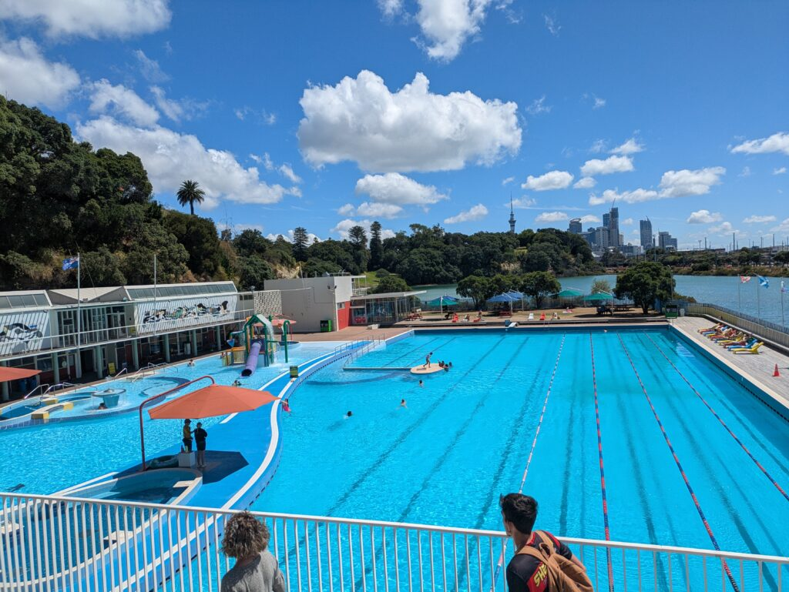

## English\_practicing

We have a activity in LSI on every Fryday. Therefore, it is a number of people limits. However, if you'd like to join it, you should write your name on list.

### cost and people of ParnellBaths

I went to the pool which is ParnellBaths. If you are under 16 years old, for free. However, you are over 17years old and have student ID, you are discounted. It costs $6 with spa and $4 without spa.

There are a few people because of day's afternoon. There are children after 4:00p.m.

### water quality of ParnellBaths

This pool is very salty because of useing seawater. We can't open our eyes without goggles.

There are deep place. If you can't swim, you should take care becase of 2 meter places. I think you float easy because of salt water but you are possible drowning.

Spa is the best place in the ParnellBaths. I was here about 50% of all hours because of like hot springs. I felt cool in other poors. If I went to outside, I felt chilly because of winds.

### Farewell party after ParnellBaths

After that, I went to the CBD by bus with my friend. I went to a farewell party at 7:30p.m. after I talked with him.

I talked someones who I don't know. Actually, I felt stressed. After that, I was tired and I took it easy within japanese groups but my friends talked with them. Awesome!

I came home anytime because of flats but my friends lived in hosthouse. Therefore they needs bus and I came home with my friends.

Saudi Arabians had this party so other school students came here except LSI. It is good point that I made japanese friends belongs to worldwide. I'd like to go to the place which I talked someone with English I drank more. See you.

## 日本語版

LSIでは金曜日にアクティビティがあります。もちろん状況によって人数制限がありますが、参加したい人はリストに名前を書けば参加することができます。

### ParnellBathsの料金や人

先日はプールに行きました。場所は[ParnellBaths](https://www.clmnz.co.nz/parnell-baths/)ですね。16歳以下であれば無料で入ることもできます。17歳以上で学生カードを提示すれば割引されてはいれます。スパ(ホットプール)付きで$6、スパなしで$4ですね。

平日の昼間だったので人は少なめでした。4時過ぎたぐらいで子供たちが増えてきた感じですね。

### ParnellBathsの水質

このプールは海水を使ってるみたいでかなりしょっぱいですね。水中をゴーグルなしで目を開けるのはまず無理です。

それから場所によって深いプールも存在します。2mの場所もあるので泳げない人は注意してください。塩水である分浮きやすいとは思いますが、溺れる可能性はあるので…

スパは最高ですね。温泉のような感じなので5割ぐらいいた気がします。他のプールだと微妙に寒く、外に出ると風があるため寒く感じます。

### ParnellBaths後の送別会

その後は友達とバスに乗ってCBDまで行きました。軽く雑談して7:30p.m.から送別会のようなパーティーが開かれるのでそっちに行ってきました。

全く知らない人たちと多少話しましたが、やっぱり負荷がかかりますね。疲れちゃって日本人グループのところでまったりしてましたが、友達はガンガン話してました。凄い！

私はフラットなのでいつでも帰れましたが、友達はホスト先でバスが必要だったみたいで一緒に変えることにしました。

このパーティーはサウジアラビア系の人たちが開いたもので、LSI以外の学校の人たちも来てました。そこにいた日本人の人とも仲良くなれたのは良かったかなと思います。今度はもう少し泥酔した状態で英語で知らない人と話す環境に行ってみたいですね。ではでは。

## AIの採点

### 【全体的な感想】

全体的に意味は伝わるばってん、文法や語彙の間違いが多かったり、表現が直訳調になっとる部分が目立つばい。自然な英語にするためには、冠詞や前置詞、動詞の形、語彙の使い方に注意せんといけんね。

* * *

### 【細かい指摘】

#### 1\. LSIでのアクティビティについて

- **原文:**We have a activity in LSI on every Fryday. Therefore, it is a number of people limits. However, if you'd like to join it, you should write your name on list.

- **誤りと解説:**
    - **"Fryday"** → 正しくは **"Friday"**。
    
    - **"on every Fryday"** は不自然。**"every Friday"** とする。
    
    - **"Therefore, it is a number of people limits."**  
        → 意味が通じん。実際は「状況により人数制限がある」という意味なら、**"there is a limit on the number of participants depending on the situation"** とする。
    
    - **"write your name on list"** → 冠詞が抜けとる。**"write your name on the list"** にする。

- **改善例:**At LSI, we hold an activity every Friday. Of course, there is a limit on the number of participants depending on the situation, but if you’d like to join, simply sign your name on the list.

* * *

#### 2\. ParnellBathsの料金と混雑状況について

- **原文:**cost and people of Parnell BathsI went to the pool which is Parnell Baths. If you are under 16 years old, for free. However, you are over 17years old and have student ID, you are discounted. It costs $6 with spa and $4 without spa.There are a few people because of day's afternoon. There are children after 4:00p.m.

- **誤りと解説:**
    - 見出しは **"cost and people"** だけやと意味が伝わりにくい。**"Admission Fees and Crowd at Parnell Baths"** などが望ましい。
    
    - **"I went to the pool which is Parnell Baths."** → 冗長で、**"I visited Parnell Baths."** のほうがよか。
    
    - **"If you are under 16 years old, for free."** → 文章が不完全。**"If you’re under 16, admission is free."** とすべし。
    
    - **"you are over 17years old and have student ID, you are discounted."**  
        → 構文が乱れてる。**"if you’re 17 or older and have a student ID, you receive a discount."** とする。
    
    - **"There are a few people because of day's afternoon."**  
        → 意味が曖昧。**"The pool isn’t very crowded during the day."** とするとわかりやすい。
    
    - **"There are children after 4:00p.m."**  
        → **"More children start coming after 4:00 p.m."** のほうが自然。

- **改善例:****Admission Fees and Crowd at Parnell Baths**  
    I visited Parnell Baths. If you’re under 16, admission is free. However, if you’re 17 or older and have a student ID, you receive a discount: $6 with spa access and $4 without.  
    The pool isn’t very crowded during the day, but more children start coming after 4:00 p.m.

* * *

#### 3\. ParnellBathsの水質について

- **原文:**water quality of Parnell BathsThis pool is very salty because of useing seawater. We can't open our eyes without goggles.

- **誤りと解説:**
    - 見出しは大文字で統一する。**"Water Quality at Parnell Baths"** とする。
    
    - **"useing"** → 正しくは **"using"**。
    
    - **"We can't open our eyes without goggles."**  
        → 意図としては「ゴーグルなしでは目を開けるのが困難」という意味やけん、**"It’s nearly impossible to keep your eyes open without goggles."** などの表現が適切。

- **改善例:****Water Quality at Parnell Baths**  
    This pool uses seawater, so it is extremely salty. It’s nearly impossible to keep your eyes open without goggles.

* * *

#### 4\. ParnellBathsの深さと安全面について

- **原文:**There are deep place. If you can't swim, you should take care becase of 2 meter places. I think you float easy because of salt water but you are possible drowning.

- **誤りと解説:**
    - **"There are deep place."** → 不自然。**"Some areas are deep."** または **"There are deep parts."** とする。
    
    - **"becase"** → 正しくは **"because"**。
    
    - **"2 meter places"** → **"areas that are 2 meters deep"** と明確にする。
    
    - **"I think you float easy because of salt water"** → 語形が不適切。**"I think you float easily because of the salt water"** が正しい。
    
    - **"but you are possible drowning."** → 文法が乱れてる。**"but drowning is still possible."** または **"but you could still drown."** とする。

- **改善例:**Some areas are deep—up to 2 meters—so if you can’t swim, you should be cautious. Although the salt water helps you float easily, drowning is still possible.

* * *

#### 5\. スパについて

- **原文:**Spa is the best place in the Parnell Baths. I was here about 50% of all hours because of like hot springs. I felt cool in other poors. If I went to outside, I felt chilly because of winds.

- **誤りと解説:**
    - **"Spa is the best place in the Parnell Baths."**  
        → 自然な表現としては、**"The spa is the highlight of Parnell Baths."** や **"The spa is fantastic."** がよか。
    
    - **"I was here about 50% of all hours because of like hot springs."**  
        → 意味が不明瞭。おそらく「温泉のような雰囲気で、半分くらいの時間を過ごした」という意味なら、**"I spent about half of my time there because it felt like a hot spring."** とする。
    
    - **"I felt cool in other poors."**  
        → **"poors"** は単語として不適切。おそらく「他のプールでは寒く感じた」という意味なら、**"I felt a bit chilly in other pools."** とする。
    
    - **"If I went to outside, I felt chilly because of winds."**  
        → **"went to outside"** は不自然。**"When I went outside, I felt chilly because of the wind."** とする。

- **改善例:**The spa is fantastic—almost half of my time there was spent enjoying it, as it felt like a hot spring. In contrast, I found other pools to be a bit chilly, and when I went outside, the wind made it feel even colder.

* * *

#### 6\. 送別会について

- **原文:**Farewell party after Parnell BathsAfter that, I went to the CBD by bus with my friend. I went to a farewell party at 7:30p.m. after I talked with him.I talked someones who I don't know. Actually, I felt stressed. After that, I was tired and I took it easy within japanese groups but my friends talked with them. Awesome!I came home anytime because of flats but my friends lived in hosthouse. Therefore they needs bus and I came home with my friends.Saudi Arabians had this party so other school students came here except LSI. It is good point that I made japanese friends belongs to worldwide. I'd like to go to the place which I talked someone with English I drank more. See you.

- **誤りと解説:**
    - **"After that, I went to the CBD by bus with my friend."**  
        → 自然な順序なら **"My friend and I took a bus to the CBD afterward."** とする。
    
    - **"I went to a farewell party at 7:30p.m. after I talked with him."**  
        → 「少し話した後に参加した」としたいなら、**"We attended a farewell party that started at 7:30 p.m. after a brief chat."** がよか。
    
    - **"I talked someones who I don't know."**  
        → **"someones"** は誤り。**"I spoke with some people I didn’t know."** とする。
    
    - **"Actually, I felt stressed."**  
        → 「圧倒された」とか「緊張した」ニュアンスなら、**"I actually felt a bit overwhelmed."** とするとよか。
    
    - **"I took it easy within japanese groups"**  
        → **"within japanese groups"** は不自然。**"I ended up relaxing with a group of Japanese students"** などに修正。
    
    - **"but my friends talked with them. Awesome!"**  
        → 接続が雑。**"while my friends kept chatting with others. It was awesome!"** とする。
    
    - **"I came home anytime because of flats"**  
        → 意味は「フラットに住んでるから自由に帰れる」という意味なら、**"I could go home whenever I wanted since I live in a flat."**
    
    - **"but my friends lived in hosthouse. Therefore they needs bus and I came home with my friends."**  
        → 「ホストハウスに住んでるからバスが必要だった」という意味なら、**"However, my friends stayed at a host house and needed to take the bus, so I ended up going home with them."** とする。
    
    - **"Saudi Arabians had this party so other school students came here except LSI."**  
        → **"had this party"** ではなく **"organized the party"** のほうが適切。**"students from other schools besides LSI attended."** とする。
    
    - **"It is good point that I made japanese friends belongs to worldwide."**  
        → 意味が不明瞭。**"It was great that I made friends with Japanese people from around the world."** とすべし。
    
    - **"I'd like to go to the place which I talked someone with English I drank more."**  
        → 文法も意味も乱れてる。原文の意図「次はもう少し泥酔した状態で、英語で知らない人と話す環境に行ってみたい」を表すなら、**"Next time, I’d like to try being a bit more intoxicated so that I can comfortably converse in English with strangers."** とする。

- **改善例:Farewell Party After ParnellBaths**  
    My friend and I took a bus to the CBD afterward. We attended a farewell party that started at 7:30 p.m. after a brief chat.  
    I spoke with some people I didn’t know, and I actually felt a bit overwhelmed. Eventually, I got tired and relaxed with a group of Japanese students, while my friends kept chatting with others. It was awesome!  
    I could go home whenever I wanted since I live in a flat, but my friends stayed at a host house and needed to take the bus, so I ended up going home with them.  
    The party was organized by Saudi Arabians, and students from other schools besides LSI attended. It was great that I made friends with Japanese people from around the world. Next time, I’d like to try being a bit more intoxicated so that I can comfortably converse in English with strangers. See you.

* * *

### 【総合的なアドバイス】

- **スペルと文法:**  
    ・スペルミス（"Fryday", "useing", "becase", "someones"）に注意。  
    ・前置詞、冠詞、動詞の形（"apply for", "go home whenever", "receive a discount"）をしっかり使うこと。

- **語彙の選び方:**  
    ・直訳になりすぎず、自然な英語表現を意識すること。  
    ・"cost and people" ではなく、"Admission Fees and Crowd" などテーマに沿った見出しにする。

- **文章の構造:**  
    ・文の区切りと接続詞を上手に使って、論理的で読みやすい文章にすること。

- **意味の明確さ:**  
    ・具体的な情報（時間、人数、深さなど）を正確に表現し、誤解のない文章にすること。

* * *

この調子で文法と語彙、自然な表現を意識して練習していけば、IELTSなどの試験でも点数アップが狙えるけん、がんばってみんしゃい！
