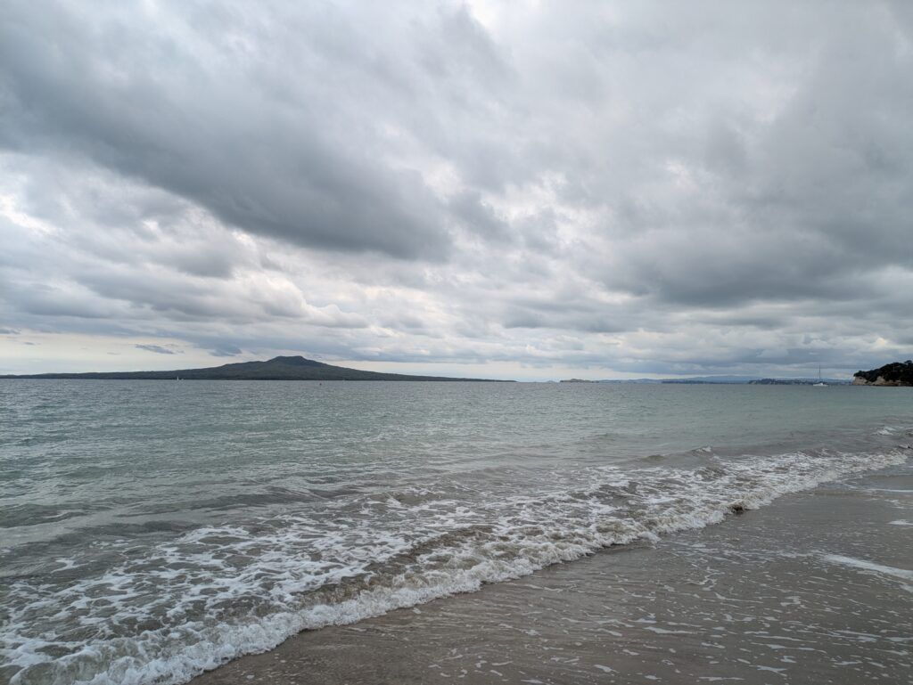
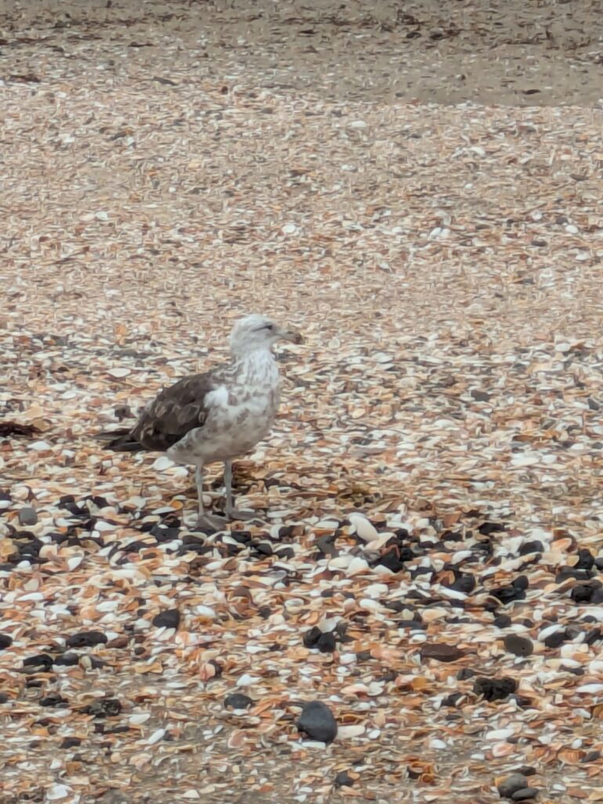
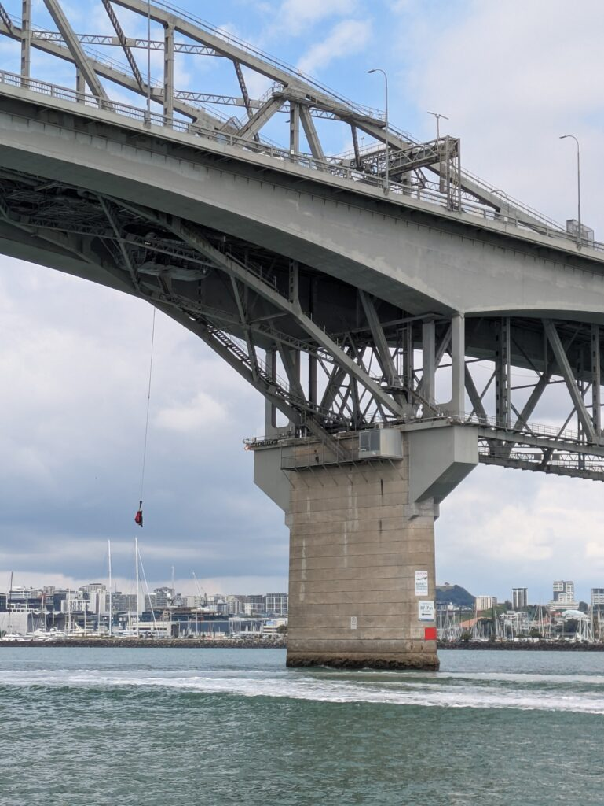
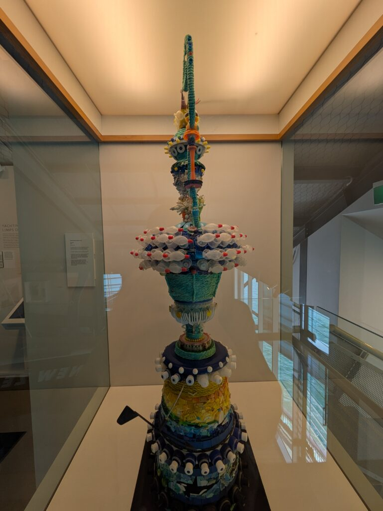

## English\_fair

On Friday, I went sailing, enjoying the ocean aboard a sailboat. However, this week there was a big test. Although I participated in the sailing activity in the afternoon, I spent the morning at Takapuna Beach.

### There was BIG TEST this week

Actually, LSI held a big test this week. In other words, the test determines whether one can advance to the next level. Nevertheless, due to the class size, only a limited number of students can progress.

By the way, my test score was not bad; while my reading, vocabulary, and grammar were fine, my listening, speaking, and writing were only about 60–70%.

### I went to the Tapukana Beach in the morning

Consequently, because of the big test, I decided to relax at the beach over the weekend. Although other options like bowling or visiting a park were available, I chose the beach this time.

First, I took a bus to a spot near the beach and, on the way, stopped by a supermarket to buy snacks. Then, I spread out the snacks on the beach and shared them with my classmates.

Meanwhile, I strolled along the beach with my feet in the water. After a brief walk, I enjoyed chatting and snacking with my classmates.

However, it was a bit chilly; although the sea was somewhat warm, the cloudy sky and wind made it feel cold.

### I did sailing and went to the Maritime museum in the afternoon

In the afternoon, I resumed activities with sailing and a museum visit.

Consequently, I cut my beach time short and went sailing, and incidentally, I was driven by an LSI teacher. After storing my luggage, I boarded a boat and cruised around the sea.

Essentially, I relaxed on board by taking photos, recording videos, and chatting, which might have seemed a bit dull.

The fare depends on the enrollment period; if you are enrolled for more than three months, it costs $16 (about 1,440 yen), but otherwise it doubles to $32, so I thought it was a good deal.

### maritime museum

After sailing, I visited the attached museum. Primarily, the museum showcased the history of ships, including steamships as well as sailing competitions. I realized that I do not have a strong interest in ships or competitions; however, I found the history and structure of old ships fascinating.

In conclusion, although I am not sure if I will go again next time, I am glad I enjoyed it. Additionally, next time I plan to explore other places. Goodbye!

## English\_practice

I did sailing at 14/02/2025. I enjoyed sailing which sets sail on the ocean

### There was BIG TEST this week

I joined this sailing of afternoon activity. I went to the Tapukana Beach in the mornig.

Exactly, I had a BIG TEST this week. In short, this test is judged us for next level.

Only some peple will go to next level because there are limited.

My score is not bad. There are no problem about Reading, vocabulary and grammer but Listening, Speaking and Writing were 60-70%.

### I went to the Tapukana Beach in the morning

we went to the beach to relax this weekend beacuse we had the BIG TEST. we had other choices for example bowling, park, but this was beach.

we went to the near beach and bought snacks in the supermarket. After that, we went to the beach and ate snacks with classmates.

I walked around the beach my foots into the sea.

After that, we ate snacks and talks with classmates but we felt chilly.

I felt warm in the sea but we felt because it was cloudy and had wind.

### I did sailing and went to the Maritime museum in the afternoon

we stop playing the beach to do sailing. By the way I rode on a LSI teacher's car to the maritime museum. we deposited my baggage and the ship flow on the sea.

we took it easy on the ship. Basically we took photos and recorded viewing and we talked each other. It means that it probably is bording.

It costs $16(about 1,440 yen) if it has more three months to go to the scool.

Other cases, it costs $32 so that I think it gets a good deal. We went to a attached museum when we had done sailing.

### maritime museum

Basically, there were historys about ships which are steamed ships and sailing compatitions and history.

I thought I am not interested in ships and competitions but it was fun to look historys and old ship structions.

I don't know I do sailing if I have opportunities but I was fun. Someday, I went other places. See you!

## 日本語版\_Sailingに行ってきた話

金曜日に[sailing](https://www.maritimenz.govt.nz/recreational/sailing/)をしてきました。こんな感じで帆を張った船で海上を楽しんでました。

### 今週はビッグテストがあった

こちらのSailingは午後のアクティビティで参加しました。ただ、午前中はTakapunaビーチに行ってました。

実は今週のLSIではビッグテストが行われました。簡単に言えば次のレベルに行けるかどうかを判断するテストですね。

ただ、クラスの人数もあるので次のレベルに行ける人は限られたりしますが…

ちなみに私のビッグテストは悪くないぐらいですね。Readingや語彙・文法などは問題ないです。ただ、Listenig、Speaking、Writingが6,7割でした。

### 午前中はTapukanaビーチ

というわけでビッグテストがあったので週末は息抜きにビーチに行くことになりました。他にもボウリングや公園などの選択肢もありましたが、今回はビーチですね。

バスに乗ってビーチの近くまで行き、途中でスーパーに寄ってお菓子を買いました。その後ビーチに行ってお菓子を広げてクラスメイト達と食べてました。

私は足元を海に入れながら散策してました。軽く往復した後はクラスメイト達と談笑しながらお菓子をつまんでました。ただ、肌寒かったですね。海の中は多少暖かいんですが、曇って風もあったので肌寒いという感じでした。

### 午後はアクティビティでSailing

ビーチを途中で切り上げてsailingに行きました。ちなみに行く途中はLSIの先生の車に乗せてもらっていきました。

荷物を預けて船に乗ってぐるっと海上を回りました。船の上ではだらだらと過ごしてました。基本的には写真や動画を撮ったり、談笑したりですね。そういった意味では暇かもしれないですね…

料金は通学する期間にもよります3か月以上であれば$16(約1440円)ですね。それ以外だと$32で倍だったのでお得だと思って乗ってみました。

sailingが終わった後は併設されている博物館に行きました。基本的には船の歴史が多かったですね。蒸気船はもちろん、sailingの大会や歴史が飾られていました。

### maritime museum

思ったことは船や大会に対する興味はそこまで強くないんだなと感じました。ただ、歴史や昔の船の構造は面白く見てました。

次機会があっても行くかはわからないですが、楽しめたので良かったです。次はもっと他のところに行ってみたりしようと思います。ではでは。
