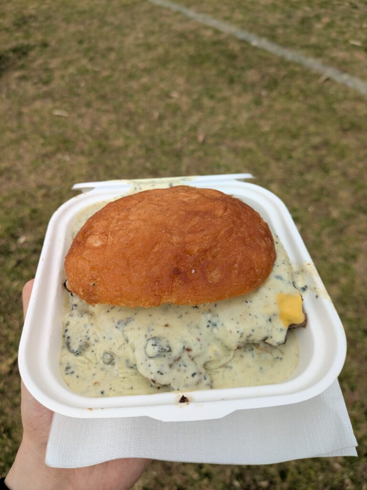
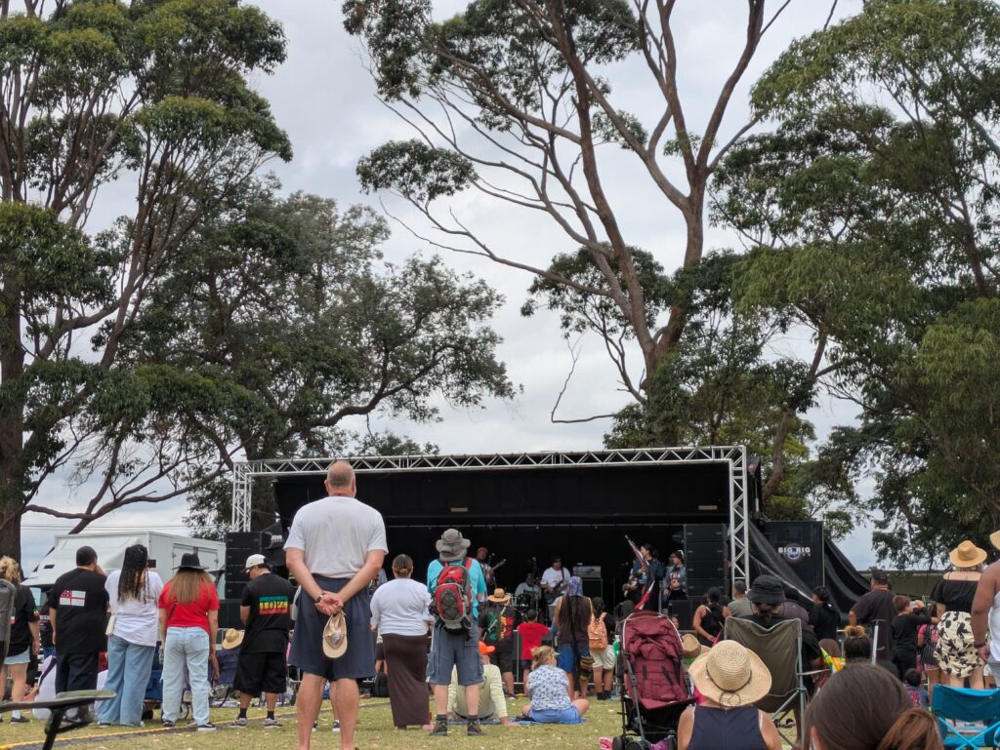
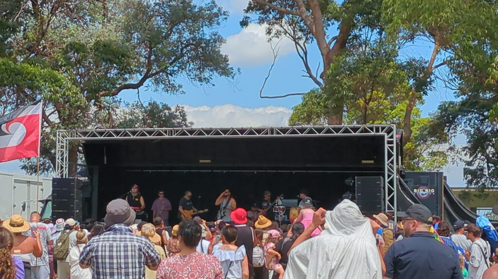
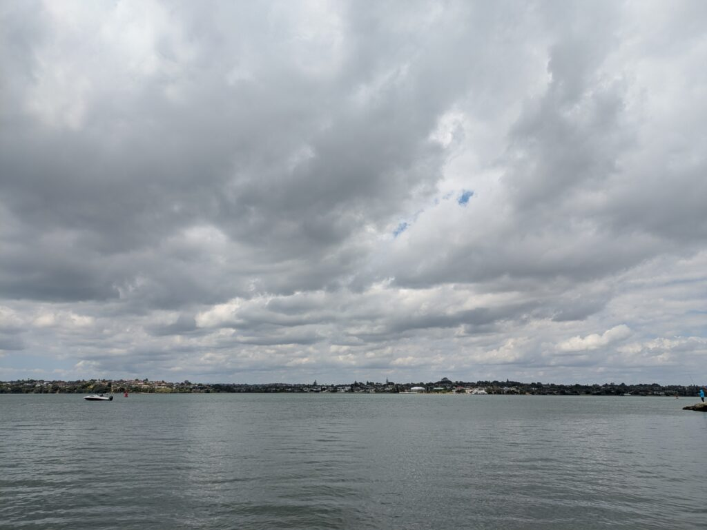

## Waitangi Dayとは

ニュージーランドでは2/6は休日です！Waitangi Dayという日になっています。この日はイギリス王室とマオリの酋長たちが条約を結んだ日らしいです。今も翻訳の解釈で議論があるみたいですが、不平等や課題に向き合う日を休日として制定したのは凄いですね。

### イベントの内容

というわけで暇になったので今回は[Point England Reserve](https://www.aucklandcouncil.govt.nz/parks-recreation/Pages/park-details.aspx?Location=98)に行きました。今回はここでマオリの歌やダンスをやってました。

後はご飯ですね。独自のごはんというわけではないですが、変わったソースと肉？のようなものがかかったハンバーガーでした。名前までは忘れちゃったのですが、こんなハンバーガーです。

このハンバーガーは非常に食べにくいですね。手にソースがべったりついて中々大変でした。

ただ、味は良かったです。野菜は全くないですが、肉とチーズとソースがたっぷりですね。もちろんこのハンバーガだけではないですし、ダブルにしてボリュームを増やすこともできました。

あるいは他のお店で買うこともできます。ただ、メキシコ料理などもあったのでせっかくならということでWAITHANIハンバーガーを頂きました。

今度はロトルアでハンギを食べてみたいですね。いつ行けるか全くわかりませんが…

ご飯を軽く食べた後はショーをだらだらと見てました。子供たちが歌ってハカを披露したり、ラップやマオリに関わる歌を披露してました。こんな感じですね。

10a.m.から3p.m.の5時間ありましたが、ちょこちょこ休憩をはさみながら聞いてました。ステージ前は影がないので日光がきつかったです。

### その他のアクティビティ

それからこの近くはビーチがありました。そこまで広くないですが、家族連れが楽しそうにしてました。釣りをしてる人もいましたが、何が釣れるんですかね？

という感じで休日を楽しんできました。次の休日は4月みたいなので楽しみに待ちたいですね。ではでは。
