## Cursorを使ってみた

[Cursor](https://www.cursor.com/pricing)が凄いとだいぶ前に話題になりましたが、重い腰を上げてようやく使ってみました。

コードエディターとして使っても優秀ですし、テキストベースで自身の考えを整理するのにも使えそうですね。

興味を持ったのが音声入力でテキスト変換し、文字おこしした文を整理してもらうという[記事](https://anond.hatelabo.jp/20250228171948)です。日常的にも使えそうですし、コードの修正にも活用できそうでしたので使うことにしました。

### Cursorのインストールとダウンロード

まずはインストーラーのダウンロードから。Windows、Mac、LINUXがあるので使っているPCに応じて選びましょう。

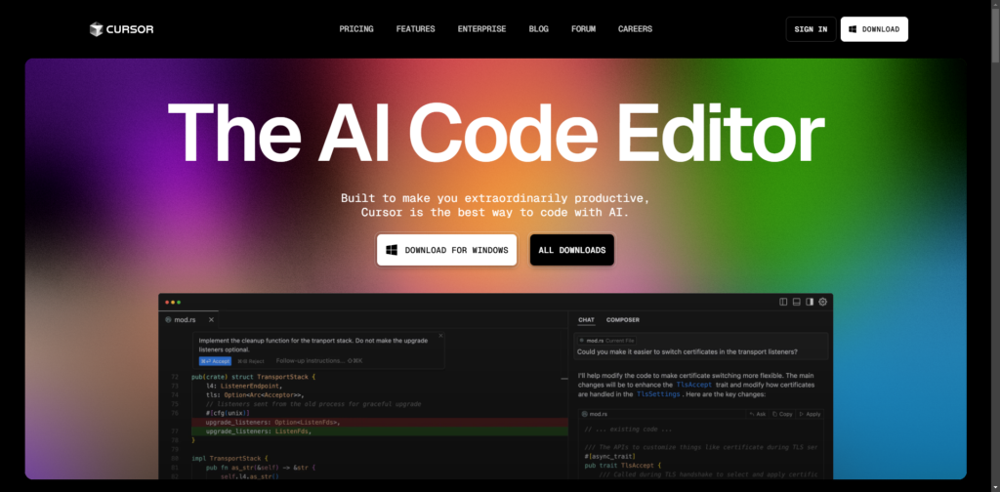

ダウンロードが完了したら、インストーラーを実行しましょう。基本的には何も変更せずポチポチ推して大丈夫です。こだわりがあれば変更するくらいですね。

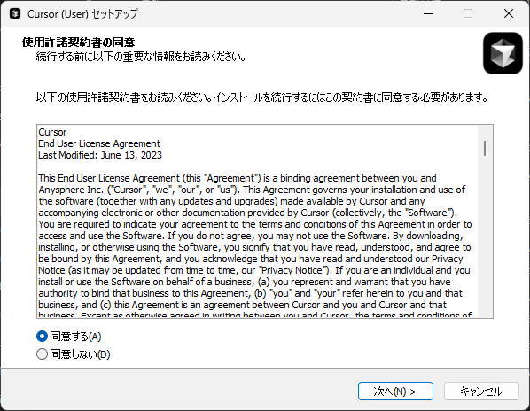

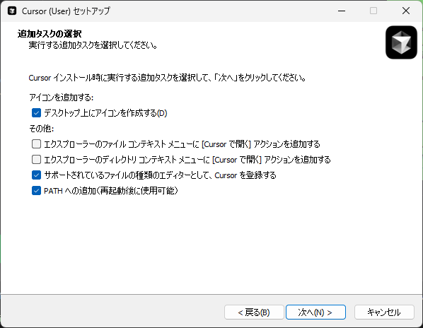

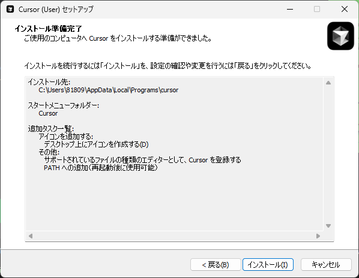

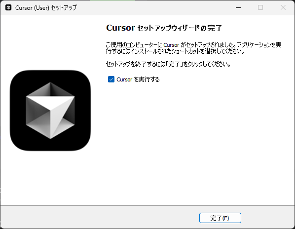

### Cursorの初期設定

インストールが完了したら実行して開きましょう。デフォルトのIDEはVS Codeになりますが、他のIDEを使ってる場合はそちらを選択しましょう。似たようなUIにしてくれると思います。

AIに対する言語は必要であれば選択しましょう。日本語なら"日本語"や"Japanese"で大丈夫だと思います。

Codebase-wideはプロジェクト全体を読み込ませるかどうかですね。単体のコードだけを読み込ませるなら不要だと思います。設定が完了したら"Continue"をクリックしましょう。

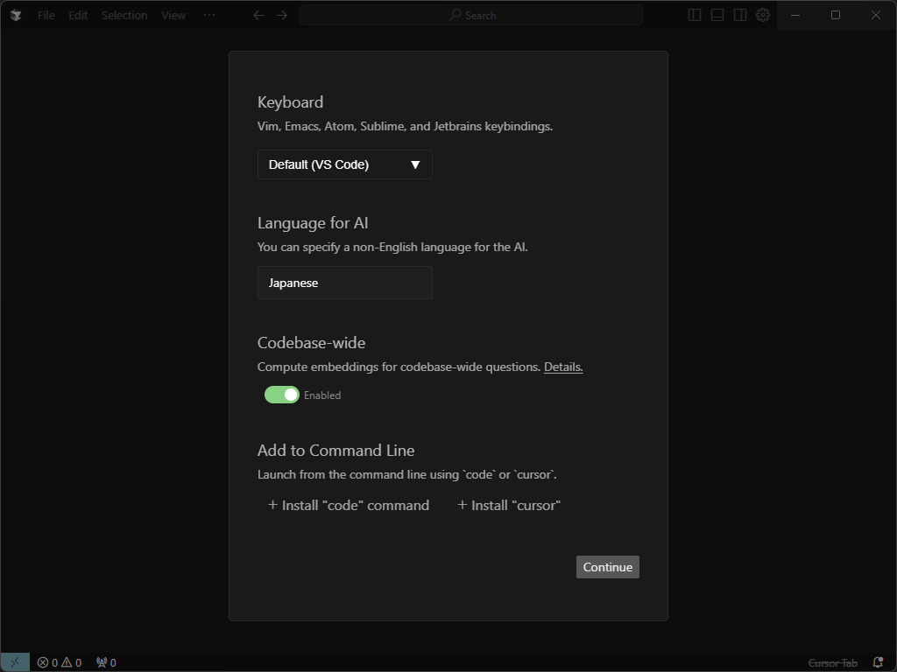

こちらはVS Codeを使ってると表示されます。VS Codeで使用してる拡張機能をそのまま使用するかの確認です。使うのであれば"Use Extensions"ですね。他のIDEはわかりませんが…

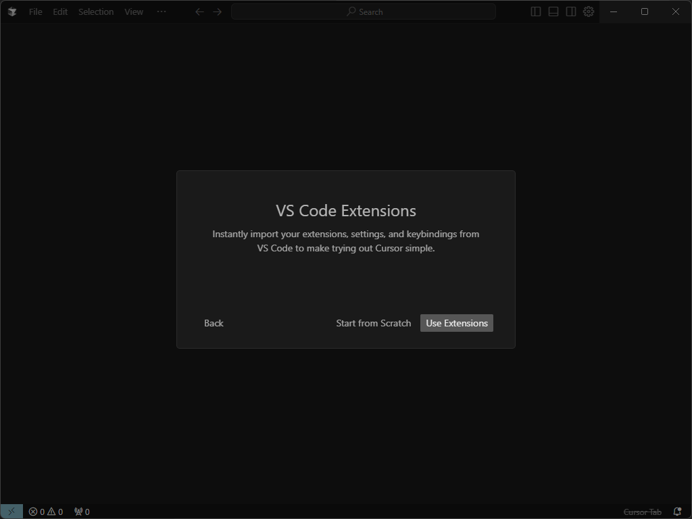

こちらは利用状況を送信するかの設定です。"Privacy Mode"であれば送信されなくなります。私は個人で使う分には気にならないですし、もっと発展してほしいので送信するようにしています。ただ、業務委託では使えませんが。

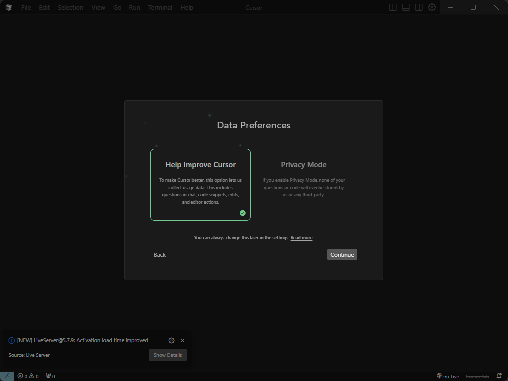

設定が完了したらログインが必要になります。Freeであってもですね。今のところはproにする予定がないのですが…

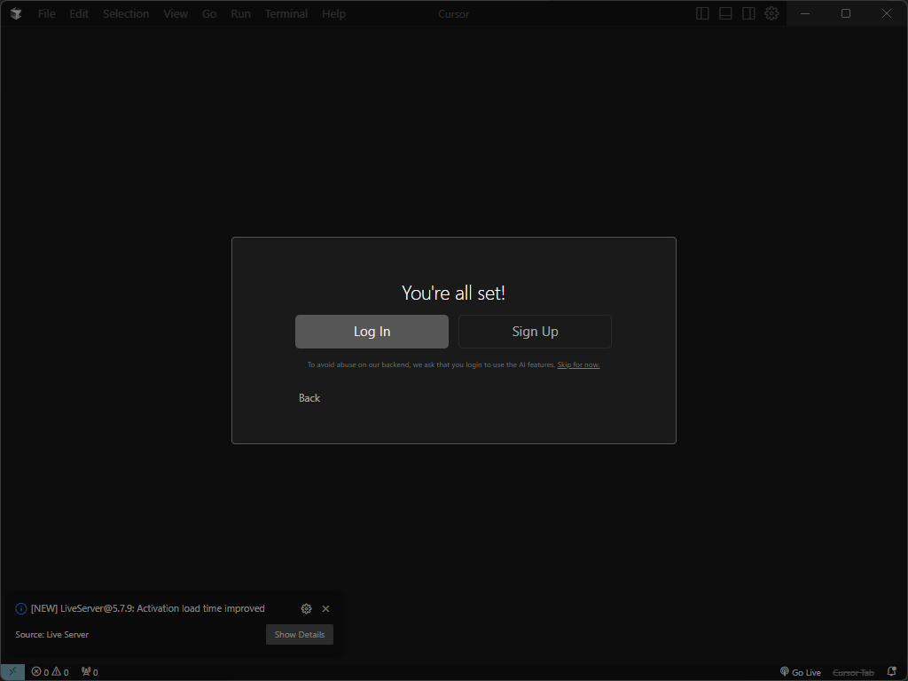

### リポジトリのクローン

ログインが完了したら初期画面はこんな感じ。後はここからプロジェクトを開くなり、Gitからリポジトリの接続をすることになります。ちなみに日本語UIへの変更はVS Codeと同じ手順で変更できます。

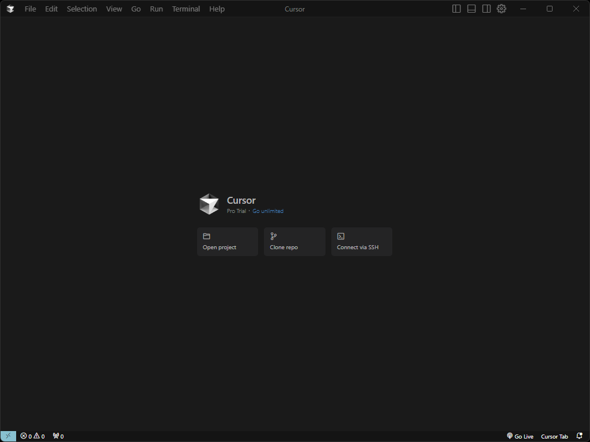

真ん中のcloneをクリックするとGitからcloneすることができます。Githubの場合は8桁のコードを求められます。画面に表示されますのでそれをペーストすれば問題ありません。

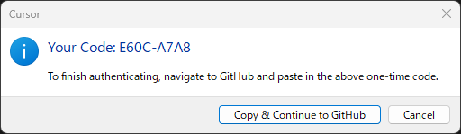

初期画面はこんな感じ。拡張機能のCotinueと似たようなUIに感じますね。

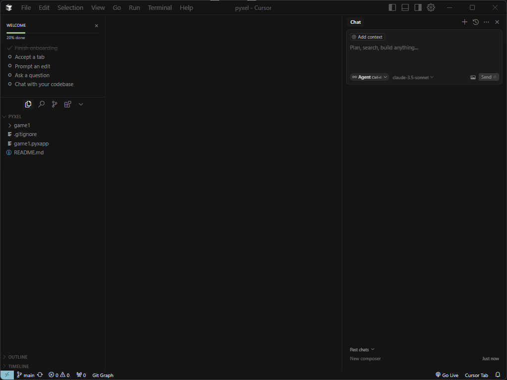

freeの場合、最初の2週間はproを使うことができます。アカウントの設定画面でどれくらい使ったかを確認することができます。

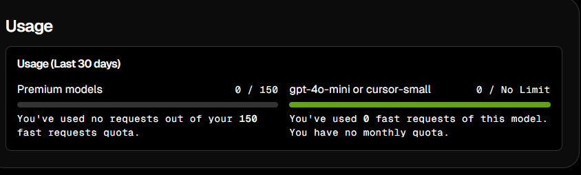

### Cursorを使ってコーディング

次は実際に使ってみましょう。Agent、Ask、Editを使い分けます。使い分けとしてはこんな感じみたいです。

- Agent: AIが考えてコードの変更や提案をする

- Ask: シンプルに質問する

- Edit: コードやテキストを変更したり指示する

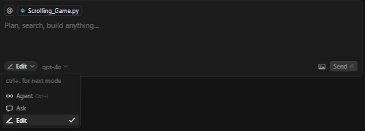

モデルは4oですね。モデルによってはproにするか設定を変えないとダメみたいです。

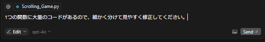

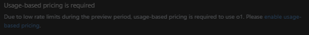

実際に実行してみるとこんな感じです。変更内容に問題なければ確定します。ちなみに動かしてみましたが、特に問題もなく動きました。リファクタリングが楽でめっちゃ嬉しい！

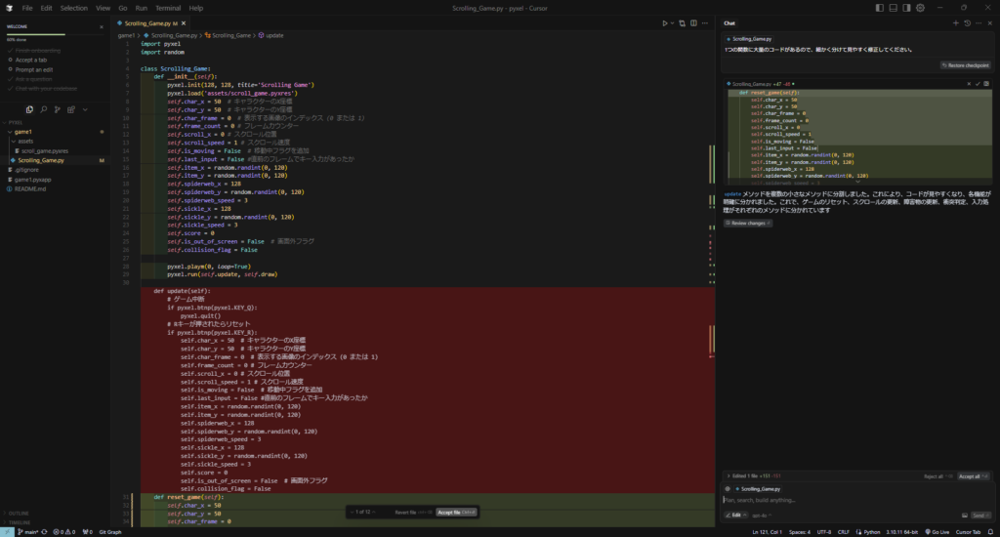

最後にAIに指示を出して意図通りの動きをするコードが作れるか試してみました。複雑になりすぎないように2つに分割しました。私が描いたイメージはAIが読み取ってくれるわけではないので、そこはコードをコピペして指示を出しました。こんな感じ。

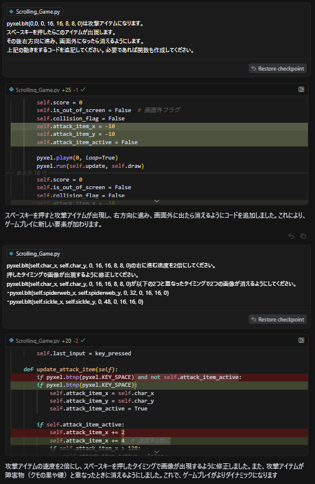

少しだけ手作業で修正しましたが、ほぼ完ぺきに作ってくれました。障害物は名前から推定したんだと思います。流石に配色とその位置から形を推測するのはまだ無理だと思うので。

### 終わりに

ただ、正直に言うとなめてました（笑）ほぼ完璧に指示をこなして[コード](https://github.com/sai-nome/pyxel)を書いてくれるとは。何よりリファクタリングが嬉しいですね。もちろんこれだけのためにお試しで導入するのもありだと思います。読みやすくもなるし、今後の作業も楽になると思うので。ではでは。
