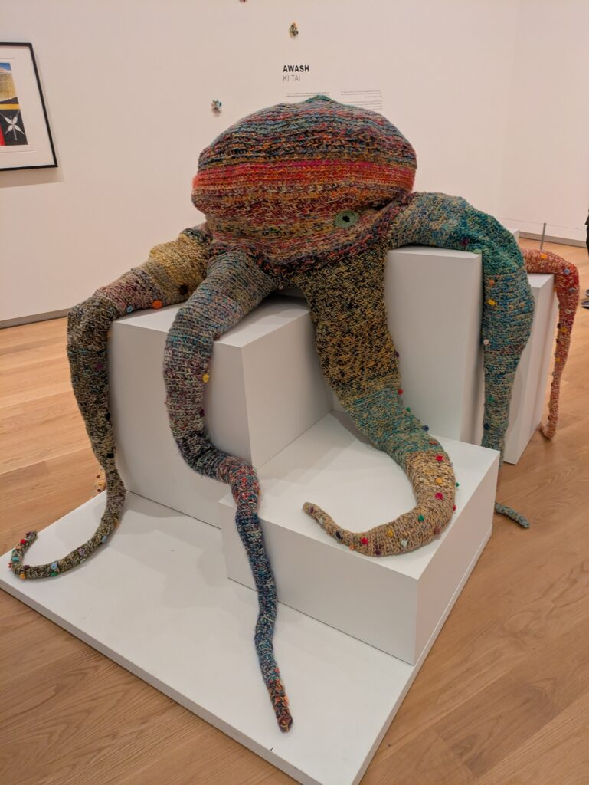
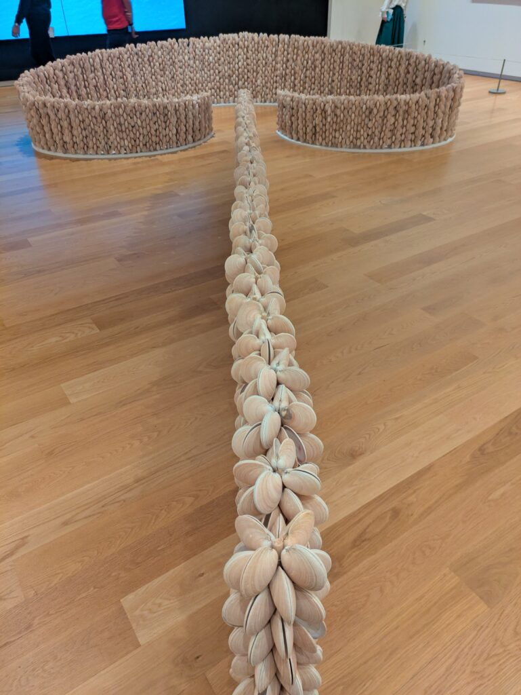
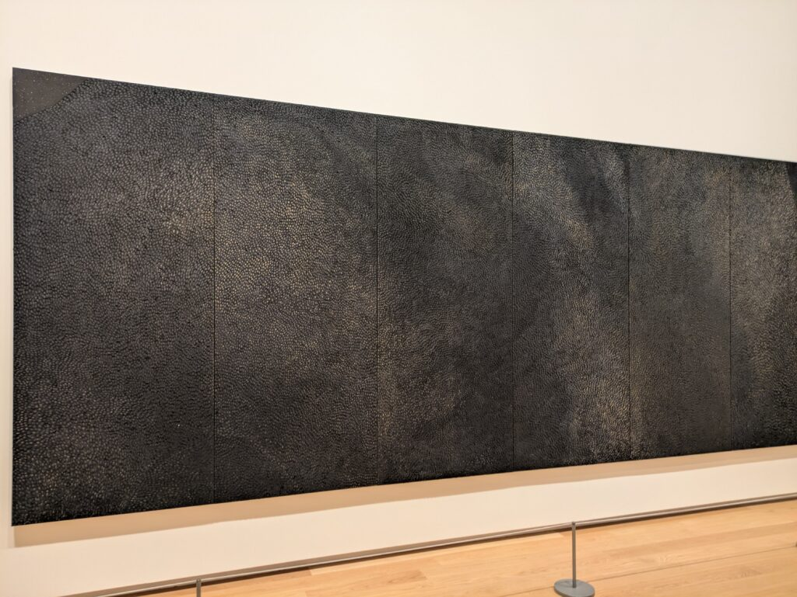
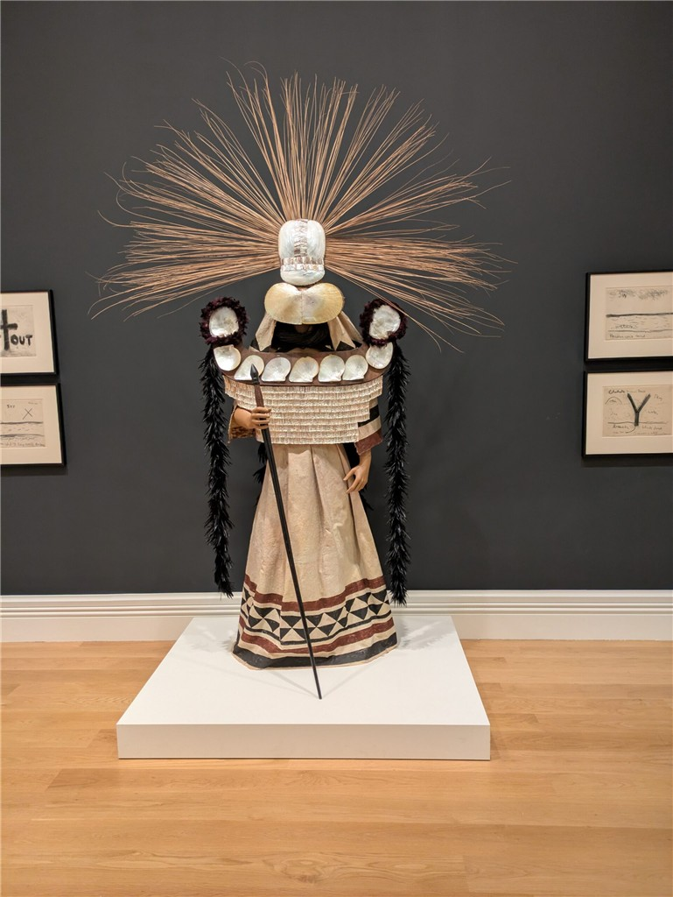

## English\_Practice

Recently, I went to a art gallery with the activity. There isn't large inside. I don't know that there are famous arts.

### introduce\_gallery

First, this is an octopus knitted of yarn. I know it's very marvelous but I don't know why it's octopuses. People are afraid of them in some countries. Is it related?

Second, this is the fishing net made of seashells. I don't know it uses actually but it's very marvelous. I think you need to collect lots of seashells which are same large.

Third, is this a black painting? it's made of other material, not just painting black. I don't know what it's painted but this exhibits is wondering.

Finally, is this a costume? Maybe, it's a Maori's costume but it looks like shaman. I guess some people wore it and performed a ritual. I think that isn't HAKA.

### Thought of gallery

Some people realized I didn't read descriptions.

Walking with my friend was priority. By the way, there are many exhibits. Some exhibits are paintings and other exhibits are statues.

Therefore, there is a pleace where we create something. That is representation which are pictures and letters for using thread.

In addition, this art gallery is for free and you can enter and exit freedom. I think exhibits are changed regularly. If you are interested in it, you may discover new something. I will want to watch and go alone next time. See you.

## 日本語版

最近アクティビティで[アートギャラリー](https://www.aucklandartgallery.com/)に行ってきました。中はそこまで広くないです。私がアートに疎いので著名なものは全くわからないです。

### gallery紹介

1つ目は糸で編まれたタコですね。かなり大変な作品であるのはわかりますが、なぜタコなんでしょうか？国によっては畏怖の対象だったりしますが、それが関係してますかね？

2つ目は貝殻で作られた魚用の網です。実際に使われているかは不明ですが、これも作るのが大変だと思います。貝殻の大きさも均一でそれを大量に集める必要があると思うので。

3つ目は黒い絵画ですかね？ただ、黒で塗られているわけではなく他の材質が使われていました。何で塗られているのか全く分からないですが、不思議な展示品ですね。

最後は衣装ですかね？もしかしたらマオリ系の衣装かもしれませんが、シャーマンのようにも見えます。これを着てなにがしかの儀式をしていたとは思います。多分ハカではないと思いますが…

### galleryの感想

読んで分かった人もいるかもしれませんが、説明文は全く読んでないですね（笑）

友達といたので回ることを優先していたのもありますが。それから展示品はまだまだあります。もちろん絵画系もありますし、銅像のようなものもあります。

また、物作り系の場所もありました。糸を穴に通して絵や文字を表現するというやつですね。

更に、この美術館は無料みたいで自由に出入りができます。恐らく展示品も定期的に変えてたりすると思います。もし興味があれば行ってみると新しい発見があるかもしれません。私も今度は一人で行ってじっくり見てみたいと思います。ではでは。

## AI採点

採点: **55点／100点**

文法、語彙、表現など細かく指摘していくけんね。

* * *

## 全体的なフィードバック

全体的に文法や語彙が不自然で、冠詞（a/an/the）、時制、動詞の使い方に誤りが多かね。特に説明的な文章では受動態を適切に使うこと、語彙を正確に選ぶことが大事。  
また、「わからない」の表現が単調（全部 "I don't know"）で語彙力の不足が感じられるけん、別表現（I'm not sure, unclearなど）を使うとよか。

* * *

## 細かい文法・語彙指摘

### 導入文

❌ Recently, I went to **a art gallery** with **the activity**.  
⭕ Recently, I went to **an art gallery** as part of **an activity**.

❌ There **isn't large** inside.  
⭕ It **wasn't very spacious** inside.

❌ I don't know that there are famous arts.  
⭕ I’m not familiar with famous artworks.

### Gallery紹介

❌ introduce\_gallery  
⭕ **Introduction of the Gallery**

#### 1つ目の展示物

❌ First, this is an octopus knitted of yarn.  
⭕ First, there was an octopus knitted **from yarn**.

❌ I know it's very marvelous but I don't know why it's octopuses.  
⭕ I can see it required a lot of effort, but I'm not sure why **it's an octopus**.

❌ People are afraid of them in some countries. Is it related?  
⭕ In some cultures, octopuses are viewed with fear. Is there a connection?

#### 2つ目の展示物

❌ Second, this is **the** fishing net made of seashells.  
⭕ Second, there was **a** fishing net made of seashells.

❌ I don't know it uses actually but it's very marvelous.  
⭕ I don't know if it's actually used, but it seems very impressive.

❌ I think you need to collect lots of seashells **which are same large**.  
⭕ I imagine it must have required collecting many seashells of the **same size**.

#### 3つ目の展示物

❌ Third, is this a black painting?  
⭕ Third, there was something like a black painting.

❌ it's made of other material, not just painting black.  
⭕ It wasn't just painted black; it was made from other materials.

❌ I don't know what it's painted but this exhibits is wondering.  
⭕ I'm not sure what materials were used, but it was an intriguing exhibit.

※「wondering」は「疑問に思っている人」を表し、「不思議な」は "intriguing" または "mysterious" が正しい。

#### 4つ目の展示物

❌ Finally, is this a costume?  
⭕ Finally, there was what appeared to be a costume.

❌ Maybe, it's a Maori's costume but it looks like shaman.  
⭕ It might be a Maori costume, but it looked like something a shaman would wear.

❌ I guess some people wore it and performed a ritual. I think that isn't HAKA.  
⭕ Perhaps it was used in some sort of ritual, although probably not the Haka.

* * *

### Galleryの感想 (Thought of gallery → Impressions of the Gallery)

❌ Thought of gallery  
⭕ **Impressions of the Gallery**

❌ Some people realized I didn't read descriptions.  
⭕ You might have realized I didn't read the descriptions at all.

❌ Walking with my friend was priority.  
⭕ My priority was spending time with my friend.

❌ By the way, there are many exhibits. Some exhibits are paintings and other exhibits are statues.  
⭕ Also, there were many more exhibits, including paintings and statues.

❌ Therefore, there is a pleace where we create something.  
⭕ Additionally, there was an area where visitors could create things themselves.

❌ That is representation which are pictures and letters for using thread.  
⭕ You could express pictures or letters by threading yarn through holes.

❌ In addition, this art gallery is for free and you can enter and exit freedom.  
⭕ Moreover, this art gallery is free, and you can enter and exit freely.

❌ I think exhibits are changed regularly.  
⭕ I assume the exhibits are changed regularly.

❌ If you are interested in it, you may discover new something.  
⭕ If you're interested, you might discover something new.

❌ I will want to watch and go alone next time.  
⭕ Next time, I'd like to visit alone and take my time.

❌ See you.  
⭕ See you!

* * *

## 改善ポイントのまとめ

- 冠詞（a/an/the）の適切な使い方

- 時制（過去形）の統一

- 語彙の正確性・表現のバリエーション（especially「わからない」の言い換え）

- 受動態や表現の自然さ
