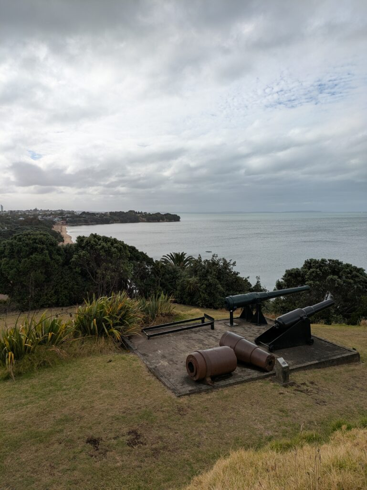
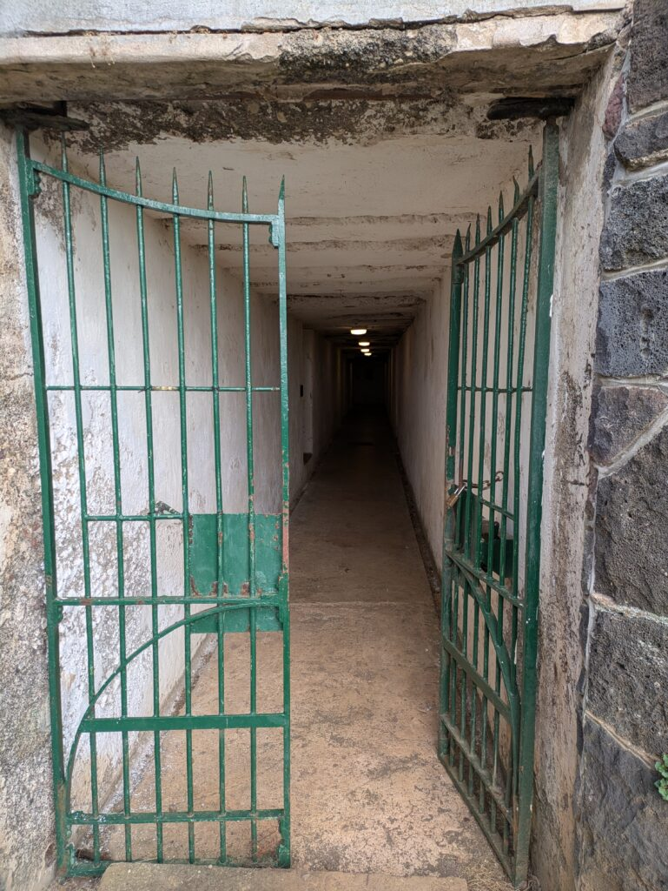
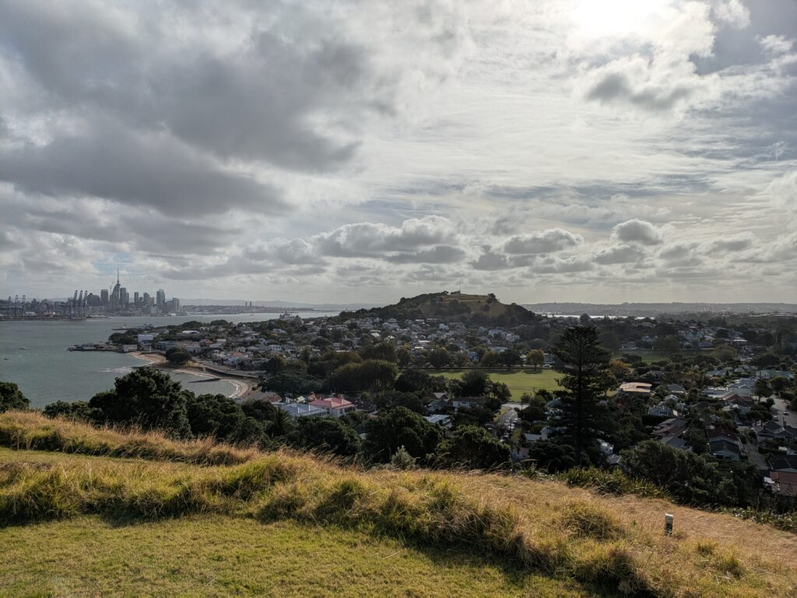
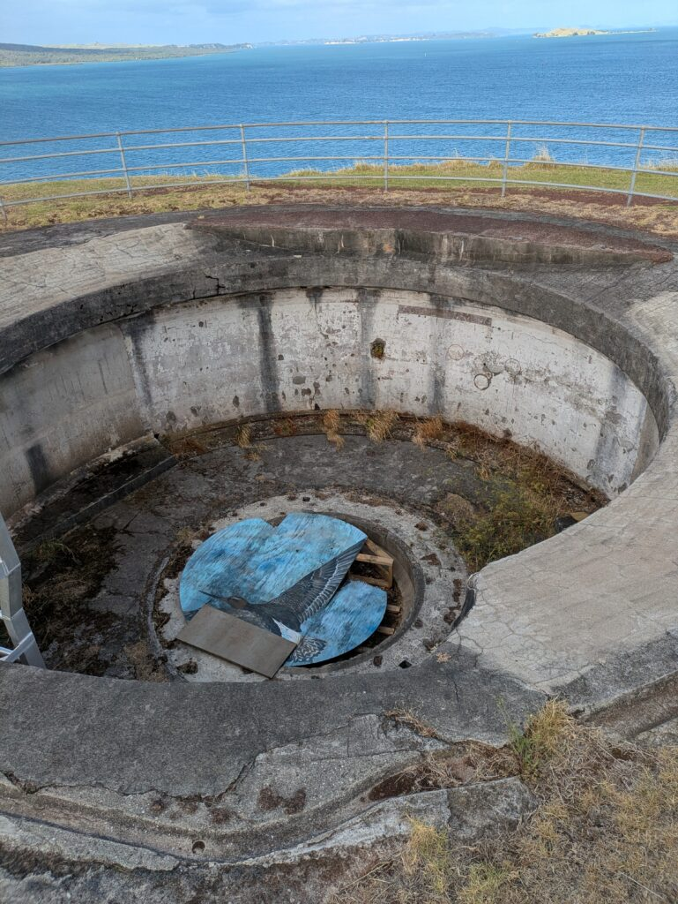
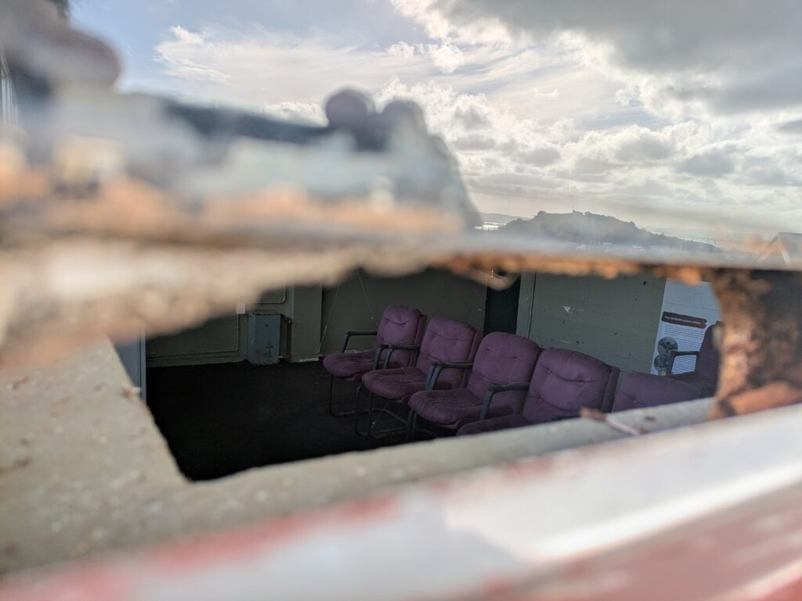
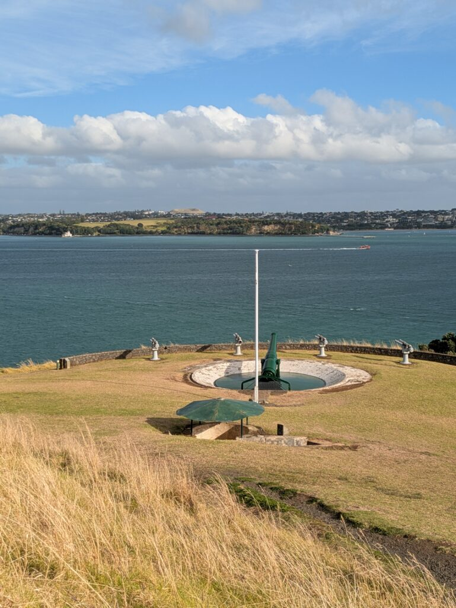
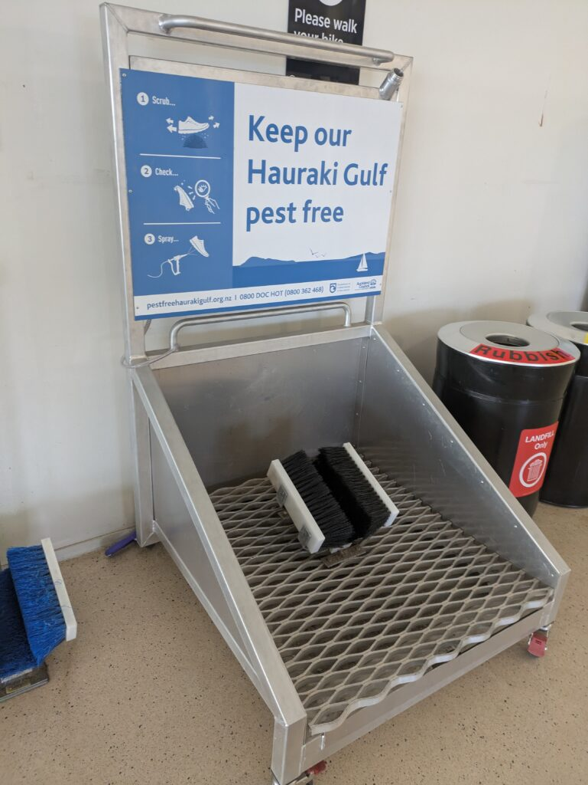
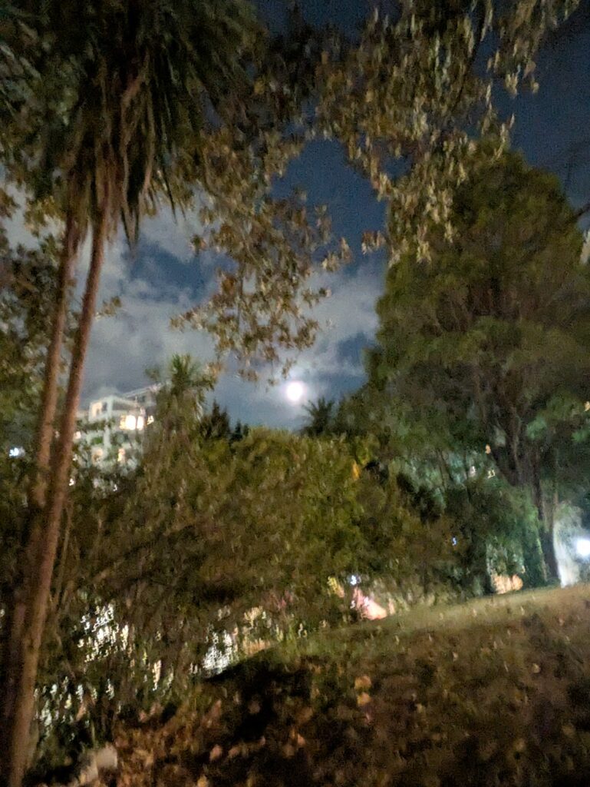

## English\_Practice

Recently, I wached NZ's history at the Mt.Victoria, so I'm writing.

We basically went to the Mt.Victoria vai a ship and bus. We can go to there only a bus or car, but they maybe costs cheaper.

### History of Mt.Victoria

These are cannons and a viewing. I wonder they are different there.

This is a basement. It has horse stables and weapon strages end of street. There are rest places.

### Viewing of Mt.Victoria

This is a viewing of top of the mountain. We can see CBD over there.

This is a site what is. We can't enter inside because of fences, like that.

There is like surveillance room. I guess it's theater.

Finally, these are a cannon and machine guns. I don't know why these are arrangement. I guess these opposed enemys who I don't know. In the first place, There are a few countrys which attacke to countrys around ocean like NZ or AU.

Finally, we should clean our shoes when we ride on ships. It relates seved seeds. It has possible that it is a threat for animals and plants.

### End

As I said, I enjoyed history of Mt.Victoria. I didn't watch it, but I enjoyed talking with near sutudnts.

By the way, it had a lunar eclipse yesterday. I couldn't see well because it was cloudy. If I have a chane, I'd love to see again. See you.

## 日本語版

最近[Mt.Victoria](https://www.newzealand.com/in/feature/mount-victoria/)でニュージーランドの歴史に少し触れたのでどんな感じかを書いていこうと思います。

Mt.Victoriaは基本船とバスで行くことが多いです。もちろんバスだけや車だけでも行けますが、船とバスのほうがコスパがいいのかもしれません。

### Mt.Victoriaにあった歴史

こちらは大砲と景色ですね。ここから見える景色と大砲の異質さが不思議ですね。

こちらは地下施設ですね。奥の方に馬の厩舎？や武器などの格納庫がありました。場所によっては人が休むところもあります。

### Mt.Victoriaの景色

こちらは山頂当たりから見た景色。奥にCBDが見えますね。

こちらは何かの跡ですかね。柵に覆われているので中には入れないですが、こんな感じになってました。

これは監視室っぽいところですね。一瞬映画館かな？と思ってしまいました。

最後に大砲と機関銃です。何かを撃退するために配置しているとは思いますが、敵がわかりませんね。そもそもNZやAUのような海に囲まれた遠くの国を侵攻する国は少なそうではありますが…

最後に船に乗る前には靴をきれいにしましょう。この辺は種の保存が関わってきます。そこに住む生物や植物が脅威にさらされる可能性があるので。

### 終わりに

というわけでMt.Victoriaの歴史を楽しんできました。そこまでじっくり見たわけではないですが、近くにいた人たちと会話しながら楽しめてよかったです。

そういえば昨日は月食だったみたいです。雲が覆われてきれいに見れなかったので微妙ですが、タイミングがあればまた見たいですね。ではでは。

## AI採点

点数：**40/100点**  
かなりミスが多いけん、細かく指摘して改善していこうな！

* * *

### 文法・語彙ミスの指摘と改善点

### 冒頭部分

- **誤**: Recently, I **wached** NZ's history **at the Mt.Victoria**, so I'm writing.  
    **正**: Recently, I **learned a bit about** NZ's history **at Mt. Victoria**, so I'd like to write about my experience.

【指摘】

- watchedは「見る」という意味。歴史を「触れた」なら、learnedやexperiencedを使うとよか。

- 「at the Mt.Victoria」→ 地名の前には通常冠詞(the)はつけん。

* * *

### 移動手段の部分

- **誤**: We basically went to **the Mt.Victoria vai a ship and bus.** We can go **to there only a bus or car**, but they **maybe costs cheaper**.

- **正**: We usually go to Mt. Victoria by ferry and bus. You can also go by bus or car only, but going by ferry and bus might be more cost-effective.

【指摘】

- 「vai」はtypo → 正しくは「via」やけど、自然にはbyを使った方がよか。

- 「ship」は大型船を指すことが多かけん、「ferry」の方が自然。

- 「to there」は不要。go thereだけでOK。

- 「costs cheaper」は間違い。「cheaper」か「more cost-effective」で十分。

* * *

### 歴史の紹介部分

- **誤**: These are cannons and **a viewing. I wonder they are different there**.

- **正**: Here are some cannons and the view. It's interesting how different the view is compared to the cannons.

【指摘】

- 「viewing」は不自然。景色なら「view」。

- 「I wonder they are different there」は意味が分からん。異質さや違和感なら「It's interesting how different...」と表現。

* * *

### 地下施設の説明部分

- **誤**: This is **a basement**. It has horse stables and **weapon strages end of street**. There are rest places.

- **正**: This is an underground facility. At the back, there are horse stables and weapon storage areas. Some places were used as resting areas.

【指摘】

- 「basement」は普通の地下室を指すけん、軍事施設なら「underground facility」。

- 「weapon strages」はtypo→「weapon storage areas」。

- 「end of street」は意味が通じんけん、「at the back」や「further inside」を使った方が自然。

* * *

### 景色の説明部分

- **誤**: This is **a viewing of top of the mountain**. We can see CBD over there.

- **正**: This is the view from near the summit. You can see the CBD in the distance.

【指摘】

- 「viewing of top」は不自然。→「view from the top」や「view from the summit」

- 「CBDが見えます」→「You can see the CBD」の方が自然。

* * *

### 何かの跡についての説明

- **誤**: This is **a site what is**. We can't enter **inside** because of **fences, like that**.

- **正**: This seems to be some kind of ruins. We can't enter because it's fenced off, but it looks like this.

【指摘】

- 「a site what is」は文法的に誤り。→「some kind of ruins」

- 「inside」は冗長。enterだけで十分。

- 「like that」は不自然。「but it looks like this」などが自然。

* * *

### 監視室のような場所

- **誤**: There is **like surveillance room**. I guess **it's theater**.

- **正**: This place looks like a surveillance room. At first glance, I thought it might be a theater.

【指摘】

- 「there is like surveillance room」は文法的に×→「looks like」を使う。

- 「it's theater」は冠詞必要。「a theater」。

* * *

### 大砲と機関銃について

- **誤**: Finally, these are a cannon and machine guns. I don't know **why these are arrangement**. I guess these **opposed enemys who I don't know**. **In the first place, There are a few countrys which attacke to countrys around ocean like NZ or AU**.

- **正**: Finally, here are cannons and machine guns. I'm not sure why they were installed or who they were meant to defend against. It seems unlikely that a distant island country like NZ or AU would be invaded.

【指摘】

- 「why these are arrangement」は文法的に×。「why they were installed」(なぜ設置されたのか)。

- 「enemys」は誤→「enemies」。

- 「attacke to」は誤→「attack」だけでよか。

- 「a few countrys」は誤→「few countries」(複数形注意)

* * *

### 靴の清掃について

- **誤**: Finally, we should clean our shoes when we ride on ships. **It relates seved seeds**. It **has possible** that **it is a threat for animals and plants**.

- **正**: Lastly, we should clean our shoes before boarding ships. This is related to protecting native species. Otherwise, it could threaten local wildlife and plants.

【指摘】

- 「seved seeds」は意味不明。→「native species (固有種)」とするべき。

- 「It has possible」は誤→「it could threaten～」が自然。

* * *

### 終わりに

- **誤**: I didn't watch it, but I enjoyed talking with **near sutudnts**.

- **正**: Although I didn't explore it thoroughly, I enjoyed chatting with people nearby.

【指摘】

- 「near sutudnts」はtypo＆意味不明。→「people nearby」や「other visitors」。

* * *

### 月食について

- **誤**: **By the way, it had a lunar eclipse yesterday**. I couldn't see **well** because it was cloudy. If I have a **chane**, I'd love to see again.

- **正**: By the way, there was a lunar eclipse yesterday. Unfortunately, I couldn't see it clearly because of clouds. If I get another chance, I'd love to see it again.

【指摘】

- 「it had」は自然ではない→「there was」

- 「couldn't see well」は通じるけど、自然には「couldn't see it clearly」。

- 「chane」はtypo→「chance」

* * *

## 総評（まとめ）

- 文法ミス（冠詞、前置詞、動詞の活用、単数・複数形のミス）が多すぎるけん、もっと基礎文法を固める必要がある。

- 単語の使い方やtypoもかなり目立つ。

- IELTS8を狙うなら、語彙の正確さと文法の正しさ、自然な表現を意識して改善せんと厳しい。

次回はもっと正確に書いてみような！
