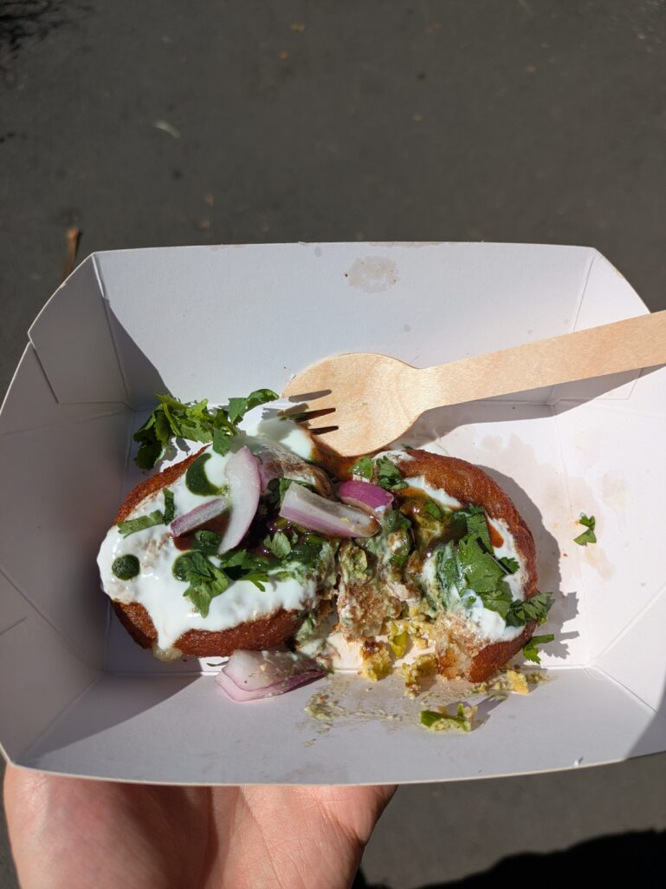
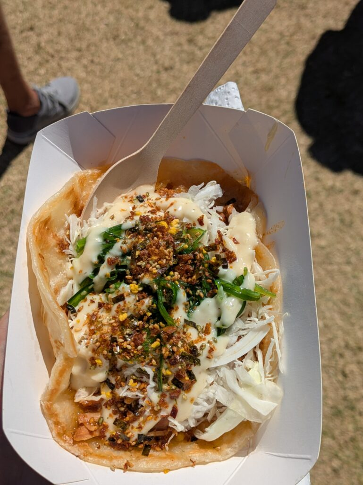
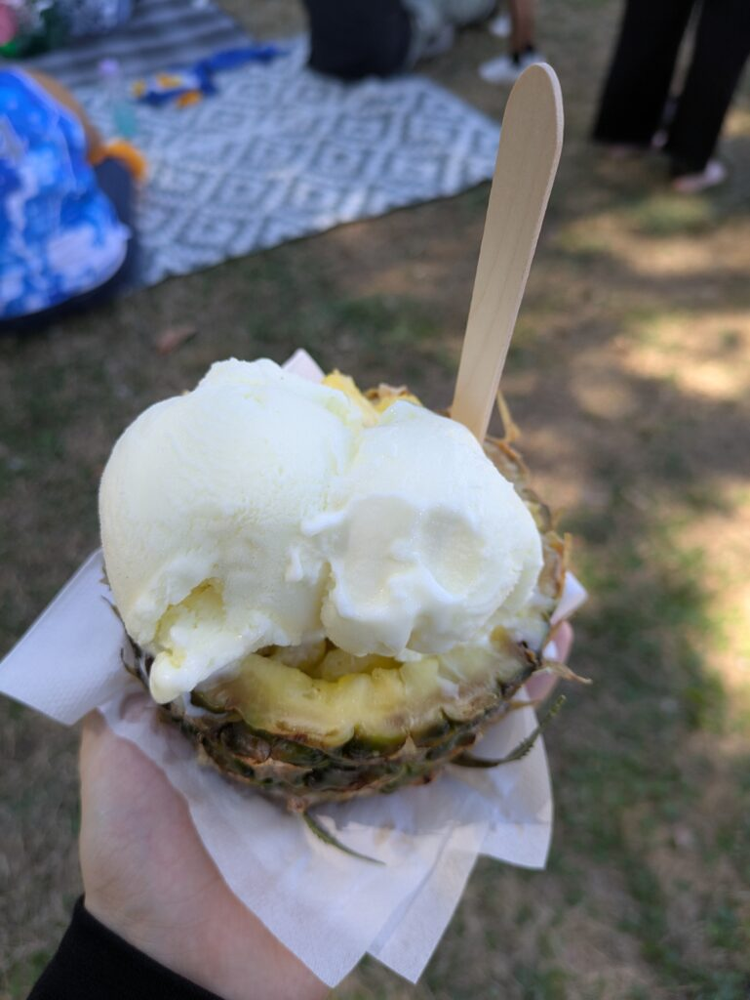
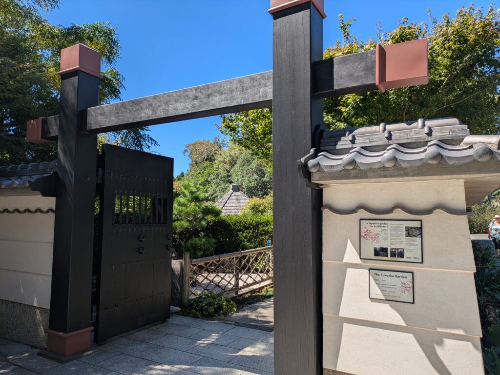

## English\_Practice

I looked Pasifika Festival on 8th and 9th March. I looked events Waitangi day previously, but it's same.

There were 5 or 6 stages and There were sold clothes and foods beside there. I understood there were stages and foods but is it culture which is clothes?

### Pasifika Festival' meals

I watched stages while eating foods. I introduce eating foods. Firstly, this is Paneer cutlets.

I guess this is indian foods and fried potatoes. Sauce is a little sweet. However, it has chopped chili peppers so if you don't like spicy foods, you shouldn't eat it. I like spicy foods so I ate it so good.

Next, this is Hawker roll which is malaysia foods. This is delicious. This has roasted chicken, crispy cabbages, crunchy seaweeds, a little sweet sauce, sprinkling of flakes and chewy dough. This combining is awesome!

It costs $14 and it is cheaper than other foods because other curry costs $20.

Finally, this is ice cream. It is dessert which is ice cream in pineapple container. This taste is imagine. If I eat it again, I will cook myself because it costs cheaper.

### Pasifika Festival's show and garden

I watched show while eating foods. This is HAKA. I was fun to watch other shows and hear songs.

Finally, I want to the Fukuoka garden. Auckland has had a relationship to Fukuoka City since 1986 and it was donated 2017. It is small but it looks like japanese style and I felt comfortable.

Let you visit! I recommend it which we feel comfortable and nostalgy. If I have a oppotunity, I'd love to visit there. See you!

## 日本語版

3月8日と9日にあった[Pasifika Festival](https://www.aucklandnz.com/pasifika)を見てきました。[前に](/posts/2025/02/waitangi-day/)ワイタンギデーでイベントを見てきましたが、内容的にはあれと同じですね。

規模的にはステージが5,6くらいあって、その周りに服やご飯が売られているという感じでした。ステージとご飯はわかりますが、服飾系もあるのは文化なんですかね？

### Pasifika Festivalで食べたご飯

というわけでいくつかご飯を食べながらステージを見てました。食べてみたご飯を紹介してみます。まずはこのPaneer cutletsですね。

インド料理でジャガイモの揚げ物だと思われます。ソースは少し甘めです。ただ、中に赤と青の唐辛子が細切れで入れてあるので、辛いものが苦手な人は食べないほうが良いですね。私は好きなので美味しく食べましたが。

次にHawker rollです。こちらはマレーシア料理ですね。これはめちゃくちゃ美味しかったです。ローストチキンにシャキシャキのキャベツ、コリコリした海藻と甘タレ、おかかのようなふりかけにもちもちの生地が組み合わさって最高です！

値段は$14くらいで比較的安い方ですね。他のカレーとかだと$20くらいが多かったので。

最後はこちらのアイスです。パイナップル容器にアイスを入れたシンプルなデザートですね。味は想像通りです。次食べるときは自分で作ると思います、そっちの方が安いので（笑）

### Pasifika Festivalのショーや庭園を見て回ったよ

ご飯を軽く食べながらこんな感じのショーを見てました。これはハカですね。他にもいろんなショーや歌を見れて楽しかったです。

最後にThe Fukuoka gardenに行ってきました。どうやらオークランドは福岡市と姉妹都市みたいです。提携自体は1986年ですが、2017年ごろに寄贈されました。小さくはありますが日本らしい庭園で心地よい限りです。

ぜひ訪れてみてください。心地よさと懐かしさを感じるのでおすすめですね。また機会があったら音擦れてみたいです。ではでは。

## AI採点

### 採点: **55/100点**

文法・語彙・表現のミスがかなり多く、改善点が多かばいね。一文ずつ丁寧に指摘するけん、よう見てみて。

* * *

## 詳細なフィードバック:

### 【文法・語彙のミス】

1. **I looked Pasifika Festival on 8th and 9th March.**
    - × looked → ○ visited または went to または attended
    
    - 日付の表現はOKやけど、冠詞(the)が必要:  
        → **I visited the Pasifika Festival on the 8th and 9th of March.**

3. **I looked events Waitangi day previously, but it's same.**
    - × looked → ○ saw または attended
    
    - 冠詞と前置詞が不足：「イベントを見る」は **attended** や **went to**
    
    - 「前にも」は **before** や **previously**  
        → **I previously attended the event on Waitangi Day, and it was basically the same.**

5. **There were 5 or 6 stages and There were sold clothes and foods beside there.**
    - × There were sold clothes → ○ clothes and food were sold
    
    - × beside there → ○ around them  
        → **There were about 5 or 6 stages, and clothes and food were sold around them.**

7. **I understood there were stages and foods but is it culture which is clothes?**
    - 表現が不自然。質問文にする場合はシンプルに:  
        → **I understand the stages and food, but I wonder if selling clothes is also part of their culture?**

* * *

### 【食べ物の説明部分】

5. **I watched stages while eating foods. I introduce eating foods.**
    - foodsはfoodに(不可算名詞)
    
    - 「紹介します」はI'll introduceやLet me introduceが自然  
        → **I watched the stages while eating some food. Let me introduce the food I tried.**

7. **Firstly, this is Paneer cutlets.**
    - Paneer cutletsが複数形ならareにする必要あり  
        → **Firstly, these are Paneer cutlets.**

9. **I guess this is indian foods and fried potatoes.**
    - × foods → ○ food（不可算）
    
    - 表現が不自然。"Paneer cutlet"は「揚げたインドのポテト料理」と明確に伝えるべき。  
        → **It's an Indian dish, basically fried potatoes.**

11. **Sauce is a little sweet.**
     - × Sauce → ○ The sauce  
         → **The sauce is a little sweet.**

13. **it has chopped chili peppers**
     - 自然な表現にするならinsideがほしい  
         → **it has finely chopped chili peppers inside.**

15. **I ate it so good.**
     - 表現が不自然  
         → **I enjoyed it very much.** または **It was delicious to me.**

* * *

### 【Hawker rollの説明】

11. **Next, this is Hawker roll which is malaysia foods.**
     - 「マレーシア料理」単数形のfoodに変更、冠詞theが必要  
         → **Next is the Hawker roll, which is Malaysian food.**

13. **This combining is awesome!**
     - 不自然な表現。"combination"を使うべき  
         → **This combination was awesome!**

* * *

### 【価格説明】

13. **It costs $14 and it is cheaper than other foods because other curry costs $20.**
     - 比較が不自然。もっと分かりやすく整理:  
         → **It cost about $14, relatively cheaper than other dishes, as curries usually cost around $20.**

* * *

### 【アイスクリームの説明】

14. **It is dessert which is ice cream in pineapple container.**
     - 冠詞と関係代名詞が不自然  
         → **It’s a simple dessert: ice cream served in a pineapple container.**

16. **This taste is imagine.**
     - 完全に誤り。"taste is imagine"という表現は存在しない  
         → **It tastes exactly as you'd imagine.**

18. **If I eat it again, I will cook myself because it costs cheaper.**
     - × cook → ○ make it myself
     
     - × costs cheaper → ○ it’s cheaper  
         → **If I eat it again, I'll make it myself because it's cheaper.**

* * *

### 【イベントと庭園の説明】

17. **I watched show while eating foods.**
     - × foods → ○ food
     
     - × show → ○ the shows (複数のショーを見たなら複数形)  
         → **I watched the shows while eating some food.**

19. **I was fun to watch other shows and hear songs.**
     - 「楽しかった」は "It was fun"  
         → **It was fun watching various other shows and listening to songs.**

21. **Finally, I want to the Fukuoka garden.**
     - × want → ○ went
     
     - 固有名詞は大文字 (Fukuoka Garden)  
         → **Finally, I went to the Fukuoka Garden.**

23. **Auckland has had a relationship to Fukuoka City since 1986 and it was donated 2017.**
     - 主語が不明確、文が分かりにくい  
         → **Auckland has been a sister city of Fukuoka since 1986, and this garden was donated around 2017.**

25. **It is small but it looks like japanese style and I felt comfortable.**
     - × japanese → ○ Japanese (大文字必須)
     
     - 「日本らしい庭園」は"Japanese-style garden"  
         → **It's small but a comfortable Japanese-style garden.**

27. **Let you visit!**
     - 表現が完全に間違い。"ぜひ訪れてみて"は"You should definitely visit."  
         → **You should definitely visit!**

29. **I recommend it which we feel comfortable and nostalgy.**
     - × nostalgy → ○ nostalgia
     
     - 文法も不自然  
         → **I recommend it because it’s relaxing and nostalgic.**

31. **If I have a oppotunity, I'd love to visit there.**
     - × a oppotunity → ○ an opportunity
     
     - × visit there → ○ visit againまたはreturn  
         → **If I have another opportunity, I'd love to visit again.**

* * *

## IELTSスコア向上のためのポイント

- 文法と語彙の正確さが低い。

- 表現が日本語直訳すぎる。英語らしい自然な言い回しを使う練習が必要やね。

- 単語の綴りミス（nostalgy→nostalgia、oppotunity→opportunity）を気をつけて。

博多弁やけど、IELTS 8.0狙うなら、正確な文法と自然な表現がかなり重要ばい！  
練習続けて、がんばりんしゃい！
