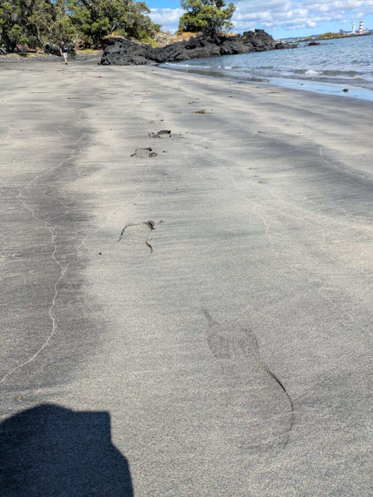
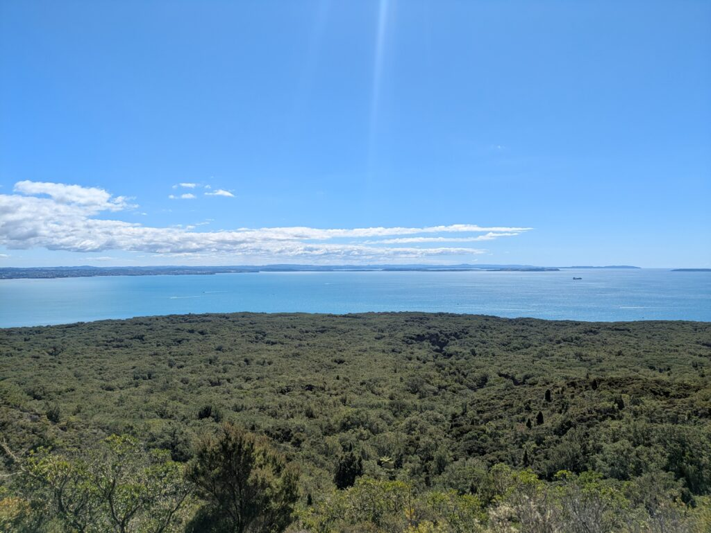
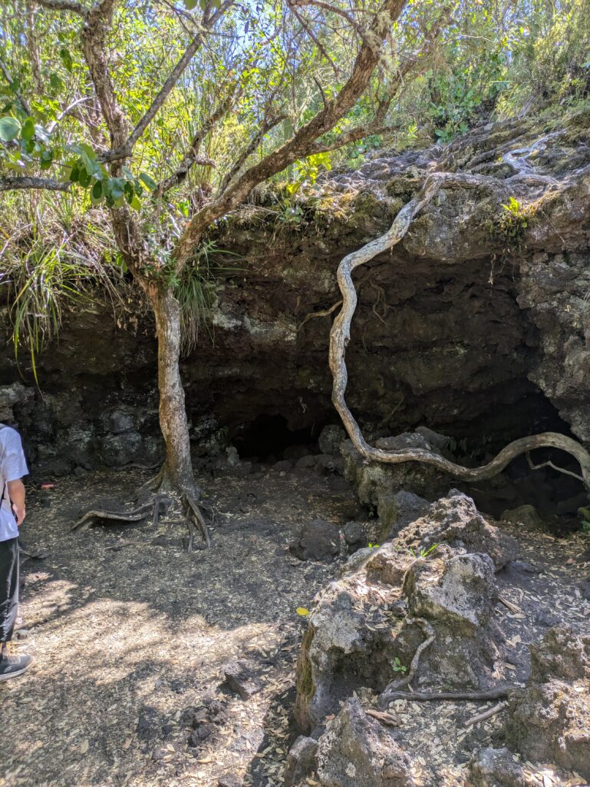

## English\_Practice

I went to Rangitoto Island. I suggested to go somewhere with my friend who will leave from LSI and go around NZ. In my opinion, I wanted to do activity but I can't do that because I had no time.

### To Rangitoto Island by a ferry

I went to Rangitoto Island by a ferry. It costs $58 and we arrive to there about 25 minutes. It's same fare if you buy a ticket online or at the counter.

I arrived there and walked around. However, my friend was late so I went to a beach. I think we just walked Rangitoto.

### walking Rangitoto Island

I waited my friend on the beach and went to the summit of mountain. I feel that scenes is similar between CBD and here.

Finally, I went to Lava Cave. It's special that It made from lava rocks. I recommend you bring a torch because it's dark. Therefore it's enough your smart phone's light.

### End

I walked around talking with my friend and came home. I talked chinese who is student in other school while riding on the ship. He talked more my friend than me and ate dinner with together.

I feel more exhausted than excited but that was a good experience. I can't recommend but you might see kiwi birds so let you go there. See you.

## 日本語版

[Rangitoto Island](https://www.newzealand.com/int/rangitoto-island/)に行ってきました。友達が学校を去ってあちこち周ると聞いたので最後にどっか行こうということで提案しました。個人的にはアクティビティのほうが良かったのですが、時間がないのでできませんでした。

### Rangitotoまでフェリーで

船で島に向かいます。料金は$58(約5,000円)で大体25分くらいで着きます。予約でも現地で買っても同じ値段らしいです。

というわけで着いて散策してきました。ただ、友達は遅れてくるようだったので先にビーチに向かってました。ちなみにRangitotoは散策がメインで他にやることはないですね。

### Rangitotoメインの散策場所

ビーチで待ってると友達が来たのでそのまま頂上まで行きました。とは言えCBDから離れただけで見える景色はそこまで大きく変わらない感じです。

最後に洞窟へ向かいました。特別な部分で言えば溶岩で出来てるくらいですね。中は暗いのでライトを持っていくことをおすすめします。もちろんスマホのライトでも十分ですが。

### 終わりに

雑談しながらぐるっと周って帰ってきました。帰りのクルーズで別学校の中国の人と話しました。私よりは友達と話してましたが、一緒にご飯を食べました。

楽しかったよりは疲れたという感じでしたが、良い経験になりました。おすすめはできないですがkiwiを見れるかもしれないらしいので是非行ってみてください。ではでは。

## AI採点

点数は **62/100点** くらいやね。

## フィードバックと修正点ば細かく言うちゃるけん、よく聞いときんしゃいね。

* * *

### ① 文法と語彙の間違い指摘

- **I suggested to go somewhere with my friend who will leave from LSI and go around NZ.**
    - × **suggested to go** → ○ **suggested going**  
        文法ミス。"suggest" は動名詞（-ing）使うとが正解。

- **In my opinion, I wanted to do activity but I can't do that because I had no time.**
    - × **In my opinion** → 不自然。ここではいらん。
    
    - × **to do activity** → ○ **to do some activities**
    
    - × **can't** (現在形) → ○ **couldn't** (過去形) 時制ミス。

- **It costs $58 and we arrive to there about 25 minutes.**
    - × **costs** (現在形でも悪くないが、過去の話なら過去形が自然) → ○ **cost**
    
    - × **arrive to there** → ○ **arrived there** または **got there**
    
    - × **about 25 minutes** → ○ **in about 25 minutes**（前置詞"in"が必要）

- **It's same fare if you buy a ticket online or at the counter.**
    - × **It's same fare** → ○ **The fare is the same**

- **I think we just walked Rangitoto.**
    - 不自然。→ ○ **Basically, walking around is the main thing to do in Rangitoto.**

- **I waited my friend on the beach and went to the summit of mountain.**
    - × **waited my friend** → ○ **waited for my friend**
    
    - × **summit of mountain** → ○ **summit** だけ、または **summit of the mountain**

- **I feel that scenes is similar between CBD and here.**
    - × **scenes is**（単数複数ミス）→ ○ **scenery is**
    
    - × **between CBD and here**（位置が逆）→ ○ **here and the CBD**

- **It's special that It made from lava rocks.**
    - × 文法不自然。→ ○ **It's special because it's made from lava rocks.**

- **I recommend you bring a torch because it's dark. Therefore it's enough your smart phone's light.**
    - × **Therefore** → ○ **However**（逆接にするべき）
    
    - × **it's enough your smart phone's light** → ○ **your smartphone's light is enough**

- **I talked chinese who is student in other school while riding on the ship.**
    - × **chinese** → ○ **to a Chinese student**
    
    - × **in other school** → ○ **from another school**

- **He talked more my friend than me and ate dinner with together.**
    - × **talked more my friend than me** → ○ **talked more with my friend than me**
    
    - × **ate dinner with together** → ○ **we ate dinner together**

- **I can't recommend but you might see kiwi birds so let you go there.**
    - × **I can't recommend** → ○ **I can't really recommend it**
    
    - × **let you go there** → ○ **you could give it a try**

* * *

### ② 自然な英文例（修正版）

I went to Rangitoto Island. I suggested going somewhere with my friend who was leaving LSI and traveling around NZ. I personally wanted to do some activities, but I couldn't because we didn't have enough time.

**Ferry to Rangitoto Island**  
We took a ferry to Rangitoto Island. It cost $58 (about 5,000 yen) and took about 25 minutes. The fare is the same whether you buy your ticket online or at the counter.

When I arrived, I started exploring. However, my friend was late, so I headed to the beach first. Basically, walking around is the main thing to do on Rangitoto.

**Exploring Rangitoto Island**  
After my friend arrived at the beach, we climbed to the summit. Honestly, the scenery wasn't much different from what you can see from the CBD.

Finally, we went to a lava cave, which is special because it's formed by lava rocks. It's dark inside, so I recommend bringing a torch, though your smartphone's light would be enough.

**End of the trip**  
We chatted while walking around the island and then headed back. On the ferry home, I talked to a Chinese student from another school. He talked more with my friend than with me, but we had dinner together.

Overall, I felt more exhausted than excited, but it was a good experience. I can't really recommend it strongly, but you might see kiwi birds, so you could give it a try. See you!

* * *

### ③ IELTSで8点取るためのアドバイス

- 文法（特に時制・冠詞・前置詞）の正確性が重要ばい。

- より自然な接続詞・表現を覚えて使えるようになると、スコアがさらに上がる。

- 文と文の繋がりが不自然やけん、接続詞や副詞（However, Therefore, Basically）ばもっと正しく使おう。
