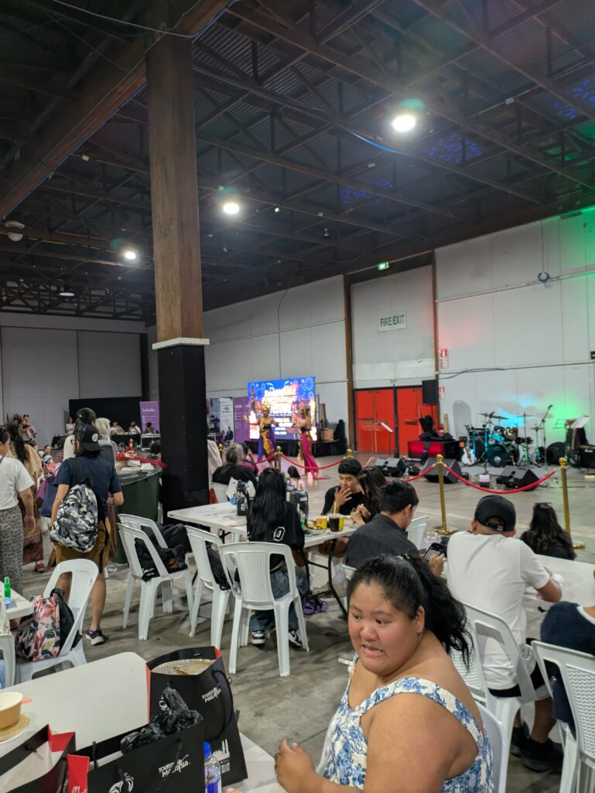
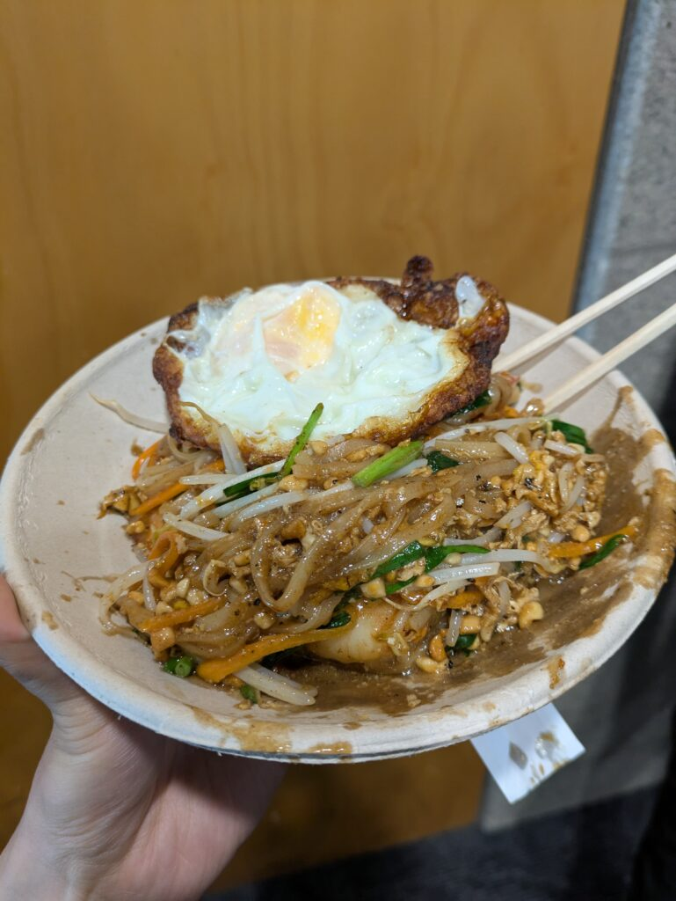
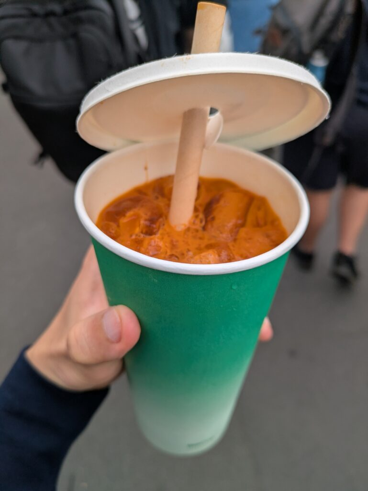

## English\_Practice

I went to the SoutheastAsia Festival!

Fortunately, I saw my friend and I knew about SoutheastAsia Festival. Therefore, I went to this.

SoutheastAsia Festival is that SoutheastAsians cook meals and dance traditional dance. However, a prat of companys took a booth. Maybe, they are sponsored.

### Scene from SoutheastAsia Festival

There is tradisional dance. Someone sang a song before this. I don't have oppotunities to watch other dance because I wasn't into inside.

After that, I ate lunch. Some classmates are from Thailand so I care that I ate phat thai and thai milk tea.

I think thai foods are famous about so spicy but phat thai isn't spicy. It is delicious prawns, nodels, a little sauce.

Thai milk tea was sweat and it's stronger tasty milk than tasty tea. I thank that I'm not good at tea.

### impressions of SoutheastAsia Festival

I looked around there with my friend and his friends. Sometimes it was rain but I had a good day.

To be honest. I'd love to talk my calssmates and eat Thai foods. See you.

## 日本語版

[SoutheastAsia Festival](https://seasia.co.nz/)に行ってきました！

前日に友達と会いたまたまSoutheastAsia Festivalについて知ったので行ってきました。

そもそもSoutheastAsia Festivalというのは東南アジア系の人が会場で料理を振舞ったり、伝統舞踊を披露したりする場になります。ただ、一部の企業はブースを出してましたね。スポンサーなのかもしれませんが。

### SoutheastAsia Festivalの様子

舞踊はこんな感じ。このひとつ前は歌を披露してました。中にあまりいなかったので他の踊りを見る機会がなかったのですが。

後はご飯を食べてました。私のクラスにはタイ出身の人も多いので、気になってたパッタイとタイティーを食べてみました。

タイは辛いものが有名なので少し覚悟してましたが、パッタイは辛くないですね。エビのぷりぷりともちもちの麺に少し甘めのタレが絡んで美味しいです。

タイティーも甘かったです。また、紅茶の味よりもミルクのほうが強かったですね。紅茶は得意じゃないので個人的にはありがたかったです。

### SoutheastAsia Festivalの感想

この日は友達とその友達と見回ってました。ちょこちょこ雨が降って大変でしたが、楽しめた一日だったと思います。

もう少し欲を言えば、たまたまあったクラスメートともう少し話すのとタイフードを味わいたかったですね。ではでは。

## AI採点

ほんなこつ、この英訳は100点満点中 **40点** くらいやね。以下、各文ごとに文法や語彙、表現のミスを細かく指摘するけん、参考にしてみんしゃい。

* * *

### 【全体的な感想】

- **文法・語彙のミスが多い:**  
    スペルミス（“SoutheastAsia”の綴り、"phat thai"、"tradisional"、"oppotunities"、"nodels"、"calssmates" など）が目立つほか、冠詞・前置詞の使い方にも問題があるばい。

- **直訳調で不自然:**  
    日本語の構造をそのまま英語にしてしまってる部分が多く、ネイティブな表現になっていないと感じるね。

- **内容の伝達:**  
    全体の意味はなんとなく伝わるばってん、各文をより自然で明確な英語にする必要があるばい。

* * *

### 【詳細なフィードバック】

#### 1\. 導入部分

**原文:**

> I went to the SoutheastAsia Festival!

- **指摘:**
    - "SoutheastAsia" は **"Southeast Asia"** と、スペースを入れて表記するのが自然。

- **改善例:** I went to the Southeast Asia Festival!

* * *

#### 2\. イベント参加の経緯

**原文:**

> Fortunately, I saw my friend and I knew about SoutheastAsia Festival. Therefore, I went to this.

- **指摘:**
    - 「I saw my friend and I knew about SoutheastAsia Festival」 は、因果関係が不明瞭。
    
    - "Therefore, I went to this." は不自然。

- **改善例:** I happened to run into a friend, and I learned about the Southeast Asia Festival, so I decided to go.

* * *

#### 3\. イベント内容の説明

**原文:**

> SoutheastAsia Festival is that SoutheastAsians cook meals and dance traditional dance. However, a prat of companys took a booth. Maybe, they are sponsored.

- **指摘:**
    - 「SoutheastAsia Festival is that SoutheastAsians cook meals and dance traditional dance.」は直訳調で不自然。
        - 自然な表現は、**"The Southeast Asia Festival is an event where Southeast Asians serve food and perform traditional dances."**
    
    - 「a prat of companys took a booth」
        - "a prat" はおそらく "a part" か "some" にする。
        
        - "companys" は正しくは **"companies"**。
        
        - 例: **"However, some companies had booths at the event."**
    
    - 「Maybe, they are sponsored.」
        - 意味が曖昧。おそらく「スポンサーである可能性がある」と言いたい。
        
        - 例: **"They might have been sponsors."**

- **改善例:** The Southeast Asia Festival is an event where Southeast Asians serve food and perform traditional dances. However, some companies also had booths, possibly as sponsors.

* * *

#### 4\. イベントの様子（舞踊の部分）

**原文:**

> Scene from SoutheastAsia Festival
> 
> There is tradisional dance. Someone sang a song before this. I don't have oppotunities to watch other dance because I wasn't into inside.

- **指摘:**
    - 見出しは **"Scenes from the Southeast Asia Festival"** とするとよか。
    
    - 「tradisional dance」は **"traditional dance"** にする。
    
    - 「Someone sang a song before this.」は、**"Before the dance, someone performed a song."** のほうが自然。
    
    - 「I don't have oppotunities to watch other dance because I wasn't into inside.」
        - "oppotunities" は **"opportunities"** で、また "watch other dance" は **"see other dances"** にする。
        
        - 「because I wasn't into inside.」は意味が不明瞭。おそらく「会場内にあまりいなかったので他の踊りを見る機会がなかった」という意味なら、**"I didn't get a chance to see other dances because I didn't stay inside."** などと明確にする。

- **改善例:** **Scenes from the Southeast Asia Festival**  
    There was a traditional dance performance. Before the dance, someone performed a song. I didn't get a chance to see other dances because I didn't stay inside.

* * *

#### 5\. ランチについて

**原文:**

> After that, I ate lunch. Some classmates are from Thailand so I care that I ate phat thai and thai milk tea.

- **指摘:**
    - 「Some classmates are from Thailand so I care that I ate phat thai and thai milk tea.」は意味が不明瞭。
        - おそらく「タイ出身のクラスメートがいるので、パッタイとタイミルクティーを試してみた」という意味なら、**"Since some of my classmates are from Thailand, I made sure to try Pad Thai and Thai milk tea."**
    
    - "phat thai" は正しくは **"Pad Thai"**。
    
    - "thai milk tea" は **"Thai milk tea"** と大文字で統一。

- **改善例:** After that, I had lunch. Since some of my classmates are from Thailand, I made sure to try Pad Thai and Thai milk tea.

* * *

#### 6\. タイ料理の味について

**原文:**

> I think thai foods are famous about so spicy but phat thai isn't spicy. It is delicious prawns, nodels, a little sauce.

- **指摘:**
    - 「I think thai foods are famous about so spicy」→ **"Thai food is famous for being very spicy"** が自然。
    
    - 「but phat thai isn't spicy.」→ **"but Pad Thai isn't spicy."**
    
    - 「It is delicious prawns, nodels, a little sauce.」は文法が乱れてる。
        - 意図としては「パッタイは、ぷりぷりのエビともちもちの麺、そして少し甘いソースが絡んでいて美味しい」という意味なら、
        
        - 例: **"It features succulent prawns, chewy noodles, and a slightly sweet sauce."**
    
    - "nodels" は **"noodles"** に訂正。

- **改善例:** I think Thai food is famous for being very spicy, but Pad Thai isn't spicy at all. It features succulent prawns, chewy noodles, and a slightly sweet sauce.

* * *

#### 7\. タイミルクティーについて

**原文:**

> Thai milk tea was sweat and it's stronger tasty milk than tasty tea. I thank that I'm not good at tea.

- **指摘:**
    - 「was sweat」→ **"was sweet"** あるいは **"was a bit sweet"**。
    
    - 「it's stronger tasty milk than tasty tea」→ 意味が不明瞭。
        - おそらく「ミルクの風味が強く、紅茶の味は控えめだった」という意味なら、
        
        - 例: **"The milk flavor was more pronounced than the tea."**
    
    - 「I thank that I'm not good at tea.」→ 意味が伝わりにくい。
        - 例: **"I'm glad because I'm not really a tea person."**

- **改善例:** The Thai milk tea was a bit sweet, with a stronger milk flavor than tea, which I actually liked since I'm not really a tea person.

* * *

#### 8\. 感想部分

**原文:**

> impressions of SoutheastAsia Festival
> 
> I looked around there with my friend and his friends. Sometimes it was rain but I had a good day.
> 
> To be honest. I'd love to talk my calssmates and eat Thai foods. See you.

- **指摘:**
    - 見出しは **"Impressions of the Southeast Asia Festival"** と大文字統一。
    
    - 「I looked around there with my friend and his friends.」→ **"I wandered around with my friend and his friends."** または **"I explored the festival with my friend and his friends."**
    
    - 「Sometimes it was rain」→ **"It rained occasionally"** とする。
    
    - 「To be honest. I'd love to talk my calssmates and eat Thai foods.」
        - "To be honest" は前の文と接続して、**"To be honest, I would have loved to chat more with my classmates and try even more Thai food."**
    
    - "calssmates" は **"classmates"** に訂正。
    
    - 「eat Thai foods」→ 単数形の **"Thai food"** が一般的。

- **改善例:** **Impressions of the Southeast Asia Festival**  
    I explored the festival with my friend and his friends. It rained occasionally, but overall I had a good day.  
    To be honest, I would have loved to chat more with my classmates and try even more Thai food. See you.

* * *

### 【総合評価】

- **総得点:** 40点／100点

- **改善のポイント:**
    - スペルミスや文法ミス（冠詞、前置詞、動詞の形、リストの整合性）を修正すること。
    
    - 直訳調にならんよう、自然な英語表現を意識すること。
    
    - 各文章をより明確で読みやすく、論理的な流れになるように再構成すること。

この調子で、各文を見直して正しい語彙と自然な文法を意識して練習すると、点数アップが狙えるけん、がんばってみんしゃい！
