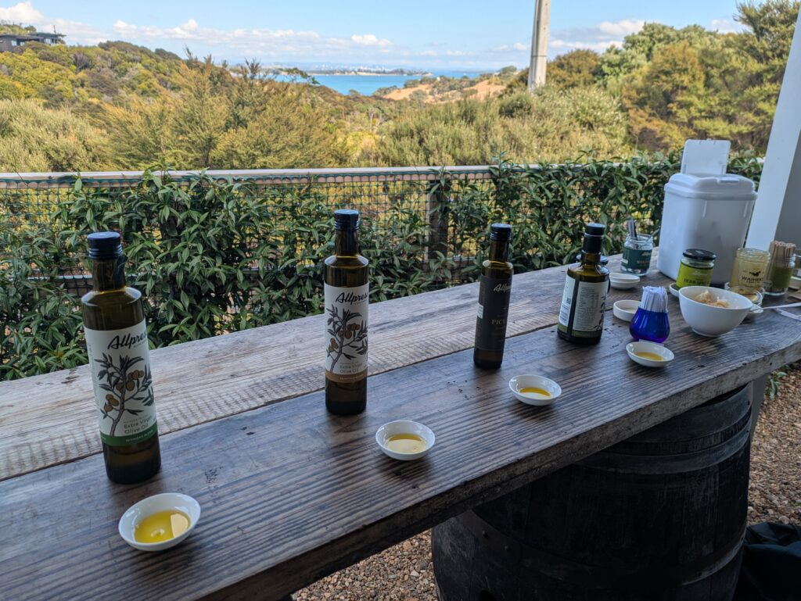
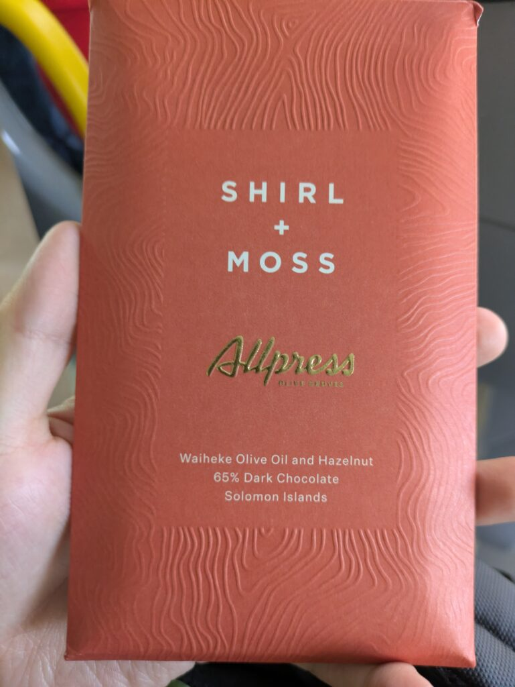
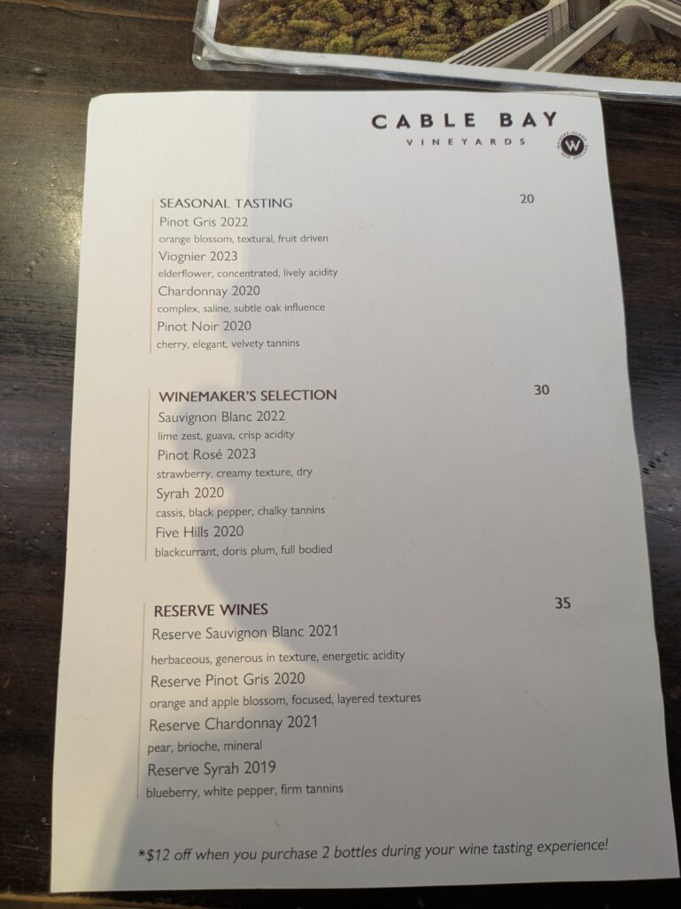
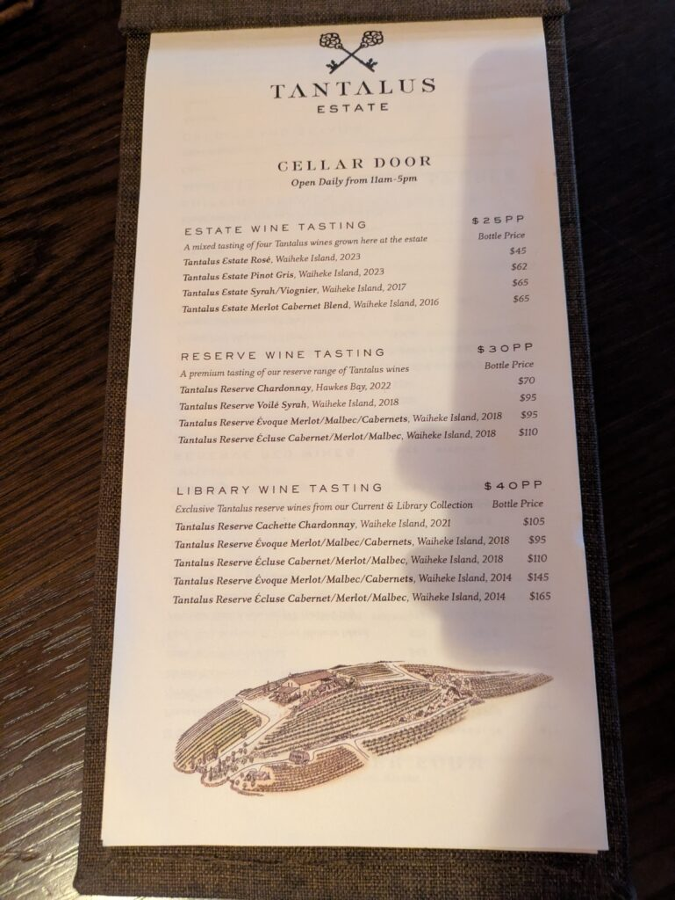
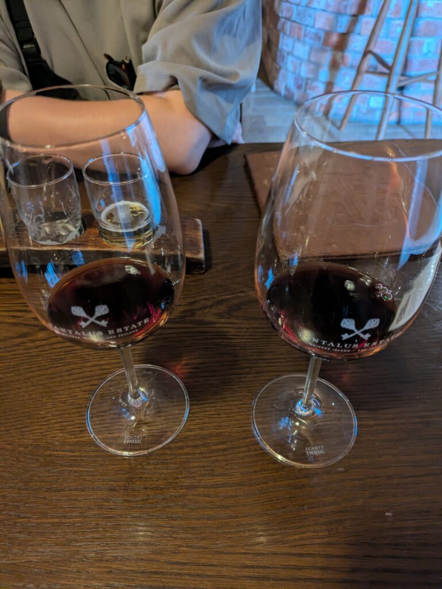
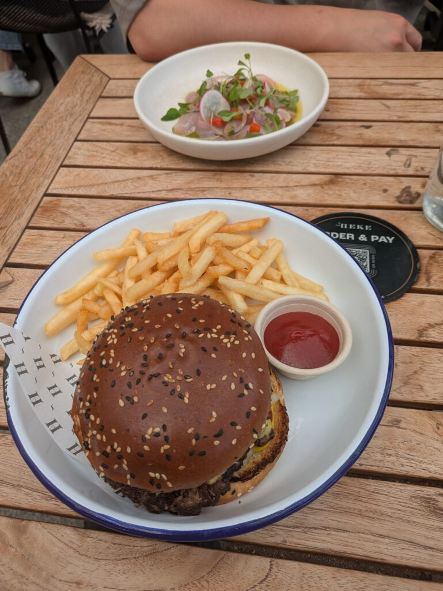
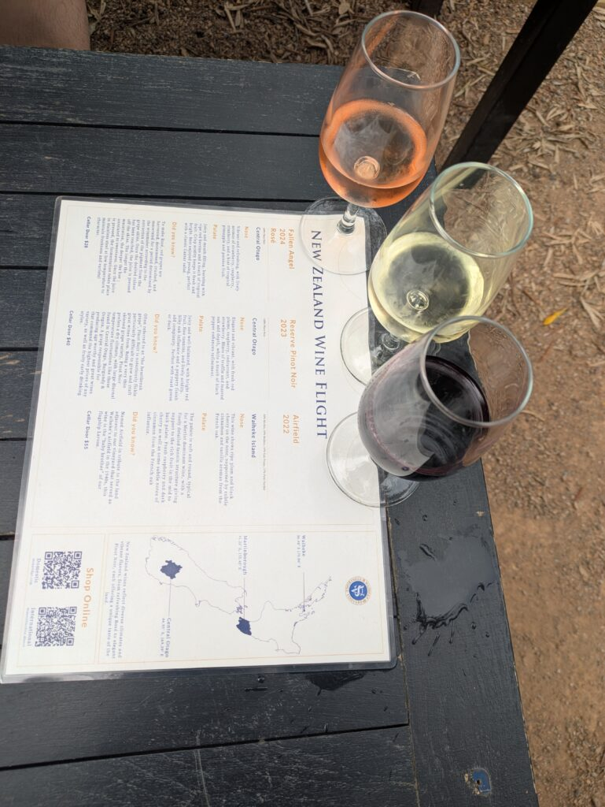
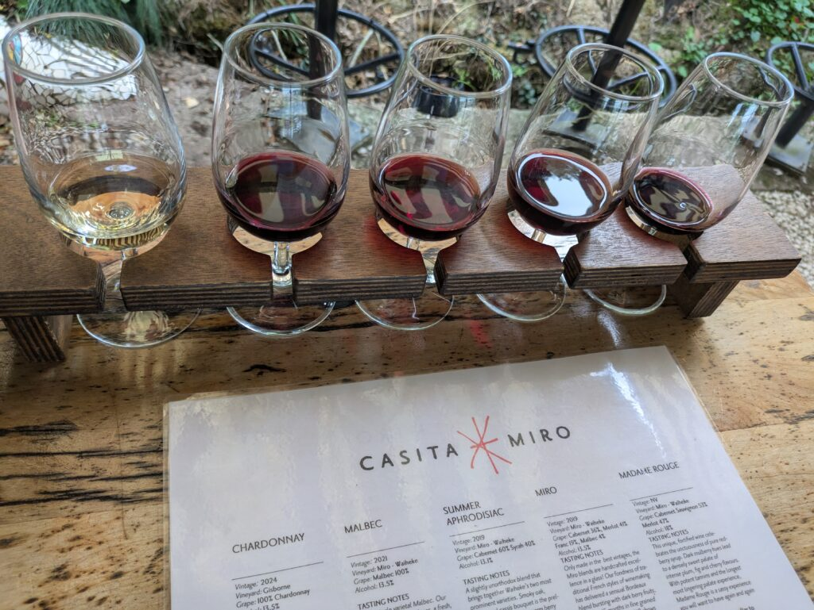
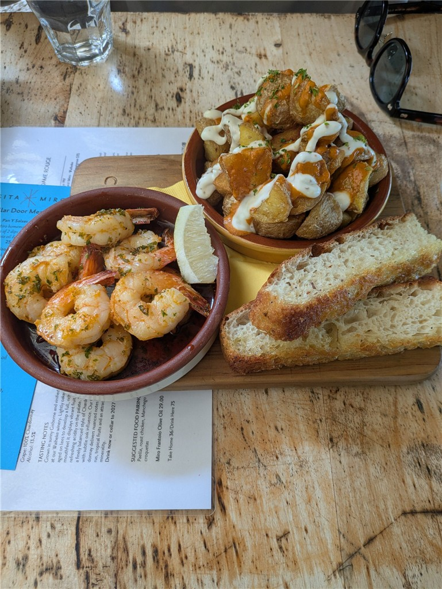

## English\_Practice

I went to Waiheke Island. I was recommended but I went to there because of doing winery tours. Basically, id doesn't need to book about tasting. Some tasting need to book when there are good places or some bottle of wines.

Actually, I saw vineyards and olive trees first time and it was amazing. I think this grapes is picked up and crushed ripen.

### Waiheke olive

Firstly, I planned to do just wine tours. However, I went to Waiheke with my friend suddenly and he booked to do a olive tasting on the day. Therefore, we went to the olive tour first.

The olive tasting is very hard. Basically, some bottles of olive was similar to smells and taste. I don't understand. The olive tasting has four bottles of olive, a olive, herbs and a spoon of Manuka honey. I recommend herbs because it's very delicious.

I bought a 100ml bottle of olive and a chocolate including olive. I felt this chocolate is oilier than usual chocolates. I don't recommend usually but I recommend as souvenirs.

### Waiheke 1st tasting

After that, I did tasting. First, I went to Cable Bay. This is kind of wines. I selected SEASONAL TASTING avobe the menu. I like Viognier or Chardonnay. I'm not a bit good at Pinot because they have strong bitter and sour.

I guess if you drink wine first time and hate alcohol, I recommend Viognier. It has a bit sour.

### Waiheke 2nd tasting

Second, I went to TANTALUS. I selected RESERVE. That is a good choice. I love écluse. It has sour but doesn't have bitter and it leaves a bad aftertaste so it's very delicious.

I did tasting évoque which is made in the field opposite the river and it has a bit strong sour. It has also strong smell but i felt écluse was deep smell. Therefore, I recommend it. It's right side on the picture

After that, I ate lunch which is a humburger. My friend ate raw fish which is drizzled bazile sauce so it doesn't raw fish. NZ's hamburgers are delicious. I think it's high quality about banz, pickles, sauce, patty.

### Waiheke 3rd tasting

I went to a third winery after I was a bit fill. It is stonyridge. However, I was very drank so I shared wine with my friend. I drunk a few cups of wine.

I alomost don't remember about taste. Rose's color is red wine but it's light because it's made of grapes removed skin. It tasted a bit bitter.

### Waiheke 4th tasting

Finally, I ate dinner and did tasting at a spanish restaurant. ROUGE is delicious on the right side. I don't remember after that.

Prawns were very delicious. They were chewy and delicious because it combines herbs and oil like ahijo. In addition, It was very delicious if you drizzle lemons. I dipped bread it.

I could book this dinner but it was sold out. It was closed later and this dinner is very delicious.

I did wine tour like that. I wasn't interested in wine but I'm grad to know a bit about it. NZ's wine don't use preservatives so we don't have a headache.

I would love to travel to find favorite wine next time. I went to just Waiheke this time but I would like to go around NZ. NZ has grapes. See you.

## 日本語版

Waiheke Islandに行ってきました。勧められたのもありますが、ワイナリー巡りをやってみたかったので行ってきました。基本的にはテイスティングに予約は不要みたいです。場所やワインの種類によっては予約が必要かもしれませんが。

実は初めてブドウ園やオリーブの木を見たのですが、壮観ですね。ここからブドウが摘まれて潰してワインとして熟成するという感じですかね。

### Waihekeでオリーブ

最初ワインだけめぐる予定だったんですが、急遽友達と行くことになり、更にオリーブのテイスティングも予約を当日しました。というわけで最初に[オリーブ](https://www.allpressolivegroves.co.nz/pages/visit)ですね。

オリーブのテイスティングは難しいですね。基本的には似たような香りと味でした。私には全くわかんないですね（笑）テイスティングはオリーブ4種と実、ハーブ、マヌカハニーです。ハーブはめちゃくちゃ美味しいのでおすすめです。

画像の4つ目100mlとオリーブオイル入りのチョコを買って帰りました。チョコは普通のチョコよりも油っぽい感じですね。日常的には食べないですがお土産におススメです。

### Waiheke 1st tasting

その次はテイスティングですね。初めに行った場所は[Cable Bay](https://cablebay.nz/)ですね。ワインの種類はこんな感じ。上のSEASONAL TASTINGをチョイスしました。個人的にはViognierかChardonnayですね。Pinotは渋みや酸味が強かったので少し苦手です。

初めて飲む人でアルコールが苦手な人はViognierが良いと思います。酸味などの刺激が少ないので。

### Waiheke 2nd tasting

2か所目は場所を移動して[TANTALUS](https://tantalus.co.nz/)ですね。ここではRESERVEをチョイスしました。結果的には良かったですね。好きだったのは4つ目のécluseですね。酸味はありますが、渋みがなく、後味もあまり残らず個人的には美味しいものでした。

上のévoqueもあって川を挟んで反対側で作られたワインみたいですが、そっちの方が酸味が強かったですね。香りもévoqueが強く、écluseは抑えめで深い気がしました。ということでおススメ出来ます。画像だと右側がécluseです。

その後は昼食を食べました。そこではハンバーガー食べました。友達は刺身ですかね？バジルのタレがあるので刺身ではないですが。こっちの自作ハンバーガーは美味しいですね。バンズ、ピクルス、タレ、パティどれもクオリティが高い気がします。

### Waiheke 3rd tasting

少しお腹を満たした後、3つめのワイナリーに行きました。[stonyridge](https://stonyridge.com/)というところですね。ただ、かなり酔いが回ってきたので、友達とシェアすることにしました。僕は数杯だけもらう形ですね。

もうほとんど味は覚えてないですね。ただ、Roseは皮を取り除いて作ってるみたいなので赤ワインだけど色が薄いみたいです。その分渋みは少ない味でした。

### Waiheke 4th tasting

最後はスペイン系の[レストラン](https://www.casitamiro.co.nz/)でテイスティングと料理を頂きました。右側のROUGEが美味しかったです。後はもう覚えてないです（笑）

エビはめちゃくちゃ美味しかったですね。ぷりぷりでアヒージョのような油と香草の組み合わせが美味しく、レモンも掛けると更に美味しさが増します。そこにパンも付けて食べる感じですね。

ここのディナーは予約ができますが、完売してましたね。遅くまでやってるのもありますが、美味しいというのもありそうです。

そんな感じでワイナリー巡りをしてきました。ワインとは全く無縁の生活をしてましたが、少し知れてよかったです。こっちであれば保存料など使ってないので頭も痛くなることはないので。

次はお気に入りのワインを見つける旅とかしてみたいですね。今回はWaihekeだけでしたが、ニュージーランド中を周ってみたいです。NZはブドウも取れますし。ではでは。

## AI採点

## 点数：55点/100点満点

全体的に内容は伝わっとるばってん、文法や語彙のミスが結構あるけん、IELTSで8.0目指すなら修正が必要ばい。

* * *

## 詳細なフィードバック（文法・語彙ミス）

### ① 導入部分

- 誤：I was recommended but I went to there because of doing winery tours.

- 正：I went there partly because it was recommended, but mainly because I wanted to do winery tours.
    - "I was recommended" は「私が推奨された」という意味になるけん、不自然。主語が違うばい。

### ② 基本予約不要の部分

- 誤：Basically, id doesn't need to book about tasting.

- 正：Basically, reservations aren't required for tastings.
    - 主語や文法が不自然。"Id"は完全に誤り。"about" も不要。

- 誤：Some tasting need to book when there are good places or some bottle of wines.

- 正：However, some places or specific wines may require reservations.
    - 主語が欠けとる。"need to book" は主語が人の場合に使う。"when there are good places" は表現が曖昧。

### ③ 初めてのぶどう園について

- 誤：I saw vineyards and olive trees first time and it was amazing.

- 正：It was my first time seeing vineyards and olive trees, and it was amazing.
    - 「初めて〜する」は "It was my first time doing" が自然。

- 誤：I think this grapes is picked up and crushed ripen.

- 正：I imagined these grapes would be picked, crushed, and then aged into wine.
    - 時制や動詞の使い方が間違っとる。"ripen"は果物が熟すときに使うけん、ワインを熟成する場合は "aged" が適切。

### ④ オリーブのテイスティング

- 誤：some bottles of olive was similar to smells and taste.

- 正：All the olive oils had similar smells and tastes to me.
    - 主語が "bottles" なら複数形。"Olive oils"が自然。

- 誤：I bought a 100ml bottle of olive and a chocolate including olive.

- 正：I bought a 100ml bottle of olive oil and chocolate containing olive oil.
    - 「オリーブ」だけだと実になってしまう。"olive oil" と言うべき。"including" は不自然。"containing" が適切。

### ⑤ ワインテイスティング1ヶ所目（Cable Bay）

- 誤：I'm not a bit good at Pinot because they have strong bitter and sour.

- 正：I'm not a big fan of Pinot because it's too bitter and acidic for me.
    - "not a bit good at" は「得意じゃない（スキル）」の意味。"big fan of"で「好きじゃない」とするのが自然。

- 誤：I guess if you drink wine first time and hate alcohol, I recommend Viognier. It has a bit sour.

- 正：If you're new to wine or don't like alcohol much, I recommend Viognier because it’s less acidic.
    - "hate alcohol" は強すぎる。"It has a bit sour" は文法的におかしい。"less acidic" が適切。

### ⑥ ワインテイスティング2ヶ所目（TANTALUS）

- 誤：That is a good choice.

- 正：It turned out to be a good choice.
    - 過去形で感想を述べる際は "turned out to be" が自然。

- 誤：It has sour but doesn't have bitter and it leaves a bad aftertaste so it's very delicious.

- 正：It was slightly acidic, not bitter, and didn't leave a bad aftertaste, so it was very enjoyable.
    - "leaves a bad aftertaste" は否定文にせな逆の意味になるばい。

- 誤：I did tasting évoque which is made in the field opposite the river.

- 正：I also tasted évoque, which is made across the river.
    - "did tasting" は不自然。"across the river" が簡潔で自然。

### ⑦ 昼食について

- 誤：My friend ate raw fish which is drizzled bazile sauce so it doesn't raw fish.

- 正：My friend ordered raw fish, but since it had basil sauce, it wasn't exactly raw fish like sashimi.
    - 「バジル」は "basil" と綴る。"it doesn't raw fish" は文法的に完全に誤り。

- 誤：NZ's hamburgers are delicious. I think it's high quality about banz, pickles, sauce, patty.

- 正：Hamburgers here are delicious, with high-quality buns, pickles, sauce, and patties.
    - "banz"→"buns"。 "NZ's hamburgers" は不自然。"Hamburgers here" がナチュラル。

### ⑧ ワインテイスティング3ヶ所目（stonyridge）

- 誤：I was very drank so I shared wine with my friend.

- 正：I was already quite drunk, so I shared the wine with my friend.
    - "drank"は動詞。"drunk"が形容詞で正しい。

### ⑨ ワインテイスティング4ヶ所目

- 誤：ROUGE is delicious on the right side.

- 正：The ROUGE wine on the right side was delicious.
    - 名詞をはっきりさせる。

- 誤：I dipped bread it.

- 正：I dipped bread into it.
    - 前置詞が必要。

- 誤：It was closed later and this dinner is very delicious.

- 正：The restaurant is open late, and it seems popular due to its delicious food.
    - "closed later" は完全に逆の意味になるけん、注意！

### ⑩ 総括部分

- 誤：I'm grad to know a bit about it.

- 正：I'm glad I learned a bit about it.
    - "grad"はスペルミス。

- 誤：NZ's wine don't use preservatives so we don't have a headache.

- 正：NZ wines don't contain preservatives, so they don’t cause headaches.
    - ワインは複数。"don't use" より "don't contain" が自然。

- 誤：NZ has grapes.

- 正：NZ grows grapes.
    - 「ブドウが採れる」は "grow grapes" と表現するばい。

* * *

## IELTS 8.0を目指すために

- 主語や時制のミスを徹底的に修正すること。

- 自然な語彙・言い回しを身につける必要あり。

- 文法の基本ルール（主語・動詞・前置詞）を再確認する必要があるばい。
